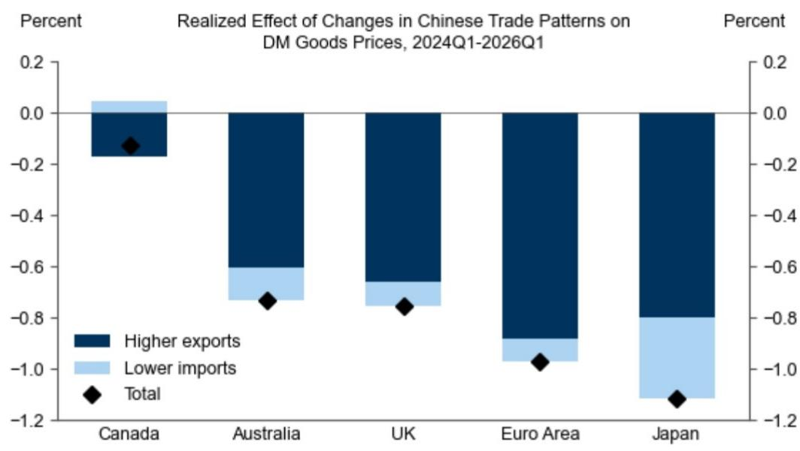

# 全球贸易格局调整：一个值得关注的宏观观察视角

全球宏观环境中的价格变化，长期以来被归因于服务成本、劳动力市场紧张以及能源波动等因素。然而，一个结构性的力量正在悄然发挥作用。自2024年以来，某大型经济体对部分发达市场的出口名义值增长了约20%，而其对另一主要市场的出口则显著下降。与此同时，该经济体从世界其他地区的进口规模低于疫情前的趋势水平。这两种变化并非简单的贸易转移，它们共同构成了一种系统性的价格影响机制。据估算，过去两年间，这一机制已使部分发达经济体的商品价格平均下降了约0.7%。

这一影响不容忽视。它对发达市场年度整体及核心价格水平的拖累，每年约为0.1至0.2个百分点。其中，日本和欧元区受到的影响最为显著，分别约为1.1%和1.0%，而加拿大仅为0.2%。这种差异表明，该经济体贸易策略演变所带来的价格影响并非均匀分布，而是取决于其出口对特定经济体的渗透深度，以及该经济体对其出口的依赖程度。

传统观点认为，该经济体的贸易只是发达市场价格波动的次要因素，这一看法如今已显过时。其作用机制是结构性、可量化的，并且可能持续增强。该经济体的经常账户盈余预计将进一步扩大，这意味着其对外供给将持续增加，而对内需求则相对减弱。对于致力于将价格水平引导至目标区间的各国央行而言，这是一个值得在预测模型中明确纳入的有利因素。

## 出口渠道是主要驱动力，而非进口渠道

该经济体贸易格局调整压低全球价格的两条渠道，其影响力并不相同。出口渠道——即其商品大量涌入部分发达市场——约占0.7%总价格降幅中的0.6个百分点。而进口渠道——即其对外国商品需求减弱，从而释放全球供给——仅贡献了约0.1个百分点。

这种不对称性符合直觉。该经济体对部分发达市场的出口增长迅速，在电子、机械和耐用消费品等领域直接替代了当地或第三国的生产。计量分析显示，在接收经济体中，该经济体进口渗透率每增加一个百分点（占其总消费的比例），同期商品价格将下降约0.5%。这一关系并非理论推导，而是基于一个协调的跨国面板数据，该数据将六位协调制度贸易数据与主要非美经济体的三位消费价格分类进行了匹配。

进口渠道的影响虽真实存在，但相对较小，因为其机制是间接的。当该经济体减少对全球某类产品的购买时，该产品对其他买家而言更为充裕，从而对其价格产生下行压力。估算表明，该经济体对某类产品的全球进口需求份额每下降一个百分点，对于完全依赖进口该产品的国家，其价格将下降1.3%。但在实践中，该经济体在大多数产品类别上的进口份额变化较为温和，因此总体影响有限。

对政策制定者而言，启示是明确的。来自该经济体的价格下行压力，其主要来源是出口端。在评估短期价格风险时，监测其出口量及目的地构成，比追踪其进口需求更为重要。

## 欧洲和日本是前沿，加拿大是例外

价格下行效应的地理分布并非随机。欧元区商品价格受到约1.0%的拖累，日本为1.1%，而加拿大仅为0.2%。这些差异可由两个变量解释：该经济体出口对每个经济体的渗透程度，以及每个经济体对其进口需求的暴露程度。

在欧元区，该经济体进口渗透率显著上升，尤其在德国和南欧，其制造的机械、电子和运输设备市场份额有所增加。直接供给效应占主导地位。在日本，情况则有所不同。更大的影响来自进口渠道：日本向该经济体出口中间产品和资本设备，而后者对这些产品需求的减弱，释放了全球市场的供给，压低了在其他地方销售的同类商品的价格。加拿大受到的影响较小，反映了该经济体出口在加拿大市场的渗透有限，且与欧洲或日本相比，其与该经济体的贸易联系相对较弱。

这种地理分布具有战略意义。欧洲央行应更有信心认为，即使服务价格依然高企，商品价格的下行压力将持续存在。相比之下，日本央行面临更复杂的局面：该经济体进口收缩带来的价格下行压力，对其出口导向型制造业构成逆风。加拿大相对隔绝，意味着其价格前景受该经济体贸易调整的影响较小，但这也意味着，如果国内需求压力重现，其价格缓冲空间也较小。

## 价格下行压力仍在积聚，而非消退

过去两年估算的0.7%价格拖累并非全貌。几个因素表明，这一影响将会扩大。首先，贸易数据反映的是实际流动，但传导至消费价格需要时间。合同、库存周期和零售定价行为意味着，该经济体供给增加的价格影响可能还需一年或更长时间才能完全显现。其次，该经济体的经常账户盈余预计将继续扩大。这意味着出口将进一步增长，进口将继续受到抑制，从而延长价格下行压力。

报告中的研究团队预测其经常账户盈余将扩大。这是一个结构性判断，而非周期性判断。它反映了该经济体在国内需求疲软和人口老龄化的背景下，制造业产能过剩和出口导向型增长的战略。如果这一预测正确，来自该经济体贸易的价格下行压力将持续数年，而非几个季度。

那些认为当前商品价格环境温和只是暂时现象的央行，可能会因价格低于目标的时间长于预期而措手不及。风险并非来自该经济体贸易的突然逆转，而是它可能成为一种永久性的结构性拖累，在较长时间内压低商品价格，从而在服务价格已放缓的经济体中，使整体价格回归目标的任务复杂化。

## 将贸易因素纳入价格预测的决策框架

对于资产管理者、企业策略师和央行经济学家而言，问题不在于这一渠道是否重要——它确实重要。问题在于如何将其付诸实践。一个实用的框架包括三个步骤。

首先，在细分的产品层面，衡量该经济体对每个目标经济体的出口渗透率。总体国家层面的数据有用，但价格下行效应集中在特定行业。电子、机械、耐用消费品和纺织品是该经济体市场份额增长最快的类别。这些类别的价格预测应纳入一个下行偏差，即该经济体进口渗透率每增加一个百分点，价格约下降0.5%。

其次，通过识别该经济体作为重要买家的产品，评估进口渠道的暴露程度。对于像日本和德国这样向该经济体出口资本品和中间产品的经济体，进口渠道会放大价格下行效应。对于与该经济体直接出口暴露有限的经济体，可以忽略进口渠道。

第三，应用时间滞后。分析中使用的贸易数据截至2026年第一季度，但价格效应是同步的。在实践中，传导可能需要六到十二个月。这意味着近期贸易变化带来的全部价格下行影响尚未实现。对2026年和2027年的预测，应针对欧元区和日本，在年度商品价格中额外嵌入0.1至0.2个百分点的拖累，其他地区影响较小。

这个框架不能替代详细的国家级模型。但它提供了一个透明、数据驱动的起点，可以随着新贸易数据的公布而每季度更新。

## 更广泛的战略启示：贸易格局调整是宏观力量，而非仅仅是地缘故事

围绕主要经济体之间贸易紧张关系的主流叙事，一直聚焦于关税、供应链和地缘风险。这种框架是不完整的。该经济体贸易流向向部分发达市场的调整，不仅仅是原本要流向另一市场的商品的重新路由。它代表了该经济体对世界其他发达地区商品供给的结构性增加，同时伴随着其对国外商品需求的结构性减少。

对于发达市场的央行而言，这对其价格目标是一个净利好。它降低了商品价格，而无需收紧货币政策。但它也造成了一种不对称：价格下行收益集中在那些对该经济体出口最开放、且最依赖其需求的经济体。这些经济体面临的实际利率水平低于其他情况，因为结构性的价格下行顺风减少了为保持价格在目标水平所需的货币紧缩力度。

对于观察者而言，这意味着发达市场之间的价格差异将持续存在，甚至可能扩大。欧元区和日本可能会看到持续的商品价格下行，而像加拿Daiwa美国这样的经济体——后者虽未在此分析中涵盖，但通过贸易联系间接受到影响——可能感受到的顺风较小。行业层面的暴露更为重要。在本国市场直接与该经济体进口商品竞争的公司，面临持续的价格压力。向该经济体出口的公司面临需求风险。既不与之竞争也不向其出口的公司则相对隔绝。

贸易格局的调整并非暂时性扰动。它是后疫情时代全球经济的一个结构性特征。价格数据已经反映了这一点。问题在于，政策制定者和市场参与者将多快调整他们的框架来应对这一变化。

*仅供参考。部分内容可能基于源材料通过AI辅助生成、翻译、总结或编辑，可能存在遗漏或错误。请独立核实。本文不构成专业建议。*

仅供参考。部分内容可能基于源材料通过AI辅助生成、翻译、总结或编辑，可能存在遗漏或错误。请独立核实。本文不构成专业建议。

