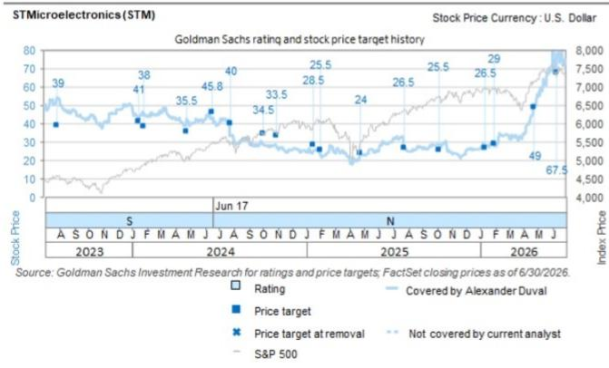

# STMicroelectronics (STMPA.PA): 需求可见度改善，AI数据中心与光互连成为关键增长动力

欧洲科技：硬件
分析欧洲AI赋能者的角色，并更新我们对长期增长潜力的看法

探索 >

Alexander Duval
+44(20)7552-2995 |
alexander.duval@gs.com
GS International

STM的2Q26收入比Visible Alpha共识数据高出1%，主要得益于汽车和CECP业务的收入增长。此外，报告的EBIT比共识低20%，主要受到5800万美元的减值、重组费用及其他相关退出成本，以及因收购NXP MEMS业务产生的PPA带来的2400万美元不利影响。剔除这些影响后，公司2.69亿美元的EBIT将比共识高出15%。主要要点包括：1) 需求可见度改善和AI数据中心势头支撑增长前景；2) 预计利润率将环比改善，但重塑成本仍是近期的不利因素；3) 随着库存正常化和供应趋紧，需求动能扩大；4) 300mm产能爬坡继续支持未来MCU和AI增长，而供应环境趋紧。维持中性评级。

**需求可见度改善和AI数据中心势头支撑增长前景**：STM指引3Q26收入中点为37亿美元，比共识低约2%，同时表示4Q26收入应超过40亿美元（共识为40.3亿美元），意味着FY26收入大致符合市场预期。重要的是，管理层强调需求持续改善，整体订单出货比接近2倍，光互连领域超过2倍。客户可见度也在持续增强，Q2订单中超过一半计划在明年交付，积压订单目前约为Q2收入的4.5-5个季度。AI数据中心仍是主要增长动力，STM将其数据中心收入展望上调至2026年超过10亿美元，2027年远超过20亿美元，这得益于AI基础设施的持续需求。增长预计将由800G和1.6T可插拔光学器件驱动，公司继续受益于在微控制器领域的领先地位、在集成电路中份额的提升以及用于光互连的硅光子的爬坡。管理层还强调了硅光子领域的制造可扩展性，同时指出FY26数据中心收入已完全由积压订单覆盖，FY27的预期得到现有客户合作的支撑。我们注意到，数据中心业务持续为集团总收入贡献毛利率；我们认为上述关于

Anant Jakhar  
+1(332)245-7829 |  
anant.x.jakhar@gs.com  
GS India SPL

Ayo Odunaiya
+44(20)7051-5995 |
ayo.x.odunaiya@gs.com  
GS International

强劲AI需求和强劲订单的评论对功率半导体同行IFX是积极信号。

**预计利润率将环比改善，但重塑成本仍是近期的不利因素**：毛利率包含约60个基点的不利影响，来自STM制造重塑计划的非经常性成本，管理层预计今年剩余时间将有类似影响。该计划涉及将硅生产从200mm转移到300mm，以及碳化硅生产从150mm转移到200mm，预计在2027年底前完成。在过渡期间，毛利率将继续受到与技术转移、产品认证和掩模重新设计相关的成本影响。尽管如此，公司指引3Q26非GAAP毛利率中点为37%，环比改善，并预计随着收入规模扩大，4Q将进一步改善。复苏步伐将受到持续的低负荷费用（包括新工厂的启动成本，特别是在中国）以及与制造转移计划相关的持续支出的制约。总体而言，管理层对毛利率在4Q环比改善保持信心，尽管这些不利因素将继续限制改善幅度。

**随着库存正常化和供应趋紧，需求动能扩大**：STM强调了需求的明显加速，可见度改善，多个产品类别出现供应紧张迹象，分销库存现已低于正常目标水平。复苏在通用微控制器和模拟产品中尤为明显，得到更强的POS（销售点）趋势支撑，而SiC也持续改善，同比增长低两位数，环比增长中30%，订单出货比远高于1。按终端市场划分，通信设备和计算机外设仍是较强劲的增长动力，预计3Q收入同比增长约60%，4Q加速至约90%。工业增长也应从2Q的32%加强至4Q接近40%，而汽车业务以低双位数百分比增长，领先于此前预期。个人电子产品仍是例外，管理层预计在1H正增长后，2H同比为负，但全年应保持在低至中个位数百分比区间。

**300mm产能爬坡继续支持未来MCU和AI增长，而供应环境趋紧**：STM注意到交期有所延长以及部分产能受限，包括OSAT合作伙伴，但管理层认为这些压力是暂时的，部分与正在进行的制造重塑计划有关。Agrate 300mm晶圆厂预计在2028年前达到完全建成，并在90nm和40nm技术认证后开始支持微控制器增长，而Crolles计划爬坡至每周15,000片晶圆，并根据AI数据中心需求进一步扩展。在中国，与本地制造合作伙伴的40nm技术认证也应增加面向国内工业和光收发器客户的可利用产能。

## 对预测的调整

我们将FY26-30收入预测上调3-5%（以美元计），以反映STM AI业务以及ADAS业务的持续强劲增长。此外，由于我们上调了收入假设，FY26-30毛利率预测变动在1%至5%之间，但部分被低负荷费用以及与制造产能过渡相关的成本所抵消。因此，我们的FY26-30E EBIT变动在-1%至+6%之间（以美元计），反映了我们最新的收入、毛利率和运营费用假设。最后，由于EBIT和最新股数假设，我们的EPS在预测期内变动在-2%至+7%之间（以美元计）。

## 估值与主要风险

我们对STMicro维持中性评级，12个月目标价为€53.0/ADR $60.5（此前为€58.0/ADR $67.5），基于11倍2HCY27+1HCY28E（此前为13倍CY27）EV/EBITDA倍数，应用于更新后的EBITDA预测。因此，我们更新的估值倍数反映了估值周期的滚动。我们观点和目标价的主要风险包括：消费类半导体库存调整底部比预期更快/更慢，竞争对手碳化硅动能加速/放缓，以及当前有利定价可持续的证据。

<table><tr><td>STMPA.PA</td><td>12个月目标价：€53.00</td><td>价格：€46.77</td><td>上行空间：13.3%</td></tr><tr><td>STM</td><td>12个月目标价：$60.50</td><td>价格：$51.54</td><td>上行空间：17.4%</td></tr></table>

<table><tr><td>中性</td><td colspan="5">GS预测</td></tr><tr><td></td><td></td><td>12/25</td><td>12/26E</td><td>12/27E</td><td>12/28E</td></tr><tr><td>市值：€431亿 / $490亿</td><td>收入（€百万）新</td><td>10,171.6</td><td>12,341.3</td><td>14,353.1</td><td>16,164.7</td></tr><tr><td>企业价值：</td><td>收入（€百万）旧</td><td>10,171.6</td><td>12,055.9</td><td>13,907.7</td><td>15,659.9</td></tr><tr><td>€444亿 / $505亿</td><td>EBIT（€百万）</td><td>150.9</td><td>1,034.9</td><td>2,054.4</td><td>2,970.5</td></tr><tr><td>3个月日均交易量：€1.983亿 / $2.292亿</td><td>EPS（€）新</td><td>0.16</td><td>1.05</td><td>2.01</td><td>2.88</td></tr><tr><td>法国</td><td>EPS（€）旧</td><td>0.16</td><td>0.98</td><td>2.05</td><td>2.90</td></tr><tr><td rowspan="3">欧洲半导体、硬件与游戏科技并购排名：3</td><td>EV/销售额（X）</td><td>2.1</td><td>3.5</td><td>3.1</td><td>2.6</td></tr><tr><td>EV/EBITDA（X）</td><td>11.9</td><td>16.2</td><td>11.5</td><td>8.8</td></tr><tr><td>市盈率（X）</td><td>145.4</td><td>43.7</td><td>23.3</td><td>16.3</td></tr><tr><td>租赁包含在净债务及EV中？：否</td><td>有机销售增长（%）</td><td>-</td><td>-</td><td>-</td><td>-</td></tr><tr><td></td><td></td><td>6/26</td><td>9/26E</td><td>12/26E</td><td>3/27E</td></tr><tr><td></td><td>EPS（€）</td><td>0.21</td><td>0.34</td><td>0.47</td><td>-</td></tr></table>

来源：公司数据、GS预测、FactSet。价格截至2026年7月24日收盘。

## 披露附录

## Reg AC

我们，Alexander Duval、Anant Jakhar和Ayo Odunaiya，特此证明本报告中表达的所有观点准确反映了我们个人对相关公司及其证券的看法。我们还证明，我们的薪酬中没有任何部分直接或间接与报告中表达的具体建议或观点相关。

除非另有说明，本报告封面所列的个人是GS全球投资研究部门的分析师。

贡献作者：Alexander Duval GS International、Anant Jakhar GS India SPL、Ayo Odunaiya GS International。

除非另有说明，本报告贡献作者披露中列出的个人是GS全球投资研究部门的分析师。

## GS因子概况

GS因子概况通过将股票的关键属性与市场（即我们的评级股票池）及其行业同行进行比较，提供投资背景。所描绘的四个关键属性是：增长、财务回报、倍数（例如估值）和综合（增长、财务回报和倍数的复合）。增长、财务回报和倍数是通过对每只股票的特定指标进行标准化排名计算得出的。各指标的标准化排名随后被平均并转换为相关属性的百分位数。每个指标的具体计算可能因财年、行业和地区而异，但标准方法如下：

增长基于股票的前瞻性销售增长、EBITDA增长和EPS增长（对于金融股，仅EPS和销售增长），百分位数越高表示公司增长越高。财务回报基于股票的前瞻性ROE、ROCE和CROCI（对于金融股，仅ROE），百分位数越高表示公司财务回报越高。倍数基于股票的前瞻性市盈率、市净率、价格/股息（P/D）、EV/EBITDA、EV/FCF和EV/债务调整后现金流（DACF）（对于金融股，仅市盈率、市净率和P/D），百分位数越高表示股票交易倍数越高。综合百分位数计算为增长百分位数、财务回报百分位数和（100% - 倍数百分位数）的平均值。

财务回报和倍数使用GS分析师对未来至少三个季度后的财年末的预测。增长使用对未来至少七个季度后的财年与未来至少三个季度后的财年相比的输入（所有指标均基于每股）。

有关我们如何计算GS因子概况的更详细说明，请联系您的GS代表。

## 并购排名

在我们的全球覆盖范围内，我们使用并购框架审视股票，考虑定性因素和定量因素（可能因行业和地区而异），以纳入某些公司可能被收购的可能性。然后，我们分配并购排名，以对我们评级覆盖范围内的公司从1到3进行评分，其中1表示公司成为收购目标的高概率（30%-50%），2表示中等概率（15%-30%），3表示低概率（0%-15%）。对于排名为1或2的公司，根据我们的标准部门指引，我们将并购组成部分纳入目标价。并购排名3被视为不重要，因此不计入我们的目标价，并且可能在研究中讨论或不讨论。

## Quantum

Quantum是GS的专有数据库，提供详细的财务报表历史、预测和比率的访问。它可用于对单一公司进行深入分析，或对不同行业和市场的公司进行比较。

## 披露

STMicroelectronics的评级相对于其覆盖范围内的其他公司：ASM International、ASML Holding、BE Semiconductor Industries、CD Projekt、Ericsson、Infineon、Logitech、Nebius Group、Nokia、STMicroelectronics、Stillfront、Technoprobe S.p.A.

## 公司特定监管披露

以下披露涉及GS集团（及其附属公司，“GS”）与GS全球投资研究所涵盖的公司之间的关系。

截至本报告前一个月末，GS实益拥有普通股1%或以上（不包括由附属公司和业务部门管理的、根据美国证券法无需汇总的头寸）：STMicroelectronics ($51.54) 和 STMicroelectronics (€46.77)

GS在过去12个月内因投资银行服务获得报酬：STMicroelectronics ($51.54) 和 STMicroelectronics (€46.77)

GS预计在未来3个月内将寻求或打算寻求投资银行服务报酬：STMicroelectronics ($51.54) 和 STMicroelectronics (€46.77)

GS在过去12个月内与以下公司存在投资银行服务客户关系：STMicroelectronics ($51.54) 和 STMicroelectronics (€46.77)

GS在过去12个月内与以下公司存在非投资银行证券相关服务客户关系：STMicroelectronics ($51.54) 和 STMicroelectronics (€46.77)

GS在过去12个月内与以下公司存在非证券服务客户关系：STMicroelectronics ($51.54) 和 STMicroelectronics (€46.77)

GS做市该证券或其衍生品：STMicroelectronics ($51.54) 和 STMicroelectronics (€46.77)

评级/投资银行关系分布 GS投资研究全球股票覆盖范围

<table><tr><td rowspan="2"></td><td colspan="3">评级分布</td><td colspan="3">投资银行关系</td></tr><tr><td>买入</td><td>持有</td><td>卖出</td><td>买入</td><td>持有</td><td>卖出</td></tr><tr><td>全球</td><td>50%</td><td>34%</td><td>16%</td><td>65%</td><td>59%</td><td>43%</td></tr></table>

截至2026年7月1日，GS全球投资研究对3,104只股票有投资评级。GS将股票分配为买入和卖出，列入各区域投资清单；未如此分配的股票被视为中性。此类分配等同于FINRA规则要求的上述披露中的买入、持有和卖出。请参阅下面的“评级、覆盖范围和相关定义”。投资银行关系图表反映了每个评级类别中GS在过去十二个月内提供过投资银行服务的公司百分比。

## 目标价和评级历史图表

  
所示目标价应结合所有先前发布的GS报告（可能包含或不包含目标价）以及公司、行业和金融市场的发展情况来考虑。

  
所示目标价应结合所有先前发布的GS报告（可能包含或不包含目标价）以及公司、行业和金融市场的发展情况来考虑。

## 目标价历史表格

STMicroelectronics (STMPA.PA)  
STMicroelectronics (STM)

<table><tr><td>报告日期</td><td>目标价（€）</td><td>收盘价（€）</td><td>报告日期</td><td>目标价（$）</td><td>收盘价（$）</td></tr><tr><td>2026年6月11日</td><td>58.00</td><td>64.85</td><td>2026年6月11日</td><td>67.50</td><td>78.12</td></tr><tr><td>2026年4月24日</td><td>42.00</td><td>43.37</td><td>2026年4月24日</td><td>49.00</td><td>50.47</td></tr><tr><td>2026年1月30日</td><td>24.20</td><td>23.84</td><td>2026年1月30日</td><td>29.00</td><td>27.89</td></tr><tr><td>2026年1月12日</td><td>22.60</td><td>24.33</td><td>2026年1月12日</td><td>26.50</td><td>28.35</td></tr><tr><td>2025年10月24日</td><td>22.00</td><td>21.56</td><td>2025年10月6日</td><td>25.50</td><td>28.92</td></tr><tr><td>2025年10月6日</td><td>21.60</td><td>24.86</td><td>2025年7月25日</td><td>26.50</td><td>26.32</td></tr><tr><td>2025年7月25日</td><td>22.60</td><td>22.25</td><td>2025年4月25日</td><td>24.00</td><td>23.28</td></tr><tr><td>2025年4月25日</td><td>21.20</td><td>20.42</td><td>2025年1月31日</td><td>25.50</td><td>22.45</td></tr><tr><td>2025年1月31日</td><td>24.50</td><td>21.83</td><td>2025年1月16日</td><td>28.50</td><td>24.69</td></tr><tr><td>2025年1月16日</td><td>27.00</td><td>24.18</td><td>2024年10月31日</td><td>33.50</td><td>27.14</td></tr><tr><td>2024年10月31日</td><td>30.70</td><td>25.03</td><td>2024年10月3日</td><td>34.50</td><td>28.24</td></tr><tr><td>2024年10月3日</td><td>31.10</td><td>25.71</td><td>2024年7月26日</td><td>40.00</td><td>33.99</td></tr><tr><td>2024年7月26日</td><td>36.50</td><td>30.72</td><td>2024年6月17日</td><td>45.80</td><td>43.10</td></tr><tr><td>2024年6月17日</td><td>42.50</td><td>39.74</td><td>2024年4月25日</td><td>35.50</td><td>42.60</td></tr><tr><td>2024年4月25日</td><td>33.00</td><td>39.66</td><td>2024年1月25日</td><td>38.00</td><td>45.60</td></tr><tr><td>2024年1月25日</td><td>34.50</td><td>42.41</td><td>2024年1月15日</td><td>41.00</td><td>43.56</td></tr><tr><td>2024年1月15日</td><td>37.00</td><td>39.63</td><td>2023年7月28日</td><td>39.00</td><td>53.45</td></tr><tr><td>2023年10月26日</td><td>36.50</td><td>38.96</td><td></td><td></td><td></td></tr><tr><td>2023年7月28日</td><td>35.00</td><td>48.40</td><td></td><td></td><td></td></tr></table>

表格中所示目标价未针对公司行动进行调整。

## 监管披露

## 美国法律法规要求的披露

请参阅上述公司特定监管披露，了解本报告所涉公司所需的任何以下披露：待定交易中的经理或联合经理；1%或以上的所有权；特定服务的报酬；客户关系类型；先前期间的承销公开发行；董事职位；对于股票，做市和/或专家角色。GS可能作为本金交易本报告中讨论的发行人的债务证券（或相关衍生品）。

以下是额外的必要披露：所有权和重大利益冲突：GS政策禁止其分析师、向分析师报告的专业人员及其家庭成员持有分析师覆盖范围内任何公司的证券。分析师薪酬：分析师的薪酬部分基于GS的盈利能力，其中包括投资银行收入。分析师作为高管或董事：GS政策通常禁止其分析师、向分析师报告的人员或其家庭成员担任分析师覆盖范围内任何公司的高管、董事或顾问。非美国分析师：非美国分析师可能不是GS & Co. LLC的关联人员，因此可能不受FINRA规则2241或FINRA规则2242关于与主题公司沟通、公开露面以及交易分析师所覆盖证券的限制。

## 美国以外司法管辖区法律法规要求的额外披露

以下披露是所指示司法管辖区要求的，除非已根据美国法律法规在上文作出。澳大利亚：GS Australia Pty Ltd及其附属公司不是澳大利亚的授权存款机构（如《1959年银行法》（联邦）所定义），不提供银行服务，也不在澳大利亚开展银行业务。除非GS另有约定，本研究及其访问权限仅适用于澳大利亚《公司法》含义内的“批发客户”。在制作研究报告时，GS Australia全球投资研究部门的成员可能会参加由研究报告所涉公司和其他实体主办或组织的实地考察和其他会议。在某些情况下，如果GS Australia认为在实地考察或会议的具体情况下适当且合理，此类实地考察或会议的费用可能部分或全部由相关发行人承担。如果本文档内容包含任何金融产品建议，则仅为一般性建议，由GS在未考虑客户目标、财务状况或需求的情况下编制。客户在根据任何此类建议采取行动之前，应考虑该建议是否适合其自身目标、财务状况和需求。某些GS Australia和New Zealand利益披露以及GS澳大利亚卖方研究独立性政策声明的副本可在以下网址获取：https://www.goldmansachs.com/disclosures/australia-new-zealand/index.html。巴西：有关CVM第20号决议的披露信息可在以下网址获取：https://www.gs.com/worldwide/brazil/area/gir/index.html。在适用的情况下，根据CVM第20号决议第20条定义，本研究报告内容的主要巴西注册分析师为本报告开头指定的第一作者，除非文本末尾另有说明。加拿大：此信息仅供您参考，在任何情况下均不应被解释为GS & Co. LLC为在加拿大购买加拿大证券而进行的广告、要约或招揽。GS & Co. LLC未在加拿大任何司法管辖区根据适用的加拿大证券法注册为交易商，通常不允许交易加拿大证券，并且可能被禁止在加拿大某些司法管辖区出售某些证券和产品。如果您希望在加拿大交易任何加拿大证券或其他产品，请联系GS Canada Inc.（GS集团附属公司）或其他注册的加拿大交易商。香港：有关本研究报告所涉公司证券的更多信息，可向GS (Asia) L.L.C.索取。印度：有关本研究报告所涉公司的更多信息，可从GS (India) Securities Private Limited获取，研究分析师 - SEBI注册号INH000001493，地址：10th Floor, Ascent-Worli, Sudam Kalu Ahire Marg, Worli, Mumbai-400 025, India，公司识别号U74140MH2006FTC160634，电话+91 22 6616 9000，传真+91 22 6616 9001。GS可能实益拥有本研究报告所涉公司1%或以上的证券（如印度《1956年证券合同（监管）法》第2(h)条所定义）。SEBI的注册和NISM的认证绝不保证中介机构的业绩或向读者提供任何回报保证。GS (India) Securities Private Limited的合规官和读者投诉联系详情、年度合规审计报告副本以及其他相关信息和披露可在以下链接找到：https://www.goldmansachs.com/worldwide/india/research-analyst。日本：见下文。韩国：除非GS另有约定，本研究及其访问权限仅适用于《金融服务和资本市场法》含义内的“专业读者”。有关本研究报告所涉公司的更多信息，可从GS (Asia) L.L.C.首尔分行获取。新西兰：GS New Zealand Limited及其附属公司不是新西兰的“注册银行”或“存款接受者”（如《1989年新西兰储备银行法》所定义）。除非GS另有约定，本研究及其访问权限适用于《2008年金融顾问法》含义内的“批发客户”。某些GS Australia和New Zealand利益披露的副本可在以下网址获取：https://www.goldmansachs.com/disclosures/australia-new-zealand/index.html。俄罗斯：在俄罗斯联邦分发的研究报告不属于俄罗斯法律定义的广告，而是信息和分析，其主要目的不是产品推广，并且不提供俄罗斯评估活动法律含义内的评估。研究报告不构成俄罗斯法律法规定义的个人化研究交流，不针对特定客户，并且在未分析客户财务状况、投资概况或风险概况的情况下编制。GS不对客户或任何其他人基于本研究报告可能做出的任何投资决策承担责任。新加坡：GS (Singapore) Pte.（公司编号：198602165W），受新加坡金融管理局监管，接受对本研究的法律责任，如有任何与本研究报告相关的事宜，应联系该公司。台湾：此材料仅供参考，未经许可不得转载。读者应仔细考虑自身的投资风险。投资结果由个人读者负责。英国：在英国可能被归类为零售客户的个人（如金融行为监管局规则所定义）应结合先前关于所涉公司的GS报告阅读本研究，并应参考GS International已发送给他们的风险警告。这些风险警告的副本以及本报告中使用的某些金融术语的词汇表，可向GS International索取。

欧盟和英国：有关欧盟委员会授权条例(EU) 2016/958第6(2)条的披露信息（包括该授权条例在英国脱离欧盟和欧洲经济区后转化为英国国内法律和法规的情况），涉及研究交流或其他建议或暗示投资策略的信息的客观呈现技术安排以及特定利益或利益冲突迹象的披露，可在以下网址获取：https://www.gs.com/disclosures/europeanpolicy.html，其中说明了与投资研究相关的利益冲突管理的欧洲政策。

日本：GS Japan Co., Ltd.是在关东财务局注册的金融工具交易商，注册号Kinsho 69，是日本证券交易商协会、日本金融期货协会、第二类金融工具交易商协会和日本投资管理协会的成员。股票买卖需支付与客户预先确定的佣金加上消费税。有关日本证券交易所、日本证券交易商协会或日本证券金融公司要求的任何适用披露，请参阅公司特定披露。

## 评级、覆盖范围和相关定义

买入(B)、中性(N)、卖出(S) 分析师建议将股票作为买入或卖出纳入各区域投资清单。被分配为买入或卖出投资清单取决于股票相对于其覆盖范围的总回报潜力。任何未被分配为买入或卖出投资清单且具有有效评级（即非评级暂停、未评级、早期生物科技、覆盖暂停或未覆盖）的股票被视为中性。每个区域管理区域信念清单，这些清单选自各自区域投资清单中的报告评级股票，代表侧重于总回报潜力大小和/或在其各自覆盖区域内实现回报的可能性的研究交流。此类信念清单中股票的添加或移除由各区域的投资审查委员会或其他指定委员会管理，并不代表分析师对此类股票投资评级的变更。

总回报潜力代表当前股价与目标价之间的上行或下行差异，包括目标价相关时间范围内预期支付或预期的所有股息。所有覆盖的股票都需要目标价。总回报潜力、目标价和相关时间范围在每份添加或重申投资清单成员资格的报告中有说明。

覆盖范围：每个覆盖范围中所有股票的列表可通过主要分析师、股票和覆盖范围在以下网址获取：https://www.gs.com/research/hedge.html。

未评级(NR)。当GS在涉及该公司的合并或战略交易中担任顾问角色时，当由于GS参与交易而存在法律、监管或政策限制时，以及在某些其他情况下，根据GS政策，投资评级、目标价和盈利预测（如相关）将被移除。早期生物科技(ES)。当该公司既没有通过II期临床试验的药物、治疗或医疗设备，也没有分销后II期药物、治疗或医疗设备的许可时，根据GS政策，不分配投资评级和目标价。评级暂停(RS)。GS已暂停该股票的投资评级和目标价，因为没有足够的基本面基础来确定投资评级或目标价。先前的投资评级和目标价（如有）不再对该股票有效，不应依赖。覆盖暂停(CS)。GS已暂停对该公司的覆盖。未覆盖(NC)。GS不覆盖该公司。

## 全球产品；分发实体

GS全球投资研究为GS客户在全球范围内制作和分发研究产品。位于GS全球各办事处的分析师对行业和公司以及宏观经济、货币、大宗商品和投资组合策略进行研究。本研究在澳大利亚由GS Australia Pty Ltd (ABN 21 006 797 897)分发；在巴西由GS do Brasil Corretora de Títulos e Valores Mobiliários S.A.分发；公共沟通渠道GS Brazil：0800 727 5764 和/或 contatogoldmanbrasil@gs.com。工作日（节假日除外），上午9点至下午6点。GS Brasil公众沟通渠道：0800 727 5764 和/或 contatogoldmanbrasil@gs.com。营业时间：周一至周五（节假日除外），上午9点至下午6点；在加拿大由GS & Co. LLC分发；在香港由GS (Asia) L.L.C.分发；在印度由GS (India) Securities Private Ltd.分发；在日本由GS Japan Co., Ltd.分发；在韩国由GS (Asia) L.L.C.首尔分行分发；在新西兰由GS New Zealand Limited分发；在俄罗斯由OOO GS分发；在新加坡由GS (Singapore) Pte.（公司编号：198602165W）分发；在美国由GS & Co. LLC分发。GS International已批准本研究在英国的分发。

GS International (“GSI”)，由审慎监管局(“PRA”)授权并由金融行为监管局(“FCA”)和PRA监管，已批准本研究在英国的分发。

欧洲经济区：GS Bank Europe SE (“GSBE”)是一家在德国注册的信贷机构，在单一监管机制内，受欧洲中央银行直接审慎监管，并在其他方面受德国联邦金融监管局(BaFin)和德国联邦银行监管，并在欧洲经济区内分发研究。

## 一般披露

本研究仅供我们的客户使用。除与GS相关的披露外，本研究基于我们认为可靠的当前公开信息，但我们不声明其准确或完整，也不应依赖于此。本文所含信息、意见、估计和预测截至本文日期，如有更改，恕不另行通知。我们力求适时更新我们的研究，但各种法规可能阻止我们这样做。除某些定期发布的行业报告外，大多数报告根据分析师的判断不定期发布。

GS开展全球全方位服务、综合投资银行、投资管理和经纪业务。我们与全球投资研究所涵盖的相当大比例的公司存在投资银行和其他业务关系。GS & Co. LLC，美国经纪交易商，是SIPC成员(https://www.sipc.org)。

我们的销售人员、交易员和其他专业人士可能会向我们的客户和自营交易部门提供口头或书面的市场评论或交易策略，这些评论或策略反映了与本研究中表达的意见相反的意见。我们的资产管理业务、自营交易部门和投资业务可能做出与本研究中表达的建议或观点不一致的投资决策。

本报告中指定的分析师可能不时与我们的客户（包括GS销售人员和交易员）讨论，或可能在本报告中讨论，涉及可能对本报告所讨论股票的市场价格产生近期影响的催化剂或事件的交易策略，这种影响可能与分析师对此类股票公布的预期目标价方向相反。任何此类交易策略都不同于且不影响分析师对此类股票的基本股票评级，该评级反映了股票相对于其覆盖范围的总回报潜力，如本文所述。

我们及我们的关联公司、高级职员、董事和员工将不时持有本研究中提及的证券或衍生品（如有）的多头或空头头寸，作为本金进行交易，以及买入或卖出，除非法规或GS政策另有禁止。

在GS组织的会议上归因于第三方演讲者的观点，包括来自GS其他部门的个人，不一定反映全球投资研究的观点，也不是GS的官方观点。

本文引用的任何第三方，包括任何销售人员、交易员和其他专业人士或其家庭成员，可能持有与本文指定分析师表达的观点不一致的上述产品的头寸。

本研究不构成在任何司法管辖区出售或招揽购买任何证券的要约，如果此类要约或招揽在该司法管辖区是非法的。它不构成个人建议，也不考虑个别客户的特定投资目标、财务状况或需求。客户应考虑本研究中的任何建议或推荐是否适合其特定情况，并在适当情况下寻求专业建议，包括税务建议。本研究中提及的投资的价值和价格以及从中获得的收入可能会波动。过往表现并非未来表现的指引，未来回报不保证，且可能损失原始资本。汇率波动可能对某些投资的价值或价格或从中获得的收入产生不利影响。

某些交易，包括涉及期货、期权和其他衍生品的交易，会带来重大风险，并不适合所有读者。读者应查看当前的期权和期货披露文件，可从GS销售代表处或以下网址获取：https://www.theocc.com/about/publications/character-risks.jsp 和 https://www.goldmansachs.com/disclosures/cftc_fcm_disclosures。在涉及多次买卖期权（如价差）的期权策略中，交易成本可能很高。将根据要求提供支持文件。

全球投资研究提供的不同服务级别：GS全球投资研究向您提供的服务级别和类型可能与向GS内部和其他外部客户提供的服务有所不同，具体取决于多种因素，包括您个人对沟通频率和方式的偏好、您的风险状况和投资重点及视角（例如，市场范围、行业特定、长期、短期）、您与GS整体客户关系的规模和范围，以及法律和监管限制。例如，某些客户可能要求在某些特定证券的研究发布时收到通知，某些客户可能要求将分析师基本面分析中可用的特定数据通过数据馈送或其他方式以电子方式交付给他们。分析师基本面研究观点的任何变化（例如，股票评级、目标价或盈利预测的重大变化）都不会在任何客户之前传达，而是在通过电子方式广泛发布到我们的内部客户网站或通过其他必要方式向所有有权接收此类报告的客户发布。

所有研究报告同时通过电子方式发布到我们的内部客户网站，向所有客户分发。并非所有研究内容都重新分发给我们的客户或提供给第三方聚合商，GS也不对第三方聚合商重新分发我们的研究负责。对于与一个或多个证券、市场或资产类别（包括相关服务）相关的研究、模型或其他数据，请联系您的GS代表或访问 https://research.gs.com。

披露信息也可在 https://www.gs.com/research/hedge.html 获取，或联系研究合规部，地址：200 West Street, New York, NY 10282。

## © 2026 GS.

您仅可为自己使用而存储、显示、分析、修改、重新格式化并打印通过本服务提供给您的信息。未经GS明确书面同意，您不得转售或逆向工程此信息以计算或开发任何用于披露和/或营销的指数，或创建任何其他衍生作品或商业产品、数据或产品。未经GS明确书面同意，您不得以任何格式向任何第三方发布、传输或以其他方式复制此信息的全部或部分。前述限制包括但不限于使用、提取、下载或检索此信息的全部或部分，以训练或微调机器学习或人工智能系统，或作为任何此类系统的提示或输入提供或复制此信息的全部或部分。
