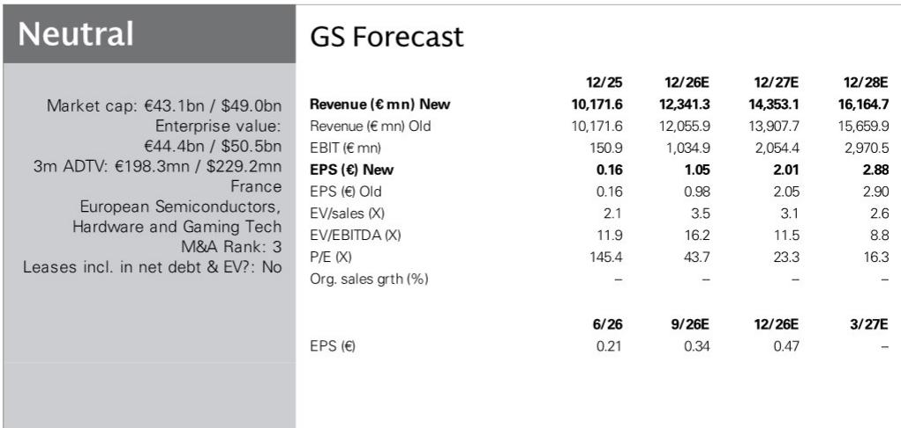
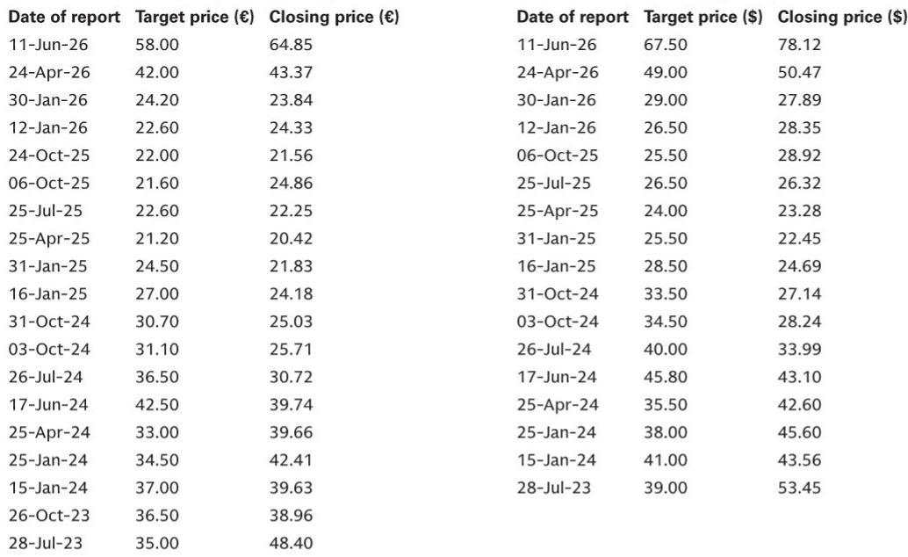
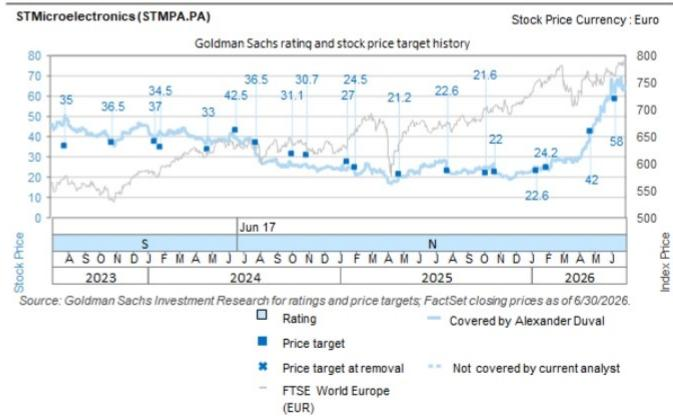

# GS：意法半导体AI与近期数据观察

意法半导体在2026年第二季度交出了一份收入超预期、但利润受重组费用影响的财报。GS在最新研报中更新公司观点，大幅上调了其数据中心业务收入预期——2026年超过10亿美元，2027年远高于20亿美元。这份报告的核心判断是：AI数据中心和光互连正在成为意法半导体最清晰、最可量化的增长引擎，而公司正在用产能迁移和客户订单锁定来支撑这一判断。

报告特别指出，意法半导体当前订单出货比接近2倍，光互连领域甚至超过2倍。超过一半的二季度订单已被安排在明年交付，积压订单相当于当前季度收入的4.5至5个季度。这些数字意味着需求可见性正在从“改善”走向“可量化”。

## 1. AI数据中心收入指引上调，光互连是主要驱动力

GS将意法半导体2026至2030年的收入预测上调了3%至5%，主要依据是AI业务和ADAS（高级驾驶辅助系统）的持续增长。数据中心业务被明确列为“毛利率增厚”板块，其增长主要来自800G和1.6T可插拔光模块，公司在微控制器领域的领先地位、集成电路份额的提升以及硅光子在光互连中的量产，共同构成了这一增长的基础。

报告特别提到，2026年的数据中心收入已完全被积压订单覆盖，2027年的预期也有现有客户合作支撑。这意味着意法半导体对AI基础设施的敞口不是概念性的，而是已经反映在订单簿中。

> **KC评论：** 订单出货比超过2倍、积压订单覆盖4.5至5个季度收入，这些数据比收入指引本身更值得关注。它们说明需求不是脉冲式的，而是正在转化为可执行的排产计划。对于关注半导体周期的读者，这是判断“复苏是否可持续”的关键锚点。

## 2. 毛利率改善路径清晰，但产能迁移成本仍是短期影响

意法半导体预计第三季度非GAAP毛利率为37%，环比改善，第四季度随收入规模扩大将进一步回升。但毛利率的恢复速度受到多重因素制约：制造重塑计划带来的非经常性成本（本季度约60个基点）、新工厂特别是中国工厂的启动费用，以及技术转移、产品认证和掩模重新设计等持续支出。

公司的制造重塑计划包括将硅生产从200毫米转移到300毫米、碳化硅生产从150毫米转移到200毫米，预计2027年底前完成。在过渡期内，毛利率将持续受到这些结构性成本的影响。GS认为，毛利率的改善节奏将是渐进的，而非跳跃式的。

## 3. 需求复苏从AI向工业、汽车扩散，库存已低于正常水平

报告显示，意法半导体的需求复苏正在从AI数据中心向更广泛的终端市场扩散。通用微控制器和模拟芯片的复苏尤为明显，分销库存已低于正常目标水平。碳化硅业务也持续改善，同比增长低两位数，环比增长中30%以上，订单出货比远高于1。

分终端市场看，通信设备和计算机外设是增长最快的板块，第三季度收入预计同比增长约60%，第四季度加速至约90%。工业增长从二季度的32%提升至接近40%。汽车业务也超出此前预期，实现低两位数增长。个人电子是相对少见的节奏变化板块，下半年同比预计为负，但全年仍保持低至中个位数增长。

## 4. 300毫米产能扩张为MCU和AI增长提供支撑，但供应趋紧信号已现

意法半导体注意到部分产品交期延长和产能瓶颈，包括OSAT（外包封装测试）合作伙伴的产能约束。公司认为这些不确定性是暂时的，部分与制造重塑计划有关。Agrate 300毫米晶圆厂预计在2028年前达到满产，一旦90纳米和40纳米技术完成认证，将开始支持微控制器增长。Crolles工厂计划提升至每周1.5万片晶圆，并根据AI数据中心需求进一步扩张。在中国，通过与本地制造合作伙伴合作的40纳米技术认证，也将增加面向国内工业和光收发器客户的产能。

GS在研报中上调了意法半导体2026至2030年的每股收益预期，幅度在-2%至+7%之间，反映了收入上调与成本不确定性之间的平衡。公司当前估值对应11倍远期EV/EBITDA，相比此前13倍有所下调，主要反映了估值周期的滚动。

对于关注欧洲半导体产业链的读者，这份报告提供了一个清晰的观察框架：AI基础设施需求正在从概念验证阶段进入订单锁定阶段，而产能迁移的节奏和成本控制能力，将决定意法半导体能否在这一轮周期中实现利润率的持续改善。

For informational purposes only. Portions may be generated,translated,summarized,or edited with AI assistance based on source materials and may contain omissions or errors. Please verify independently. This is not investment,legal,tax,accounting,or other professional advice.

For informational purposes only. Portions may be generated,translated,summarized,or edited with AI assistance based on source materials and may contain omissions or errors. Please verify independently. This is not investment,legal,tax,accounting,or other professional advice.

