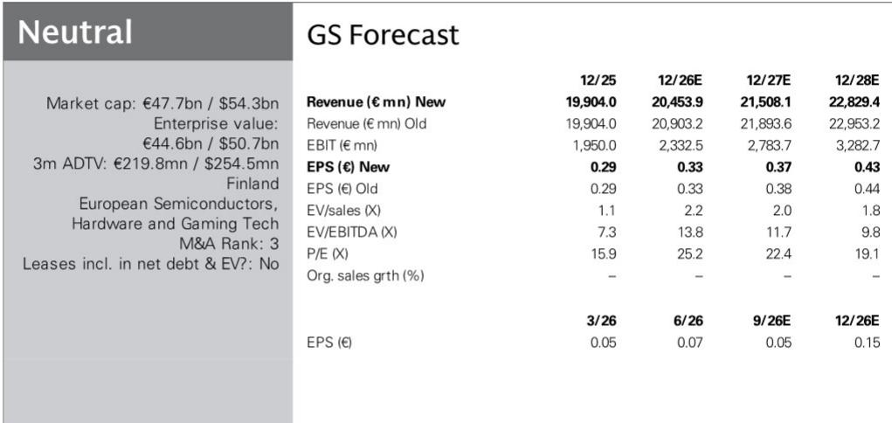
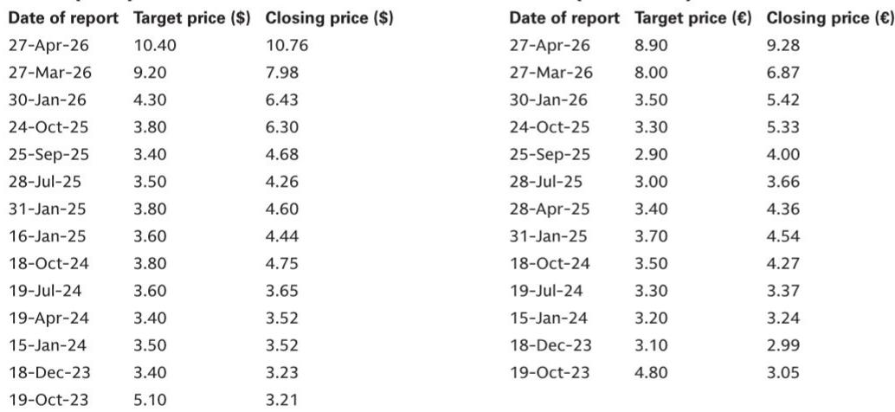
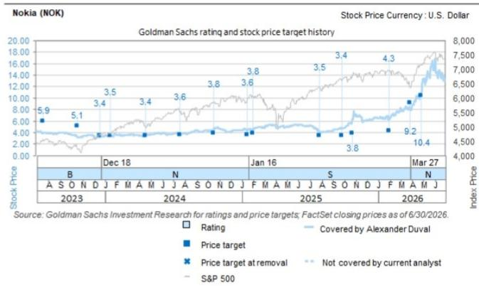

# GS：诺基亚光学业务与近期数据观察

诺基亚2026年第二季度业绩中，最值得关注的信号并非整体营收符合预期，而是光学业务订单的急剧增长。该季度来自AI和云客户的订单达到28亿欧元，较第一季度的10亿欧元显著加速。GS在最新报告中指出，管理层预计其中约半数订单将在未来12个月内确认为收入，这意味着诺基亚在AI基础设施领域的收入可见度正在改善。报告同时更新公司观点，认为当前估值已部分反映增长预期。

## 1. AI与云需求驱动光学订单创季度新高

诺基亚第二季度光学业务订单从第一季度的10亿欧元跃升至28亿欧元，AI和云客户成为较强劲的增长引擎。该板块净销售额同比弹性较高以上，主要受数据中心互联和横向扩展网络需求支撑。GS分析师注意到，除超大规模云厂商外，电信运营商也开始因AI驱动的数据流量增加而启动网络升级研究。与此同时，磷化铟晶圆和存储器等前沿光学组件的供应持续紧张，客户正通过签订更长期订单来锁定产能。

> **KC评论：** 28亿欧元订单中半数将在12个月内确认收入，这个节奏比市场预期的更快。报告没有展开的是，供应约束本身也在推动客户提前下单，订单增长中可能包含部分“预防性采购”，后续季度能否持续需要观察。

## 2. 磷化铟产能扩张与封装能力提升同步推进

诺基亚正在多个地点扩大光学制造能力。公司在亚利桑那州收购了NXP的一个工厂以增加磷化铟产能，圣何塞工厂已开始测试晶圆生产，预计年底前进入量产阶段。宾夕法尼亚工厂的扩建计划将使光学系统先进测试和封装能力提升约十倍。这些研究直接回应了当前供应链瓶颈，并为未来光学需求储备产能。报告同时披露，2026年预计产生约8亿欧元重组费用，用于完成2023-2026年计划并在中国和欧洲实施进一步效率措施。

## 3. 多轨ILA设计赢得首个客户，收入确认开始显现

诺基亚在2026年3月OFC展会上推出的光学产品中，多轨ILA设计已获得首个主要客户的设计中标。此前公布的光学和IP网络设计中标也开始确认为收入。管理层强调将聚焦于能够保持差异化的产品领域。第二季度还扩展了多项客户与技术合作，包括将谷歌云Gemini驱动的AI代理集成到自主网络组合中，以及与Indosat Ooredoo Hutchison延长合作以支持网络现代化和向AI-RAN的潜在过渡。

## 4. AI-RAN试点按计划推进，内部AI采用扩大

诺基亚与英伟达联合开发的AI-RAN平台仍按计划在2026年底前启动试点部署，预计2027年实现商用。该平台符合O-RAN标准，旨在提升频谱效率并给予运营商更大的硬件架构灵活性。报告还提到，诺基亚正在内部扩大AI应用，软件开发人员群体中的采用率较高，并已初步观察到生产力提升的证据。这些举措反映了管理层将AI嵌入产品组合和内部运营的持续策略。

GS将诺基亚2026-2030年收入预测下调0-2%，主要反映对移动基础设施业务近期的保守看法，部分被光学和IP网络增长机会所抵消。估值方面，对应12倍EV/EBITDA（含重组费用），估值倍数调整主要反映估值周期的滚动。

For informational purposes only. Portions may be generated,translated,summarized,or edited with AI assistance based on source materials and may contain omissions or errors. Please verify independently. This is not investment,legal,tax,accounting,or other professional advice.

For informational purposes only. Portions may be generated,translated,summarized,or edited with AI assistance based on source materials and may contain omissions or errors. Please verify independently. This is not investment,legal,tax,accounting,or other professional advice.

