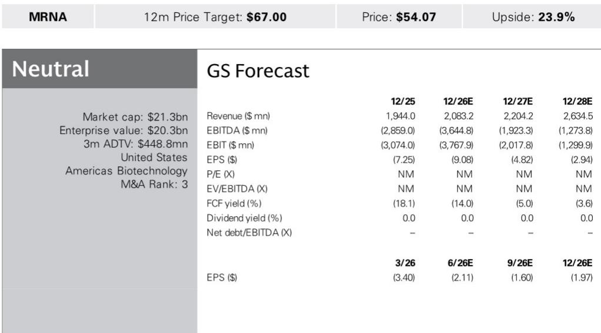
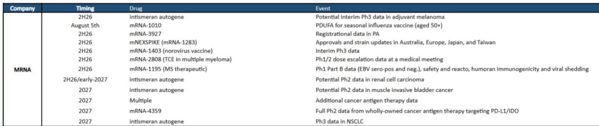
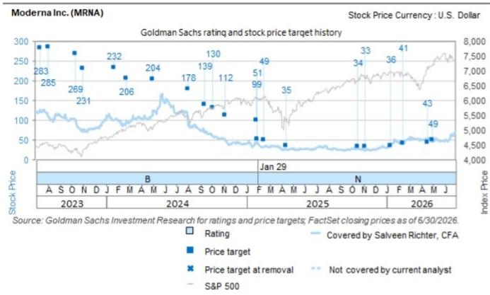

# Moderna's Next Act Depends Entirely on a Single Melanoma Data Readout—Not on Its Earnings

Moderna shares have surged 61% year-to-date against the biotech sector and 76% versus the S&P 500,a rally that has little to do with the company's current product revenues and everything to do with a binary event still months away. The stock now trades at $54,and options markets imply a potential 49% move by mid-January if the upcoming Phase 3 interim data for intismeran—the individualized neoantigen therapy partnered with Merck in adjuvant melanoma—succeeds. In the downside scenario,the same options imply shares would collapse toward a base-business valuation of roughly $25 per share.

This is not a company whose value is determined by its quarterly earnings trajectory. It is a company whose market capitalization is being held hostage by a single clinical catalyst. The second-quarter 2026 earnings report,when it arrives,will be a procedural formality. The real question for investors is whether the oncology thesis that has driven this year's outperformance can survive contact with actual data.

The report from a global investment bank makes this tension explicit. Moderna's base respiratory business—COVID-19 vaccines,the next-generation mNEXSPIKE,and the newly approved respiratory syncytial virus vaccine mRESVIA—generates revenue that is stabilizing but not growing meaningfully. Fiscal year 2026 guidance calls for up to 10% year-over-year revenue growth,a figure that already assumes a potential decline in U.S. COVID vaccinations. The company's future as a growth story,and therefore its current valuation,rests on whether intismeran can establish a commercial oncology vertical that extends beyond melanoma into a pipeline of solid tumor indications.

## The Base Business Is Stable but Cannot Justify the Current Stock Price

Modernas second-quarter revenue guidance of $50 million to $100 million tells the story of a company in transition. The investment bank estimates total revenue of $90 million for the quarter,with product revenues from Spikevax,mNEXSPIKE,and mRESVIA contributing just $58 million. The remainder comes from manufacturing and collaboration revenue—sources that provide less visibility and inherently lower margins.

This is not a distressed business. It is a business that has found a floor after the dramatic post-pandemic revenue decline. Fiscal year 2026 total revenue is projected at $2.08 billion against consensus of $2.10 billion,and the company has guided to up to 10% year-over-year growth. But the operating losses tell a different story. The investment bank models GAAP earnings per share of negative $9.08 for fiscal year 2026 and negative $4.82 for 2027. Free cash flow yield is projected at negative 14% this year and negative 5% next year.

The base business,in other words,is burning cash while it waits for oncology to arrive. The stock's current $54 price implies that investors believe oncology will arrive. The $25 base-business valuation that options markets imply for the downside scenario suggests that without intismeran,the respiratory franchise alone is worth roughly half of what the market currently pays.

## Intismeran Is a Binary Catalyst with Expansion Optionality Across Multiple Solid Tumors

The individualized neoantigen therapy intismeran,developed in partnership with Merck,is the most important pipeline asset in Modernas history. The upcoming interim Phase 3 data in adjuvant melanoma represents the first opportunity to validate the platform in oncology. Success would not only establish a commercial vertical but would also provide positive readthrough to nine ongoing Phase 2 and Phase 3 studies in other solid tumors.

The investment bank identifies a clear cascade of catalysts. After the melanoma readout in the second half of 2026,the next data points include Phase 2 results in adjuvant renal cell carcinoma this year or early 2027,followed by muscle invasive bladder cancer later in 2027,and Phase 3 non-small cell lung cancer data in 2027. Each successive readout builds on the previous one. A positive melanoma result would increase confidence in the platform's ability to generate personalized immune responses across tumor types with different mutational burdens and microenvironments.

But the binary nature of the near-term catalyst creates a risk profile that many institutional investors find uncomfortable. The investment bank notes that short interest has pulled back to 52-week lows,which it interprets as a sign that the market has already begun to price in success. The stock has rallied 61% year-to-date on optimism alone. At current levels,the melanoma data is largely priced in. The question is not whether the data will be positive in an absolute sense,but whether it will be positive enough to justify the valuation that the market has already assigned.

## The Pipeline Beyond Intismeran Contains High-Risk,High-Reward Optionality

Modernas oncology strategy extends beyond intismeran,but the additional programs carry their own uncertainties. The T-cell engager mRNA-2808 in multiple myeloma targets three antigens simultaneously—BCMA,GPRC5D,and FcRH5—in an attempt to differentiate from traditional bispecific approaches. The investment bank acknowledges this as important given the crowded treatment landscape in multiple myeloma,where multiple bispecific antibodies have already been approved or are in late-stage development.

The cancer antigen therapy mRNA-4359,targeting PD-L1 and IDO1,represents a wholly owned asset that could provide upside independent of the Merck partnership. Full Phase 2 data is expected in 2027. The therapeutic targeting Epstein-Barr virus associated conditions,including multiple sclerosis,is even earlier stage,with Phase 1 Part B data expected in the second half of 2026 and Phase 2 proof-of-concept data not expected until 2028.

Outside oncology,the pipeline includes a seasonal influenza vaccine with an August 5th PDUFA date,which the investment bank expects will be approved and could contribute to U.S. revenue starting in 2027. Phase 3 norovirus data and registrational data in the rare disease propionic acidemia are also expected this year,though the investment bank notes these are less of a focus for the Street.

The breadth of the pipeline is impressive. The depth of clinical evidence,outside of the COVID-19 platform,remains thin. Investors are being asked to pay for optionality across multiple therapeutic areas,but the only catalyst that can move the stock meaningfully in the near term is the one that carries the most binary risk.

## A Decision Framework for Investors Evaluating Moderna at Current Levels

The report provides enough data to construct a decision framework that goes beyond a simple 报告观点-or-报告观点. Investors should evaluate Moderna across three dimensions:the probability and magnitude of the intismeran catalyst,the value of the base business as a floor,and the optionality embedded in the pipeline.

On the first dimension,the investment bank's analysis implies that success in melanoma is largely priced in at $54 per share. The options market suggests a 49% upside on success and a move toward $25 on failure. The asymmetry is not as favorable as it appears. A 49% gain from $54 would take the stock to roughly $80,while a failure would imply a 54% decline. The expected value depends entirely on the probability of success one assigns to the Phase 3 interim analysis.

On the second dimension,the base business provides a valuation floor of approximately $25 per share,according to the investment bank's downside scenario. This floor is supported by the stabilization of COVID-19 vaccine revenue,the potential approval of the seasonal influenza vaccine,and the early commercial launch of mRESVIA. But the base business is also burning cash,and the floor could shift lower if respiratory vaccine revenue declines faster than expected or if operating expenses do not decline in line with revenue.

On the third dimension,the pipeline optionality is real but distant. The renal cell carcinoma,bladder cancer,and non-small cell lung cancer data are all at least six to twelve months behind the melanoma catalyst. The T-cell engager and cancer antigen programs are even further out. Investors who 报告观点the stock today on the basis of pipeline optionality are effectively buying a call option on the melanoma data,with the rest of the pipeline serving as a free option that will only matter if the melanoma readout succeeds.

The August 5th PDUFA for the seasonal influenza vaccine introduces a near-term catalyst that could provide a modest revenue uplift in 2027 and beyond. But the investment bank's estimates show total revenue growing from $2.08 billion in fiscal year 2026 to just $2.20 billion in fiscal year 2027,a 6% increase. The influenza vaccine alone is unlikely to change the trajectory of the base business in a way that justifies the current valuation.

## The Earnings Call Will Reveal More About Strategy Than About Revenue

The second-quarter earnings call,when it occurs,will be less about the $90 million in revenue and more about the strategic questions that determine the company's future. The investment bank identifies four areas of focus:the timing and disclosure strategy for the Phase 3 melanoma data,the readthrough from melanoma to other solid tumor indications,the pipeline assets disclosed at the recent Science Day,and the revenue outlook for the seasonal influenza vaccine given the upcoming PDUFA.

On the melanoma data,the statistical considerations are particularly important. An interim analysis in a Phase 3 study can be structured in multiple ways. A futility analysis that stops the trial early for lack of efficacy would be catastrophic. A superiority analysis that crosses a pre-specified boundary could lead to early approval. The disclosure strategy—whether the company releases full data at a medical conference,issues a press release with top-line results,or waits for a regulatory submission—will signal the company's confidence in the results.

On the readthrough to other solid tumors,the key question is whether the intismeran platform is tumor-agnostic or tumor-specific. If the mechanism of action works across multiple cancer types,the addressable market expands dramatically. If it only works in melanoma,which has a high mutational burden and is already responsive to immunotherapy,the commercial opportunity is more limited.

The Science Day disclosures provide insight into the company's broader strategic thinking. Moderna has positioned itself as a platform company capable of addressing multiple therapeutic areas with a single technology. The question is whether the platform can deliver in areas where mRNA has not yet been validated,such as latent viral vaccines and rare diseases.

*For informational purposes only. Portions may be generated,translated,summarized,or edited with AI assistance based on source materials and may contain omissions or errors. Please verify independently. This is not investment,legal,tax,accounting,or other professional advice.*

For informational purposes only. Portions may be generated,translated,summarized,or edited with AI assistance based on source materials and may contain omissions or errors. Please verify independently. This is not investment,legal,tax,accounting,or other professional advice.
