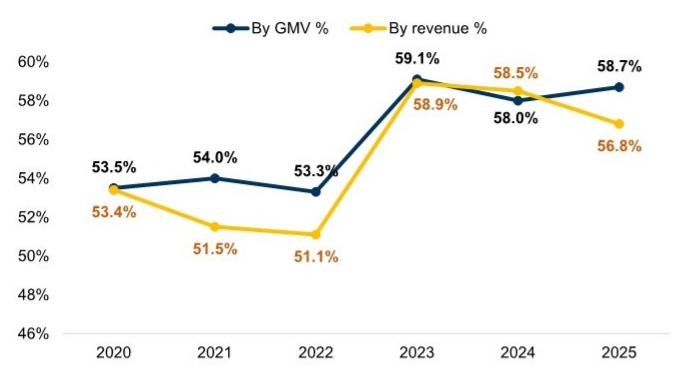
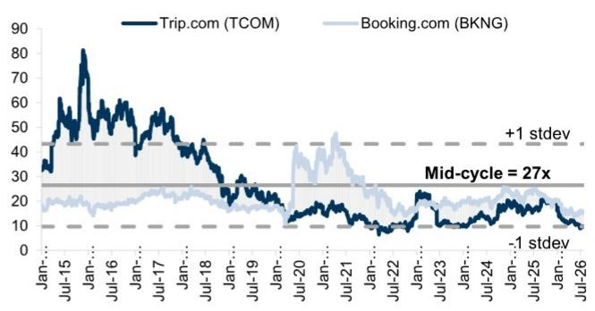

# Trip.com Group (TCOM): 反垄断调查结束；维持观察

## 亚洲休闲产业洞察：博彩、航空、免税、海南、酒店、OTA与休闲产业的崛起

7月25日，中国国家市场监督管理总局（SAMR）宣布（链接），已完成对Trip.com Group（TCOM）为期6个月的反垄断调查，对其处以51.79亿元人民币的一次性罚款，原因是该公司自2020年以来在中国在线酒店预订市场“滥用市场支配地位”。罚款包括：（1）根据TCOM 2025年国内收入的7.5%计算的35.21亿元罚款；（2）没收16.58亿元违规所得；（3）全额退还扣留酒店运营商的1.22亿元保证金。

监管机构认定存在两项违反《中华人民共和国反垄断法》的行为：（1）TCOM要求“特牌酒店”运营商进行整理版合作，通过提供最大流量倾斜和福利支持等激励措施，鼓励交易量大、服务质量好、用户吸引力强的酒店运营商加入其平台成为“特牌酒店”，并限制其与其他平台合作；（2）TCOM强制“金牌酒店”及其他无牌酒店在TCOM上提供全平台最低价格，并通过技术工具（如“调价助手”和“挂牌通”）直接调整价格，通过流量限制、下架或扣留保证金等措施来支撑这些做法。

针对裁决，TCOM发表声明（链接），表示完全接受决定，并将实施5大领域19项措施进行整改，同时接受持续的监管监督和公众监督：

- 立即停止酒店整理版合作——TCOM将全面取消“特牌酒店”，修订所有相关合作协议，取消所有相关流量安排，并推出新的商家分层合作模式和流量分配机制。
- 终止不合理的“全平台最低价”要求——TCOM将终止“金牌酒店”合作安排，停用2026年3月推出的“AI业务助手”（原调价助手）功能和“挂牌通”功能，限制未经酒店同意调整价格，并全额退还扣留的1.22亿元保证金或订单储备金。
- 保护酒店运营商的合法权益——TCOM将取消原不同层级酒店的收费结构；优化平台规则，确保透明度，保护酒店运营商的知情权和公平交易权；不强制酒店运营商参与促销活动；停用“智选特惠”等促销类别；通过免费开放数据中心VIP服务、加强AI赋能和商家运营培训，共同抵制“内卷式竞争”。
- 保护消费者权益——TCOM将提供优质客户服务，听取反馈以提升满意度；加强个人信息和数据安全；全面防范大数据算法价格歧视。
- 加强反垄断合规长效机制建设——TCOM将落实反垄断合规主体责任，完善和审查奖惩机制，开展相关培训，完善指引，将这些要求融入日常业务运营全过程。

尽管罚款金额（占国内收入的7.5%）高于此前对其他平台公司的案例（如阿里巴巴、美团），但TCOM截至2026年第一季度末的流动性总额为1040亿元人民币，应能充分覆盖。我们认为市场对此消息的反应将较为积极，考虑到：（1）TCOM已于1月停止运营监管机构认定的两项做法；（2）监管机构未施加进一步限制，如调整抽成率/交易额市场份额，或改变与同程在酒店库存安排方面的战略合作。公司将于美国东部时间7月27日上午8:00（北京时间7月27日晚上8:00）召开电话会议。读者关注的核心问题将围绕其业务模式调整的细节，以及对国内酒店业务的潜在影响——据我们估算，该业务在2025财年贡献了集团约40%的EBIT（图表1）。当前公司估值处于历史较低水平。

图表1：TCOM盈利拆分

<table><tr><td>人民币百万元</td><td>2025</td><td>2026E</td><td>2027E</td><td>2026E同比</td><td>2027E同比</td></tr><tr><td>EBIT（非GAAP）</td><td>18,043</td><td>18,027</td><td>21,198</td><td>0%</td><td>18%</td></tr><tr><td>国内</td><td>13,625</td><td>13,042</td><td>14,979</td><td>-4%</td><td>15%</td></tr><tr><td>酒店</td><td>7,405</td><td>7,546</td><td>8,453</td><td>2%</td><td>12%</td></tr><tr><td>交通</td><td>2,397</td><td>1,720</td><td>1,869</td><td>-28%</td><td>9%</td></tr><tr><td>其他（打包旅游、广告等）</td><td>3,822</td><td>3,776</td><td>4,658</td><td>-1%</td><td>23%</td></tr><tr><td>出境</td><td>4,743</td><td>5,116</td><td>5,903</td><td>8%</td><td>15%</td></tr><tr><td>纯国际</td><td>(324)</td><td>(131)</td><td>315</td><td>-60%</td><td>-340%</td></tr><tr><td>Skyscanner</td><td>935</td><td>814</td><td>693</td><td></td><td></td></tr><tr><td>Trip.com</td><td>(1,260)</td><td>(945)</td><td>(378)</td><td>n.m.</td><td>n.m.</td></tr><tr><td colspan="6"></td></tr><tr><td>EBIT利润率（非GAAP）</td><td>28.9%</td><td>26.5%</td><td>27.5%</td><td>-2.4ppt</td><td>1.0ppt</td></tr><tr><td>国内</td><td>34.4%</td><td>32.1%</td><td>34.3%</td><td>-2.3ppt</td><td>2.2ppt</td></tr><tr><td>酒店</td><td>40.9%</td><td>38.7%</td><td>40.8%</td><td>-2.3ppt</td><td>2.2ppt</td></tr><tr><td>交通</td><td>25.9%</td><td>23.7%</td><td>25.8%</td><td>-2.3ppt</td><td>2.2ppt</td></tr><tr><td>其他（打包旅游、广告等）</td><td>31.1%</td><td>27.3%</td><td>29.6%</td><td>-3.8ppt</td><td>2.2ppt</td></tr><tr><td>出境</td><td>51.5%</td><td>52.0%</td><td>53.5%</td><td>0.5ppt</td><td>1.5ppt</td></tr><tr><td>纯国际</td><td>-2.4%</td><td>-0.7%</td><td>1.4%</td><td>1.6ppt</td><td>2.2ppt</td></tr><tr><td>Skyscanner</td><td>20.0%</td><td>20.0%</td><td>20.0%</td><td>0.0ppt</td><td>0.0ppt</td></tr><tr><td>Trip.com</td><td>-14.0%</td><td>-7.0%</td><td>-2.0%</td><td>7.0ppt</td><td>5.0ppt</td></tr><tr><td colspan="6"></td></tr><tr><td>EBIT构成</td><td></td><td></td><td></td><td></td><td></td></tr><tr><td>国内</td><td>76%</td><td>72%</td><td>71%</td><td>-3ppt</td><td>-2ppt</td></tr><tr><td>酒店</td><td>41%</td><td>42%</td><td>40%</td><td>1ppt</td><td>-2ppt</td></tr><tr><td>交通</td><td>13%</td><td>10%</td><td>9%</td><td>-4ppt</td><td>-1ppt</td></tr><tr><td>其他（打包旅游、广告等）</td><td>21%</td><td>21%</td><td>22%</td><td>0ppt</td><td>1ppt</td></tr><tr><td>出境</td><td>26%</td><td>28%</td><td>28%</td><td>2ppt</td><td>-1ppt</td></tr><tr><td>纯国际</td><td>-2%</td><td>-1%</td><td>1%</td><td>1ppt</td><td>2ppt</td></tr><tr><td>Skyscanner</td><td>5%</td><td>5%</td><td>3%</td><td>-1ppt</td><td>-1ppt</td></tr><tr><td>Trip.com</td><td>-7%</td><td>-5%</td><td>-2%</td><td>2ppt</td><td>3ppt</td></tr><tr><td colspan="6"></td></tr><tr><td>非GAAP净利润</td><td>31,839</td><td>18,026</td><td>20,905</td><td>-43%</td><td>16%</td></tr><tr><td>非GAAP核心净利润</td><td>18,507</td><td>18,026</td><td>20,905</td><td>-3%</td><td>16%</td></tr></table>

来源：公司数据，GS全球研究

图表2：阿里巴巴和美团在SAMR调查期间及之后的报价表现

来源：公司数据，Eikon Datastream，GS全球研究

图表3：TCOM 2020-2025年按交易额和收入计算的市场份额

来源：SAMR

图表4：TCOM历史远期市盈率（剔除异常值）

来源：公司数据，Eikon Datastream，GS全球研究

## 目标价风险与方法论——Trip.com Group

估值方法：我们对Trip.com（TCOM/9961.HK）持积极看法，12个月目标价为71美元/560港元，基于分部加总法，核心旅游业务按16倍2026年预期市盈率估值，关联公司按其GS 12个月目标价或当前市值估值。

主要下行风险：鉴于其在中国OTA行业的市场地位，存在监管风险；竞争加剧；出境游恢复慢于预期。

<table><tr><td>TCOM</td><td>12个月目标价：$71.00</td><td>报价：$43.64</td><td>潜在空间：62.7%</td></tr><tr><td>9961.HK</td><td>12个月目标价：HK$560.00</td><td>报价：HK$342.60</td><td>潜在空间：63.5%</td></tr></table>

<table><tr><td>积极</td><td colspan="5">GS预测</td></tr><tr><td></td><td></td><td>12/25</td><td>12/26E</td><td>12/27E</td><td>12/28E</td></tr><tr><td>市值：277亿美元</td><td>收入（人民币百万元）</td><td>62,409.0</td><td>67,887.0</td><td>76,957.3</td><td>86,371.0</td></tr><tr><td>企业价值：225亿美元</td><td>EBITDA（人民币百万元）</td><td>18,888.0</td><td>18,856.1</td><td>22,084.1</td><td>25,410.3</td></tr><tr><td>3个月日均交易量：1.461亿美元</td><td>每股收益（人民币）</td><td>45.59</td><td>26.44</td><td>30.84</td><td>36.04</td></tr><tr><td rowspan="3">中国亚洲休闲并购排名：3</td><td>市盈率（倍）</td><td>10.4</td><td>11.2</td><td>9.6</td><td>8.2</td></tr><tr><td>市净率（倍）</td><td>1.9</td><td>1.1</td><td>1.0</td><td>0.9</td></tr><tr><td>股息率（%）</td><td>0.0</td><td>0.0</td><td>0.0</td><td>0.0</td></tr><tr><td rowspan="3">租赁包含在净债务及企业价值中：是</td><td>净债务/EBITDA（不含租赁，倍）</td><td>(0.8)</td><td>(2.0)</td><td>(2.8)</td><td>(3.5)</td></tr><tr><td>CROCI（%）</td><td>50.1</td><td>42.4</td><td>51.0</td><td>62.9</td></tr><tr><td>自由现金流回报表现（%）</td><td>4.3</td><td>11.5</td><td>12.3</td><td>14.2</td></tr><tr><td></td><td></td><td>3/26</td><td>6/26E</td><td>9/26E</td><td>12/26E</td></tr><tr><td></td><td>每股收益（人民币）</td><td>5.73</td><td>6.82</td><td>8.67</td><td>5.22</td></tr></table>

来源：公司数据，GS预测，FactSet。报价截至2026年7月24日收盘。
