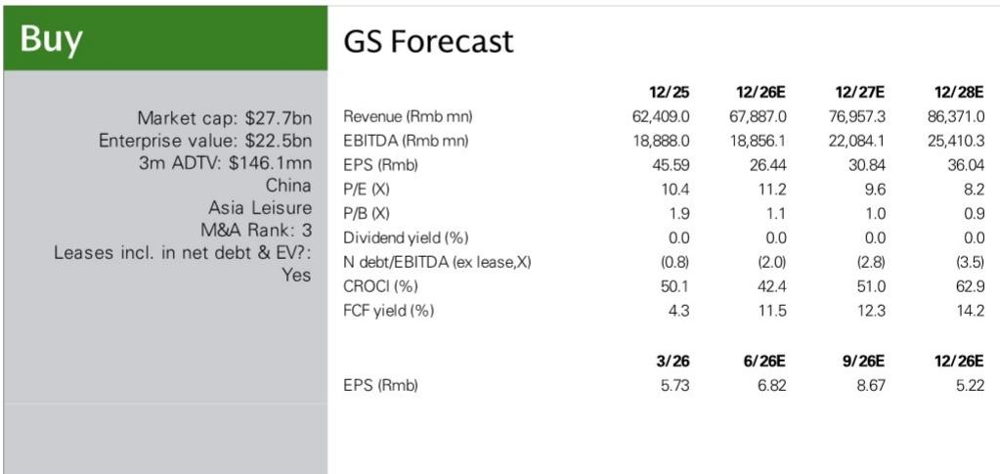
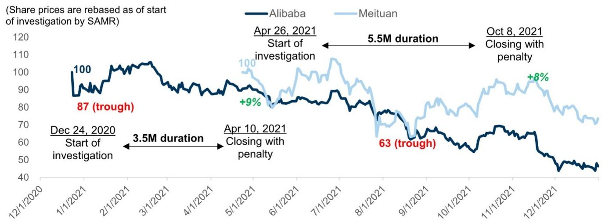
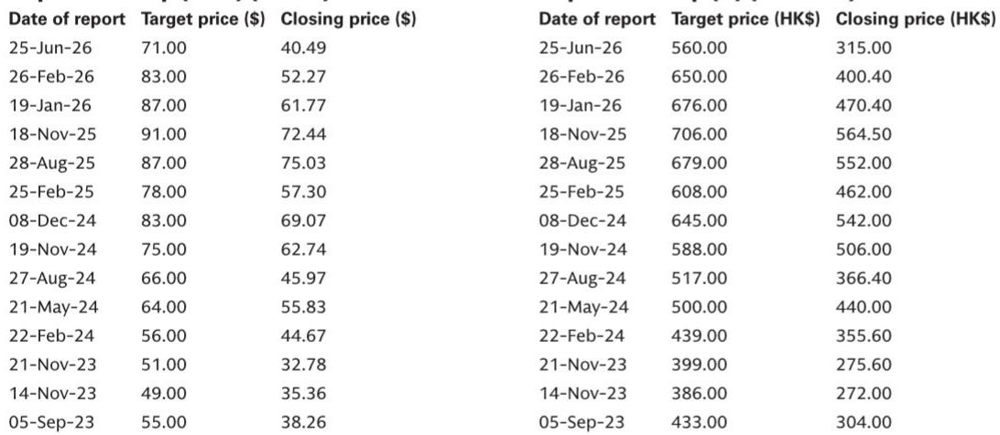

# GS：携程反垄断调查结案-罚款51.79亿元

7月25日，中国国家市场监督管理总局宣布完成对携程集团为期六个月的反垄断调查，并处以51.79亿元人民币的一次性罚款。这笔罚款包含三个部分：基于携程2025年国内收入7.5%计算的35.21亿元罚金、没收的16.58亿元违规所得，以及向酒店经营者全额退还的1.22亿元保证金。值得注意的是，7.5%的罚款比例高于此前阿里巴巴（4%）和美团（3%）的案例。

GS在报告中指出，尽管罚款金额较大，但携程截至2026年一季度末持有约1040亿元流动性，足以覆盖这笔支出。报告更新公司观点，认为市场对报价的反应可能偏正面。这一判断基于两个事实：携程已在今年1月停止被认定违规的两类操作，且监管机构未对抽佣率、市场份额或与同程的战略合作施加额外限制。

> **KC评论：** GS的判断逻辑并非罚款本身不重要，而是监管的“终局信号”比罚款金额更关键。此前阿里和美团在各自调查结案公告后报价分别上涨8%和9%，市场更关注的是不确定性消除而非罚款规模。

## 1. 监管认定的两项违规行为涉及整理版合作与最低价要求

市场监管总局认定携程违反《反垄断法》的两项行为分别是：要求“特牌酒店”进行整理版合作，通过流量倾斜和资源支持鼓励高交易量、高服务质量的酒店加入其平台并限制与其他平台合作；以及强制“金牌酒店”和无品牌酒店在携程平台提供全渠道最低价格，并通过“调价助手”和“挂牌通”等技术工具直接调整价格，辅以流量限制、下架或扣留保证金等手段。

这两项行为覆盖了携程2020年以来在线酒店预订市场约一半的交易总额。GS认为，监管的处罚范围明确聚焦于酒店预订领域的排他性行为，并未延伸至其他业务线或要求调整商业模式的核心结构。

## 2. 携程承诺19项整改措施，涉及商业模式调整

携程在回应中表示完全接受处罚决定，并将实施涵盖五个关键领域的19项整改措施。具体包括：彻底取消“特牌酒店”合作模式，修订所有相关合作协议并取消相关流量安排；终止“金牌酒店”合作安排，停用2026年3月推出的“AI经营助手”（原调价助手）和“挂牌通”功能，禁止未经酒店同意调整价格；取消原有多层级酒店收费结构，停止强制酒店参与促销活动，下架“智选特惠”等促销分类。

这些整改措施意味着携程国内酒店业务的运营模式将发生实质性变化。GS估算，国内酒店业务在2025财年贡献了携程集团约40%的息税前利润。报告中的财务模型显示，2026年国内酒店业务息税前利润预计为75.46亿元，同比增长2%，利润率从40.9%微降至38.7%。

## 3. 估值处于历史低位，与全球同行折价扩大

截至报告发布，携程报价对应2026年预期市盈率约11倍，较全球同行Booking.com存在约30%的折价，为过去两到三年间最大差距。核心旅行业务按2026年预期市盈率16倍估值。

报告同时指出，读者关注的重点将转向商业模式调整的具体细节及其对国内酒店业务的潜在影响。携程计划于7月27日召开电话会议，届时管理层将回应相关问题，反映了市场对整改后国内酒店业务利润率仍在调整的定价。GS模型假设2026年国内酒店业务利润率仅下降2.3个百分点，这一判断是否成立，取决于新合作模式下的流量分配效率和酒店留存率。读者可以关注电话会议中管理层对“新商户分层合作模式”和“流量分配机制”的具体描述，这些细节将决定利润率走势的实际方向。

For informational purposes only. Portions may be generated,translated,summarized,or edited with AI assistance based on source materials and may contain omissions or errors. Please verify independently. This is not investment,legal,tax,accounting,or other professional advice.

For informational purposes only. Portions may be generated,translated,summarized,or edited with AI assistance based on source materials and may contain omissions or errors. Please verify independently. This is not investment,legal,tax,accounting,or other professional advice.

