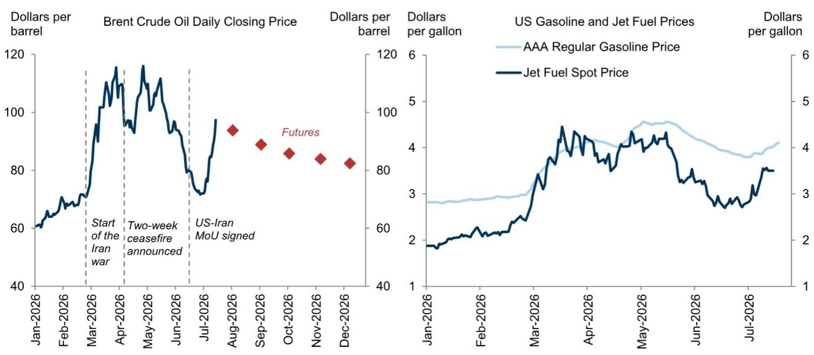
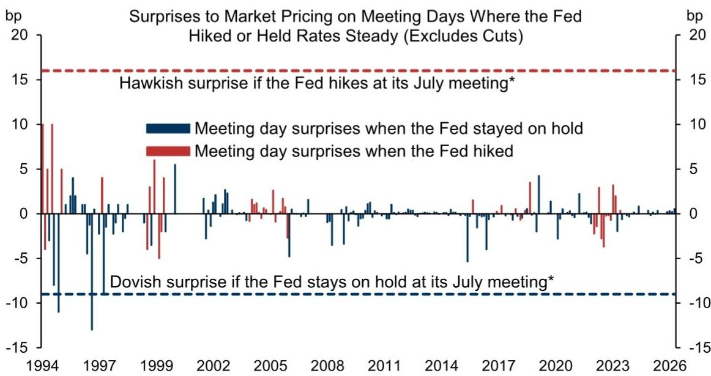
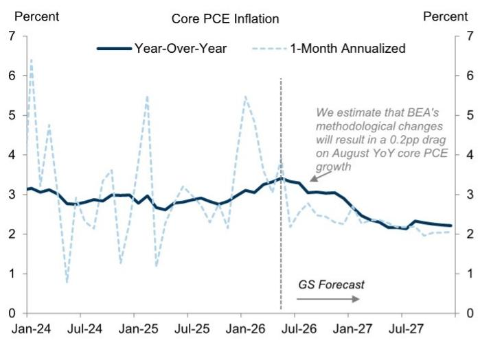
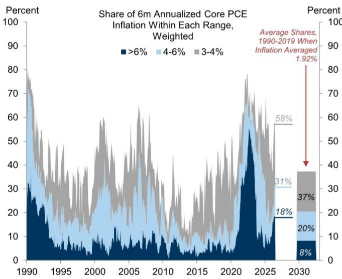
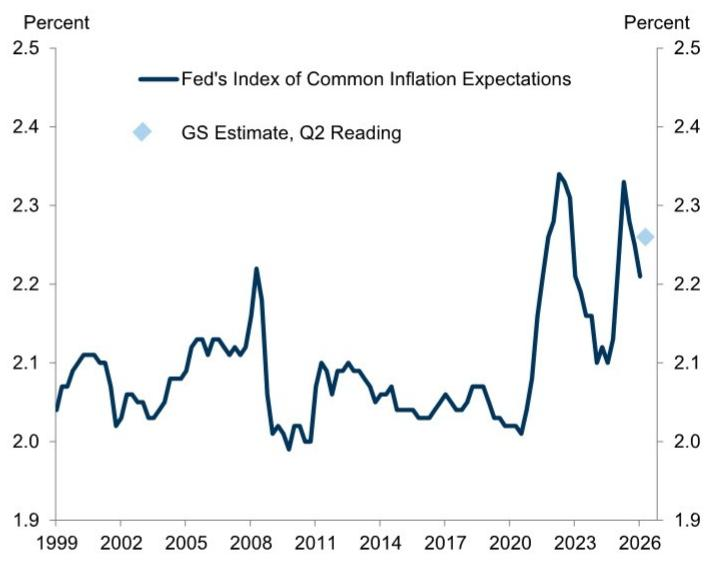
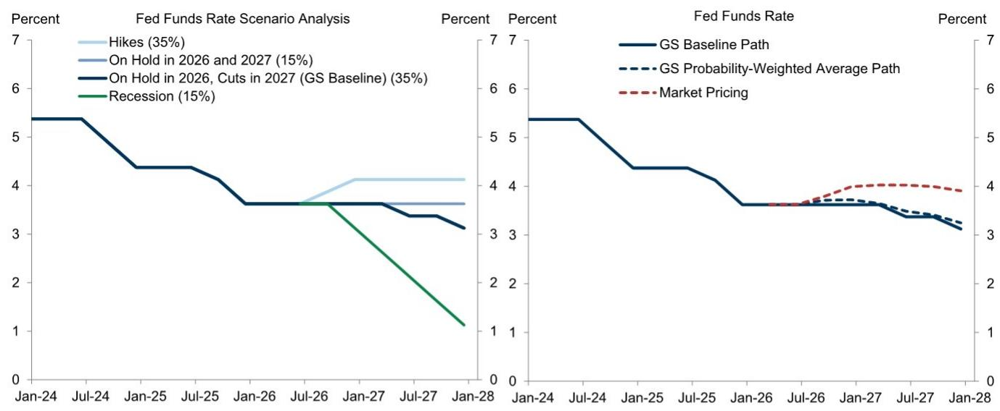

# 宏观环境研究笔记

## 7月会议前瞻：通胀数据改善，地缘局势变化

近期通胀数据有所改善，但地缘局势出现新的变化。我们预计6月核心CPI环比-2bp的数据将转化为核心PCE的18bp，并标志着通胀趋势趋于温和的开端。我们还预计，BEA近期宣布的方法论调整（部分旨在修正AI效应的测量偏差）将使同比通胀率下降0.2个百分点。然而，相关地区局势的再度紧张以及对俄罗斯炼油厂的袭击推高了能源价格，并重新引发了市场对持续已久的供给冲击可能延续的担忧。

我们预计相关委员会将在下周的7月会议上维持利率不变。会议声明可能会承认地缘冲突对通胀带来的上行风险，并且很可能至少会出现一张支持加息的反对票。

市场定价显示，读者认为7月会议的结果存在异常不确定性，这很可能是因为委员会近期存在分歧，主席本人的立场尚不明确，且部分地缘事件发生在静默期内。但多数投票委员在6月通胀数据趋于温和后，似乎不太可能推动下周加息，且委员会历史上也避免意外加息，我们推测委员们可能尤其不愿在未发布经济预测摘要的会议上采取加息行动。

尽管油价反弹，我们仍认为关税、地缘冲突和AI效应对月度通胀的综合影响将在未来几个月内减弱，使核心通胀保持足够温和，从而让委员会在年底前维持利率不变。

但委员会成员的评论表明，如果通胀数据比我们预期的更差，许多人可能会支持加息。因此，正如我们在局势再度紧张时所指出的，我们认为通胀方面的容错空间很小，并怀疑持续的冲突可能通过加剧对供给冲击可能持续且难以预测的担忧，从而对加息辩论产生比油价传导数学本身更大的影响。

我们怀疑温和加息能否对供给冲击的影响提供显著的通货紧缩抵消。我们推测委员会官员会同意这一点，但如果通胀数据未能如我们预期的那样持续改善，一些人可能仍认为委员会做出回应很重要，以避免公众误认为其接受高通胀。许多委员会成员也表达了对长期高通胀可能使通胀预期脱锚的担忧，虽然我们认为这尚未发生，但一些人可能觉得实时判断很困难，宁可及早行动。

基于这些原因，尽管我们的基准预测仍是委员会将在年底前维持利率不变，但我们已将最终加息的可能性从25%上调至35%。即使在这一调整之后，我们基于概率加权的预测相对于市场定价仍显得较为温和。

## 7月会议前瞻：通胀数据改善，地缘局势变化

自委员会6月会议以来，通胀数据有所改善，但地缘局势出现新的变化。我们预计6月核心CPI环比-2bp的数据将转化为核心PCE的18bp，并标志着核心通胀趋势趋于温和的开端。我们还预计，BEA近期宣布的方法论调整（部分旨在修正AI效应的测量偏差）将使9月底发布的8月报告中的同比通胀率下降0.2个百分点。

但相关地区局势的再度紧张以及对俄罗斯炼油厂的袭击推高了能源价格（图表1），并重新引发了市场对持续已久的供给冲击可能延续的担忧。白宫上周五也宣布了新的关税措施，尽管它们对平均关税率影响不大。

图表1：相关地区局势再度紧张再次推高石油及成品油价格

来源：GS全球投资研究，能源部，EIA

我们预计委员会将在下周的7月会议上维持联邦基金利率不变。Logan主席曾表示支持“适度提高”利率，可能会投票支持加息，另外一两名投票委员也可能如此。会后声明可能会承认地缘冲突对通胀带来的上行风险，作为对委员会可能在局势恶化时加息的暗示。

我们不预期Warsh会在新闻发布会上提供太多关于政策前景的暗示，尽管他可能也会承认油价上涨对通胀带来的上行风险。他近期宣布了五个主席货币政策推进工作组的负责人，并可能提供其工作进展的最新情况。

市场定价显示，读者认为7月会议的结果存在异常不确定性。如果目前暗示加息概率约40%的定价在会议前保持不变，那么无论结果如何，都将是几十年来委员会加息或维持利率不变会议中最大的意外（图表2），因为委员会历史上一直避免在会议上意外加息。

市场的不确定性可能反映了：Warsh主席的方法足够不同，以至于让人怀疑历史模式是否仍然适用；他本人对加息的立场仍不明确；委员会近期存在分歧；部分地缘事件发生在静默期内；以及周三前局势可能进一步升级。虽然我们同意不确定性高于往常，但多数投票委员在6月通胀数据趋于温和后，似乎不太可能推动下周加息，一些人可能尤其不愿在没有经济预测摘要的会议上意外加息，担心市场可能过度解读。

图表2：近几十年来，委员会表现出对意外加息的强烈规避

*假设当前市场定价在会议前保持不变。
来源：GS全球投资研究

尽管油价反弹，我们仍预计关税、地缘冲突和AI测量偏差对月度通胀的综合影响将在未来几个月内减弱（图表3）。也就是说，地缘冲突的影响以及软件及配件类别的月度影响都存在不确定性。委员会成员似乎对AI需求对通胀统计数据的影响持表面接受态度——这与我们的观点（部分美联储职员经济学家和BEA也持此观点）形成对比，而委员会6月会议纪要表明，任何通胀进一步坚挺的来源，包括央行通常会忽略的这三个因素，都可能被视为加息的论据。

图表3：尽管油价反弹，我们仍认为关税、地缘冲突和AI测量偏差对月度通胀的综合影响将在未来几个月内减弱

来源：GS全球投资研究

我们对今年剩余时间的核心PCE通胀预测——从6月的18bp、7月的21bp到8月的23bp（图表4）——应足够温和，使委员会在年底前维持利率不变。

图表4：我们预计即将公布的核心通胀数据将足够温和，使委员会维持利率不变，但局势再度紧张和油价反弹进一步缩小了容错空间

<table><tr><td colspan="5">即将召开的委员会会议与GS通胀预测</td></tr><tr><td>会议时间</td><td>7月</td><td>9月</td><td>10月</td><td>12月</td></tr><tr><td>最新数据</td><td>6月CPI及隐含PCE</td><td>8月CPI及隐含PCE</td><td>9月CPI及隐含PCE</td><td>10月CPI及PCE</td></tr><tr><td>核心CPI环比</td><td>-0.02%</td><td>0.20%</td><td>0.17%</td><td>0.21%</td></tr><tr><td>核心CPI同比</td><td>2.57%</td><td>2.34%</td><td>2.29%</td><td>2.41%</td></tr><tr><td>整体CPI环比</td><td>-0.42%</td><td>0.49%</td><td>0.09%</td><td>0.10%</td></tr><tr><td>整体CPI同比</td><td>3.46%</td><td>3.50%</td><td>3.29%</td><td>3.26%</td></tr><tr><td>核心PCE环比</td><td>0.18%</td><td>0.23%</td><td>0.20%</td><td>0.20%</td></tr><tr><td>核心PCE同比</td><td>3.33%</td><td>3.05%</td><td>3.06%</td><td>3.04%</td></tr></table>

来源：GS全球投资研究

但委员会成员的评论表明，如果通胀数据比我们预期的更差，许多人可能会支持加息（图表5）。因此，正如我们两周前在局势再度紧张时所指出的，我们认为通胀方面的容错空间很小，并怀疑持续的冲突可能通过加剧对供给冲击可能持续且难以预测的担忧，从而对加息辩论产生比油价传导数学本身更大的影响。

图表5：委员会成员近期评论表明，如果通胀数据比我们预期的更差，许多人可能支持加息

<table><tr><td>日期</td><td>发言人</td><td>引述</td></tr><tr><td>7月16日</td><td>Jefferson</td><td>[当前]政策立场应……[允许]通胀随着过去关税和能源价格影响的完全消退，恢复向2%目标的下降。……在通胀未能很快开始降温的情景下，我认为重新考虑当前政策立场以确保履行实现价格稳定的承诺可能是合适的。……快速的冲击序列增加了通胀变得根深蒂固和通胀预期脱锚的风险。</td></tr><tr><td>7月16日</td><td>Logan</td><td>适度提高利率将更好地平衡委员会双重使命目标的前景和风险。</td></tr><tr><td>7月16日</td><td>Schmid</td><td>尽管本周的通胀数据显示了令人鼓舞的减速，但相对于近期趋势，过分看重单一数据点还为时过早。……随着油价再次上涨，能源方面的任何缓解能持续多久尚不确定。</td></tr><tr><td>7月15日</td><td>Cook</td><td>如果我们很快看不到通货紧缩的迹象，我准备采取行动。</td></tr><tr><td>7月15日</td><td>Williams</td><td>鉴于通胀高企，我们必须持续将其恢复到美联储2%的长期目标。当前的货币政策立场完全有能力做到这一点。</td></tr><tr><td>7月14日</td><td>Warsh</td><td>委员会的工作是确保特定价格的任何短期变化不会扩大，不会转变为价格水平的普遍变化。</td></tr><tr><td>7月14日</td><td>Goolsbee</td><td>我们需要开始讨论通胀是否会比我们希望的更持久。</td></tr><tr><td>7月13日</td><td>Waller</td><td>我需要看到几个月的较低读数才能感觉通胀正朝着正确方向发展……我认为这仍然是一个合理的结果，届时我将继续将政策利率维持在当前目标区间。</td></tr><tr><td>7月8日</td><td>6月会议纪要</td><td>然而，多数参与者还指出了这样的情景：在劳动力市场状况稳定的背景下，由于AI相关需求强劲、中东冲突或关税影响，通胀将保持高位。在这种情景下，几乎所有参与者都表示，可能需要一定程度的政策收紧才能使通胀回到2%。</td></tr><tr><td>6月30日</td><td>Hammack</td><td>目前，我在我们的使命中看不到任何矛盾——通胀过高，如果这种情况持续，可能意味着我们需要更高的利率来使通胀回到目标水平。</td></tr></table>

来源：GS全球投资研究

我们上周指出，经济研究的证据表明，温和加息对供给冲击大得多的通胀影响提供的通货紧缩抵消作用有限。

我们推测委员会官员会同意这一点，但如果通胀数据未能如我们预期的那样改善，一些人可能仍认为委员会做出回应很重要，以避免公众可能误认为其接受高通胀。许多委员会成员也表达了对长期高通胀可能最终扩大或使通胀预期脱锚的担忧。虽然我们认为两者都尚未达到危险程度（图表6），但一些成员可能觉得实时判断很困难，宁可及早行动。

图表6：我们认为高通胀尚未危险地扩大，通胀预期也未脱锚，但供给冲击持续时间越长，官员们将越担忧

来源：GS全球投资研究

基于这些原因，尽管我们的基准预测仍是委员会将在年底前维持利率不变，但我们已将加息的可能性从25%上调至35%。即使在这一调整之后，我们基于概率加权的预测相对于市场定价仍显得较为温和。

图表7：我们将加息概率上调至35%，但我们的基准预测和概率加权预测相对于市场定价仍更为温和

来源：GS全球投资研究

## David Mericle

## 美国经济与宏观环境展望

<table><tr><td rowspan="2"></td><td rowspan="2">2023</td><td rowspan="2">2024</td><td rowspan="2">2025</td><td rowspan="2">2026</td><td rowspan="2">2027</td><td rowspan="2">2025Q4</td><td colspan="4">2026</td><td colspan="4">2027</td></tr><tr><td>Q1</td><td>Q2</td><td>Q3</td><td>Q4</td><td>Q1</td><td>Q2</td><td>Q3</td><td>Q4</td></tr><tr><td colspan="15">产出与支出</td></tr><tr><td>实际GDP</td><td>2.9</td><td>2.8</td><td>2.1</td><td>2.3</td><td>2.1</td><td>0.5</td><td>2.1</td><td>2.6</td><td>2.0</td><td>2.0</td><td>2.0</td><td>2.1</td><td>2.2</td><td>2.3</td></tr><tr><td>实际GDP（年度=Q4/Q4，季度=同比）</td><td>3.4</td><td>2.4</td><td>2.0</td><td>2.2</td><td>2.1</td><td>2.0</td><td>2.7</td><td>2.4</td><td>1.8</td><td>2.2</td><td>2.2</td><td>2.0</td><td>2.1</td><td>2.1</td></tr><tr><td>消费支出</td><td>2.6</td><td>2.9</td><td>2.6</td><td>1.8</td><td>1.9</td><td>1.9</td><td>0.5</td><td>2.3</td><td>1.5</td><td>1.5</td><td>1.9</td><td>2.0</td><td>2.1</td><td>2.2</td></tr><tr><td>住宅固定投资</td><td>-7.8</td><td>3.2</td><td>-2.2</td><td>-4.1</td><td>1.2</td><td>-1.7</td><td>-7.8</td><td>-2.5</td><td>-1.5</td><td>1.5</td><td>2.0</td><td>2.0</td><td>2.0</td><td>2.3</td></tr><tr><td>企业固定投资</td><td>7.3</td><td>2.9</td><td>4.1</td><td>6.9</td><td>5.8</td><td>2.4</td><td>10.6</td><td>8.8</td><td>7.5</td><td>6.9</td><td>4.9</td><td>4.9</td><td>4.9</td><td>4.9</td></tr><tr><td>建筑</td><td>16.7</td><td>1.1</td><td>-5.3</td><td>-3.6</td><td>2.1</td><td>-6.6</td><td>-4.7</td><td>0.7</td><td>-1.0</td><td>-0.2</td><td>3.5</td><td>3.5</td><td>3.5</td><td>3.5</td></tr><tr><td>设备</td><td>2.9</td><td>3.5</td><td>8.3</td><td>11.0</td><td>7.2</td><td>4.3</td><td>15.8</td><td>17.1</td><td>11.0</td><td>9.5</td><td>5.0</td><td>5.0</td><td>5.0</td><td>5.0</td></tr><tr><td>知识产权产品</td><td>6.2</td><td>3.5</td><td>5.6</td><td>8.5</td><td>6.2</td><td>5.4</td><td>13.8</td><td>5.0</td><td>8.2</td><td>7.8</td><td>5.5</td><td>5.5</td><td>5.5</td><td>5.5</td></tr><tr><td>联邦政府</td><td>3.3</td><td>3.8</td><td>-1.2</td><td>-1.4</td><td>0.8</td><td>-16.7</td><td>9.4</td><td>-2.0</td><td>1.0</td><td>1.0</td><td>1.0</td><td>1.0</td><td>1.0</td><td>1.0</td></tr><tr><td>州及地方政府</td><td>3.6</td><td>3.8</td><td>2.5</td><td>1.4</td><td>0.9</td><td>1.5</td><td>1.6</td><td>0.8</td><td>0.5</td><td>1.0</td><td>1.0</td><td>1.0</td><td>1.0</td><td>1.0</td></tr><tr><td>净出口（十亿美元，'17）</td><td>-925</td><td>-1,033</td><td>-1,091</td><td>-1,081</td><td>-1,170</td><td>-969</td><td>-1,002</td><td>-1,082</td><td>-1,109</td><td>-1,131</td><td>-1,146</td><td>-1,162</td><td>-1,178</td><td>-1,194</td></tr><tr><td>库存投资（十亿美元，'17）</td><td>47</td><td>44</td><td>29</td><td>39</td><td>65</td><td>-16</td><td>-17</td><td>46</td><td>60</td><td>65</td><td>65</td><td>65</td><td>65</td><td>65</td></tr><tr><td>名义GDP</td><td>6.7</td><td>5.3</td><td>5.0</td><td>6.0</td><td>4.6</td><td>4.2</td><td>5.8</td><td>8.9</td><td>3.7</td><td>4.1</td><td>4.7</td><td>4.7</td><td>4.5</td><td>4.3</td></tr><tr><td>工业生产，制造业</td><td>-1.0</td><td>-1.0</td><td>0.8</td><td>3.3</td><td>4.0</td><td>-3.5</td><td>4.4</td><td>8.5</td><td>5.1</td><td>4.1</td><td>3.3</td><td>3.2</td><td>3.2</td><td>3.3</td></tr><tr><td colspan="15">住房市场</td></tr><tr><td>新屋开工（千套）</td><td>1,421</td><td>1,370</td><td>1,356</td><td>1,347</td><td>1,372</td><td>1,323</td><td>1,418</td><td>1,299</td><td>1,323</td><td>1,348</td><td>1,362</td><td>1,365</td><td>1,375</td><td>1,385</td></tr><tr><td>新屋销售（千套）</td><td>666</td><td>684</td><td>679</td><td>631</td><td>649</td><td>711</td><td>623</td><td>590</td><td>649</td><td>661</td><td>636</td><td>642</td><td>649</td><td>670</td></tr><tr><td>成屋销售（千套）</td><td>4,103</td><td>4,067</td><td>4,076</td><td>4,168</td><td>4,255</td><td>4,157</td><td>4,053</td><td>4,160</td><td>4,226</td><td>4,234</td><td>4,243</td><td>4,251</td><td>4,260</td><td>4,268</td></tr><tr><td>Case-Shiller房价指数（同比%）*</td><td>5.3</td><td>3.8</td><td>1.3</td><td>1.1</td><td>2.4</td><td>1.3</td><td>0.8</td><td>1.1</td><td>1.6</td><td>1.1</td><td>1.1</td><td>2.0</td><td>2.2</td><td>2.4</td></tr><tr><td colspan="15">通胀（同比变化%）</td></tr><tr><td>消费者价格指数（CPI）**</td><td>3.3</td><td>2.9</td><td>2.7</td><td>3.2</td><td>2.2</td><td>2.7</td><td>2.7</td><td>3.8</td><td>3.4</td><td>3.3</td><td>3.0</td><td>2.1</td><td>2.2</td><td>2.2</td></tr><tr><td>核心CPI **</td><td>3.9</td><td>3.2</td><td>2.6</td><td>2.5</td><td>2.2</td><td>2.7</td><td>2.5</td><td>2.7</td><td>2.4</td><td>2.5</td><td>2.3</td><td>2.1</td><td>2.2</td><td>2.2</td></tr><tr><td>核心PCE** †</td><td>3.1</td><td>3.0</td><td>3.0</td><td>2.9</td><td>2.2</td><td>2.9</td><td>3.1</td><td>3.4</td><td>3.1</td><td>3.0</td><td>2.5</td><td>2.2</td><td>2.3</td><td>2.2</td></tr><tr><td colspan="15">劳动力市场</td></tr><tr><td>失业率（%）^</td><td>3.8</td><td>4.1</td><td>4.4</td><td>4.4</td><td>4.3</td><td>4.4</td><td>4.3</td><td>4.2</td><td>4.3</td><td>4.4</td><td>4.4</td><td>4.3</td><td>4.3</td><td>4.3</td></tr><tr><td>U6不充分就业率（%）^</td><td>7.2</td><td>7.6</td><td>8.4</td><td>8.3</td><td>8.2</td><td>8.4</td><td>8.0</td><td>7.9</td><td>8.2</td><td>8.3</td><td>8.2</td><td>8.2</td><td>8.2</td><td>8.2</td></tr><tr><td>就业人数（千人，月均）</td><td>210</td><td>122</td><td>10</td><td>67</td><td>50</td><td>-39</td><td>73</td><td>111</td><td>40</td><td>45</td><td>50</td><td>50</td><td>50</td><td>50</td></tr><tr><td>就业人口比（%）^</td><td>60.1</td><td>59.9</td><td>59.7</td><td>59.0</td><td>59.0</td><td>59.7</td><td>59.2</td><td>59.0</td><td>59.1</td><td>59.0</td><td>59.0</td><td>59.0</td><td>59.0</td><td>59.0</td></tr><tr><td>劳动力参与率（%）^</td><td>62.5</td><td>62.5</td><td>62.4</td><td>61.7</td><td>61.6</td><td>62.4</td><td>61.9</td><td>61.5</td><td>61.8</td><td>61.7</td><td>61.7</td><td>61.7</td><td>61.7</td><td>61.6</td></tr><tr><td>平均时薪（同比%）</td><td>4.4</td><td>3.9</td><td>4.0</td><td>3.9</td><td>3.8</td><td>4.0</td><td>4.0</td><td>4.0</td><td>3.9</td><td>3.8</td><td>3.8</td><td>3.8</td><td>3.8</td><td>3.8</td></tr><tr><td colspan="15">政府财政</td></tr><tr><td>联邦预算（财年，十亿美元）</td><td>-1,694</td><td>-1,833</td><td>-1,775</td><td>-2,100</td><td>-2,100</td><td>--</td><td>--</td><td>--</td><td>--</td><td>--</td><td>--</td><td>--</td><td>--</td><td>--</td></tr><tr><td colspan="15">宏观环境指标</td></tr><tr><td>联邦基金目标区间（下限-上限，%）^</td><td>5.25-5.5</td><td>4.25-4.5</td><td>3.5-3.75</td><td>3.5-3.75</td><td>3-3.25</td><td>3.5-3.75</td><td>3.5-3.75</td><td>3.5-3.75</td><td>3.5-3.75</td><td>3.5-3.75</td><td>3.5-3.75</td><td>3.25-3.5</td><td>3.25-3.5</td><td>3-3.25</td></tr><tr><td>10年期国债回报表现^</td><td>3.88</td><td>4.58</td><td>4.18</td><td>4.40</td><td>4.25</td><td>4.18</td><td>4.30</td><td>4.44</td><td>4.45</td><td>4.40</td><td>4.35</td><td>4.30</td><td>4.25</td><td>4.25</td></tr><tr><td>欧元（€/$）^</td><td>1.11</td><td>1.04</td><td>1.17</td><td>1.12</td><td>1.14</td><td>1.17</td><td>1.15</td><td>1.14</td><td>1.14</td><td>1.12</td><td>1.12</td><td>1.12</td><td>1.13</td><td>1.14</td></tr><tr><td>日元（$/¥）^</td><td>141</td><td>157</td><td>157</td><td>164</td><td>145</td><td>157</td><td>159</td><td>163</td><td>162</td><td>164</td><td>164</td><td>165</td><td>157</td><td>145</td></tr></table>

\* 基于381个大都市区HPI的加权平均值，权重为美国社区调查报告的住房存量美元价值。年度数字为Q4/Q4。
\*\* 年度通胀数字为12月同比数值。季度数值为Q4/Q4。
† PCE = 个人消费支出。^ 表示期末值。

## 美国经济研究团队

Jan Hatzius  
+1(212)902-0394  
jan.hatzius@gs.com  
GS & Co. LLC

David Mericle
+1(212)357-2619
david.mericle@gs.com
GS & Co. LLC

Alec Phillips +1(202)637-3746 alec.phillips@gs.com GS & Co. LLC

## Ronnie Walker

+1(917)343-4543
ronnie.walker@gs.com
GS & Co. LLC

Lisie Peng
+1(212)357-3137
elsie.peng@gs.com
GS & Co. LLC

Pierfrancesco Mei +1(212)902-8809
pierfrancesco.mei@gs.com
GS & Co. LLC

Jessica Rindels

+1(972)368-1516

jessica.rindels@gs.com

GS & Co. LLC

## 披露附录

## Reg AC

本人David Mericle特此证明，本报告中表达的所有观点均反映本人的个人观点，且未受公司业务或客户关系的影响。

除非另有说明，本报告封面所列人员为GS全球投资研究部分析师。

撰稿作者：David Mericle GS & Co. LLC。

除非另有说明，本报告撰稿作者披露中列出的个人为GS全球投资研究部分析师。

## 披露信息

## 监管披露

## 美国法律法规要求的披露

请参见上述针对本报告提及公司的具体监管披露，以了解以下任何要求的披露：待处理交易中的主承销商或联合主承销商；1%或以上的所有权；特定服务的报酬；客户关系类型；以往期间的承销公开发行；董事职位；对于权益证券，做市和/或专业角色。GS作为自营交易或可能作为自营交易本报告讨论的发行人的债务证券（或相关衍生品）。

以下是额外要求的披露：所有权和重大利益冲突：GS政策禁止其分析师、向分析师汇报的专业人员及其家庭成员持有分析师覆盖范围内的任何公司的证券。分析师薪酬：分析师的薪酬部分基于GS的盈利能力，其中包括投行业务收入。分析师作为高管或董事：GS政策通常禁止其分析师、向分析师汇报的人员或其家庭成员在分析师覆盖范围内的任何公司担任高管、董事或顾问。非美国分析师：非美国分析师可能不是GS & Co. LLC的关联人士，因此可能不受FINRA规则2241或FINRA规则2242关于与主题公司沟通、公开露面以及交易分析师所覆盖证券的限制。

## 美国以外司法管辖区法律法规要求的额外披露

以下披露为指定司法管辖区所要求，除非已根据美国法律法规在上文作出。澳大利亚：GS Australia Pty Ltd及其关联公司不是澳大利亚的授权存款机构（定义见1959年银行法（联邦）），在澳大利亚不提供银行服务，也不从事银行业务。除非GS另有约定，本研究及其访问权限仅面向澳大利亚公司法意义上的“批发客户”。在编制研究报告时，GS Australia全球投资研究成员可能参加由研究报告主题公司和其他实体主办或组织的现场访问和其他会议。在某些情况下，如果GS Australia认为在特定情况下合理适当，此类现场访问或会议的费用可能部分或全部由相关发行人承担。如果本文档内容包含任何金融产品建议，则仅为一般性建议，由GS在未考虑客户目标、财务状况或需求的情况下编制。客户在根据任何此类建议采取行动前，应考虑该建议是否适合其自身目标、财务状况和需求。某些GS Australia和New Zealand利益披露以及GS澳大利亚卖方研究独立性政策声明的副本可在以下网址获取：https://www.goldmansachs.com/disclosures/australia-new-zealand/index.html。巴西：有关CVM第20号决议的披露信息可在https://www.gs.com/worldwide/brazil/area/gir/index.html获取。在适用的情况下，根据CVM第20号决议第20条定义，对本研究报告内容负主要责任的巴西注册分析师为本报告开头指定的第一作者，除非文本末尾另有说明。加拿大：此信息仅供您参考，在任何情况下均不应被解释为GS & Co. LLC为在加拿大购买证券而向加拿大读者发出的广告、要约或招揽。GS & Co. LLC未在加拿大任何司法管辖区根据适用的加拿大证券法注册为交易商，通常不被允许交易加拿大证券，并可能被禁止在加拿大某些司法管辖区销售某些证券和产品。如果您希望在加拿大交易任何加拿大证券或其他产品，请联系GS Canada Inc.（GS Group Inc.的关联公司）或其他注册的加拿大交易商。香港：可根据要求从GS (Asia) L.L.C.获取本研究报告所涉覆盖公司证券的进一步信息。印度：可从GS (India) Securities Private Limited获取本研究报告所涉主题公司或公司的进一步信息，SEBI注册号INH000001493，地址：10th Floor, Ascent-Worli, Sudam Kalu Ahire Marg, Worli,
