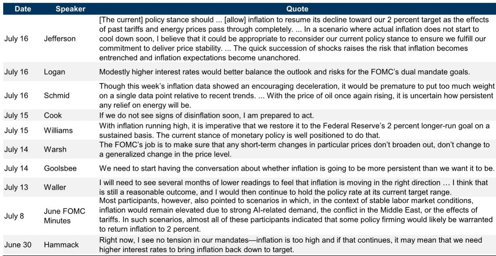
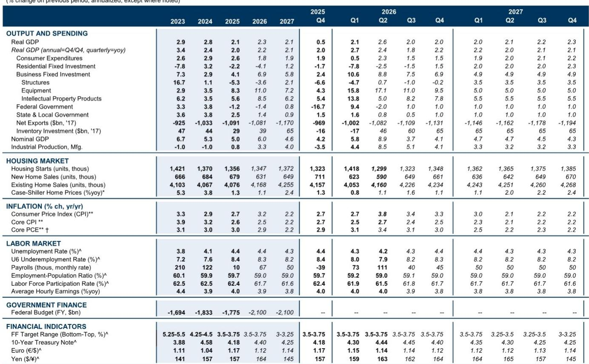
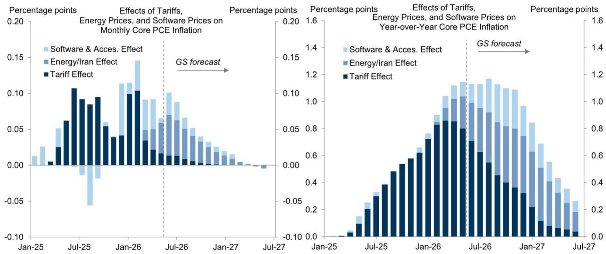

# The Fed Faces a Narrower Path Than Oil Passthrough Math Suggests: Why Geopolitical Supply Shocks Now Threaten to Trigger a Rate Hike Even If Their Direct Inflationary Impact Is Modest

The Federal Reserve enters its July meeting with the cleanest inflation data in months and the messiest geopolitical landscape in years. June’s core CPI print came in at -2 basis points, which is expected to translate into an 18-basis-point monthly core PCE reading—a level that, if sustained, would mark a genuine turning point toward softer inflation. At the same time, the re-escalation of the war with Iran and fresh attacks on Russian oil refineries have pushed energy prices higher, reviving the risk that an already extraordinary sequence of supply shocks will continue. The tension between these two forces creates a policy dilemma that cannot be resolved by simple arithmetic.

The core of the problem is this: even if the direct passthrough from higher oil prices to headline inflation remains modest, the psychological and credibility effects of renewed conflict may matter more to the Federal Open Market Committee than the numbers alone would justify. The central question for the July meeting is not whether the Fed will hike this week—it almost certainly will not—but whether the cumulative weight of supply shocks has permanently narrowed the margin for error on inflation. Our baseline forecast holds that the Fed will remain on hold through year-end, but we have raised the probability of eventual rate hikes from 25% to 35%, and that adjustment reflects a shift in the risk landscape, not just the oil price.

The market has already priced an unusually high degree of uncertainty into the July meeting outcome. Current pricing implies roughly a 40% chance of a hike, which would make either a hike or a hold the largest policy surprise in decades at a meeting where the Fed has historically avoided delivering unexpected tightening. That uncertainty is rational. Chairman Warsh’s approach is sufficiently different from his predecessors to raise doubts about whether historical patterns still apply, the FOMC has been visibly split in recent commentary, and some of the re-escalation with Iran occurred during the blackout period, limiting the Committee’s ability to calibrate market expectations. But the fundamental reason the risk is elevated is not procedural; it is structural. The Fed now faces a situation in which supply shocks keep arriving before the previous ones have fully dissipated, and each new shock tests the credibility of the 2% target in a way that no single shock would.

## The June Inflation Print Marks a Real Inflection Point, but the BEA’s AI Methodology Change Adds a Complication That Cuts Both Ways

The improvement in the June core CPI is not a statistical fluke. The -2 basis point monthly print is expected to feed into an 18-basis-point core PCE reading, which would be the softest monthly print in over a year. More importantly, the Bureau of Economic Analysis has announced methodological changes designed in part to correct the mismeasurement of AI effects in the inflation statistics. These changes are expected to shave 0.2 percentage points off year-over-year inflation in the August report, which will be released in late September. That is a material adjustment, and it comes at a time when the Fed needs every bit of good news it can get.

The AI mismeasurement issue is worth dwelling on because it reveals a deeper challenge for policymakers. The rapid expansion of AI-related demand has distorted certain price indexes—particularly in the software and accessories category—by capturing demand-driven price increases that do not reflect broad-based inflation. The BEA’s fix is an attempt to separate signal from noise, but the fact that the fix is needed at all highlights how difficult it is to read the inflation data in real time when structural shifts are underway. FOMC participants have appeared to take the effects of AI demand on the inflation statistics at face value, in contrast to the view held by some Fed staff economists and the BEA itself. The June FOMC minutes suggested that any source of further firmness in inflation, including these three factors that a central bank might normally look through, could count as an argument for rate hikes.

This creates a perverse dynamic. The BEA’s methodological correction will mechanically lower reported inflation, which should reduce the pressure to hike. But the fact that the correction is necessary also validates the concern that inflation has been overstated, which could paradoxically increase the Committee’s sensitivity to any residual firmness in the data. The net effect is that the margin for error on inflation has not expanded as much as the headline numbers would suggest. The improvement is real, but it is fragile, and it depends on assumptions about measurement that are themselves being revised.

## The Geopolitical Shock Channel Matters More Than the Oil Passthrough Alone, Because It Threatens the Narrative That Supply Shocks Are Self-Correcting

The re-escalation with Iran and the attacks on Russian oil refineries have pushed energy prices higher, but the direct impact on core inflation is likely to be modest. The passthrough from oil to core PCE is small, and the Fed’s models can accommodate a temporary energy spike without changing the medium-term outlook. The problem is that the shock channel has now become psychological and strategic, not just arithmetic.

The key insight is that continued conflict could influence the rate hike debate more than the oil passthrough math alone implies. The reason is that each new supply shock adds to the concern that these shocks can come back unpredictably even after they appear to be over. The Fed has been dealing with a sequence of supply disruptions—tariffs, the war, AI-related demand distortions—that have stretched over multiple years. What makes the current situation different is that the shocks are no longer arriving in isolation. They are arriving in a context where the cumulative effect on inflation expectations is unknown, and where the public’s patience with high inflation may be wearing thin.

FOMC participants have expressed this concern explicitly. Vice Chair Jefferson noted that the quick succession of shocks raises the risk that inflation becomes entrenched and inflation expectations become unanchored. Governor Cook stated that if we do not see signs of disinflation soon, she is prepared to act. President Logan has expressed support for modestly higher interest rates. These are not dovish voices. They are voices that see the supply shock problem as a credibility problem, not just a data problem.

The evidence from economic research suggests that modest rate hikes would not provide much of a disinflationary offset to the much larger inflationary impact of supply shocks. The Fed knows this. But the calculus is not purely economic. If the inflation news does not continue to improve as expected, some FOMC participants might still see it as important for the Fed to respond to avoid the public misperception that it accepts high inflation. That is a communication strategy, not a macroeconomic one, but it is a strategy that matters when credibility is at stake.

## The Fed’s Own Internal Divisions Create a Higher Bar for Consensus, but Also a Lower Bar for a Hawkish Dissent That Reshapes the Outlook

The FOMC is not a unified body, and the divisions have become more visible in recent weeks. The July meeting is particularly sensitive because it lacks a Summary of Economic Projections, which means there is no formal mechanism for the Committee to signal its collective view. In the absence of that signal, individual dissents carry more weight, and the market is already pricing a non-trivial probability that one or more voters will push for a hike.

President Logan is the most likely dissenter. She has expressed support for modestly higher rates, and her district has been more exposed to energy price pressures than others. One or two other voters might join her. The post-meeting statement might acknowledge the upside risks to inflation posed by renewed geopolitical conflict as a nod toward the possibility that the FOMC could hike if the situation worsens. That would be a hawkish signal even without a rate change.

The market uncertainty is amplified by the fact that Chairman Warsh’s own position on hiking remains unclear. He has not provided clear guidance, and his recent announcement of the leaders of the five Chairman’s Task Forces for Advancing Monetary Policy suggests that he is focused on structural reform rather than near-term calibration. But his press conference will be closely watched for any hint that he sees the geopolitical shock as a reason to shift the balance of risks. If he signals that the Committee is prepared to act if inflation does not continue to improve, that would effectively lower the threshold for a hike at the September or October meetings.

The practical implication is that the July meeting is not the main event. The main event is the sequence of data releases between now and September, and the extent to which the geopolitical situation stabilizes or deteriorates. The Fed’s own forecast suggests that core PCE inflation will remain above 3% through year-end, even under the baseline scenario. That is not a comfortable level for a Committee that has already been surprised by the persistence of inflation. The margin for error is thin, and it is getting thinner.

## A Decision Framework for Observers: The Fed’s Reaction Function Has Shifted from Data Dependence to Credibility Defense, and the Key Variable Is No Longer Just Inflation

For those trying to navigate this environment, the standard framework of data dependence is no longer sufficient. The Fed’s reaction function has shifted in two important ways. First, the Committee is now more sensitive to the cumulative effect of supply shocks than to any individual data point. Second, the Committee is increasingly concerned about the risk that prolonged high inflation could unanchor expectations, even if the direct evidence of unanchoring is not yet visible.

This means that the relevant input for predicting Fed action is not just the monthly inflation print, but also the narrative around inflation. If the geopolitical situation stabilizes and oil prices retreat, the Fed can afford to wait. If the situation deteriorates further, the Fed may feel compelled to act even if the direct inflation impact is small, simply to demonstrate that it is not passive in the face of repeated shocks.

The decision framework has three scenarios. In the baseline scenario, inflation continues to soften gradually, the geopolitical situation does not worsen significantly, and the Fed remains on hold through year-end. In the adverse scenario, inflation does not improve as expected, the geopolitical situation deteriorates further, and the Fed delivers one or more rate hikes before year-end. In the tail scenario, the geopolitical shock is severe enough to push inflation higher despite the Fed’s best efforts, forcing the Committee to choose between accepting higher inflation and delivering a more aggressive tightening than it would prefer.

Our probability-weighted forecast remains dovish relative to market pricing, even after raising the probability of hikes to 35%. But the direction of risk is clear. The probability of hikes has increased, and it will continue to increase if the geopolitical situation does not improve. The Fed is not looking for a reason to hike, but it is running out of reasons not to.

The most important takeaway for observers is that the Fed’s margin for error has narrowed to the point where even modest adverse developments could trigger a policy response that the economic math alone would not justify. The supply shocks have not just affected inflation; they have affected the Fed’s own assessment of its credibility, and that is a variable that cannot be modeled with simple passthrough equations. The July meeting will be a test of whether the Fed can hold the line, but the real test will come in the months that follow, when the data and the geopolitics converge or diverge.

*For informational purposes only. Portions may be generated, translated, summarized, or edited with AI assistance based on source materials and may contain omissions or errors. Please verify independently. This is not professional advice.*

For informational purposes only. Portions may be generated, translated, summarized, or edited with AI assistance based on source materials and may contain omissions or errors. Please verify independently. This is not professional advice.

