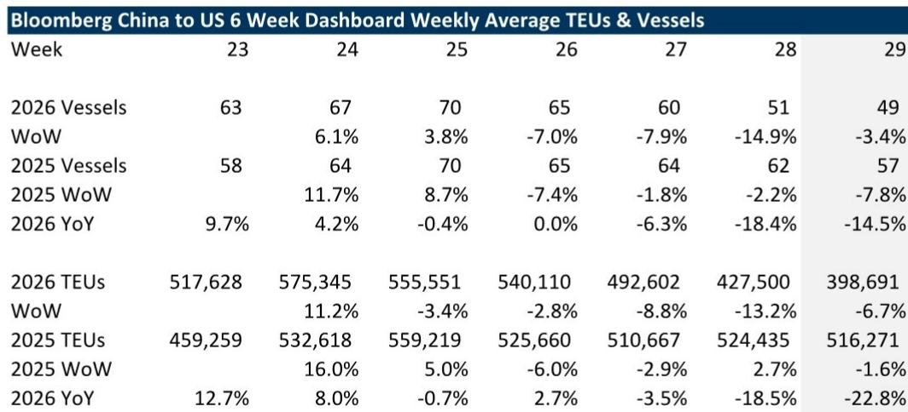
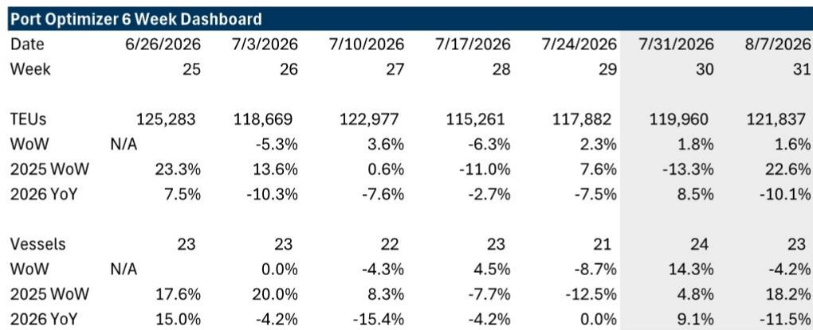
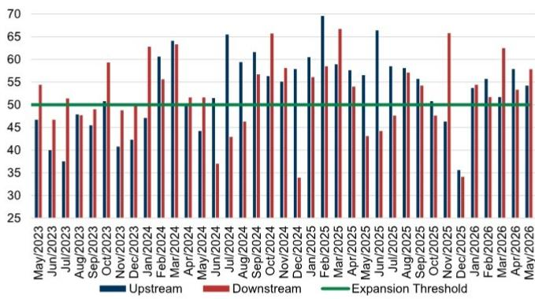

# GS：跨境贸易与行业变化观察

截至7月23日当周，中国至美国的重载集装箱船数量同比下降14.5%，较前一周18%的降幅有所收窄。但以TEU计量的货运量同比下降23%，较前一周18.5%的降幅进一步扩大。GS每周发布的关税影响追踪器显示，贸易流量的短期波动仍在持续，而洛杉矶港的预期到港量在未来两周将呈现先升后降的走势。

这份报告的核心价值不在于单周数据的涨跌，而在于它提供了一个高频观察框架：通过追踪船舶、TEU、港口吞吐量、铁路联运、卡车运力和海运费率等多个维度的周度变化，来评估关税政策对全球供应链的实际影响。报告特别提醒，周度数据本身噪音较大，需要结合多周趋势综合判断。

## 1. 中国出发的集装箱船运量连续四周环比下降

从周度数据看，第29周（7月17日至23日）中国至美国的重载集装箱船数量为49艘，较第28周的51艘环比下降3.4%，较第27周的60艘下降7.9%，较第26周的65艘下降7.0%。这是连续第四周环比下降。以TEU计，第29周货运量为398,691个标准箱，环比下降6.7%，同比下降22.8%。

报告还比较了中国大陆与亚洲其他地区（越南、韩国、台湾、日本）对美出口的表现。在船舶数量上，中国大陆同比下降15.5%，而亚洲其他地区同比下降10.5%。在TEU上，中国大陆同比下降23%，亚洲其他地区同比下降9%。这一差异可能反映了部分供应链从中国向东南亚转移的趋势。

> **KC评论：** 中国大陆与亚洲其他地区对美出口的降幅差异，是观察“中国+1”或“中国+2”策略实际推进程度的一个窗口。如果亚洲其他地区的降幅持续小于中国大陆，可能意味着部分订单确实在转移，而非整体需求调整。

## 2. 洛杉矶港预期到港量未来两周先升后降

根据Port Optimizer数据，洛杉矶港第29周（截至7月24日）实际到港TEU为117,882个，环比增长2.3%。展望未来两周，第30周（7月31日）预期到港119,960个TEU，环比增长1.8%；第31周（8月7日）预期到港121,837个TEU，环比增长1.6%。

但同比数据呈现不同格局：第30周预期同比增长8.5%，而第31周预期同比下降10.1%。报告指出，需要关注7月和8月的流量变化，这可以反映托运人如何决定补库存、旺季是否提前启动，以及较低的有效关税税率如何在不确定的地缘政治背景下影响进口决策。

## 3. 海运费率环比下降但同比仍处高位

中国/东亚至美国西海岸的集装箱海运费率本周环比下降12%，但同比仍上涨167%。报告预计，由于全球运力可能因地缘政治事件而调整，加上旺季提前启动和潜在附加费，未来几周海运费率可能继续波动。

铁路联运方面，西海岸的联运量同比增长8%，高于前一周4%的增幅。卡车现货运价（不含燃油）在西海岸同比增长56%，但环比下降3%。卡车运力可用性指数环比增长2%，同比下降5%。

## 4. 月度数据显示西海岸港口吞吐量低于历史季节性

从月度数据看，洛杉矶、长滩和奥克兰三大港口的5月总吞吐量同比增长29.6%，但环比仅增长2.5%，低于五年平均12%的季节性增幅。其中，长滩港表现较强，同比增长40%，环比增长7.4%；洛杉矶港同比增长26.2%，但环比下降2.3%；奥克兰港同比增长5.7%，环比增长6.2%。

报告认为，关税相关不确定性导致的需求前置，加上托运人在生产和库存决策上的犹豫，是2025年大部分时间运输板块表现的主要原因。但报告对周期复苏仍持积极态度，指出美联储降息周期通常有利于运输股，而“解放日”（2025年4月2日）已过去一年，托运人可能拥有更一致的规则来制定计划。

---

For informational purposes only. Portions may be generated,translated,summarized,or edited with AI assistance based on source materials and may contain omissions or errors. Please verify independently. This is not investment,legal,tax,accounting,or other professional advice.

For informational purposes only. Portions may be generated,translated,summarized,or edited with AI assistance based on source materials and may contain omissions or errors. Please verify independently. This is not investment,legal,tax,accounting,or other professional advice.

