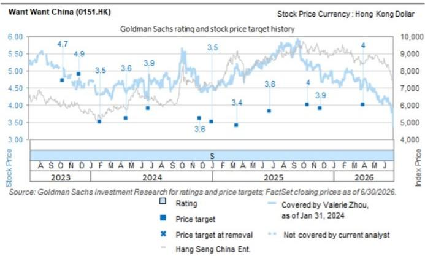

# 中国旺旺（0151.HK）业绩预告：FY1Q26营收与净利润受消费情绪及传统渠道表现影响

旺旺于7月26日发布了FY1Q26初步业绩（对应CY2Q26，截至6月30日止季度），营收同比下降6%，净利润同比下降38%（对比市场一致预期1HFY26营收/净利润同比-5%/-13%）。公司认为业绩表现主要受到以下因素影响：1）消费需求平淡，传统批发渠道持续承压，对营收端形成影响——这与我们在零食行业前瞻中的观察一致，公司指出批发渠道营收同比下降双位数百分比；2）运营费用同比上升（公告显示FY1Q26同比增幅为高个位数百分比），主要由于公司加大了对新产品/品类推广的品牌促销投入。1HFY26业绩预计于2026年11月发布，公司表示若当前趋势延续，业绩可能持续受到影响。与此同时，公司将优化内部组织架构、管控运营费用效率，同时调整渠道产品配置，引入利润率更高的产品并配合市场开发支持，重组经销商激励框架以提升销售动力与渠道参与度。

我们维持对旺旺的观察评级，12个月目标价为2.9港元。当前股价对应最近一期FY2026E市盈率9倍（FY2026 GSe净利润39亿元人民币，同比增长2%），而卫龙/洽洽/盐津铺子2026E市盈率分别为11倍/13倍/14倍，对应净利润增速分别为7%/120%/22%。

## 目标价风险与方法论——中国旺旺

估值方法：我们对旺旺给予观察评级。12个月目标价为2.90港元，基于FY2026E每股收益的8倍市盈率。

主要风险：1）乳制品业务复苏好于预期；2）新产品/渠道销售贡献快于预期；3）成本端有利因素带来利润率回升超预期。

Valerie Zhou
+852-2978-0820 | valerie.zhou@gs.com
GS (Asia) L.L.C.

Leaf Liu
+852-3966-4169 | leaf.liu@gs.com
GS (Asia) L.L.C.

Christina Liu
+852-2978-6983 | christina.liu@gs.com
GS (Asia) L.L.C.

<table><tr><td>0151.HK</td><td>12个月目标价：2.90港元</td><td>现价：3.44港元</td><td>潜在空间：-15.7%</td></tr></table>

<table><tr><td rowspan="2">观察</td><td colspan="5">GS预测</td></tr><tr><td></td><td>3/26</td><td>3/27E</td><td>3/28E</td><td>3/29E</td></tr><tr><td rowspan="11">市值：409亿港元/52亿美元 企业价值：275亿港元/35亿美元 3个月日均交易量：3810万港元/490万美元 中国 化妆品、宠物及食品并购排名：3 租赁计入净债务及企业价值：是</td><td>营收（百万元人民币）</td><td>24,400.7</td><td>23,869.5</td><td>24,251.5</td><td>24,651.8</td></tr><tr><td>EBITDA（百万元人民币）</td><td>5,850.3</td><td>5,909.6</td><td>5,946.2</td><td>6,004.2</td></tr><tr><td>每股收益（人民币）</td><td>0.32</td><td>0.33</td><td>0.33</td><td>0.34</td></tr><tr><td>市盈率（倍）</td><td>14.4</td><td>8.9</td><td>8.9</td><td>8.9</td></tr><tr><td>市净率（倍）</td><td>2.8</td><td>1.5</td><td>1.4</td><td>1.2</td></tr><tr><td>股息率（%）</td><td>2.1</td><td>3.4</td><td>3.4</td><td>3.4</td></tr><tr><td>净债务/EBITDA（不含租赁，倍）</td><td>(1.5)</td><td>(2.0)</td><td>(2.4)</td><td>(2.9)</td></tr><tr><td>CROCI（%）</td><td>16.3</td><td>18.0</td><td>17.7</td><td>17.4</td></tr><tr><td>自由现金流回报表现（%）</td><td>6.0</td><td>11.9</td><td>11.2</td><td>11.3</td></tr><tr><td></td><td>9/25</td><td>3/26</td><td>9/26E</td><td>3/27E</td></tr><tr><td>每股收益（人民币）</td><td>0.15</td><td>0.18</td><td>0.14</td><td>0.19</td></tr></table>

数据来源：公司数据、GS预测、FactSet。价格截至2026年7月24日收盘。

## 附录：披露信息

## Reg AC

我们，Valerie Zhou、Leaf Liu和Christina Liu，特此证明本报告中表达的所有观点均准确反映了我们个人对相关公司及其证券的看法。我们还证明，我们的薪酬中没有任何部分直接或间接与报告中表达的具体建议或观点相关。

除非另有说明，本报告封面所列人员为GS全球研究部门的分析师。

撰稿作者：Valerie Zhou GS (Asia) L.L.C.、Leaf Liu GS (Asia) L.L.C.、Christina Liu GS (Asia) L.L.C.。

除非另有说明，本报告撰稿作者披露中列出的个人为GS全球研究部门的分析师。

## GS因子概况

GS因子概况通过将关键属性与市场（即我们的评级股票池）及其行业同行进行比较，为股票提供研究背景。所描绘的四个关键属性是：增长、财务回报、倍数（例如估值）和综合（增长、财务回报和倍数的组合）。增长、财务回报和倍数是通过使用每只股票特定指标的标准化排名计算得出的。然后将这些指标的标准化排名进行平均，并转换为相关属性的百分位数。每个指标的具体计算可能因财年、行业和地区而异，但标准方法如下：

增长基于股票的前瞻性销售增长、EBITDA增长和每股收益增长（对于金融股，仅基于每股收益和销售增长），百分位数越高表示公司增长越高。财务回报基于股票的前瞻性ROE、ROCE和CROCI（对于金融股，仅基于ROE），百分位数越高表示公司财务回报越高。倍数基于股票的前瞻性市盈率、市净率、价格/股息（P/D）、EV/EBITDA、EV/FCF和EV/债务调整后现金流（DACF）（对于金融股，仅基于市盈率、市净率和P/D），百分位数越高表示股票交易倍数越高。综合百分位数计算为增长百分位数、财务回报百分位数和（100% - 倍数百分位数）的平均值。

财务回报和倍数使用GS分析师对未来至少三个季度后的财年结束时的预测。增长使用对未来至少七个季度后的财年与未来至少三个季度后的财年相比的输入数据（所有指标均基于每股）。

有关我们如何计算GS因子概况的更详细说明，请联系您的GS代表。

## 并购排名

在我们的全球覆盖范围内，我们使用并购框架审视股票，同时考虑定性因素和定量因素（可能因行业和地区而异），以纳入某些公司可能被收购的可能性。然后我们分配一个并购排名，作为对我们评级覆盖范围内的公司从1到3进行评分的方法，其中1表示公司成为收购目标的可能性较高（30%-50%），2表示中等可能性（15%-30%），3表示较低可能性（0%-15%）。对于排名为1或2的公司，按照我们标准部门指南，我们将并购组成部分纳入我们的目标价。并购排名3被视为不重要，因此不计入我们的目标价，并且可能在研究中讨论或不讨论。

## Quantum

Quantum是GS的专有数据库，提供详细的财务报表历史、预测和比率的访问。它可用于对单个公司进行深入分析，或比较不同行业和市场的公司。

## 披露信息

中国旺旺的评级相对于其覆盖范围内的其他公司：安琪酵母、安井食品（A股）、安井食品（H股）、华熙生物、贝泰妮、洽洽食品、中宠股份、依依股份、巨子生物、双汇发展、立高食品、毛戈平化妆品、佩蒂股份、珀莱雅、千味央厨、三全食品、上海家化、上海家化、三只松鼠、万洲国际、中国旺旺、卫龙美味、盐津铺子

## 公司特定监管披露

以下披露涉及GS集团（及其附属机构，“GS”）与GS全球研究覆盖的公司之间的关系。

GS预计在未来3个月内寻求或将从以下公司获得投资银行服务报酬：中国旺旺（3.44港元）

GS在过去12个月内与以下公司存在投资银行服务客户关系：中国旺旺（3.44港元）

评级/投资银行关系分布 GS研究全球股票覆盖范围

<table><tr><td rowspan="2"></td><td colspan="3">评级分布</td><td colspan="3">投资银行关系</td></tr><tr><td>买入</td><td>持有</td><td>卖出</td><td>买入</td><td>持有</td><td>卖出</td></tr><tr><td>全球</td><td>50%</td><td>34%</td><td>16%</td><td>65%</td><td>59%</td><td>43%</td></tr></table>

截至2026年7月1日，GS全球研究对3,104只股票进行了评级。GS将股票指定为买入和卖出，列入各区域投资清单；未列入清单的股票被视为中性。此类指定相当于FINRA规则要求的买入、持有和卖出。请参阅下文“评级、覆盖范围及相关定义”。投资银行关系图反映了GS在过去十二个月内提供投资银行服务的每个评级类别中标的公司的百分比。

## 目标价与评级历史图表

  
所示目标价应结合所有先前发布的GS报告（可能包含或不包含目标价）以及公司、行业和金融市场的发展情况来考虑。

## 目标价历史表格 中国旺旺（0151.HK）

报告日期 目标价（港元） 收盘价（港元）

<table><tr><td>2026年7月7日</td><td>2.90</td><td>3.43</td></tr><tr><td>2026年3月31日</td><td>4.00</td><td>4.61</td></tr><tr><td>2025年11月24日</td><td>3.90</td><td>4.92</td></tr><tr><td>2025年10月15日</td><td>4.00</td><td>5.03</td></tr><tr><td>2025年6月24日</td><td>3.80</td><td>5.25</td></tr><tr><td>2025年3月18日</td><td>3.40</td><td>5.21</td></tr><tr><td>2025年1月2日</td><td>3.50</td><td>4.54</td></tr><tr><td>2024年11月25日</td><td>3.60</td><td>4.57</td></tr><tr><td>2024年6月25日</td><td>3.90</td><td>4.41</td></tr><tr><td>2024年4月18日</td><td>3.60</td><td>4.36</td></tr><tr><td>2024年1月31日</td><td>3.50</td><td>4.31</td></tr><tr><td>2023年11月28日</td><td>4.90</td><td>4.63</td></tr><tr><td>2023年10月10日</td><td>4.70</td><td>5.11</td></tr></table>

表格中所示目标价未针对公司行为进行调整。

## 监管披露

## 美国法律法规要求的披露

请参阅上述公司特定监管披露，了解本报告提及公司所需的任何以下披露：待处理交易中的管理人或联合管理人；1%或以上的所有权；特定服务的报酬；客户关系类型；先前期间的公开募股管理/联合管理；董事职位；对于股票，做市和/或专家角色。GS可能作为本报告讨论的发行人的债务证券（或相关衍生品）的本金进行交易或可能进行交易。

以下为额外要求的披露：所有权和重大利益冲突：GS政策禁止其分析师、向分析师报告的专业人员及其家庭成员持有分析师覆盖范围内任何公司的证券。分析师薪酬：分析师的薪酬部分基于GS的盈利能力，其中包括投资银行收入。分析师作为高管或董事：GS政策通常禁止其分析师、向分析师报告的人员或其家庭成员担任分析师覆盖范围内任何公司的高管、董事或顾问。非美国分析师：非美国分析师可能不是GS & Co. LLC的关联人员，因此可能不受FINRA规则2241或FINRA规则2242关于与标的公司沟通、公开露面以及交易分析师所覆盖证券的限制。

## 美国以外司法管辖区法律法规要求的额外披露

以下披露是相关司法管辖区要求的，除非已根据美国法律法规在上文作出。澳大利亚：GS Australia Pty Ltd及其附属机构不是澳大利亚《1959年银行法》定义的授权存款机构，在澳大利亚不提供银行服务，也不从事银行业务。除非GS另有约定，本研究及其访问权限仅面向《澳大利亚公司法》定义的“批发客户”。在编制研究报告时，GS Australia全球研究部门的成员可能会参加由其研究报告所涉及的公司和其他实体主办或组织的实地考察和其他会议。在某些情况下，如果GS Australia认为在实地考察或会议的具体情况下适当且合理，此类实地考察或会议的费用可能部分或全部由相关发行人承担。如果本文档内容包含任何金融产品建议，则仅为一般性建议，由GS在未考虑客户目标、财务状况或需求的情况下编制。客户在根据任何此类建议采取行动前，应考虑该建议是否适合其自身目标、财务状况和需求。某些GS Australia和New Zealand的利益披露以及GS澳大利亚卖方研究独立性政策声明的副本可在以下网址获取：https://www.goldmansachs.com/disclosures/australia-new-zealand/index.html。巴西：与CVM决议第20号相关的披露信息可在https://www.gs.com/worldwide/brazil/area/gir/index.html获取。在适用的情况下，根据CVM决议第20号第20条定义，本研究报告内容的主要负责巴西注册分析师为本报告开头指定的第一作者，除非文本末尾另有说明。加拿大：此信息仅供您参考，在任何情况下均不应被解释为GS & Co. LLC为在加拿大交易任何加拿大证券而向加拿大证券购买者发出的广告、要约或招揽。GS & Co. LLC未在加拿大任何司法管辖区根据适用的加拿大证券法注册为交易商，通常不被允许交易加拿大证券，并且可能被禁止在加拿大某些司法管辖区出售某些证券和产品。如果您希望在加拿大交易任何加拿大证券或其他产品，请联系GS集团附属公司GS Canada Inc.或其他注册的加拿大交易商。香港：可向GS (Asia) L.L.C.索取本研究报告所涉覆盖公司证券的进一步信息。印度：可从GS (India) Securities Private Limited获取本研究报告所涉公司或公司的进一步信息，研究分析师 - SEBI注册号INH000001493，地址：10th Floor, Ascent-Worli, Sudam Kalu Ahire Marg, Worli, Mumbai-400 025, India，企业识别号U74140MH2006FTC160634，电话+91 22 6616 9000，传真+91 22 6616 9001。GS可能实益拥有本研究报告所涉公司或公司1%或以上的证券（定义见印度《1956年证券合同（监管）法》第2(h)条）。SEBI的注册和NISM的认证绝不保证中介机构的业绩，也不向读者提供任何回报保证。GS (India) Securities Private Limited合规官和读者投诉联系详情、年度合规审计报告副本以及其他相关信息和披露可在以下链接找到：https://www.goldmansachs.com/worldwide/india/research-analyst。日本：见下文。韩国：除非GS另有约定，本研究及其访问权限仅面向《金融服务和资本市场法》定义的“专业读者”。可从GS (Asia) L.L.C.首尔分行获取本研究报告所涉公司或公司的进一步信息。新西兰：GS New Zealand Limited及其附属机构在新西兰既不是“注册银行”，也不是《1989年新西兰储备银行法》定义的“存款接受者”。除非GS另有约定，本研究及其访问权限面向《2008年金融顾问法》定义的“批发客户”。某些GS Australia和New Zealand的利益披露副本可在以下网址获取：https://www.goldmansachs.com/disclosures/australia-new-zealand/index.html。俄罗斯：在俄罗斯联邦分发的研究报告不是俄罗斯立法定义的广告，而是不以产品推广为主要目的的信息和分析，并且不提供俄罗斯评估活动立法意义上的评估。研究报告不构成俄罗斯法律法规定义的个人化研究交流，不针对特定客户，并且是在未分析客户财务状况、投资概况或风险概况的情况下编制的。GS不对客户或任何其他人基于本研究报告可能做出的任何投资决策承担任何责任。新加坡：GS (Singapore) Pte.（公司编号：198602165W），受新加坡金融管理局监管，对本研究承担法律责任，如有任何与本研究报告相关的事宜，应联系该公司。台湾：此材料仅供参考，未经许可不得转载。读者应仔细考虑其自身风险。投资结果由个人读者自行承担。英国：在英国将被归类为零售客户（定义见金融行为监管局规则）的人士，应结合先前GS关于本报告所涉公司的报告阅读本研究，并应参考GS International已发送给他们的风险警告。这些风险警告的副本以及本报告中使用的某些金融术语的词汇表，可向GS International索取。

欧盟和英国：与欧盟委员会授权条例(EU) 2016/958第6(2)条相关的披露信息（包括该授权条例在英国脱离欧盟和欧洲经济区后作为英国国内法律和法规实施的部分），关于研究交流或推荐或暗示投资策略的其他信息客观呈现的技术安排，以及特定利益或利益冲突迹象的披露，可在https://www.gs.com/disclosures/europeanpolicy.html获取，其中说明了与投资研究相关的利益冲突管理欧洲政策。

日本：GS Japan Co., Ltd.是在关东财务局注册的金融工具交易商，注册号金商第69号，是日本证券业协会、日本金融期货协会、第二类金融工具业协会和日本投资管理协会的会员。股票买卖需支付与客户预先确定的佣金加消费税。有关日本证券交易所、日本证券业协会或日本证券金融公司要求的任何适用披露，请参阅公司特定披露。

## 评级、覆盖范围及相关定义

买入(B)、中性(N)、卖出(S) 分析师建议将股票作为买入或卖出列入各区域投资清单。被指定为投资清单上的买入或卖出取决于股票相对于其覆盖范围的总回报潜力。任何未被指定为投资清单上的买入或卖出且具有有效评级（即非评级暂停、未评级、早期生物技术、覆盖暂停或未覆盖的股票）的股票被视为中性。每个区域管理区域确信清单，这些清单选自各自区域投资清单上的报告评级股票，代表侧重于总回报潜力大小和/或在其各自覆盖区域内实现回报的可能性的研究交流。此类确信清单中股票的添加或移除由各区域的审查委员会或其他指定委员会管理，并不代表分析师对该等股票评级的变化。

总回报潜力代表当前股价与目标价之间的上涨或下跌差异，包括目标价相关时间范围内所有已支付或预期股息。所有覆盖股票均需设定目标价。总回报潜力、目标价及相关时间范围在每份添加或重申投资清单成员资格的报告中有说明。

覆盖范围：每个覆盖范围的所有股票清单可按首席分析师、股票和覆盖范围在https://www.gs.com/research/hedge.html获取。

未评级(NR)。当GS在此公司涉及合并或战略交易中担任顾问角色时，当存在法律、监管或政策限制（由于GS参与交易）时，以及在特定其他情况下，根据GS政策，评级、目标价和盈利预测（如相关）将被移除。早期生物技术(ES)。根据GS政策，当此公司既没有通过II期临床试验的药物、治疗或医疗设备，也没有获得分销后II期药物、治疗或医疗设备的许可时，不分配评级和目标价。评级暂停(RS)。GS已暂停此股票的评级和目标价，因为没有足够的基本面基础来确定评级或目标价。先前的评级和目标价（如有）对此股票不再有效，不应依赖。覆盖暂停(CS)。GS已暂停对此公司的覆盖。未覆盖(NC)。GS不覆盖此公司。

## 全球产品；分发实体

GS全球研究在全球范围内为GS客户制作和分发研究产品。位于GS全球各办事处的分析师对行业和公司进行研究，并对宏观经济、货币、大宗商品和投资组合策略进行研究。本研究由以下机构分发：澳大利亚由GS Australia Pty Ltd (ABN 21 006 797 897)分发；巴西由GS do Brasil Corretora de Títulos e Valores Mobiliários S.A.分发；GS巴西公共沟通渠道：0800 727 5764和/或contatogoldmanbrasil@gs.com。工作日（节假日除外），上午9点至下午6点。加拿大由GS & Co. LLC分发；香港由GS (Asia) L.L.C.分发；印度由GS (India) Securities Private Ltd.分发；日本由GS Japan Co., Ltd.分发；韩国由GS (Asia) L.L.C.首尔分行分发；新西兰由GS New Zealand Limited分发；俄罗斯由OOO GS分发；新加坡由GS (Singapore) Pte.（公司编号：198602165W）分发；美国由GS & Co. LLC分发。GS International已批准本研究在英国的分发。

GS International (“GSI”)，由审慎监管局授权，受金融行为监管局和审慎监管局监管，已批准本研究在英国的分发。

欧洲经济区：GS Bank Europe SE (“GSBE”) 是一家在德国注册的信贷机构，在单一监管机制下，受欧洲中央银行直接审慎监管，并在其他方面受德国联邦金融监管局和德国联邦银行监管，并在欧洲经济区内分发研究。

## 一般披露

本研究仅面向我们的客户。除与GS相关的披露外，本研究基于我们认为可靠的当前公开信息，但我们不保证其准确或完整，也不应依赖于此。本文所含信息、意见、估计和预测截至本文日期，如有变更，恕不另行通知。我们力求适时更新我们的研究，但各种法规可能阻止我们这样做。除某些定期发布的行业报告外，大部分报告根据分析师的判断不定期发布。

GS开展全球全方位、综合性的投资银行、投资管理和经纪业务。我们与全球研究覆盖的相当大比例的公司存在投资银行和其他业务关系。GS & Co. LLC，美国经纪交易商，是SIPC成员（https://www.sipc.org）。

我们的销售人员、交易员和其他专业人员可能向我们的客户和自营交易部门提供口头或书面的市场评论或交易策略，这些评论或策略反映的观点可能与本研究表达的观点相反。我们的资产管理业务、自营交易部门和投资业务可能做出与本研究报告中的建议或观点不一致的投资决策。

本报告中指定的分析师可能不时与我们的客户（包括GS销售人员和交易员）讨论，或在本报告中讨论，提及可能对本报告讨论的股票市场价格产生近期影响的催化剂或事件的交易策略，这种影响可能在方向上与分析师的已发布目标价预期相反。任何此类交易策略均不同于且不影响分析师对该等股票的基本面评级，该评级反映了股票相对于其覆盖范围的总回报潜力，如本文所述。

我们及我们的关联机构、高级职员、董事和员工可能不时持有本研究报告提及的证券或衍生品的多头或空头头寸，作为本金进行交易，以及买入或卖出，除非法规或GS政策禁止。

在GS组织的会议上第三方演讲者表达的观点，包括来自GS其他部门的个人，不一定反映全球研究的观点，也不是GS的官方观点。

本文引用的任何第三方，包括任何销售人员、交易员和其他专业人员或其家庭成员，可能持有与本报告指定分析师表达的观点不一致的所述产品的头寸。

本研究不构成在任何司法管辖区出售或购买任何证券的要约或招揽，如果此类要约或招揽在该司法管辖区将是非法的。它不构成个人建议，也未考虑个别客户的具体投资目标、财务状况或需求。客户应考虑本研究中的任何建议或推荐是否适合其特定情况，并在适当情况下寻求专业建议，包括税务建议。本研究中提及的投资的价值和价格以及从中获得的收入可能会波动。过往表现并非未来表现的指引，未来回报不保证，可能发生原始资本损失。汇率波动可能对某些投资的价值或价格或从中获得的收入产生不利影响。

某些交易，包括涉及期货、期权和其他衍生品的交易，会产生重大风险，并不适合所有读者。读者应查阅当前的期权和期货披露文件，这些文件可从GS销售代表或https://www.theocc.com/about/publications/character-risks.jsp和https://www.goldmansachs.com/disclosures/cftc_fcm_disclosures获取。在需要多次买卖期权的期权策略（如价差）中，交易成本可能很高。将根据要求提供支持文件。

全球研究提供的不同服务水平：GS全球研究向您提供的服务水平和类型可能与向GS内部和其他外部客户提供的服务不同，这取决于多种因素，包括您个人对沟通频率和方式的偏好、您的风险状况和投资重点及视角（例如，全市场、特定行业、长期、短期）、您与GS整体客户关系的规模和范围，以及法律和监管限制。例如，某些客户可能要求在特定证券的研究发布时收到通知，某些客户可能要求将分析师基本面分析的基础数据通过数据馈送或其他方式以电子方式交付给他们。分析师基本面研究观点的任何变化（例如，对股票的评级、目标价或盈利预测的重大变化）都不会在通过电子方式广泛发布到我们的内部客户网站或通过其他方式向所有有权接收此类报告的客户发布此类信息之前，向任何客户传达。

所有研究报告同时通过电子方式发布到我们的内部客户网站，向所有客户提供。并非所有研究内容都重新分发给我们的客户或提供给第三方聚合商，GS也不对第三方聚合商重新分发我们的研究负责。如需与一只或多只证券、市场或资产类别相关的研究、模型或其他数据（包括相关服务），请联系您的GS代表或访问https://research.gs.com。

披露信息也可在https://www.gs.com/research/hedge.html或联系研究合规部获取，地址：200 West Street, New York, NY 10282。

## © 2026 GS.

您仅可为自己使用而存储、展示、分析、修改、重新格式化及打印通过本服务向您提供的信息。未经GS明确书面同意，您不得转售或逆向工程此信息以计算或开发任何用于披露和/或营销的指数，或创建任何其他衍生作品或商业产品、数据或服务。未经GS明确书面同意，您不得以任何格式向任何第三方发布、传输或以其他方式复制此信息的全部或部分。前述限制包括但不限于使用、提取、下载或检索此信息的全部或部分，以训练或微调机器学习或人工智能系统，或作为任何此类系统的提示或输入来提供或复制此信息的全部或部分。
