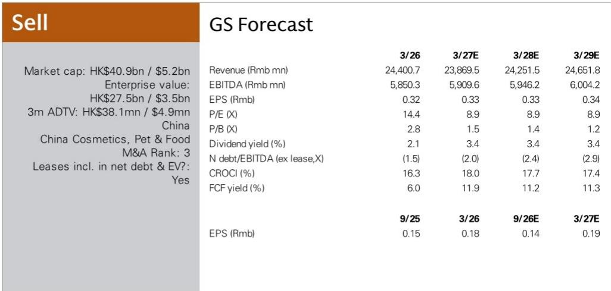

# 旺旺中国的利润变化：消费类公司面临的结构性挑战

数据值得关注。在2026财年第一季度，旺旺中国报告营收同比下降6%，净利润下降38%。市场普遍预期整个上半财年营收仅下降5%、利润下降13%。公司在短短三个月内就大幅超出了这一预期。一家长期被视为防御性持有的消费类公司出现38%的利润收缩，并非常规的业绩不及预期。这是一个信号，表明支撑中国最大零食和饮料品牌之一的运营模式，正面临不易快速逆转的力量。

对此变化的常规解释是消费情绪疲软。这虽属实，但并不充分。中国消费情绪已疲软数个季度，但并非每家消费类公司都报告了38%的利润下降。更深层的原因在于旺旺依赖的具体渠道、其构建的成本结构以及其产品品类的竞争动态。第一季度业绩揭示了一家陷入困境的公司：一边是分销模式在退化，另一边是战略转型的成本上升速度快于收入增长。对于观察者而言，问题不在于本季度是否糟糕，而在于公司的应对能否解决问题，抑或只是确认了结构性阻力强于管理层的应对能力。

某全球机构关于该公司的报告，在业绩预警后发布，维持目标价3.44港元。估值看似便宜，为9倍远期收益，但这一倍数具有欺骗性。它反映了市场正在定价一个运营数据尚未支持的复苏。该公司的报价相对于卫龙、洽洽和盐津铺子等同业存在折价，这些同业交易在11至14倍远期收益，同时实现净利润正增长。旺旺以折价交易，是因为它理应如此。

## 传统批发渠道的变化并非周期性：分销模式的结构性侵蚀

业绩预警中最具说明力的数据点是传统批发渠道营收同比出现两位数百分比下降。旺旺的分销网络历来是其核心竞争优势之一。该公司与全国低线城市和农村地区的数万家小型分销商建立了深厚关系，使其能够触及现代贸易和电商渠道无法覆盖的销售点。这一模式运行了数十年，因为传统批发渠道是在碎片化零售环境中触达消费者的最有效方式。

这种效率正在减弱。社区团购平台、短视频电商和直达消费者模式的兴起，从根本上改变了低线城市消费者发现和购买包装食品及饮料的方式。曾经控制产品流向夫妻店的传统批发商正在被绕过。消费者直接通过拼多多和抖音等平台下单，零售商越来越多地从提供更低价格和更快配送的B2B平台采购。批发中间商正变得多余。

这不是需求问题。中国零食和饮料的基础消费并未崩溃。这是分销问题。旺旺的产品仍在被消费，但通过公司控制力较弱、利润率较低、品牌可见度较弱的渠道进行消费。批发渠道营收的两位数下降是预警信号。它告诉观察者，公司最重要的市场通路正在失去相关性，没有快速修复的办法。

管理层已承认问题并概述了应对措施：优化内部组织、管理运营费用效率、细化渠道产品分配、推出高利润率产品并配合市场开发支持分销商、以及重组分销商激励框架。这些措施在纸面上是合理的，但它们面临一个根本性约束。如果终端消费者已转向不同的购买模式，你无法激励批发商来推广你的产品。激励重组可能减缓下降，但不太可能逆转它。

## 运营费用上升并非投资：对结构性利润率压力的防御性反应

业绩预警披露，第一季度运营费用同比实现高个位数百分比增长。公司将其归因于在新产品和品类推广上加大了品牌促销投入。表面上看，这听起来像增长导向策略。实际上，这是对竞争地位恶化的防御性反应。

当公司的核心渠道萎缩时，它必须要么寻找新渠道，要么创造能在剩余渠道中获取溢价定价的新产品。旺旺正在同时尝试两者，这代价高昂。新产品的促销投入本质上效率低于维持现有产品线，因为从尝试到重复购买的转化不确定。公司正在花费更多资金来推广品牌资产和货架存在感低于其传统产品（如旺旺果冻和米饼）的产品。

利润率计算是无情的。营收下降6%，但运营费用却以高个位数百分比增长。仅这一差异就解释了38%利润下降的很大一部分。公司正在经历负运营杠杆，恰逢其需要更多投入之时。这是成熟消费类公司面临颠覆时的典型困境。传统业务产生的现金流在下降，但建立新增长引擎所需的再投资消耗了这些下降现金流的更大份额。结果是利润压缩速度快于营收压缩。

这里的风险在于，新产品和品类的支出未能产生足够的投资回报。报告指出，公司正在推出高利润率产品并配合市场开发支持分销商。高利润率产品是对利润率压力的合理回应，但它们也带来更高的执行风险。习惯于为旺旺产品支付一定价格的消费者，可能不会接受溢价替代品，尤其是在消费支出疲软的环境下。公司实际上是在要求分销商在核心业务承压时，对未经证实的产品承担风险。这是一个困难的要求。

## 旺旺的估值折价反映了信誉差距，仅靠削减成本无法弥合

该公司报价为9倍远期收益，相对于更广泛的中国消费板块及其直接竞争对手存在显著折价。卫龙交易在11倍远期收益，净利润增长7%。洽洽交易在13倍，净利润增长120%。盐津铺子交易在14倍，净利润增长22%。旺旺交易在9倍，收益增长基本持平。市场正在赋予结构性折价，而非周期性折价。

逻辑很简单。观察者并不确信旺旺能够稳定营收，更不用说恢复增长。公司自身的指引支持这种怀疑。业绩预警指出，如果第一季度趋势持续，将于2026年11月发布的2026财年上半年业绩将受到负面影响。这不是信心的声明。这是进一步失望的预告。

估值也反映了收益轨迹缺乏可见性。该机构的预测显示，营收从2026财年的244亿元人民币下降至2027财年的239亿元人民币，然后在2028财年温和恢复至243亿元人民币。这是基本持平的三年营收。每股收益预测为2027、2028和2029财年均为0.33元人民币。三年收益持平，9倍倍数意味着除非倍数扩大，否则该报价没有上行空间。倍数扩大需要催化剂，而当前数据点并未提供。

2026财年收益预测。这是当前交易倍数的一个点折价。其含义是，该机构预计收益预测将进一步下调，倍数将相应收缩。鉴于第一季度业绩，这是一个合理的预期。

## 决策框架：重新考虑该公司的三个条件

被低估值或旺旺历史品牌实力所吸引的观察者，需要一个严谨的框架来决定风险回报等式何时转变。以下三个条件，源自第一季度业绩的动态，应作为任何研究论点的把关标准。

第一，传统批发渠道营收下降必须稳定。两位数下降不是基数效应，而是趋势。在公司能够证明下降正在减速，或其他渠道增长足够快以抵消下降之前，营收风险仍然较高。观察者应关注批发渠道的环比改善，而非受易比较基数扭曲的同比比较。

第二，运营费用增长必须相对于营收增长放缓。高个位数费用增长伴随中个位数营收下降，是利润下降的主要驱动因素。公司需要证明其促销支出正在产生可衡量的回报，无论是通过新品类市场份额增长，还是通过改善分销商推广率。如果费用继续快于营收增长，无论投入成本趋势如何，利润复苏都将延迟。

第三，新产品线必须证明重复购买率足以证明投资的合理性。推出高利润率产品是合理策略，但如果销量未能实现，利润率就无关紧要。观察者应寻找证据表明新产品正在现代贸易和电商渠道获得分销，而不仅仅是通过下降的批发渠道推动。如果新产品只是被放置在难以推广传统产品的现有分销商处，该策略将失败。

在满足这三个条件之前，该报价仍是一个价值陷阱。低倍数不是机会。它反映了市场对公司盈利能力正在恶化的正确评估。旺旺中国在其分销模式完好、品牌实力未受挑战时是一只防御性股票。那个时代已经结束。第一季度业绩不是买入机会。它们是对公司面临的结构性挑战比市场定价更深层的确认。

*仅供参考。部分内容可能基于源材料通过AI辅助生成、翻译、总结或编辑，可能存在遗漏或错误。请独立核实。本文不构成任何专业建议。*

仅供参考。部分内容可能基于源材料通过AI辅助生成、翻译、总结或编辑，可能存在遗漏或错误。请独立核实。本文不构成任何专业建议。

