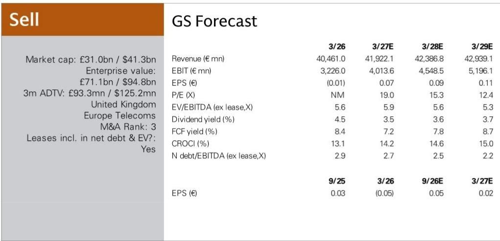
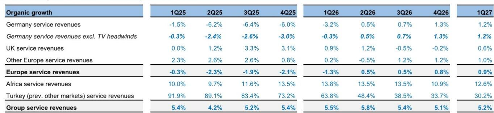
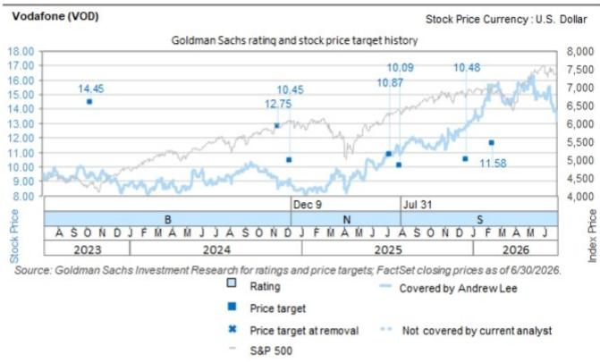

# Vodafone’s Africa-Driven Guidance Raise Masks a Structural Problem: European Growth Has Not Improved

Vodafone’s first-quarter results for fiscal 2027 delivered a modest operational beat, but the narrative that matters for observers is not the headline outperformance. Group organic service revenue growth reached 5.2%, marginally ahead of consensus at 5.0%, and management upgraded full-year guidance for both adjusted EBITDA and adjusted free cash flow to the upper end of previously stated ranges. On the surface, this looks like a validation of the turnaround story.

The reality is more layered. The guidance upgrade was driven almost entirely by Vodacom, Vodafone’s listed African subsidiary, which raised its own outlook on the back of a better-than-expected macroeconomic environment, favorable energy hedging outcomes, and successful price increases that have landed well across the region. European organic service revenue growth, by contrast, remained stuck at 0.9%—essentially unchanged from the 0.8% recorded in the prior quarter. The core structural challenge for Vodafone has not moved.

This creates a critical tension for observers. The company’s rerating potential depends on whether the market interprets the Africa-driven raise as a sustainable improvement in the group’s earnings power or as a temporary tailwind that masks stagnation in Vodafone’s largest and most valuable region. The evidence from the quarter points decisively toward the latter interpretation. Europe still accounts for the majority of group EBITDA, and its growth trajectory remains anemic, lumpy, and increasingly dependent on non-recurring items.

The German beat, which accounted for most of the European surprise, illustrates the problem. Germany delivered organic service revenue growth of 1.2%, a full 1.1 percentage points above consensus. But this was not a sign of accelerating momentum. The prior-year comparison was easy, and the quarter benefited from lumpy digital services revenue that management explicitly noted will not repeat at the same level. Underlying broadband net additions continued to deteriorate, with a loss of 98,000 subscribers compared to a loss of 90,000 in the prior quarter. Postpaid mobile net additions were also negative at minus 85,000, worsening from minus 77,000 in the fourth quarter.

The UK business, meanwhile, posted organic service revenue growth of 0.6%, recovering from a negative 0.2% in the prior quarter. But this too was the product of an easy comparison: the year-ago period had been depressed by a material decline in managed services revenues. Management confirmed that the underlying growth backdrop in the UK remains unchanged, and the integration of the Three UK merger remains on track but has not yet delivered incremental revenue benefits.

What emerges from these numbers is a clear strategic picture. Vodafone’s European operations are not generating organic momentum. The beats are explainable by base effects, one-off revenue items, and currency tailwinds that are unlikely to persist. The Africa business, while genuinely improving, operates in higher-risk currencies and a macroeconomic environment that Vodafone itself described as better than expected—a framing that implies downside if conditions normalize.

For an observer trying to assess Vodafone’s equity value, the question is not whether the company can beat by a few basis points in a given quarter. The question is whether the underlying earnings trajectory supports the current valuation. On that front, the evidence remains unconvincing.

## The Germany Beat Was Real But Not Structural, and the Headwinds Are Building

Germany is Vodafone’s single most important market, contributing roughly a third of group service revenues. The 1.2% organic service revenue growth in the first quarter was a meaningful positive surprise relative to consensus expectations of just 0.1%. But the composition of that growth matters far more than the headline number.

The beat was driven by two factors. First, broadband average revenue per user improved as the company successfully migrated customers to higher-value plans. Second, B2B digital services revenue was exceptionally strong in the quarter. Management noted, however, that digital services revenue is inherently lumpy and that the second quarter of the prior fiscal year saw an unusually high level of such revenue. This creates a difficult comparable for the coming quarter, and consensus already models German organic service revenue growth of negative 1.1% for the second quarter of fiscal 2027.

The subscriber trends are equally concerning. Broadband net additions have been negative for five consecutive quarters, and the pace of losses is accelerating. The first-quarter loss of 98,000 subscribers compared to a loss of 90,000 in the fourth quarter, 63,000 in the third quarter, and 26,000 in the second quarter. Postpaid mobile net additions have been negative in four of the last five quarters, with the first-quarter loss of 85,000 representing a significant deterioration from a gain of 11,000 in the third quarter of fiscal 2026.

The structural headwind from the lost 1&1 wholesale contract revenues is also intensifying. Vodafone has guided for this drag to increase through the remainder of the fiscal year, with the most significant impact expected in the second quarter. The company’s own forward guidance for Germany implies that the first-quarter beat was a temporary reprieve, not a turning point.

For observers, the implication is straightforward. Germany is Vodafone’s largest profit pool, and it is losing subscribers, facing a deteriorating revenue mix, and entering a period of difficult comparables. The first-quarter beat should not be extrapolated. The underlying trend is still negative.

## Africa Is the Growth Engine, But It Is a Different Risk Profile

Vodacom’s performance in the quarter was genuinely strong. Organic service revenue growth reached 12.6%, exceeding consensus of 11.5% and accelerating from 10.9% in the prior quarter. Management raised Vodacom’s full-year guidance, citing a better-than-expected macroeconomic backdrop, favorable energy hedging outcomes, and successful price increases that have been well received by customers.

The African business is benefiting from structural tailwinds that Europe cannot replicate. Mobile penetration is still increasing in many markets, data consumption is growing rapidly, and Vodacom has pricing power that has been tested and confirmed. These are genuine competitive advantages that should support growth for several years.

But Africa also introduces risks that are not present in the European business. Currency volatility in South Africa, Egypt, and Turkey creates significant translation risk when results are consolidated into euros. The macroeconomic backdrop that Vodafone described as better than expected could easily shift if commodity prices change or if political instability increases. The energy hedging gains that contributed to the beat are, by definition, non-recurring.

The valuation question is whether the market is properly discounting the Africa growth story against these risks. Vodafone’s consolidated guidance now implies roughly 7% year-over-year growth in group adjusted EBITDA and 20% growth in adjusted free cash flow for fiscal 2027. But the Europe component of that guidance is unchanged. The entire upgrade comes from Africa.

If Africa’s growth were purely structural, this would be a positive signal. But the fact that management cited a better-than-expected macro backdrop and favorable energy hedging as key drivers suggests that some portion of the upgrade is cyclical or temporary. Observers should be cautious about assigning a high multiple to earnings that may not be sustainable at current levels.

## The UK Recovery Is Illusory, and the Merger Synergies Are Not Yet Visible

The UK business posted organic service revenue growth of 0.6% in the first quarter, a notable improvement from the negative 0.2% recorded in the fourth quarter of fiscal 2026. But the recovery is entirely attributable to an easy comparison. The first quarter of fiscal 2026 had been depressed by a material decline in managed services revenues, which created a low base for the current period.

Management confirmed that the underlying growth backdrop in the UK is unchanged. The competitive environment remains intense, and Vodafone continues to lose postpaid subscribers. The first-quarter loss of 48,000 postpaid subscribers was worse than the loss of 22,000 in the prior quarter and marks the fourth negative quarter out of the last five.

The merger with Three UK is expected to deliver significant cost and revenue synergies, but these have not yet materialized in the financial results. Management reiterated that integration is on track, but there is no evidence yet of improved revenue trends or market share stabilization. The UK business remains a drag on group performance, and the merger benefits, while real, are several years away from full realization.

For observers, the UK story is one of promise without proof. The easy comparisons will fade, and the underlying competitive dynamics remain challenging. The company’s valuation should not assume any near-term improvement in UK profitability.

## A Decision Framework for Vodafone Observers: Three Questions to Assess the Risk-Reward

The first-quarter results provide enough data to construct a clear decision framework for evaluating Vodafone. Three questions separate the positive case from the cautious case, and each has a concrete answer based on the evidence.

First, is European growth improving or deteriorating? The answer is deteriorating. German subscriber losses are accelerating, the 1&1 revenue headwind is increasing, and the UK recovery is a mirage created by easy comparables. European organic service revenue growth of 0.9% is essentially unchanged from the prior quarter, and forward guidance implies a significant deceleration in the second quarter.

Second, is the Africa growth sustainable? Partially, but not entirely. The structural drivers of rising penetration and pricing power are real, and Vodacom’s execution has been strong. But the guidance upgrade was also driven by a better-than-expected macro backdrop and energy hedging gains, both of which are temporary. The currency risk is material and unhedged.

Third, does the current valuation reflect these risks? The company trades at an enterprise value-to-EBITDA multiple that implies a stable or improving earnings trajectory. If European growth continues to decelerate and Africa’s tailwinds fade, the multiple is likely to contract. The consensus estimates already embed expectations for a German slowdown in the second quarter, but the market may not be fully pricing in the risk of further deterioration beyond that.

The evidence from the first quarter supports a cautious view. Vodafone is not a broken business, but it is a business that is growing in its highest-risk region while stagnating in its core market. The guidance raise provides near-term support, but the structural challenges remain unresolved.

*For informational purposes only. Portions may be generated, translated, summarized, or edited with AI assistance based on source materials and may contain omissions or errors. Please verify independently. This is not professional advice.*

For informational purposes only. Portions may be generated, translated, summarized, or edited with AI assistance based on source materials and may contain omissions or errors. Please verify independently. This is not professional advice.

