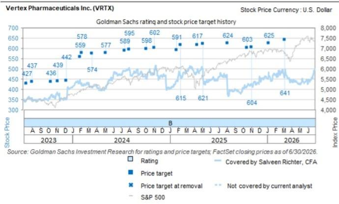

# Vertex Pharmaceuticals Inc. (VRTX): 2Q业绩前瞻：下半年值得关注的进展

VRTX股价年初至今表现弱于行业及整体市场（-5%对比DRG，-2%对比标普500），主要由于SION预计于8月发布的囊性纤维化（CF）二期数据（评估作为VRTX标准疗法Trikafta的附加治疗）带来不确定性。尽管SION将关键生物标志物汗液氯离子浓度降低10mmol/L设为成功门槛，但对VRTX而言，评估标准更高，我们将结合其产品组合及在CF领域的持续创新来审视这些数据。此后，我们认为公司处于有利位置：1）povetacicept在IgA肾病领域的上市进程（11月30日PDUFA日期），这是一个新的产品周期——我们认为现有全部数据（血尿改善及月给药方案，在慢性治疗背景下至关重要）支持其成为同类最佳潜力；2）拟收购CRNX资产的相关数据，包括先天性肾上腺皮质增生症和库欣综合征的atumelnant二期开放标签扩展数据（可能今年发布），以及2027年的三期数据——该收购在估值方面引发读者讨论。我们还预计下半年将看到下一代CFTR调节剂VX-828的一/二期CF数据、DM1初步一/二期数据，以及2027年初inaxaplin在APOL1介导肾病中的三期数据（我们也预计下半年将看到inaxaplin在合并糖尿病及中度蛋白尿人群中的二期数据，但因支持数据较少且MAZE数据表现不一，我们对此持更谨慎态度）。

我们预计二季度业绩符合预期（GS预估/公司汇总总收入31.55亿美元/32.19亿美元；非GAAP每股收益4.57美元/4.70美元），并注意到VRTX历史上常在二季度财报时上调收入指引（2025年二季度除外）（2026财年总收入129.5亿-131亿美元，中点同比增长8.5%；GS预估/共识为131亿美元/130亿美元），收入通常符合共识，每股收益则达到或超过共识。我们预计二季度Alyfrek收入为4.9亿美元，公司汇总共识为5.15亿美元。我们预计电话会议将关注以下问题：1）前述SION数据及VRTX在CF领域进一步临床创新的策略；2）povetacicept上市前准备工作，VRTX正在组建覆盖覆盖90%以上美国患者的肾病专科医生的初始销售团队（估计120-150人，大于竞争对手VERA和Otsuka的80/100人销售团队）；3）inaxaplin在AMKD中的成功概率，我们认为《新英格兰医学杂志》发表的二期数据具有积极参考意义；4）CRNX资产Palsonify和atumelnant的商业前景（VRTX认为可实现50亿美元以上收入）。我们还关注拟收购CRNX的会计处理可能出现的任何更新，VRTX预计该收购将于三季度完成，并在2029财年前对非GAAP营业利润产生增厚效应。

Salveen Richter, CFA
+1(212)934-4204 |
salveen.richter@gs.com
GS & Co. LLC

Elizabeth Webster, Ph.D.  
+1(212)357-9925 |  
elizabeth.webster@gs.com  
GS & Co. LLC

Lydia Erdman
+1(212)357-6383 |
lydia.erdman@gs.com
GS & Co. LLC

Matt Dellatorre, Ph.D.
+1(212)855-0830 |
matt.dellatorre@gs.com
GS & Co. LLC

Mark Aleynick, Ph.D.
+1(212)357-6820 |
mark.aleynick@gs.com
GS & Co. LLC

Tommie Reerink, CFA
+1(212)357-2470 |
tommie.reerink@gs.com
GS & Co. LLC

Shrunatra Mishra
+1(332)245-7673 |
shrunatra.mishra@gs.com
GS India SPL

GS会与其研究报告所覆盖的公司开展业务并寻求业务合作。因此，读者应注意，该公司可能存在影响本报告客观性的利益冲突。读者应将本报告仅视为其决策的参考因素之一。有关Reg AC认证及其他重要披露信息，请参阅披露附录，或访问www.gs.com/research/hedge.html。非美国关联机构聘用的分析师未在美国FINRA注册/具备研究分析师资格。

我们预计二季度财报表现符合预期。我们预计季度业绩基本符合预期（GS预估和公司汇总总收入约32亿美元；非GAAP每股收益4.57美元/4.70美元）。VRTX历史上常在二季度财报时上调收入指引，2025年二季度为例外（2026财年总收入129.5亿-131亿美元，中点同比增长8.5%；GS预估/共识为131亿美元/130亿美元）。

图表1：GS预估 vs. 共识

<table><tr><td rowspan="9">VRTX</td><td rowspan="2"></td><td colspan="2">2026年二季度</td><td colspan="3">2026财年</td><td colspan="2">2027财年</td></tr><tr><td>GS预估</td><td>共识</td><td>GS预估</td><td>共识</td><td>指引</td><td>GS预估</td><td>共识</td></tr><tr><td>Trikafta全球销售额（百万美元）</td><td>2,440</td><td>2,480</td><td>9,985</td><td>9,734</td><td></td><td>9,650</td><td>9,158</td></tr><tr><td>Alyftrek</td><td>490</td><td>515</td><td>2,169</td><td>2,280</td><td></td><td>3,130</td><td>3,378</td></tr><tr><td>Casgevy收入（百万美元）</td><td>57</td><td>60</td><td>243</td><td>242</td><td></td><td>443</td><td>411</td></tr><tr><td>Journavx（急性疼痛）</td><td>45</td><td>49</td><td>234</td><td>214</td><td></td><td>553</td><td>552</td></tr><tr><td>povetacicept（IgAN）</td><td>0</td><td>0</td><td>0</td><td>1</td><td></td><td>174</td><td>102</td></tr><tr><td>产品总收入（百万美元）</td><td>3,155</td><td>3,219</td><td>13,099</td><td>13,037</td><td>129.5-131亿</td><td>14,338</td><td>14,309</td></tr><tr><td>非GAAP每股收益</td><td>4.57</td><td>4.70</td><td>19.61</td><td>19.16</td><td></td><td>22.90</td><td>21.33</td></tr></table>

来源：公司数据、FactSet、GS全球研究汇总

催化剂：在拟收购CRNX之后，读者希望了解CRNX的Palsonify和三期atumelnant的收入前景，以及atumelnant和其他收购管线资产（甲状腺眼病和格雷夫斯病）的催化剂路径。对于atumelnant，下一个预期催化剂是2026年下半年+的先天性肾上腺皮质增生症开放标签扩展数据，这可能有助于缓解读者对先前肝脏毒性的担忧（我们对此并不担忧），以及根据clinicaltrials.gov上的主要完成日期，三期数据可能在2027年发布。在CRNX资产之外，市场关注焦点仍集中在肾脏疾病/自身免疫适应症的近期催化剂上，包括：1）2026年中期inaxaplin在APOL1介导肾病中针对中度蛋白尿合并2型糖尿病患者的二期数据；2）povetacicept在IgAN中的批准和上市（11月30日PDUFA日期）；3）2027年初inaxaplin在原发性AMKD中的三期48周中期分析数据。我们还关注VRTX在CF领域的创新周期（结合竞争格局，即SION的NBD1稳定剂），包括下一代3.0 CFTR校正剂VX-828在CF患者中的初步一期数据（下半年）。此外，VX-670在DM1中的一/二期数据（肌肉力量、剪接）是上行潜力因素。

图表2：至2027年的关键催化剂

<table><tr><td>公司</td><td>时间</td><td>药物</td><td>事件</td></tr><tr><td rowspan="11">VRTX</td><td>-</td><td>povetacicept（gMG）</td><td>在gMG中启动二期，推进入组+给药</td></tr><tr><td>-</td><td>povetacicept（pMN）</td><td>二期关键试验入组完成并启动三期；推进三期进展</td></tr><tr><td>2026年下半年</td><td>VX-670（DM1）</td><td>一/二期数据（剪接、肌肉力量）</td></tr><tr><td>2026年下半年</td><td>inaxaplin</td><td>AMKD中度蛋白尿或糖尿病患者的AMPLIFIED研究二期数据</td></tr><tr><td>2026年下半年</td><td>VX-828（下一代CFTR调节剂）</td><td>CF患者一/二期数据</td></tr><tr><td>2026年下半年+</td><td>atumelnant</td><td>CAH开放标签扩展数据（预计）</td></tr><tr><td>11月30日</td><td>povetacicept</td><td>IgAN的PDUFA日期</td></tr><tr><td>2027年初</td><td>inaxaplin</td><td>AMKD三期48周中期分析数据；此后可能提交AA申请</td></tr><tr><td>2027年二季度+</td><td>suzetrigine</td><td>DPN三期数据</td></tr><tr><td>2027年中</td><td>atumelnant</td><td>CAH三期数据（预计时间）</td></tr><tr><td>2027年</td><td>atumelnant</td><td>类癌综合征三期数据（预计时间）</td></tr></table>

来源：GS全球研究汇总

## 估值与风险

VRTX（买入）：我们的12个月目标价652美元基于100% DCF估值（WACC 8%，终值增长率1%）。风险：下行风险：临床/技术挫折——早期管线执行不力将对VRTX在CF特许经营权之外的未来增长前景构成风险。CF疗法在美国以外地区未能获得报销。后期管线资产未能获得监管批准及商业成功将对我们的销售预估构成重大下行风险。竞争——我们注意到CF特许经营权和基因编辑技术面临的潜在竞争威胁。知识产权保护不力——我们假设知识产权覆盖至2030年代末，未能延长这些专利将对我们的预估构成下行风险。定价/报销压力——与所有大型生物制药公司一样，近期上市或现有药物的价格下行压力和/或报销挑战将对产品收入构成下行风险。

<table><tr><td>VRTX</td><td>12个月目标价：652.00美元</td><td colspan="2">当前价：477.36美元</td><td colspan="2">上行空间：36.6%</td></tr><tr><td>买入</td><td colspan="5">GS预测</td></tr><tr><td></td><td></td><td>2025年12月</td><td>2026年12月E</td><td>2027年12月E</td><td>2028年12月E</td></tr><tr><td>市值：1212亿美元</td><td>收入（百万美元）</td><td>12,001.3</td><td>13,098.8</td><td>14,338.3</td><td>16,448.6</td></tr><tr><td>企业价值：1112亿美元</td><td>EBITDA（百万美元）</td><td>4,383.1</td><td>5,144.3</td><td>5,833.9</td><td>7,408.1</td></tr><tr><td>3个月日均交易量：7.032亿美元</td><td>EBIT（百万美元）</td><td>4,173.3</td><td>4,929.6</td><td>5,555.7</td><td>7,312.0</td></tr><tr><td>美国</td><td>每股收益（美元）</td><td>18.40</td><td>19.61</td><td>22.90</td><td>29.57</td></tr><tr><td>美洲生物技术</td><td>市盈率（倍）</td><td>24.1</td><td>24.3</td><td>20.8</td><td>16.1</td></tr><tr><td>并购排名：3</td><td>EV/EBITDA（倍）</td><td>24.7</td><td>21.7</td><td>18.2</td><td>13.7</td></tr><tr><td></td><td>自由现金流回报表现（%）</td><td>2.8</td><td>4.0</td><td>5.2</td><td>4.3</td></tr><tr><td></td><td>股息回报表现（%）</td><td>-</td><td>-</td><td>-</td><td>-</td></tr><tr><td></td><td>净债务/EBITDA（倍）</td><td>(1.2)</td><td>(1.9)</td><td>(2.8)</td><td>(2.9)</td></tr><tr><td></td><td></td><td>2026年3月</td><td>2026年6月E</td><td>2026年9月E</td><td>2026年12月E</td></tr><tr><td></td><td>每股收益（美元）</td><td>4.47</td><td>4.57</td><td>5.18</td><td>5.39</td></tr></table>

来源：公司数据、GS预估、FactSet。价格截至2026年7月24日收盘。

## 披露附录

## Reg AC

我们，Salveen Richter, CFA、Elizabeth Webster, Ph.D.、Lydia Erdman、Matt Dellatorre, Ph.D.、Mark Aleynick, Ph.D.、Tommie Reerink, CFA和Shrunatra Mishra，特此证明本报告中表达的所有观点准确反映了我们对相关公司及其证券的个人观点。我们还证明，我们的薪酬中没有任何部分直接或间接与本报告中表达的具体建议或观点相关。

除非另有说明，本报告封面所列人员为GS全球研究部门分析师。

撰稿作者：Salveen Richter, CFA GS & Co. LLC、Elizabeth Webster, Ph.D. GS & Co. LLC、Lydia Erdman GS & Co. LLC、Matt Dellatorre, Ph.D. GS & Co. LLC、Mark Aleynick, Ph.D. GS & Co. LLC、Tommie Reerink, CFA GS & Co. LLC、Shrunatra Mishra GS India SPL。

除非另有说明，本报告撰稿作者披露中列出的个人为GS全球研究部门分析师。

## GS因子概况

GS因子概况通过将关键属性与市场（即我们的评级股票池）及其行业同行进行比较，为股票提供研究背景。所描绘的四个关键属性是：增长、财务回报、估值倍数和综合（增长、财务回报和估值倍数的复合指标）。增长、财务回报和估值倍数通过计算每只股票特定指标的标准化排名得出。各指标的标准化排名随后取平均值并转换为相关属性的百分位数。每个指标的具体计算可能因财年、行业和地区而异，但标准方法如下：

增长基于股票的前瞻性销售增长、EBITDA增长和每股收益增长（对于金融股，仅基于每股收益和销售增长），百分位数越高表示增长型公司。财务回报基于股票的前瞻性ROE、ROCE和CROCI（对于金融股，仅基于ROE），百分位数越高表示财务回报越高的公司。估值倍数基于股票的前瞻性市盈率、市净率、股息率、EV/EBITDA、EV/FCF和EV/债务调整后现金流（对于金融股，仅基于市盈率、市净率和股息率），百分位数越高表示股票交易倍数越高。综合百分位数计算为增长百分位数、财务回报百分位数和（100% - 估值倍数百分位数）的平均值。

财务回报和估值倍数使用GS分析师对未来至少三个季度后的财年末的预测。增长使用对未来至少七个季度后的财年与未来至少三个季度后的财年相比的输入数据（所有指标均基于每股）。

有关我们如何计算GS因子概况的更详细说明，请联系您的GS代表。

## 并购排名

在我们的全球覆盖范围内，我们使用并购框架审视股票，同时考虑定性因素和定量因素（可能因行业和地区而异），以纳入某些公司可能成为收购目标的潜力。然后，我们将并购排名分配为1至3分，1分表示公司成为收购目标的可能性较高（30%-50%），2分表示中等可能性（15%-30%），3分表示较低可能性（0%-15%）。对于排名为1或2的公司，按照我们的标准部门指南，我们将并购因素纳入目标价。并购排名3被视为不重要，因此不计入我们的目标价，并且可能在研究中讨论或不讨论。

## Quantum

Quantum是GS的专有数据库，可访问详细的财务报表历史、预测和比率。它可用于对单一公司进行深入分析，或比较不同行业和市场的公司。

## 披露信息

Vertex Pharmaceuticals Inc.的评级相对于其覆盖范围内的其他公司：4D Molecular Therapeutics、Acadia Pharmaceuticals Inc.、Agios Pharmaceuticals Inc.、Alnylam Pharmaceuticals Inc.、Amgen Inc.、Annexon Biosciences、BioMarin Pharmaceutical Inc.、Biogen Inc.、CRISPR Therapeutics、Denali Therapeutics Inc.、Enliven Therapeutics Inc.、Generate Biomedicines Inc.、Gilead Sciences Inc.、Immunome Inc.、Incyte Corp.、Intellia Therapeutics、Ionis Pharmaceuticals Inc.、Moderna Inc.、Rapport Therapeutics、Regeneron Pharmaceuticals Inc.、Relay Therapeutics、Sarepta Therapeutics Inc.、Summit Therapeutics Inc.、Taysha Gene Therapies Inc.、Ultragenyx Pharmaceutical、Vertex Pharmaceuticals Inc.、uniQure

## 公司特定监管披露

以下披露涉及GS集团（及其关联公司，“GS”）与GS全球研究覆盖的公司之间的关系，并在此研究中提及。

GS在过去12个月内因投资银行服务获得报酬：Vertex Pharmaceuticals Inc.（477.36美元）

GS预计在未来3个月内将寻求因投资银行服务获得报酬：Vertex Pharmaceuticals Inc.（477.36美元）

GS在过去12个月内因非投资银行服务获得报酬：Vertex Pharmaceuticals Inc.（477.36美元）

GS在过去12个月内与以下公司存在投资银行服务客户关系：Vertex Pharmaceuticals Inc.（477.36美元）

GS在过去12个月内与以下公司存在非投资银行证券相关服务客户关系：Vertex Pharmaceuticals Inc.（477.36美元）

GS在过去12个月内与以下公司存在非证券服务客户关系：Vertex Pharmaceuticals Inc.（477.36美元）

GS做市该证券或其衍生品：Vertex Pharmaceuticals Inc.（477.36美元）

## 评级/投资银行关系分布

GS研究全球股票覆盖范围

<table><tr><td rowspan="2"></td><td colspan="3">评级分布</td><td colspan="3">投资银行关系</td></tr><tr><td>买入</td><td>持有</td><td>卖出</td><td>买入</td><td>持有</td><td>卖出</td></tr><tr><td>全球</td><td>50%</td><td>34%</td><td>16%</td><td>65%</td><td>59%</td><td>43%</td></tr></table>

截至2026年7月1日，GS全球研究对3,104只股票进行了评级。GS将股票分配为买入和卖出，列入各地区的投资清单；未如此分配的股票被视为中性。此类分配等同于FINRA规则要求的上述披露中的买入、持有和卖出。请参阅下文“评级、覆盖范围及相关定义”。投资银行关系图表反映了GS在过去十二个月内为每个评级类别中的相关公司提供投资银行服务的百分比。

## 目标价与评级历史图表

  
所示目标价应结合所有先前发布的GS报告（可能包含或不包含目标价）以及公司、行业和金融市场的发展情况来考虑。

## 目标价历史表 Vertex Pharmaceuticals Inc. (VRTX)

<table><tr><td>报告日期</td><td>目标价（美元）</td><td>收盘价（美元）</td></tr><tr><td>2026年7月20日</td><td>652.00</td><td>480.50</td></tr><tr><td>2026年3月9日</td><td>641.00</td><td>460.87</td></tr><tr><td>2026年1月8日</td><td>625.00</td><td>469.68</td></tr><tr><td>2025年11月4日</td><td>604.00</td><td>421.67</td></tr><tr><td>2025年10月17日</td><td>603.00</td><td>416.81</td></tr><tr><td>2025年8月5日</td><td>624.00</td><td>374.98</td></tr><tr><td>2025年5月6日</td><td>621.00</td><td>450.03</td></tr><tr><td>2025年4月14日</td><td>617.00</td><td>495.83</td></tr><tr><td>2025年2月11日</td><td>615.00</td><td>455.22</td></tr><tr><td>2025年1月27日</td><td>591.00</td><td>443.88</td></tr><tr><td>2024年11月5日</td><td>602.00</td><td>499.88</td></tr><tr><td>2024年10月4日</td><td>598.00</td><td>455.31</td></tr><tr><td>2024年8月2日</td><td>595.00</td><td>494.46</td></tr><tr><td>2024年7月16日</td><td>589.00</td><td>488.98</td></tr><tr><td>2024年5月7日</td><td>577.00</td><td>410.24</td></tr><tr><td>2024年3月15日</td><td>574.00</td><td>407.69</td></tr><tr><td>2024年2月6日</td><td>578.00</td><td>416.13</td></tr><tr><td>2024年1月31日</td><td>559.00</td><td>433.38</td></tr><tr><td>2023年12月10日</td><td>442.00</td><td>350.15</td></tr><tr><td>2023年11月7日</td><td>439.00</td><td>378.25</td></tr><tr><td>2023年10月13日</td><td>436.00</td><td>371.00</td></tr><tr><td>2023年8月2日</td><td>437.00</td><td>358.40</td></tr></table>

表中所示目标价未针对公司行为进行调整。

## 监管披露

## 美国法律和法规要求的披露

请参阅上述公司特定监管披露，了解本报告中提及的公司所需的任何以下披露：待定交易中的经理或联合经理；1%或其他所有权；特定服务的报酬；客户关系类型；先前期间的承销公开发行；董事职位；对于股票证券，做市和/或专家角色。GS可能作为本金交易本报告中讨论的发行人的债务证券（或相关衍生品）。

以下是额外要求的披露：所有权和重大利益冲突：GS政策禁止其分析师、向分析师报告的专业人员及其家庭成员持有分析师覆盖范围内的任何公司的证券。分析师薪酬：分析师的薪酬部分基于GS的盈利能力，其中包括投资银行收入。分析师作为高管或董事：GS政策通常禁止其分析师、向分析师报告的人员或其家庭成员在分析师覆盖范围内的任何公司担任高管、董事或顾问。非美国分析师：非美国分析师可能不是GS & Co. LLC的关联人员，因此可能不受FINRA规则2241或FINRA规则2242关于与相关公司沟通、公开露面以及交易分析师所覆盖证券的限制。

## 美国以外司法管辖区法律和法规要求的额外披露

以下披露是相关司法管辖区要求的，除非已根据美国法律和法规在上文作出。澳大利亚：GS Australia Pty Ltd及其关联公司不是澳大利亚的授权存款机构（该术语在1959年银行法（联邦）中定义），不提供银行服务，也不在澳大利亚开展银行业务。除非GS另有约定，本研究及其任何访问权限仅面向澳大利亚公司法含义内的“批发客户”。在制作研究报告时，GS Australia全球研究成员可能会参加由其研究报告所涵盖的公司和其他实体主办或组织的现场访问和其他会议。在某些情况下，如果GS Australia认为在特定情况下适当且合理，此类现场访问或会议的费用可能部分或全部由相关发行人承担。如果本文档内容包含任何金融产品建议，则仅为一般性建议，由GS在未考虑客户目标、财务状况或需求的情况下编制。客户在根据任何此类建议采取行动之前，应考虑该建议是否适合其自身目标、财务状况和需求。某些GS Australia和New Zealand利益披露以及GS澳大利亚卖方研究独立性政策声明的副本可在以下网址获取：https://www.goldmansachs.com/disclosures/australia-new-zealand/index.html。巴西：有关CVM第20号决议的披露信息可在https://www.gs.com/worldwide/brazil/area/gir/index.html获取。在适用的情况下，根据CVM第20号决议第20条定义，对本研究报告内容负主要责任的巴西注册分析师为本报告开头指定的第一作者，除非文本末尾另有说明。加拿大：此信息仅供您参考，在任何情况下均不应被解释为GS & Co. LLC为购买加拿大证券而在加拿大进行的广告、要约或招揽。GS & Co. LLC未在加拿大任何司法管辖区根据适用的加拿大证券法注册为交易商，通常不被允许交易加拿大证券，并且可能被禁止在加拿大某些司法管辖区销售某些证券和产品。如果您希望在加拿大交易任何加拿大证券或其他产品，请联系GS Canada Inc.（GS集团公司的关联公司）或其他注册的加拿大交易商。香港：可向GS (Asia) L.L.C.索取本研究中提及的所覆盖公司证券的进一步信息。印度：可从GS (India) Securities Private Limited获取本研究中提及的相关公司或公司的进一步信息，SEBI研究分析师注册号INH000001493，地址：10th Floor, Ascent-Worli, Sudam Kalu Ahire Marg, Worli, Mumbai-400 025, India，企业识别号U74140MH2006FTC160634，电话+91 22 6616 9000，传真+91 22 6616 9001。GS可能实益拥有本研究报告提及的相关公司或公司1%或以上的证券（该术语在1956年印度证券合同（监管）法第2(h)条中定义）。SEBI的注册和NISM的认证绝不保证中介机构的业绩或向读者提供任何回报保证。GS (India) Securities Private Limited合规官和读者投诉联系详情、年度合规审计报告副本以及其他相关信息和披露可在以下链接找到：https://www.goldmansachs.com/worldwide/india/research-analyst。日本：见下文。韩国：除非GS另有约定，本研究及其任何访问权限仅面向金融服务和资本市场法含义内的“专业读者”。可从GS (Asia) L.L.C.首尔分行获取本研究中提及的相关公司或公司的进一步信息。新西兰：GS New Zealand Limited及其关联公司不是新西兰的“注册银行”或“存款接受者”（定义见1989年新西兰储备银行法）。除非GS另有约定，本研究及其任何访问权限面向“批发客户”（定义见2008年金融顾问法）。某些GS Australia和New Zealand利益披露的副本可在以下网址获取：https://www.goldmansachs.com/disclosures/australia-new-zealand/index.html。俄罗斯：在俄罗斯联邦分发的研究报告不是俄罗斯立法中定义的广告，而是不以产品推广为主要目的的信息和分析，并且不提供俄罗斯立法关于评估活动含义内的评估。研究报告不构成俄罗斯法律法规定义的个人化研究建议，不针对特定客户，并且是在未分析客户财务状况、研究概况或风险概况的情况下编制的。GS不对客户或任何其他人基于本研究可能做出的任何研究决策承担任何责任。新加坡：GS (Singapore) Pte.（公司编号：198602165W），受新加坡金融管理局监管，对本研究承担法律责任，如有任何与本研究报告相关的事宜，应与其联系。台湾：此材料仅供参考，未经许可不得转载。读者应仔细考虑自身研究风险。研究结果由个人读者自行负责。英国：在英国被归类为零售客户（定义见金融行为监管局规则）的人士，应结合先前GS关于本研究中提及的所覆盖公司的报告阅读本研究，并应参考GS International已发送给他们的风险警告。这些风险警告的副本以及本报告中使用的某些金融术语的词汇表，可向GS International索取。

欧盟和英国：有关欧盟委员会授权条例（EU）（2016/958）第6(2)条（该条例补充欧洲议会和理事会条例（EU）第596/2014号，包括该授权条例在英国脱离欧盟和欧洲经济区后作为英国国内法律和法规实施的情况）关于客观呈现研究建议或其他建议或暗示研究策略的信息以及披露特定利益或利益冲突迹象的技术安排的技术标准的披露信息，可在https://www.gs.com/disclosures/europeanpolicy.html获取，其中说明了与研究相关的利益冲突管理的欧洲政策。

日本：GS Japan Co., Ltd.是一家金融工具交易商，在关东财务局注册，注册号Kinsho 69，是日本证券交易商协会、日本金融期货协会、第二类金融工具公司协会和日本研究管理协会的成员。股票买卖需支付与客户预先确定的佣金加上消费税。有关日本证券交易所、日本证券交易商协会或日本证券金融公司要求的任何适用披露，请参阅公司特定披露。

## 评级、覆盖范围及相关定义

买入（B）、中性（N）、卖出（S）分析师建议将股票作为买入或卖出纳入各地区的投资清单。被分配为买入或卖出投资清单取决于股票相对于其覆盖范围的总回报潜力。任何未被分配为买入或卖出投资清单且具有有效评级（即非评级暂停、未评级、早期生物技术、覆盖暂停或未覆盖）的股票被视为中性。每个地区管理区域信念清单，这些清单选自各自地区投资清单中的报告评级股票，代表专注于总回报潜力大小和/或在其各自覆盖领域内实现回报的可能性的研究建议。此类信念清单中股票的添加或移除由各自地区的审查委员会或其他指定委员会管理，并不代表分析师对此类股票研究评级的变化。

总回报潜力代表当前股价与目标价之间的上行或下行差异，包括所有已支付或预期的股息，在目标价相关的时间范围内预期实现。所有覆盖股票均需设定目标价。总回报潜力、目标价和相关时间范围在每份添加或重申投资清单成员资格的报告中有说明。

覆盖范围：每个覆盖范围内的所有股票清单可按主要分析师、股票和覆盖范围在https://www.gs.com/research/hedge.html获取。

未评级（NR）。当GS在涉及该公司的合并或战略交易中担任顾问角色时，当存在法律、监管或政策限制（由于GS参与交易）时，以及在某些其他情况下，根据GS政策，研究评级、目标价和盈利预测（如相关）将被移除。早期生物技术（ES）。根据GS政策，当该公司既没有通过二期临床试验的药物、治疗或医疗设备，也没有获得分销后二期药物、治疗或医疗设备的许可时，不分配研究评级和目标价。评级暂停（RS）。GS已暂停对该股票的研究评级和目标价，因为没有足够的基础来确定研究评级或目标价。先前的研究评级和目标价（如有）不再对该股票有效，不应依赖。覆盖暂停（CS）。GS已暂停对该公司的覆盖。未覆盖（NC）。GS不覆盖该公司。

## 全球产品；分发实体

GS全球研究在全球范围内为GS客户制作和分发研究产品。位于GS全球各办事处的分析师对行业和公司进行研究，并对宏观经济、货币、大宗商品和组合策略进行研究。本研究由GS Australia Pty Ltd（ABN 21 006 797 897）在澳大利亚分发；由GS do Brasil Corretora de Títulos e Valores Mobiliários S.A.在巴西分发；GS巴西公共沟通渠道：0800 727 5764和/或contatogoldmanbrasil@gs.com。工作日（节假日除外），上午9点至下午6点。GS巴西客户沟通渠道：0800 727 5764和/或contatogoldmanbrasil@gs.com。工作时间：周一至周五（节假日除外），上午9点至下午6点；由GS & Co. LLC在加拿大分发；由GS (Asia) L.L.C.在香港分发；由GS (India) Securities Private Ltd.在印度分发；由GS Japan Co., Ltd.在日本分发；由GS (Asia) L.L.C.首尔分行在韩国分发；由GS New Zealand Limited在新西兰分发；由OOO GS在俄罗斯分发；由GS (Singapore) Pte.（公司编号：198602165W）在新加坡分发；由GS & Co. LLC在美国分发。GS International已批准本研究在英国的分发。

GS International（“GSI”），由审慎监管局授权，受金融行为监管局和审慎监管局监管，已批准本研究在英国的分发。

欧洲经济区：GS Bank Europe SE（“GSBE”）是一家在德国注册的信贷机构，在单一监管机制内，受欧洲央行直接审慎监管，并在其他方面受德国联邦金融监管局和德意志联邦银行监管，并在欧洲经济区内分发研究。

## 一般披露

本研究仅供我们的客户使用。除与GS相关的披露外，本研究基于我们认为可靠的当前公开信息，但我们不声明其准确或完整，也不应依赖于此。本文所含信息、意见、估计和预测截至本文日期，如有更改，恕不另行通知。我们力求适时更新我们的研究，但各种法规可能阻止我们这样做。除某些定期发布的行业报告外，大多数报告根据分析师的判断不定期发布。

GS开展全球全方位、综合性的研究银行、研究管理和经纪业务。我们与全球研究覆盖的相当大比例的公司存在研究银行和其他业务关系。GS & Co. LLC，美国经纪交易商，是SIPC成员（https://www.sipc.org）。

我们的销售人员、交易员和其他专业人员可能会向我们的客户和自营交易部门提供口头或书面的市场评论或交易策略，这些评论或策略反映的观点可能与本研究表达的观点相反。我们的资产管理领域、自营交易部门和研究业务可能做出与本研究报告中的建议或观点不一致的研究决策。

本报告中指定的分析师可能不时与我们的客户（包括GS销售人员和交易员）讨论，或在本报告中讨论，提及可能对本文讨论的股票证券市场价格产生短期影响的催化剂或事件的交易策略，该影响可能在方向上与分析师对此类股票的已发布目标价预期相反。任何此类交易策略均不同于且不影响分析师对此类股票的基础股票评级，该评级反映股票相对于其覆盖范围的总回报潜力，如本文所述。

我们及我们的关联公司、高级职员、董事和员工将不时持有本研究中提及的任何证券或衍生品的多头或空头头寸，作为本金行事，并买卖此类证券或衍生品，除非法规或GS政策另有禁止。

在GS组织的会议上归因于第三方演讲者的观点，包括来自GS其他部门的个人，不一定反映全球研究的观点，也不是GS的官方观点。

本文引用的任何第三方，包括任何销售人员、交易员和其他专业人员或其家庭成员，可能持有与本文指定分析师表达的观点不一致的所提及产品的头寸。

本研究不构成在任何司法管辖区出售或招揽购买任何证券的要约，在该等司法管辖区此类要约或招揽将是非法的。它不构成
