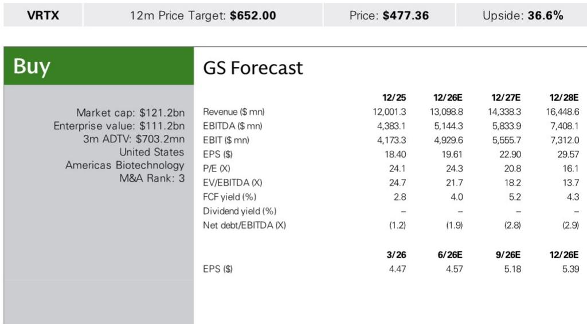
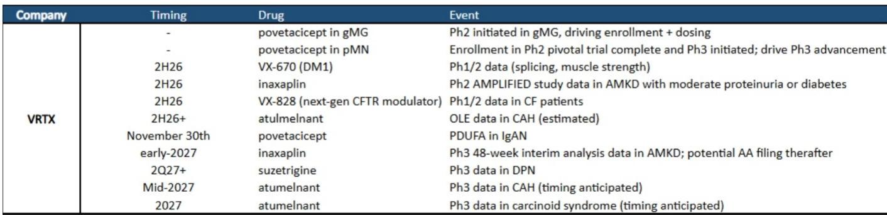
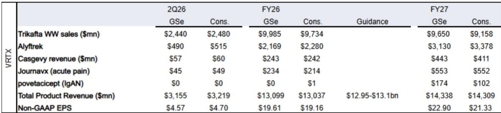

# GS：Vertex业务与季度数据观察

Vertex 报价年初至今跑输板块和标普500指数，主要原因是SION预计于8月公布的囊性纤维化（CF）领域二期数据构成压制。GS在7月发布的这份二季度业绩预览报告中指出，市场对SION数据的评估标准与Vertex自身的创新管线之间存在差异。SION将关键生物标志物汗液氯离子浓度降低10mmol/L视为成功门槛，但对于Vertex而言，这一门槛更高，需要放在其CF产品组合和持续创新序列中综合判断。

报告认为，当前报价水平下，Vertex的吸引力来自三个方向：povetacicept在IgA肾病领域的上市（11月30日PDUFA日期），GS认为现有数据（血尿改善和每月给药方案）支持其成为同类最佳药物；Crinetics收购资产的数据读出，包括先天性肾上腺皮质增生症和库欣综合征的二期开放标签扩展数据；以及CF和DM1领域下一代疗法的早期数据。

> **KC评论：** GS对Vertex的判断核心不是二季度业绩本身，而是下半年密集的数据催化剂。报告将SION的CF数据视为短期压制因素，但认为Vertex的管线深度和povetacicept的上市潜力才是中期价值锚点。

## 1. 二季度业绩预计符合预期，收入指引调整值得关注

GS模型显示，Vertex二季度总收入预计为31.55亿美元，略低于公司汇总的市场共识32.19亿美元；非GAAP每股收益预计为4.57美元，共识为4.70美元。Alyftrek收入预计为4.9亿美元，低于共识的5.15亿美元。

报告特别指出，除2025年二季度外，Vertex历史上通常在二季度财报时上调全年收入指引。当前公司给出的2026年全年收入指引为129.5亿至131亿美元，GS和共识均约为130亿美元。这一历史模式意味着，如果二季度业绩符合预期，管理层对全年展望的表述将成为市场关注焦点。

## 2. 下半年管线催化剂密度高于近年同期

报告列出的关键催化剂时间表显示，2026年下半年至2027年初是Vertex管线数据最密集的窗口。具体包括：povetacicept的PDUFA日期为11月30日；VX-670在DM1领域的1/2期数据（肌肉力量和剪接指标）预计在2026年下半年；VX-828（下一代CFTR校正剂）在CF患者中的1/2期数据同样在2026年下半年；inaxaplin在APOL1介导肾病（AMKD）合并中度蛋白尿或糖尿病人群中的2期数据也在2026年下半年。

2027年初，inaxaplin在AMKD领域的3期48周中期分析数据将读出，GS认为这之后可能提交加速批准申请。此外，atumelnant在先天性肾上腺皮质增生症中的3期数据预计在2027年中期。

## 3. 销售团队规模成为povetacicept商业化竞争的一个观察维度

报告披露了一个容易被忽略的细节：Vertex正在为povetacicept组建覆盖美国90%以上肾病患者的销售团队，预计规模为120至150人。这一数字大于竞争对手Vera和Otsuka的销售团队（分别为80人和100人）。在慢性病治疗领域，销售团队覆盖能力直接影响新产品的渗透速度，尤其是povetacicept作为每月给药方案，需要与医生建立持续的学术沟通。

GS同时指出，Vertex管理层对Crinetics收购资产（Palsonify和atumelnant）的商业前景给出了50亿美元以上的收入路径预期。这笔收购的会计处理和整合进展，预计将在三季度财报电话会议上被提及。

## 4. 一个可复用的观察框架：数据读出与商业化准备的时间匹配

这份报告提供了一个适用于生物技术公司的分析框架：将管线数据读出时间表与商业化准备进度进行对照。Vertex在2026年下半年至2027年初面临多个数据节点，同时povetacicept的销售团队建设和PDUFA日期高度重合。这种时间匹配意味着，如果数据积极，公司可以迅速进入商业化阶段；如果数据不及预期，前期投入的销售成本可能对短期利润率形成不确定性。

GS对inaxaplin在AMKD领域的成功概率持相对积极态度，依据是已发表在《新英格兰医学杂志》上的二期数据。但对于inaxaplin在合并糖尿病和中度蛋白尿人群中的2期数据，报告表达了一定谨慎，认为支持性数据较少，且此前MAZE的数据结果存在混合信号。

For informational purposes only. Portions may be generated,translated,summarized,or edited with AI assistance based on source materials and may contain omissions or errors. Please verify independently. This is not investment,legal,tax,accounting,or other professional advice.

For informational purposes only. Portions may be generated,translated,summarized,or edited with AI assistance based on source materials and may contain omissions or errors. Please verify independently. This is not investment,legal,tax,accounting,or other professional advice.

