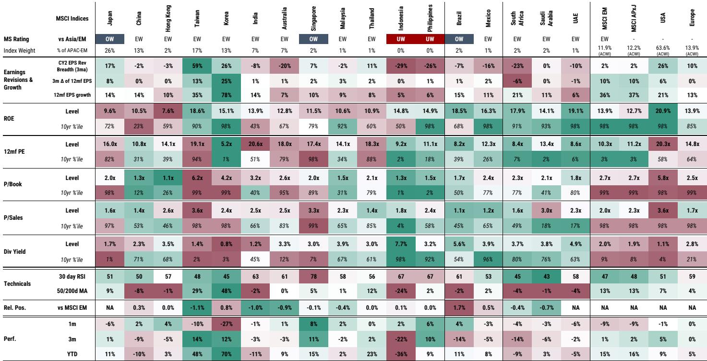
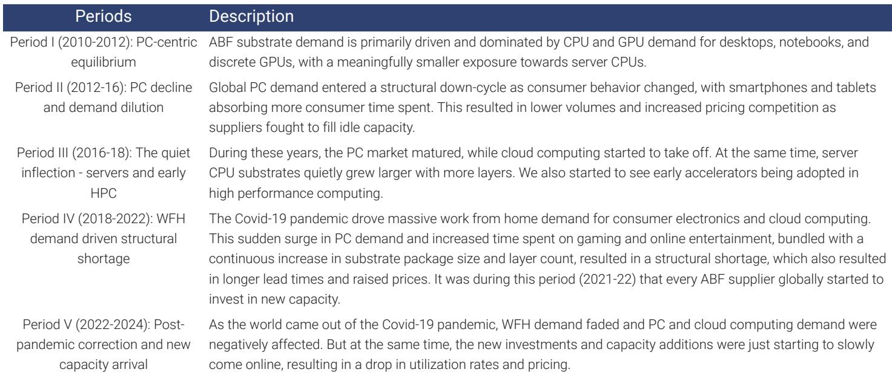
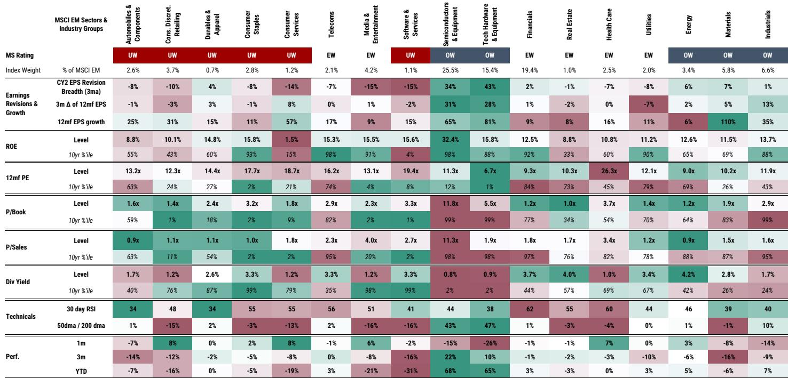

# 人工智能基础设施领域的调整是观察窗口，而非转折：算力需求将在未来多年持续超过供给

企业级人工智能用户目前在代币上的中位数月支出不足11美元。这一数据点包含了评估近期人工智能基础设施领域价格波动时最重要的战略洞察：市场尚未开始充分变现已构建的智能能力。近期由模型竞争、企业代币支出上限以及数据中心建设瓶颈等因素引发的价格调整，更多是技术性重定价，而非基本面逆转。核心逻辑依然成立：未来多年，算力需求将持续显著超过供给，而掌握人工智能供应链中物理、电力和物流瓶颈的公司将获得不成比例的价值。

此次调整为区分结构性挑战与暂时性波动提供了契机。三个被广泛讨论的读者关注点——代币使用上限、模型进展以及数据中心建设限制——均未能动摇人工智能基础设施的核心经济逻辑。事实上，每一项关注点，若仔细审视，反而强化了算力需求持续增长的论据。真正的问题不在于基础设施建设是否会继续，而在于供应链的哪些环节将最具韧性，哪些资产将成为关键约束。

## 企业代币支出如此之低，以至于“代币使用上限”在经济上无关紧要

认为企业会限制员工代币使用量从而抑制人工智能收入的观点，误解了当前的采用曲线。企业用户的中位数月代币支出不足11美元。在这一水平上，谈论预算约束不仅为时过早，而且方向错误。人工智能使用的经济学逻辑非常清晰：保守估计，每个用例节省的劳动力成本为55美元，而代币成本仅为2至3美元。这意味着代币支出的回报率约为20比1。

推动代币需求上升的机制并非员工热情，而是竞争必要性。未能部署最具成本效益的人工智能工具的公司，将面临相对于竞争对手的结构性成本劣势。随着这一动态在未来几个季度日益显现，企业采用将加速而非停滞。代币使用上限的担忧假设了一个尚不存在的天花板。数据表明的却是一个地板。

## 模型进展不会威胁算力需求，反而会加速它

包括Moonshot K3在内的前沿模型发布，被一些观察者解读为对模型开发者的威胁，进而对支撑它们的算力建设构成威胁。这种解读颠倒了因果关系。模型进展并非算力需求下降的信号，而是全球智能竞赛正在加剧的证据，这提高了每个参与者的赌注。

多个因素解释了为何来自任何地区的更强大模型都会增加而非减少总算力需求。首先，这些模型本身的训练和部署都需要大量算力。代币的价格并不等于代币使用所实现的价值，更低的代币价格会扩大而非缩小可寻址市场。其次，开发者对效率的追求强化了杰文斯悖论：随着生成每单位智能的成本下降，算力总消耗反而上升，因为新的用例变得经济可行，现有用户也增加了工作负载的频率和复杂性。第三，将任务分配给最具成本效益模型的中介层的出现，将增加跨多个模型的总代币量，而非将需求集中在单一供应商上。

对前沿模型开发者的竞争威胁是真实的。但对算力需求的威胁恰恰相反。更多竞争意味着更多模型变体、更多推理工作负载和更多训练任务。每个新前沿模型都需要一个训练集群；每次部署都需要推理基础设施。无论哪家公司在基准测试中胜出，算力生态系统都受益于模型的多样化。

## 数据中心建设的物理限制是减速带，而非障碍，但它们创造了瓶颈价值

人力、电力和政策因素将限制数据中心建设的速度，但不会阻止建设进程。熟练的建筑工人——电工、焊工和管道工——供应短缺。电网接入越来越困难。多个地区对数据中心建设的反对声音正在增加。一份全球研究报告预测，这些限制可能导致到2028年美国数据中心容量相对于基于芯片销售预测所需量出现超过10%的缺口。

这一缺口并非看空基础设施的理由。相反，它是持有那些随着供应趋紧而价值上升的资产的理由。人工智能基础设施栈中的关键约束并非芯片，而是通电时间、建筑工人和监管审批。控制这些瓶颈的公司——燃料电池供应商、涡轮机制造商、储能运营商、拥有强劲增长管线的数据中心REITs，以及已转向供电壳体的能源公司——将拥有定价权和稀缺溢价。

区分减速带和障碍至关重要。减速带减缓增长但不会逆转它。来自超大规模云服务商的需求信号依然明确：它们正在投入数千亿美元用于人工智能资本支出，因为这项投资的回报具有吸引力。代币经济学模型表明，大型模型和更高效的模型都能在底层人工智能基础设施上产生强劲的回报。物理限制会导致延迟和成本超支，但不会导致大规模取消。

## 在人工智能基础设施调整期进行布局的决策框架

近期的调整为资本配置提供了一个清晰的框架。该框架包含四个层面，每个层面具有不同的风险回报特征，并由报告中的特定机制支撑。

第一，持有物理瓶颈资产。这些资产的供给受到结构性约束，而需求在结构性增长。关键约束是通电时间、熟练劳动力和监管审批。受益的资产包括燃料电池供应商、涡轮机制造商、储能公司、拥有强劲增长管线的数据中心REITs，以及已转向供电壳体的能源公司。这些头寸不依赖于哪个前沿模型胜出，也不依赖于代币支出是否达到特定上限。它们仅依赖于一个事实：算力需求将超过供给，而建设新供给需要数年时间。

第二，持有算力制造生态系统。智能的价值正以非线性速率上升，而算力供给不足以满足需求。芯片制造商、半导体设备公司以及更广泛的硬件供应链，无论哪家超大规模云服务商或模型开发者获得最多收入，都将从这种不平衡中受益。每代芯片计算能力的快速提升——预计每代可提供250%更多的exaFLOPs，而功耗仅增加60%——意味着每一代新芯片以更低的相对能源成本提供更多智能，这进一步扩大了可寻址市场。

第三，持有领先的解决方案提供商。报告指出，这些公司的产品能力强大且具有成本竞争力，而许多相关公司的报价中并未充分反映这些利好。Moonshot K3的发布——报告将其描述为中国模型行业累积进展的结果，而非一夜之间的奇迹——表明相关公司将继续改进，并可能在国内外市场占据显著份额。智能工厂模型预测，使用K3运营的数据中心的投入资本回报率仅略有改善，表明该模型实力强劲但并非颠覆性优越。定价机会在于当前市场认知与实际竞争地位之间的差距。

第四，持有具备实现规模效益并推动人工智能资本支出获得可观回报能力的超大规模云服务商。报告根据其获取规模效益的能力——包括更低的单位成本、更广泛的分布以及持续资本支出的能力——识别出一组特定的超大规模云服务商。代币经济学模型支持以下观点：这些超大规模云服务商将在其人工智能投资上产生强劲回报，尤其是在企业采用加速且智能成本持续下降的情况下。

## 人工智能能力的非线性提升是长期算力需求最被低估的驱动因素

支撑持续算力需求的最重要因素是人工智能能力的非线性提升速率。读者很难进行非线性思考，报告明确指出，对于人工智能采用随时间推移的影响，目前缺乏足够的关注。数据是清晰的：前沿模型目前可以在超过50%的广泛人类知识任务上达到或超越人类水平。能力弹性较高的模型则可以在绝大多数知识任务上达到或超越人类水平。

这种能力跃升的经济影响是巨大的。数学领域的一个近期例子说明了这一点：一个团队开发了一个模型框架，在353个尝试的数学问题中自主解决了9个埃尔德什问题，其中包括两个已悬而未决56年的问题，每个问题的推理成本仅为几百美元。这不是理论推测，而是有记录的结果。当前能力与全部潜力之间的差距仍然巨大，模型性能的每一次增量改进都会解锁以前不经济或技术上不可行的新用例。

主要实验室将递归自我改进纳入模型架构的开发工作，可能进一步加速这一轨迹。递归自我改进允许以机器速度而非人类工作速度进行改进，并可能减少每次能力提升所需的额外算力量。各种估计表明，完全递归自我改进可能在2027年春季至2030年间到来，尽管这一时间线存在显著风险和不确定性。如果实现，其对算力需求的影响将是惊人的：更强大的模型、更多用例、更多推理工作负载，以及一个自我加速的改进循环。

## 全球人工智能市场的分化既带来风险也创造机遇

美国和人工智能政策干预的可能性增加，可能导致全球市场进一步分化。这一动态引入了地缘政治风险，但也创造了研究机会。能够在两个监管体系下运营的公司，或为双方提供关键基础设施的公司，将受益于分化而非受损。

在此背景下，能源安全资产尤为重要。报告将储能标记为一个突出的资产类别，逻辑很简单：随着数据中心建设加速和电网接入变得更加困难，按需存储和调度电力的能力成为关键能力。储能资产的地缘政治风险也低于芯片制造或模型开发，使其成为人工智能基础设施主题中的防御性头寸。

政策动态也强化了持有解决方案提供商的理由。如果政策限制先进芯片的出口，相关公司将更加大力投资国内替代品，从而推动本地算力基础设施的需求。如果政策支持国内人工智能发展——这几乎必然发生——领先的相关公司将受益于政府支持和庞大的国内市场。报告认为许多相关公司的报价中并未充分反映这些利好，这反映了市场倾向于折价相关科技公司，这为相信其竞争地位强于市场认知的观察者创造了不对称性。

*仅供参考。部分内容可能基于源材料通过人工智能辅助生成、翻译、总结或编辑，可能存在遗漏或错误。请独立核实。本文不构成专业建议。*

仅供参考。部分内容可能基于源材料通过人工智能辅助生成、翻译、总结或编辑，可能存在遗漏或错误。请独立核实。本文不构成专业建议。

