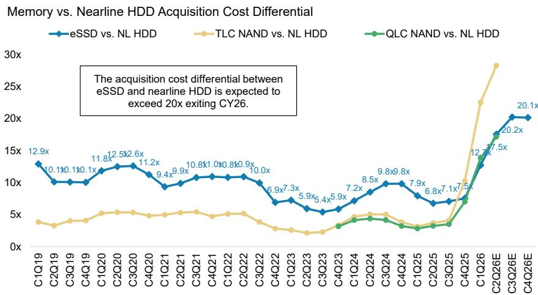
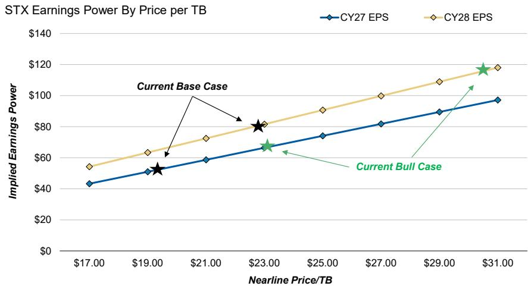
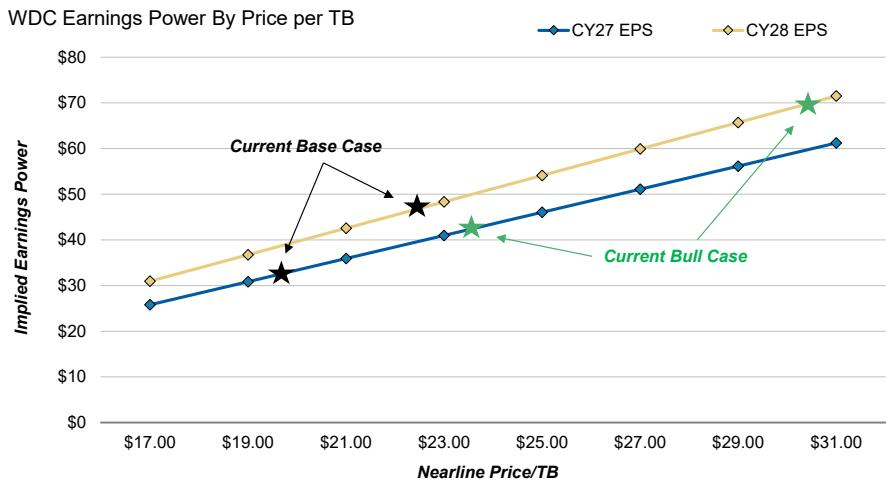
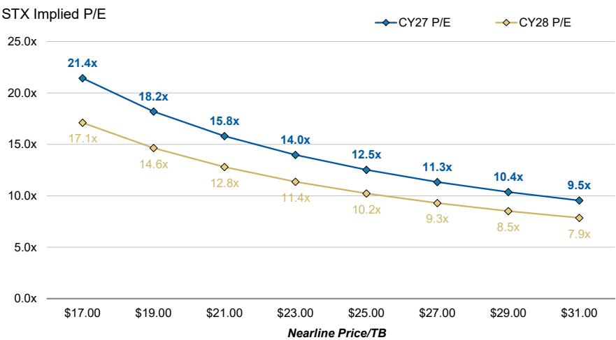
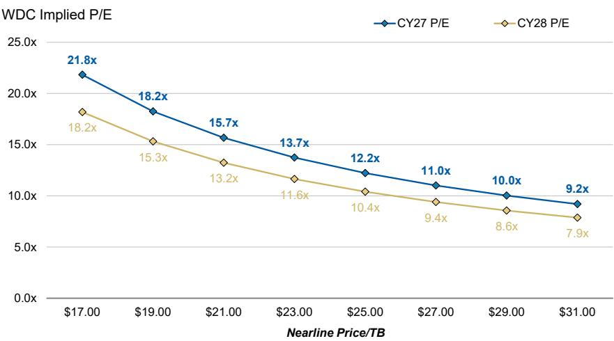
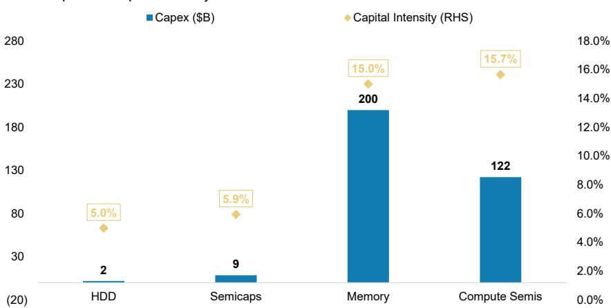

# F4Q26 业绩前瞻——重新审视行业逻辑

我们的行业调研持续显示积极信号，预计STX和WDC本季度将交出不错的成绩单。市场预期正在升温，但我们认为近期回调后值得重新关注，维持对STX和WDC的积极看法，其中STX是本季度的重点关注标的。

## 核心要点

■ 硬盘行业基本面持续改善，需求可见性延伸至2032年，行业调研显示2027年前存在300-400EB的供应缺口。

我们预计STX和WDC的6月季度业绩将接近指引上限，9月季度指引有望显著高于市场一致预期，定价动能保持强劲。

\- 定价仍是关键差异化因素，2027-2028年的价格讨论正朝着每TB 25-30美元的方向发展，现货EB价格较合约量有30-40%以上的溢价。

近期市场对STX洁净室扩建、NAND定价、开源AI以及与存储芯片的比较等担忧，根据我们的调研来看有些过度。

尽管名义市盈率较高，STX和WDC基于基准情景的2027年每股收益约为16倍，基于乐观情景的2028年每股收益约为7倍，每股收益年增长率至少在2028年前保持75%以上。

关于我们最新硬盘观点的更多细节，请参阅《IT硬件：硬盘——下一阶段上行》（2026年6月15日）和《西部数据：管理层会议显示客户寻求2032年可见性》（2026年6月15日）。

我们认为即将到来的硬盘业绩报告是重新建立对硬盘行业信心的关键催化剂，有助于巩固对更广泛AI基础设施支出周期的信心。我们的季度内调研持续指向硬盘定价环境改善、EB供应趋紧以及超大规模客户长期需求可见性提升，我们认为这将支持STX和WDC的营收、毛利率和每股收益预期出现显著上行空间（可能超过买方的高预期）。重要的是，这一背景与积极的云资本支出修正和加速的云收入增长相吻合，为过去4周表现相对一般的AI基础设施受益标的创造了更广泛的重新定价潜力。供应链的交流持续表明，硬盘市场在结构上仍处于供不应求状态，2027-2028年的定价讨论正逐步推向每TB 25-30美元，现货EB交易继续较合约量享有30-40%（或更高）的溢价。在此背景下，我们的敏感性分析（图表1）展示了在不同近期定价情景下，STX和WDC的9月季度营收、毛利率和每股收益可能落在什么位置。

Erik W Woodring
股票分析师
Erik.Woodring@morganstanley.com +1 212 296-8083

Dylan Liu
研究助理
Dylan.Liu@morganstanley.com +1 212 761-4519

Rauf Ural
研究助理
Rauf.Ural@morganstanley.com +1 212 761-5958

## IT硬件

北美
行业观点 谨慎

分析师认证及其他重要披露请参阅本报告末尾的披露部分。

除了6月和9月季度的业绩，我们预计读者将关注管理层关于当前指引之外的定价评论、需求可见性的持续时间、长期EB供应增长、客户容量预订延伸至下一个十年，以及HAMR采用作为持续盈利驱动因素的进展。虽然STX和WDC目前交易在我们基准情景2027年每股收益预估的约16倍，以及乐观情景预估的12-13倍（或我们2028年基准情景每股收益的约11倍/2028年乐观情景每股收益的约7倍），我们认为考虑到行业定价结构改善、盈利能力扩Daiwa更强的长期需求可见性，这些估值具有吸引力，特别是相对于STX在盈利水平明显较低时期的历史8-14倍交易区间。我们维持对STX和WDC的积极评级，并维持STX为首选标的。

图表1：虽然我们对9月季度的每股收益预估已比市场高出4-5%，但更强的定价动能可能推动近期盈利进一步上行。

<table><tr><td>2026年9月季度</td><td>MSe</td><td>Cons</td><td>Diff.</td><td colspan="6">混合每TB价格的潜在结果</td></tr><tr><td>STX</td><td></td><td></td><td></td><td></td><td></td><td></td><td></td><td></td><td></td></tr><tr><td>每TB价格环比增长</td><td>3.7%</td><td>2.3%</td><td>130bps</td><td>3.0%</td><td>4.0%</td><td>5.0%</td><td>6.0%</td><td>7.0%</td><td>8.0%</td></tr><tr><td>营收（百万美元）</td><td>3,806</td><td>3,782</td><td>1%</td><td>3,782</td><td>3,819</td><td>3,856</td><td>3,892</td><td>3,929</td><td>3,966</td></tr><tr><td>毛利率</td><td>53.2%</td><td>49.9%</td><td>330bps</td><td>52.9%</td><td>53.4%</td><td>53.8%</td><td>54.3%</td><td>54.7%</td><td>55.1%</td></tr><tr><td>每股收益</td><td>$6.11</td><td>$5.84</td><td>4%</td><td>$6.02</td><td>$6.15</td><td>$6.29</td><td>$6.42</td><td>$6.55</td><td>$6.69</td></tr><tr><td>WDC</td><td></td><td></td><td></td><td></td><td></td><td></td><td></td><td></td><td></td></tr><tr><td>每TB价格环比增长</td><td>3.6%</td><td>2.8%</td><td>80bps</td><td>3.0%</td><td>4.0%</td><td>5.0%</td><td>6.0%</td><td>7.0%</td><td>8.0%</td></tr><tr><td>营收（百万美元）</td><td>4,046</td><td>4,027</td><td>0%</td><td>4,028</td><td>4,067</td><td>4,106</td><td>4,145</td><td>4,184</td><td>4,223</td></tr><tr><td>毛利率</td><td>55.3%</td><td>51.8%</td><td>350bps</td><td>55.1%</td><td>55.5%</td><td>56.0%</td><td>56.4%</td><td>56.8%</td><td>57.2%</td></tr><tr><td>每股收益</td><td>$3.96</td><td>$3.78</td><td>5%</td><td>$3.92</td><td>$4.00</td><td>$4.09</td><td>$4.17</td><td>$4.25</td><td>$4.34</td></tr></table>

来源：公司数据、FactSet、MS预估。注：市场一致预期的每TB价格是根据市场一致预期营收除以MS预估的EB出货量计算得出的。

我们仍然认为AI带来的数据保留顺风仍处于早期阶段，我们的调研持续指向硬盘需求前景改善，供需动态正变得更加紧张，且可能比读者意识到的更持久。硬盘需求信号与更广泛的LLM采用、新AI应用发布（如字节跳动的AI视频应用Seedance）、企业AI部署和数据湖创建的扩展，以及模型训练和推理对数据生成和保留的持续需求保持一致。换句话说，我们迄今为止进行的几乎所有调研都表明，要么硬盘供应短缺正在加剧，要么周期持续时间正在延长。例如，CSP现在要求到2032年的容量可见性，而我们的行业调研持续表明，到2028年每年存在300-400EB的硬盘供应缺口。在此背景下，根据我们6月初的调研，2027-2028年的硬盘定价讨论正逐步推向每TB 25-30美元，而合同外的EB量（"现货"）目前较合同EB享有30-40%以上的溢价。重要的是，硬盘供应商在公开评论中也变得越来越积极。在我们6月初与WDC的路演中，管理层指出"存在机会"使每TB价格同比增长达到两位数百分比，而3月季度为同比增长9%。

在此背景下，我们预计STX和WDC的6月季度业绩将处于指引高端，受到持续定价动能的支撑。虽然我们没有在业绩公布前调整预估，但我们预计6月季度业绩将明显高于MSe和市场一致预期。值得一提的是，日经新闻报道近线硬盘价格在6月季度环比增长约10%。如果准确，这将意味着我们的预估和当前市场一致预期都有显著上行空间，不过这感觉比我们约3%的环比近线价格/EB基准预测要激进得多，而我们的基准预测已经高于市场。需要明确的是，虽然现货定价/未来近线价格的谈判都在走高，但影响2026年6月季度的大部分合同是在几个季度前决定的，这意味着我们应该预期6月季度业绩会高于指引/MSe/市场一致预期，但不会达到上述水平。对于STX，我们预计6月季度营收为35.0-35.5亿美元（指引为34.5-35.5亿美元），毛利率为50-51%，意味着营业利润率为41.5-42.5%（指引为低40%），每股收益为5.14-5.33美元。对于WDC，我们预计6月季度营收为37.0-37.5亿美元（指引为35.5-37.5亿美元），毛利率为52-53%（指引为51-52%），每股收益为3.34-3.44美元。

我们也预计9月季度展望强劲，定价仍是盈利上行的主要驱动力。我们的基准情景假设硬盘定价继续以中个位数百分比的速度环比增长，支持营收和利润率轨迹高于当前市场一致预期。也就是说，虽然"现货"EB继续以显著溢价交易，但我们不预计9月季度近线硬盘价格会出现10%以上的广泛环比增长。我们认为这不太可能，因为：（1）"现货"EB可能仅占近线EB出货量的15-20%，以及（2）存储芯片定价直到去年9月才开始急剧上涨——硬盘定价谈判可能不会在存储芯片合同价格上涨后立即变得激进。即便如此，STX应该受益于相对每TB价格的顺风，因为向GOOGL出货的折扣HAMR量在6月季度基本完成。此外，随着我们进入新的财年，STX和WDC都可能从更高价格的合同进入生产中受益。虽然我们预计运营支出会有适度增加（STX环比增加500-1000万美元，WDC环比增加1000-1500万美元），我们仍然预计9月季度指引将高于MSe并显著高于市场一致预期。对于STX，我们预计营收指引为38.0-38.5亿美元，毛利率为53-54%，环比扩张约300个基点，意味着营业利润率在中40%范围，每股收益为6.10-6.30美元（图表2）。对于WDC，我们预计管理层指引营收为40.5-41.5亿美元，毛利率为54-55%，环比提高200个基点（我们认为WDC的指引比STX更保守一些），意味着每股收益为3.95-4.15美元（图表3）。

图表2：STX：我们对6月季度的预估与市场基本一致，而9月季度的每股收益预估比市场高出4%，受营收和利润率上行驱动。

<table><tr><td rowspan="2">（百万美元）</td><td colspan="5">2026年6月</td><td colspan="5">2026年9月</td></tr><tr><td>已报告</td><td>MSe旧</td><td>差异</td><td>市场一致</td><td>差异</td><td>MSe新</td><td>MSe旧</td><td>差异</td><td>市场一致</td><td>差异</td></tr><tr><td>营收</td><td>3,474</td><td>3,474</td><td>0%</td><td>3,497</td><td>-1%</td><td>3,806</td><td>3,806</td><td>0%</td><td>3,782</td><td>1%</td></tr><tr><td>毛利润</td><td>1,734</td><td>1,734</td><td>0%</td><td>1,747</td><td>-1%</td><td>2,027</td><td>2,027</td><td>0%</td><td>1,888</td><td>7%</td></tr><tr><td>营业利润</td><td>1,437</td><td>1,437</td><td>0%</td><td>1,468</td><td>-2%</td><td>1,724</td><td>1,724</td><td>0%</td><td>1,643</td><td>5%</td></tr><tr><td>税前利润</td><td>1,388</td><td>1,388</td><td>0%</td><td>1,403</td><td>-1%</td><td>1,679</td><td>1,679</td><td>0%</td><td>1,554</td><td>8%</td></tr><tr><td>净利润</td><td>1,166</td><td>1,166</td><td>0%</td><td>1,171</td><td>0%</td><td>1,411</td><td>1,411</td><td>0%</td><td>1,334</td><td>6%</td></tr><tr><td>每股收益</td><td>$5.05</td><td>$5.05</td><td>0%</td><td>$5.10</td><td>-1%</td><td>$6.11</td><td>$6.11</td><td>0%</td><td>$5.84</td><td>4%</td></tr><tr><td>毛利率</td><td>49.9%</td><td>49.9%</td><td>0bps</td><td>50.0%</td><td>-10bps</td><td>53.2%</td><td>53.2%</td><td>0bps</td><td>49.9%</td><td>330bps</td></tr><tr><td>营业利润率</td><td>41.4%</td><td>41.4%</td><td>0bps</td><td>42.0%</td><td>-60bps</td><td>45.3%</td><td>45.3%</td><td>0bps</td><td>43.4%</td><td>180bps</td></tr><tr><td>稀释股份（百万）</td><td>231</td><td>231</td><td>0%</td><td>230</td><td>1%</td><td>231</td><td>231</td><td>0%</td><td>228</td><td>1%</td></tr></table>

来源：公司数据、FactSet、MS预估

图表3：WDC：我们对6月季度的预估与市场基本一致，而9月季度的每股收益预估比市场高出8%，主要受利润率上行驱动。

<table><tr><td rowspan="2">（百万美元）</td><td colspan="5">2026年6月</td><td colspan="5">2026年9月</td></tr><tr><td>MSe新</td><td>MSe旧</td><td>差异</td><td>市场一致</td><td>差异</td><td>MSe新</td><td>MSe旧</td><td>差异</td><td>市场一致</td><td>差异</td></tr><tr><td>营收</td><td>3,685</td><td>3,685</td><td>0%</td><td>3,693</td><td>0%</td><td>4,046</td><td>4,046</td><td>0%</td><td>4,027</td><td>0%</td></tr><tr><td>毛利润</td><td>1,917</td><td>1,917</td><td>0%</td><td>1,905</td><td>1%</td><td>2,238</td><td>2,238</td><td>0%</td><td>2,085</td><td>7%</td></tr><tr><td>营业利润</td><td>1,522</td><td>1,522</td><td>0%</td><td>1,526</td><td>0%</td><td>1,829</td><td>1,829</td><td>0%</td><td>1,743</td><td>5%</td></tr><tr><td>税前利润</td><td>1,516</td><td>1,516</td><td>0%</td><td>1,519</td><td>0%</td><td>1,830</td><td>1,830</td><td>0%</td><td>1,750</td><td>5%</td></tr><tr><td>净利润</td><td>1,273</td><td>1,273</td><td>0%</td><td>1,271</td><td>0%</td><td>1,537</td><td>1,537</td><td>0%</td><td>1,446</td><td>6%</td></tr><tr><td>每股收益</td><td>$3.30</td><td>$3.30</td><td>0%</td><td>$3.30</td><td>0%</td><td>$3.96</td><td>$3.96</td><td>0%</td><td>$3.78</td><td>5%</td></tr><tr><td>毛利率</td><td>52.0%</td><td>52.0%</td><td>0bps</td><td>51.6%</td><td>40bps</td><td>55.3%</td><td>55.3%</td><td>0bps</td><td>51.8%</td><td>350bps</td></tr><tr><td>营业利润率</td><td>41.3%</td><td>41.3%</td><td>0bps</td><td>41.3%</td><td>0bps</td><td>45.2%</td><td>45.2%</td><td>0bps</td><td>43.3%</td><td>190bps</td></tr><tr><td>稀释股份（百万）</td><td>385</td><td>385</td><td>0%</td><td>386</td><td>0%</td><td>389</td><td>389</td><td>0%</td><td>383</td><td>2%</td></tr></table>

来源：公司数据、FactSet、MS预估

近期读者对产能增加和周期持续性的担忧，似乎与我们的调研结果越来越脱节。过去几周，尽管行业数据点越来越积极，但我们听到了读者的一系列问题。最常见的担忧集中在：（1）STX在明尼苏达州的洁净室扩建，（2）如何在NAND定价疲软的情况下看待硬盘定价，（3）近期开源LLM发布或超大规模企业举措——如META转向通过类似neocloud的模式租赁数据中心容量——是否最终会压力硬盘需求，以及（4）与存储芯片公司的比较。我们逐一回应这些担忧。

\- STX洁净室扩建反映的是HAMR需求，而非广泛的产能增加。我们的调研表明，明尼苏达州的扩建代表了约20%的额外产能，但专门用于现代HAMR磁头晶圆，这些晶圆与传统磁头晶圆不可互换。假设STX的近线硬盘今天平均约23TB，在2026年下半年达到30-40TB+的容量，将需要比STX目前生产的更多的HAMR磁头。重要的是，这不是一个新建项目。与此同时，我们的亚洲调研持续指向今年硬盘单位增长约5%，增长持续到2030年，受到HAMR采用、良率改善和制造周期缩短的支持。

\- 我们认为将NAND定价疲软与硬盘定价联系起来的担忧是不恰当的。虽然一些读者关注了近几个月NAND现货定价的疲软，但我们的硬盘调研持续表明非常强劲的定价基本面，包括2027-2028年的谈判走向每TB 25-30美元，当前现货EB定价比合同水平高出30-40%以上。与此同时，我们听到了NAND市场趋紧的迹象，包括一些eSSD交易以每GB约0.60-0.70美元签署，而硬盘定价约为每GB 0.015美元。换句话说，硬盘与eSSD的获取成本优势今天仍然约为17-20倍（而替代风险为3倍），并且可能进一步扩大（图表4），这意味着（1）任何对NAND定价的近期担忧都被夸大了，（2）eSSD的替代风险每天都在变小（尽管中长期仍然相关），以及（3）硬盘应该继续看到定价上行压力。

\- 开源LLM的采用和新兴的neocloud模式更可能支持而非破坏硬盘需求。随着硬盘需求越来越与推理工作负载相关，我们认为行业仍处于AI驱动数据创建的早期阶段。更多的LLM使用驱动更多的推理活动，进而推动更大的数据保留、存储和模型再训练需求。无论模型是专有的还是开源的，数据仍然是AI系统的核心输入，而硬盘继续占数据中心存储的所有数据的约80%。

\- HAMR的采用继续按计划推进，良率改善，未来还有更多催化剂。我们的调研表明STX的HAMR良率持续改善，6月季度预计出货200-300万+片。我们还看到Mozaic 4的爬坡正朝着2026年下半年推进，2026年第二季度开始有限量出货。在STX之外，亚洲供应链调研表明WDC的HAMR爬坡仍按计划在2027年上半年进行，我们认为这是更广泛行业采用的重要催化剂。此外，在我们与WDC的NDR期间的讨论突出了重要的认证进展。根据四大美国超大规模企业的反馈，WDC在HAMR认证过程的类似阶段，在可靠性和性能指标上都领先于同行。

\- 我们认为硬盘和存储芯片在熊市风险方面的比较在今天并不特别相关。一个常见的看空论点是，硬盘应该遵循与存储芯片相同的路径，特别是当存储芯片公司的利润率、定价增长和盈利增长开始见顶时（根据看空者的观点）。虽然我们理解存储芯片和硬盘之间的广泛关系，但这种比较很快就站不住脚了——（1）存储芯片公司目前的毛利率在80-90%，而硬盘供应商今天的毛利率约为50%，增量毛利率为70-80%+——硬盘远未达到利润率峰值，（2）硬盘定价刚刚开始同比上升——市场距离硬盘每TB价格同比见顶的任何潜在迹象还有几个季度，（3）我们预测硬盘营收同比增长在未来至少5个季度内每个季度都在加速——再次强调，无论同比定价或营收趋势如何——二阶导数担忧对硬盘并不相关，（4）硬盘供应商没有计划任何新建产能扩张——今年5%的单位增长与3个月前的预期一致，尽管对硬盘磁头的需求更大——我们的调研指向周期持续延长，最后（5）硬盘市场没有中国竞争对手——硬盘是一个由3家参与者组成的理性寡头垄断，80%以上的需求来自全球最大的云供应商。

图表4：eSSD的获取成本现在是硬盘的17-20倍——即使有人认为NAND定价可能见顶，硬盘定价仍有足够的上升空间。

  
来源：IDC、TrendForce、MS

尽管名义倍数看起来较高，但估值仍然具有吸引力。基于市场一致预期的2027财年预估，STX和WDC目前的市盈率分别约为31倍和28倍，远高于历史8-14倍区间。然而，我们认为这些倍数夸大了估值，因为市场预估相对于我们看到的定价环境仍然过于保守。即使我们的硬盘定价调研只是大致准确，这些公司在我们盈利预估上的估值也要便宜得多，而我们尚未完全纳入调研中的定价上行空间（图表5和图表6）。基于我们2027年基准情景的每股收益预估，STX和WDC的交易价格约为16倍，在乐观情景下仅为12-13倍（图表7和图表8），这些公司到2028年的盈利年复合增长率超过75%，资本支出需求（用于面密度提升，而非物理扩张）远低于其他AI基础设施受益标的（图表9）。在我们2028年乐观情景的每股收益上——这仍然没有完全纳入我们强劲的定价调研——STX和WDC的交易价格仅为约7倍市盈率。

图表5：我们新的STX基准情景预测2027年近线价格/EB为19美元，2028年为22美元，而新的乐观情景预测为22美元/29美元。

  
来源：公司数据、MS预估

图表6：同样，我们新的WDC基准情景预测2027年近线价格/EB接近19.50美元，2028年接近22美元，而新的乐观情景预测为22.50美元/29美元。  
  
来源：公司数据、MS预估

图表7：STX目前交易在我们2027年基准情景每股收益的18倍，但仅为新2027年乐观情景每股收益的14倍。

  
来源：公司数据、MS预估

图表8：WDC目前交易在我们2027年基准情景每股收益的17倍，或仅为新2027年乐观情景每股收益的13倍。  
  
来源：公司数据、MS预估

图表9：与半导体设备、存储芯片和计算半导体公司相比，硬盘在未来1-2年实现强劲营收/盈利增长所需的资本密集度和资本支出金额最低。

NTM资本支出与资本密集度

  
来源：公司数据、MS预估。注：NTM预估基于MSe；硬盘包括STX、WDC；半导体设备包括AMAT、LRCX、KLAC、ASML；存储芯片包括三星、SK海力士、美光、铠侠、闪迪；计算半导体包括NVDA、AVGO、MRVL、AMD、INTC；计算半导体的资本密集度计算也包括台积电的资本支出。

在业绩公布时，我们将较少关注季度本身，而更多关注有助于构建硬盘周期下一阶段的信号。STX计划于7月28日公布业绩，WDC于8月5日公布，两家公司均在市场收盘后公布。除了季度业绩和指引（营收、毛利率、运营支出、隐含每TB价格和每TB成本等），我们认为关键关注领域包括：（1）关于中长期硬盘定价的评论，（2）长期EB供应和增长的可见性，（3）成本压力和长期成本下降轨迹，（4）单位容量计划与推理驱动的硬盘需求增长，（5）需求可见性和LTA，（6）向40TB+产品的出货爬坡轨迹，（7）HAMR认证进展，以及（8）资本配置优先事项，特别是对于STX（回购与去杠杆）。不过在我们看来——定价和周期持续时间评论仍然是本季度最关键的话题。

图表10：STX：我们2027-2028财年的每股收益预估仍比市场一致预期高出24-55%

<table><tr><td rowspan="2">（百万美元）</td><td colspan="3">2026财年预估</td><td colspan="3">2027财年预估</td><td colspan="3">2028财年预估</td></tr><tr><td>MS</td><td>市场一致</td><td>差异</td><td>MS</td><td>市场一致</td><td>差异</td><td>MS</td><td>市场一致</td><td>差异</td></tr><tr><td>营收</td><td>12,040</td><td>12,057</td><td>0%</td><td>18,603</td><td>16,963</td><td>10%</td><td>27,878</td><td>22,340</td><td>25%</td></tr><tr><td>毛利润</td><td>5,442</td><td>5,431</td><td>0%</td><td>11,046</td><td>8,729</td><td>27%</td><td>19,909</td><td>11,920</td><td>67%</td></tr><tr><td>营业利润</td><td>4,268</td><td>4,279</td><td>0%</td><td>9,829</td><td>7,948</td><td>24%</td><td>18,642</td><td>11,978</td><td>56%</td></tr><tr><td>税前利润</td><td>4,013</td><td>3,971</td><td>1%</td><td>9,663</td><td>7,630</td><td>27%</td><td>18,499</td><td>11,560</td><td>60%</td></tr><tr><td>净利润</td><td>3,385</td><td>3,325</td><td>2%</td><td>8,117</td><td>6,542</td><td>24%</td><td>15,539</td><td>9,996</td><td>55%</td></tr><tr><td>每股收益</td><td>$14.91</td><td>$14.91</td><td>0%</td><td>$35.38</td><td>$28.54</td><td>24%</td><td>$70.64</td><td>$45.57</td><td>55%</td></tr><tr><td>毛利率</td><td>45.2%</td><td>45.0%</td><td>20bps</td><td>59.4%</td><td>51.5%</td><td>790bps</td><td>71.4%</td><td>53.4%</td><td>1810bps</td></tr><tr><td>营业利润率</td><td>35.4%</td><td>35.5%</td><td>0bps</td><td>52.8%</td><td>46.9%</td><td>600bps</td><td>66.9%</td><td>53.6%</td><td>1330bps</td></tr><tr><td>稀释股份（百万）</td><td>227</td><td>223</td><td>2%</td><td>229</td><td>229</td><td>0%</td><td>220</td><td>219</td><td>0%</td></tr></table>

来源：公司数据、FactSet、MS预估

图表11：WDC：我们2027-2028财年的每股收益预估仍比市场一致预期高出20-50%

<table><tr><td rowspan="2">（百万美元）</td><td colspan="3">2026财年预估</td><td colspan="3">2027财年预估</td><td colspan="3">2028财年预估</td></tr><tr><td>MS</td><td>市场一致</td><td>差异</td><td>MS</td><td>市场一致</td><td>差异</td><td>MS</td><td>市场一致</td><td>差异</td></tr><tr><td>营收</td><td>12,857</td><td>12,868</td><td>0%</td><td>19,663</td><td>18,280</td><td>8%</td><td>29,976</td><td>24,234</td><td>24%</td></tr><tr><td>毛利润</td><td>6,229</td><td>6,182</td><td>1%</td><td>12,055</td><td>9,862</td><td>22%</td><td>21,769</td><td>13,432</td><td>62%</td></tr><tr><td>营业利润</td><td>4,684</td><td>4,638</td><td>1%</td><td>10,387</td><td>8,574</td><td>21%</td><td>19,916</td><td>12,814</td><td>55%</td></tr><tr><td>税前利润</td><td>4,565</td><td>4,566</td><td>0%</td><td>10,392</td><td>8,625</td><td>20%</td><td>19,943</td><td>12,877</td><td>55%</td></tr><tr><td>净利润</td><td>3,783</td><td>3,764</td><td>1%</td><td>8,730</td><td>7,202</td><td>21%</td><td>16,753</td><td>10,859</td><td>54%</td></tr><tr><td>每股收益</td><td>$9.97</td><td>$9.99</td><td>0%</td><td>$22.40</td><td>$18.50</td><td>21%</td><td>$43.47</td><td>$29.18</td><td>49%</td></tr><tr><td>毛利率</td><td>48.4%</td><td>48.0%</td><td>40bps</td><td>61.3%</td><td>54.0%</td><td>740bps</td><td>72.6%</td><td>55.4%</td><td>1720bps</td></tr><tr><td>营业利润率</td><td>36.4%</td><td>36.0%</td><td>40bps</td><td>52.8%</td><td>43.6%</td><td>920bps</td><td>66.4%</td><td>42.7%</td><td>2370bps</td></tr><tr><td>稀释股份（百万）</td><td>379</td><td>377</td><td>1%</td><td>390</td><td>389</td><td>0%</td><td>385</td><td>372
