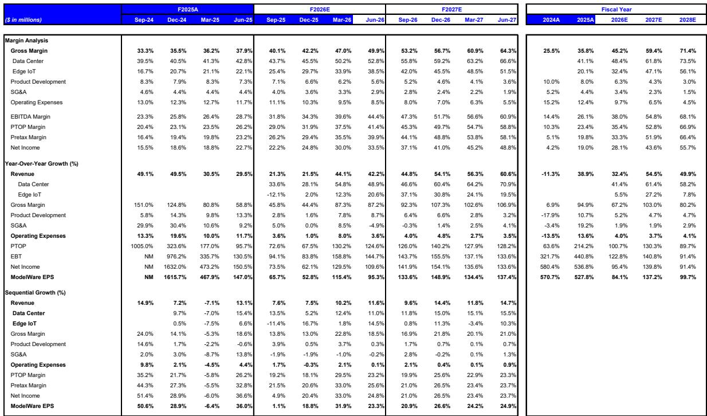
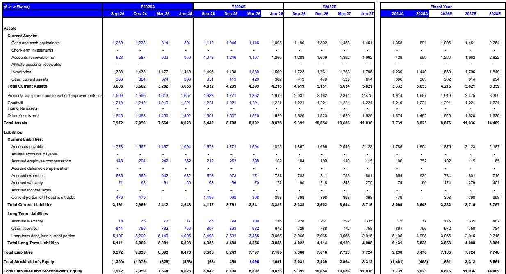
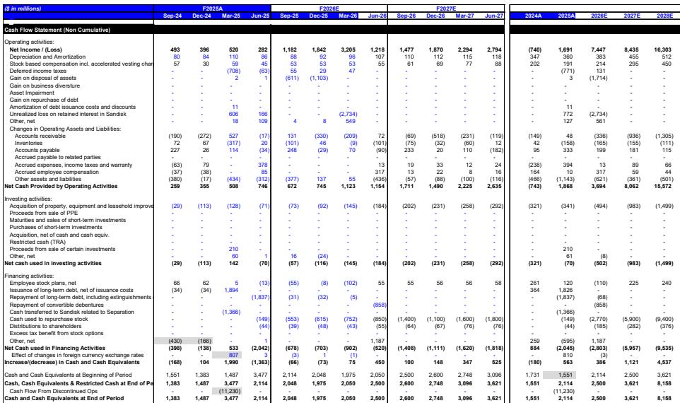

# 即将到来的硬盘行业财报季将验证结构性供应缺口是真实存在的，而非周期性现象

硬盘驱动器行业即将迎来一个财报季，其意义将超越又一次业绩超预期和上调指引。它将确立当前的价格周期并非暂时性上涨，而是一个由供需失衡驱动的多年结构性重新定价，这种失衡远远超出了典型的半导体或存储周期。证据已在合同谈判、现货市场溢价以及延伸至2032年的超大规模客户需求信号中显现。然而，关注市盈率倍数和与内存周期比较的权益市场，尚未完全消化其影响。

行业调研显示，至少在2028日历年之前，每年持续存在300至400艾字节的供应缺口。这不是对市场紧张的预测，而是表明在任何合理的供应情景下，该行业都无法生产足够的硬盘容量来满足需求。针对2027和2028日历年度的定价讨论已趋向每太字节25至30美元，而现货艾字节交易价格比合同量溢价30%至40%。这些并非孤例，而是未来几个季度将反映在财务报告中的重新定价的先行指标。

即将到来的希捷科技和西部数据6月和9月季度财报将成为推动市场重新评估的催化剂。两家公司预计将报告6月季度业绩处于指引高端，9月季度展望将显著高于市场共识。但真正的故事并非眼前的利好，而是前瞻性评论将揭示的关于定价周期持续时间和幅度的信息。

## 供应缺口并非产能限制，而是技术转型瓶颈

读者最常关注的问题集中在希捷在明尼苏达州的洁净室扩建上，一些人将其解读为供应能够迅速跟上的信号。这种解读是错误的。扩建代表了大约20%的额外产能，但它专门用于现代HAMR磁头晶圆，这些晶圆与传统的磁头晶圆不可互换。随着近线硬盘容量从今天平均约23太字节，在2026日历年下半年提升至30至40太字节或更高，每出货艾字节所需的HAMR磁头数量显著增加。这不是一个全新的扩建，而是一次必要的改造，以在产品组合转变时维持当前的艾字节产出。

其含义很直接。即使希捷和西部数据积极投资于产能，向HAMR技术的过渡也会造成一个自然的瓶颈。生产良率稳步提升，但可用的HAMR兼容磁头的相对数量限制了总艾字节产出。与此同时，到2030年，单位增长保持温和，大约每年5%。结果是，艾字节需求的增长速度超过了行业的供应能力，定价权决定性地转向了制造商。

## 与内存定价的比较具有误导性，因为硬盘利润率远未达到峰值

一个常见的看空观点认为，硬盘定价将遵循与NAND或DRAM相同的轨迹，即利润率最终达到峰值然后崩溃。这种比较在三个结构性基础上站不住脚。

首先，内存公司目前的毛利率在80%至90%之间。硬盘供应商目前的毛利率约为50%，增量毛利率为70%至80%。这意味着硬盘利润率在接近任何类似峰值之前，还有很大的扩张空间。其次，硬盘定价刚刚开始同比加速。市场距离出现每太字节价格同比增长减速的任何迹象还有几个季度。第三，在可预见的未来，硬盘制造商的收入增长预计每个季度都会加速，而非减速。

目前，硬盘与企业级SSD的获取成本优势仍然大约为17至20倍。只有当这一比率缩小到大约3倍时，来自企业级SSD的替代风险才具有经济相关性。这个差距正在扩大，而非缩小。NAND现货价格的任何短期疲软对硬盘定价基本面没有直接影响。这两个市场服务于不同的成本层级，其定价动态由不同的供需结构驱动。

## 开源AI与Neocloud模式是需求催化剂，而非威胁

一些读者担心，开源大语言模型的兴起或超大规模企业（如Meta）通过类似neocloud模式租赁数据中心容量的举措，可能会减少硬盘需求。其逻辑是，开源模型需要更少的专有数据存储，或者neocloud架构将工作负载转移到不同的存储层级。

事实恰恰相反。随着硬盘需求日益与推理工作负载挂钩，该行业仍处于AI驱动数据创造的早期阶段。更多的LLM使用会推动更多的推理活动，进而推动对数据保留、存储和模型再训练的更大需求。无论模型是专有的还是开源的，数据仍然是AI系统的核心输入。硬盘继续占据数据中心存储数据的大约80%。任何增加总AI工作负载量的情景都会增加硬盘需求，无论模型架构如何。

新兴的neocloud模式，即超大规模企业租赁容量而非自建数据中心，实际上可能会加速硬盘采购。这些租赁安排通常要求出租方预先配置存储容量，从而对硬盘订单产生拉动效应，而非替代效应。

## 决策框架：如何评估财报前的硬盘行业敞口

对于在即将到来的财报前建立或调整仓位的读者而言，相关框架并非希捷和西部数据是否会超出市场共识预期。问题在于，市场是否会重新评估这些公司，以反映当前周期的结构性特征。即将到来的财报电话会议中的三个具体数据点将决定这种重新评估是否会发生。

首先，管理层对9月季度指引之外的定价评论。如果高管表示2027日历年度的定价讨论正趋向每太字节25至30美元，这将确认当前定价轨迹还有多年的运行空间。如果他们保持谨慎或拒绝评论，市场可能会对可见性打折扣。

第二，任何关于客户容量预留延伸至下一个十年的披露。超大规模企业已经在要求看到2032年的可见性。如果希捷或西部数据宣布正式的容量预留协议并附带多年承诺，这将把叙事从周期性上涨转变为结构性稀缺。

第三，HAMR的采用速度和良率提升。希捷的HAMR出货量预计在6月季度达到200万至300万个。Mozaic 4的爬坡计划在2026日历年第二季度进行小批量出货。西部数据仍按计划在2027年上半年进行HAMR爬坡，其认证进展似乎比希捷在类似阶段更快。更快的良率提升或更早的认证里程碑将加速供应约束并延长定价周期。

估值情况很直接。按基准情景下2027日历年度每股收益的大约16倍和乐观情景下2028日历年度每股收益的大约7倍计算，希捷和西部数据的交易倍数暗示要么是盈利峰值，要么是利润率的快速均值回归。这两种假设都不被供需数据支持。在盈利水平显著较低的时期，希捷的历史交易区间为8至14倍。当前的倍数，虽然在相对基础上较高，但在根据盈利轨迹调整后，实际上低于该历史区间的中点。

## 盈利上行空间集中在定价而非销量，使其更具持久性

9月季度的展望说明了为什么这个周期不同。对于希捷，预期的收入指引区间为38亿至38.5亿美元，毛利率为53%至54%，这意味着营业利润率在40%左右，每股收益为6.10至6.30美元。对于西部数据，预期的收入指引为40.5亿至41.5亿美元，毛利率为54%至55%，这意味着每股收益为3.95至4.15美元。

这些数字几乎完全由定价驱动。销量增长温和，单位增长率大约为每年5%。所有的利润率扩张都来自混合每太字节价格的转变。这是一个比销量驱动增长更持久的盈利驱动因素，因为它不依赖于单位需求的加速。即使单位增长停滞，定价轨迹也能维持多年的盈利增长。

敏感性分析强化了这一点。如果混合每太字节价格环比增长5%，而不是基准情景的3%至4%，希捷9月季度的每股收益可能达到6.29美元，西部数据可能达到4.09美元。在8%的环比定价增长下，希捷的每股收益可能达到6.69美元，西部数据可能达到4.34美元。上行空间是非对称的。下行空间有限，因为供应缺口阻止了定价崩溃。

## 过度解读的风险是存在的，但信号是清晰的

人们自然倾向于将近期数据点外推为永久趋势。这种风险是存在的。6月季度的结果将反映几个季度前做出的定价决策，而非最新的现货市场动态。9月季度的展望将包含部分近期的定价势头，但并非全部。读者不应期望单个季度出现10%的环比定价增长。现货艾字节量仅占近线出货量的15%至20%，而针对2027日历年度的激进定价谈判需要时间才能反映在财务报告中。

但结构性方向是明确的。供应缺口每年以数百艾字节衡量。定价讨论正在走高。需求可见性延伸至2032年。向HAMR的技术转型造成了自然的瓶颈，限制了行业的应对能力。即将到来的财报季不会解决所有不确定性，但它将提供足够的证据，将叙事从周期性怀疑转变为结构性信念。

*仅供参考。部分内容可能基于源材料通过AI辅助生成、翻译、总结或编辑，可能存在遗漏或错误。请独立核实。这不构成投资、法律、税务、会计或其他专业建议。*

仅供参考。部分内容可能基于源材料通过AI辅助生成、翻译、总结或编辑，可能存在遗漏或错误。请独立核实。这不构成投资、法律、税务、会计或其他专业建议。

