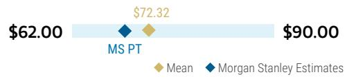
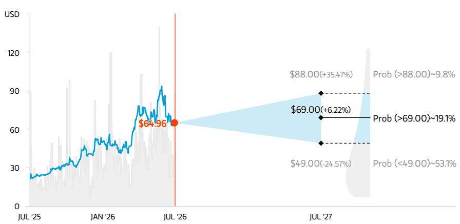
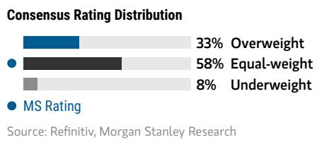

# Weekly: Earnings Week 2 (AMKR, NVTS, NXPI, SWKS, QCOM, ALGM, ON); Thoughts on MRVL/Frozen, MCHP/Hailo

The sector continues to see some adjustments - but the numbers have been good and for the most part we see that continuing this week. We also touch on Google "Frozen" and Microchip's acquisition of Hailo.

Google Frozen could be a Marvell opportunity. Google (covered by Brian Nowak) is reportedly exploring “Frozen v2,” a new chip designed specifically to run Gemini models more efficiently. Unlike a general-purpose TPU, Frozen v2 could hardwire elements of Gemini’s architecture directly into the silicon, improving inference speed and power efficiency. Our checks suggest the chip will use on-chip SRAM, eliminating the need for CoWoS packaging, with limited production beginning in 2027 and a broader ramp in 2028. Per industry checks, we believe Marvell is a likely development partner, although the supplier has not been confirmed. More broadly, Frozen v2 reinforces the emerging trend toward SRAM-based solutions optimized for inference workloads. While volumes are expected to be modest initially, the program could still support Marvell’s custom silicon outlook, particularly given management’s guidance for more than 100% growth in 2027.

Microchip announced a definitive agreement to acquire Hailo on Friday while COO Richard Simoncic has resigned to become CEO of Menlo Microsystems (private). Hailo is a provider of accelerated edge AI processors, advanced vision processing solutions, and robotics processors - with financial terms undisclosed, the deal expected to remain immaterial, and closing targeted by end of September 2026. The deal fits a broader trend of semis positioning at the Physical AI/edge intersection, validated by ON's acquisition of Synaptics, and is consistent with Microchip's long history of acquisitions - having executed roughly 17 deals between 2009 and 2018 alone, including Atmel, Microsemi, and PMC-Sierra. While the strategic rationale is clear, with so many acquisitions over the years it can be difficult to track where value is being created - not necessarily a negative, but a complexity worth acknowledging given the core business remains deeply embedded in product markets where AI-driven revenue uplift is slow to materialize.

AMKR (EW, reporting after the market close on Monday, July 27th): Looking for additional details on the NVIDIA and TSMC deals and the pace of GM% expansion. With the stock up 50% YTD and advanced packaging continuing to see momentum, the focus around the Arizona opportunity has continued to intensify

Joseph Moore
Equity Analyst
Joseph.Moore@morganstanley.com +1 212 761-7516

Nicole Kozhukhov
Research Associate
Nicole.Kozhukhov@morganstanley.com +1 212 761-1636

Ella Tulchinsky
Research Associate
Ella.Tulchinsky@morganstanley.com +1 212 761-2222

Mason Wayne
Research Associate
Mason.Wayne@morganstanley.com +1 212 761-6012

Shane Brett
Equity Analyst
Shane.Brett@morganstanley.com +1 212 761-1022

## SEMICONDUCTORS

North America
Industry View Attractive throughout the quarter. The Analyst Day in May provided greater clarity on the Arizona build-out, though we continue to view estimate revisions as more likely to be driven by later in the year - particularly around the HDFO ramp cadence and the 2H margin bridge. For the print, we're focused on:

1.) Potential for AMKR pricing benefit as OSAT capacity tightens. The broader backend capacity environment is clearly tight: industry utilization overall is running at ~90% (while AMKR is at mid-70's%), ASE has raised advanced packaging quotes by more than 20%, and non-TSMC CoWoS capacity (Amkor + ASE) is expected to reach ~80kwpm by end-2027 with Amkor growing from 20kwpm to 30kwpm (MSe). TSMC confirmed its own advanced packaging capacity is "so tight that it is limited by customers' growth," welcoming third-party OSATs to absorb overflow. The question is how much of this pricing power flows through to Amkor's P&L - mgmt cited pricing, utilization, and mix as the three levers for 2H GM% expansion, but substrate and material constraints (advanced silicon, memory, BT substrate up 20-30%) are creating nonlinear loading that could limit the capture. We want to hear how much of the industry price upcycle is already in guidance vs. still to come.

2.) Whether the Arizona dilution path has changed since the Analyst Day. The key overhang on the stock in our view remains the pace of GM% recovery and is the primary driver of our EW rating. Mgmt guided for 1-2% operating income dilution starting in 2027 as Arizona construction costs flow through OpEx before programs qualify in ~2028, and the 2028 EPS target of $2.50 came in below both our estimate and consensus. The $1.5bn NVIDIA deal and TSMC procurement agreement are strategically important validations of the demand side, though it remains to be seen whether they materially change the dilution math - higher depreciation from front-loaded HDFO equipment and ongoing material supply constraints are real offsets, and we think the earnings power inflection timeline warrants watching closely. We are modestly more conservative than the Street on the pace of the bridge and look to the print for any update to the 2028 framework.

NVTS (UW, reporting after the market close on Monday, July 27th): Expectations are high for an 800V sampling update and additional detail on recent NVTS announcements. As we move through 2H26 and closer to 2027, investors are hyperfocused on evidence of progress in Navitas' 800V roadmap. The company delivered final production samples to customers last quarter and recently announced a licensing deal with Magnachip for GeneSiC Gen 4/5 TAP SiC technology - though we view the Magnachip opportunity as immaterial to the Navitas story near-term, as Magnachip is only just beginning its SiC journey and investors remain squarely focused on the 800V GaN HVDC theme. Legal actions from Renesas and Wolfspeed against Navitas remain an overhang on the stock.

We continue to acknowledge that Navitas 2.0 is moving in the right direction and give credit for the HSD q/q growth mgmt has guided to - but significant proof points remain in question. The stock has pulled back ~70% from its June ATH of $34 - a meaningful reset, but one that still leaves a wide gap between where the stock is and where the fundamentals are, with a sub-$10mn quarterly run rate and a long-duration catalyst path. We continue to see more favorable risk/reward elsewhere for high-power themes such as GaN in other MS-covered names such as Innoscience (Daisy Dai), Renesas (Kazuo Yoshikawa), and Infineon (Lee Simpson), which already have incumbency status.

NXPI (OW, reporting after the market close on Tuesday, July 28th): We expect NXP to report an above-consensus JunQ and SepQ guide as peer read-throughs have been quite strong. In our 2Q26 Distributor Survey, auto expectations were notably mixed relative to Industrial, with respondents recording weaker-than-seasonal expectations increasing from 6% to 15%. That said, after overall strong results from TI and STMicro last week - with auto in particular outperforming (+HSD % q/q for TI and +14% q/q for STMicro) - the setup for NXP's print has become more de-risked. More broadly, TI reported a beat and raise, characterizing this point in time as "the start of a cycle that is very, very broad." STMicro similarly beat its JunQ guide, led by auto and Industrial, book-to-bills close to 2 overall, and distribution inventory now below its standard target. With NXP having guided 2Q26 revenue of $3.45bn (+18% y/y, +8% q/q) and auto at +HSD q/q, the peer data de-risks the JunQ guide and raises the bar for a SepQ raise. What we are focused on for earnings:

1. Lead times and supply tightness: TI confirmed lead times ticked up a couple of weeks in 2Q26 - from below 13 weeks to slightly above - "simply because the demand is growing," with competitors now quoting 52-week lead times. Additionally, CEO Haviv Ilan called out auto dynamics: I think our automotive customers have taken their inventory to very low levels. And now, as there is a little bit more demand, they find themselves in a situation that is not sustainable. I think that also drove part of the demand." Backlog built throughout 2Q26 for both immediate and forward shipment, with short lead time orders a meaningful driver of TI's above-range result. For NXP, which at 1Q26 noted "slight bottlenecks in certain parts of the supply chain" and was already taking selective pricing adjustments, the TI data suggests tightness has intensified further through the quarter - any commentary on lead time extension or escalating customer urgency would be a meaningful positive signal for 2H visibility.

2. Automotive strength driven by China EV/hybrid momentum: TI's automotive inflection was led by China EVs/hybrids, with demand having "developed throughout the quarter" - not visible at the April call and building as the quarter progressed, suggesting the cycle is still early. STMicro confirmed automotive performed "above what we expect and what the market is expecting," guiding the segment to grow ~13-14% y/y for the full year. The read-through for NXP is particularly strong: unlike TI's analog/power-heavy auto exposure, NXP's growth is driven by SDV architecture transitions - S32N, S32K5, imaging radar, 10-gigabit Ethernet - which are content-per-vehicle stories independent of SAAR. NXP's accelerated growth drivers were already north of 45% of auto revenue in 1Q26 and growing double digits, positioning it to capture the tailwinds seen by TI and STMicro.

SWKS (EW, reporting after the market close on Tuesday, July 28th): Skyworks has continued to execute well despite a challenging smartphone environment, and we see a relatively balanced setup heading into the June-quarter print. We model mobile revenue declining ~4% q/q, consistent with management's outlook for an LSD decline, with Broad Markets remaining relatively stable. Apple demand appears to be the most resilient part of the smartphone market, and our hardware team does not anticipate any meaningful changes in iPhone builds in the C2H (Apple covered by Erik Woodring). Given Skyworks' concentration in premium smartphones, we believe the company should hold up better than suppliers with greater exposure to lower-end devices, although rising memory costs and the resulting pressure on handset pricing and demand remain an industry-wide headwind to watch. Blended RF content at Apple should remain roughly flat near term.

Looking to September, we model total revenue increasing 10% q/q, including mobile growth of 16%. Mobile growth is slightly below seasonal, which is typically ~20% q/q, but we are remaining conservative given memory-related cost inflation that is a significant risk, and September iPhone builds that are tracking below seasonal, which may be partly due to Apple's staggered launch. We continue to view the Qorvo acquisition positively, with management targeting an early-2027 close or possibly late 2026.

QCOM (EW, reporting after the market close on Wednesday, July 29th): We moved off Underweight after Qualcomm's data center investor day, as the $5bn FY27 target made the diversification story far more tangible. Handsets remain under pressure from Android weakness, memory inflation and Apple modem share loss, but the debate has shifted to whether data center can scale fast enough to offset those headwinds. We expect challenging handset fundamentals for the next few quarters.

Double-digit chipset pricing could cushion the Android downturn. We model June handset revenue of $4.9bn, in line with guidance, with management calling June the bottom for China Android. Bloomberg reported that Qualcomm is raising chipset prices by double digits to offset higher costs, which should support margins, though the benefit will take time and could further pressure demand. We model flattish Android revenue in September and see limited recovery thereafter, with some weakness broadening beyond the low end. Qualcomm should outperform given its premium mix, but we remain below consensus for September at $9.5bn of revenue (1.5% q/q and -15.5% y/y), including $4.6bn of handset revenue (-7% q/q and -33% y/y). Apple share loss also becomes more material, with Qualcomm's share of iPhone units falling from roughly 70% in September to 40% in December, though this is well understood. We updated our model to reflect our hardware team's latest Apple assumptions and our revised expectations for Qualcomm's share, with no material change to our full-year estimates.

Diversification is gaining traction, with automotive as the foundation and data center the key swing factor, with possible Trainium participation. Automotive should remain a bright spot, with Qualcomm on track to exit FY26 at approximately a $6bn revenue run rate according to the latest guidance. In data center, the $5bn FY27 target appears largely driven by custom silicon, including at least two $1bn-plus programs, with little contribution from Qualcomm's own CPU or merchant accelerator products. Alphawave's existing wins should be a meaningful part of the ramp. Qualcomm also continues to develop a custom AI XPU for ByteDance that uses LPDDR rather than HBM, with shipments expected next year. We have also heard Qualcomm could receive a portion of the Trainium opportunity alongside Marvell and Alchip, potentially supported by its access to 3nm wafers. Qualcomm remains our least-preferred AI exposure and the longer-term roadmap is still a show-me story, but $5bn in FY27 would materially help fill the handset hole and validate the diversification strategy.

ALGM (OW; reports before market open Thursday, July 30th): Strong quarter with continued secular momentum expected, though expectations for auto strength are elevated. We expect Allegro to come in at the high end of its JunQ revenue range with a strong SepQ guide. Following last quarter which was squarely in-line amidst exceptionally high expectations, Allegro is expected to report near the high-end of guidance this quarter as peers TI and STMicro have noted a clear and durable acceleration in automotive demand and overall cyclical dynamics continue to improve.

Since last earnings, the stock has seen significant volatility concentrated in late June/early July which we believe was driven by excitement in Physical AI following ON's acquisition of Synaptics. While Allegro has clarified that material revenue from humanoid robotics is a 2030 opportunity, the company has continued to highlight customer engagement and design win activity. Peer TI flagged that Physical AI was one of the strongest areas within Industrial outside of A&D and energy, and greater detail may provide upside to the stock. For earnings, we are focused on the following:

1) Auto e-Mobility momentum. Auto was flat sequentially in MarQ due largely to seasonal CNY impacts. For JunQ, MSe is +2.1% q/q (+16.0% y/y) to $167mn, with further acceleration in SepQ to $174mn (+4.0% q/q, +11.7% y/y). Lean OEM inventories and continued PHEV/BEV content gains support the recovery. TI reported auto up mid-teens y/y and upper-single digits q/q in JunQ, characterizing demand as "everywhere" and noting "a cycle that is very, very broad," led by China EVs/hybrids and unsustainably low customer inventory levels. STM reported auto up 16% y/y and 14% q/q in Q2, with design momentum building across OEM and Tier 1 ecosystems in onboard chargers, powertrain and ADAS.

2) Data Center momentum and progress on the current sensor ramp. Data center reached ~14% of MarQ revenue (up from ~10% in DecQ), and mgmt guided it to reach 16-17% of revenue in JunQ - a new record, implying 20-25% sequential growth. The fastest-growing component is now current sensors, which represented 18% of data center shipments in MarQ (up from zero at the start of FY26), driven by content gains replacing resistors in power racks. Data center and broader Industrial momentum remains according to peers. Critically, current sensors are one of Allegro's higher-margin products - previously data center was margin dilutive driven by motor drivers, but as current sensor mix increases, data center GM is approaching fleet average and is expected to exceed it in the back half of FY27.

ON (++, reporting after the market close on Monday, August 3rd): Expectations have moderated following the stock's sell-off along with power semi peers. While the company reiterated 2Q guidance, we still see potential for a beat and raise as the setup is more favorable than it appears given +ve peer read-throughs. For the print, we are focused on:

1.) Power market recovery: STMicro's 2Q26 earnings call this week highlighted that SiC revenue grew low-teens year-over-year and mid-30s% quarter-over-quarter in 2Q, supported by a book-to-bill well above 1 and a growing backlog - with mgmt confirming SiC revenues will grow double-digit in 2026 versus 2025 based on existing design wins and backlog. STM also noted confidence in a strong 2026, citing "on top of ADAS, SiC, sensor, general-purpose micro, clearly, AI infrastructure and low-earth-orbit satellite will be a very strong contributor to the performance of ST in 2026," along with improving demand in SiC-based power solutions for data center and continued traction in auto design wins. We do believe the broader power market environment has improved, which could have positive netting effects for 2H if replenishment remains muted or does not materialize as expected.

2.) GM% expansion: As of 4Q25, ON had ~700bps of GM% headwinds as a result of underutilization charges (driven by topline). The company gave guidance toward an uptick in utilization in 1Q - which came in at 77%, up from 68% - and an expected trend toward the mid-70s% for the year with progression weighted toward 2H, with utilization guided flat to up slightly in 2Q. With ON already having announced $200-$300mn of impairment charges to be recognized through 1H of this year, an associated $45-$50mn depreciation benefit in 2026 hitting the P&L in 2H as inventory bleeds through, pricing actions now offsetting input cost headwinds in 2H, and the July 7 announcement of two fab divestitures expected to generate ~$35mn in annual cost savings starting in 2027, we do see upside toward the year's GM% with the potential for a 4-handle (vs. MSe and Street at 39.6%), which we would see as a surprise relative to buyside expectations.

<table><tr><td>Focus KPI</td><td>Focus KPI Surprise</td><td>Likely impact to consensus EPS*</td></tr><tr><td colspan="3">Skyworks Solutions Inc SWKS.O</td></tr><tr><td>Mobile Revenue</td><td>- In-line</td><td>- Largely unchanged</td></tr><tr><td colspan="3">• Skyworks has continued to execute well despite a challenging smartphone environment, and we see a relatively balanced setup heading into the June-quarter print.</td></tr><tr><td colspan="3">Qualcomm Inc. QCOM.O</td></tr><tr><td>September Revenue</td><td>↓ Likely downside surprise</td><td>- Largely unchanged</td></tr><tr><td colspan="3">• Handset fundamentals remain challenged, but the $5bn FY27 data center targe could materially accelerate Qualcomm&#x27;s diversification.</td></tr><tr><td colspan="3">Amkor Technology Inc AMKR.O</td></tr><tr><td>SepQ GM%</td><td>- In-line</td><td>- Largely unchanged</td></tr><tr><td colspan="3">Allegro Microsystems Inc ALGM.O</td></tr><tr><td>JunQ &amp; SepQ Auto &amp; Data Center Revenue</td><td>↑ Likely upside surprise</td><td>↑ Modest revision higher</td></tr><tr><td colspan="3">ON Semiconductor Corp. ON.O</td></tr><tr><td>SepQ GM% &amp; Data Center Revenue</td><td>↑ Likely upside surprise</td><td>↑ Modest revision higher</td></tr><tr><td colspan="3">Navitas Semiconductor Corp NVTS.O</td></tr><tr><td>SepQ High-Power Revenue</td><td>- In-line</td><td>- Largely unchanged</td></tr><tr><td colspan="3">NXP Semiconductor NV NXPI.O</td></tr><tr><td>JunQ &amp; SepQ Auto Revenue</td><td>↑ Likely upside surprise</td><td>↑ Modest revision higher</td></tr></table>

AlphaSignals Earnings Preview

\*Likely impact to consensus EPS is for the next 12 months

Source: Company data, MS

## AMKR Earnings Preview

The company is scheduled to report after the market close on Monday, July 27th.

Looking for additional details on the NVIDIA and TSMC deals and the pace of GM% expansion. With the stock up 50% YTD and advanced packaging continuing to see momentum, the focus around the Arizona opportunity has continued to intensify throughout the quarter. The Analyst Day in May provided greater clarity on the Arizona build-out, though we continue to view estimate revisions as more likely to be driven by later in the year - particularly around the HDFO ramp cadence and the 2H margin bridge. For the print, we're focused on:

1.) Potential for AMKR pricing benefit as OSAT capacity tightens. The broader backend capacity environment is clearly tight: industry utilization overall is running at ~90% (while AMKR is at mid-70's%), ASE has raised advanced packaging quotes by more than 20%, and non-TSMC CoWoS capacity (Amkor + ASE) is expected to reach ~80kwpm by end-2027 with Amkor growing from 20kwpm to 30kwpm (MSe). TSMC confirmed its own advanced packaging capacity is "so tight that it is limited by customers' growth," welcoming third-party OSATs to absorb overflow. The question is how much of this pricing power flows through to Amkor's P&L - mgmt cited pricing, utilization, and mix as the three levers for 2H GM% expansion, but substrate and material constraints (advanced silicon, memory, BT substrate up 20-30%) are creating nonlinear loading that could limit the capture. We want to hear how much of the industry price upcycle is already in guidance vs. still to come.

2.) Whether the Arizona dilution path has changed since the Analyst Day. The key overhang on the stock in our view remains the pace of GM% recovery and is the primary driver of our EW rating. Mgmt guided for 1-2% operating income dilution starting in 2027 as Arizona construction costs flow through OpEx before programs qualify in ~2028, and the 2028 EPS target of $2.50 came in below both our estimate and consensus. The $1.5bn NVIDIA deal and TSMC procurement agreement are strategically important validations of the demand side, though it remains to be seen whether they materially change the dilution math - higher depreciation from front-loaded HDFO equipment and ongoing material supply constraints are real offsets, and we think the earnings power inflection timeline warrants watching closely. We are modestly more conservative than the Street on the pace of the bridge and look to the print for any update to the 2028 framework.

Details on the June quarter: We model revenue of $1,810mn (up 7.4% q/q and up 19.8% y/y), in-line with the street at $1,811 mn. We model gross margin/EPS of 15.1%/$0.46, in-line with the street at 15.2%/$0.47.

September quarter outlook: We model revenue of $2,026 mn (up 11.9% q/q and 2% y/y), below street at $2,098mn. We model gross margin/EPS of 16.3%/$0.59, below the street at 17.4%/$0.63.

Exhibit 1: AMKR: MS vs. Cons  
MS vs. Consensus

<table><tr><td colspan="9">Figures in $ MMs</td></tr><tr><td rowspan="2"></td><td colspan="2">F2Q26E</td><td colspan="2">F3Q26E</td><td colspan="2">FY2026E</td><td colspan="2">FY2027E</td></tr><tr><td>MS</td><td>Cons.</td><td>MS</td><td>Cons.</td><td>MS</td><td>Cons.</td><td>MS</td><td>Cons.</td></tr><tr><td>Revenues</td><td>1,810</td><td>1,811</td><td>2,026</td><td>2,098</td><td>7,570</td><td>7,644</td><td>8,436</td><td>8,503</td></tr><tr><td>Q/Q Change</td><td>7.4%</td><td>7.5%</td><td>11.9%</td><td>15.9%</td><td></td><td></td><td></td><td></td></tr><tr><td>GMs</td><td>15.1%</td><td>15.2%</td><td>16.3%</td><td>17.4%</td><td>15.9%</td><td>16.0%</td><td>18.0%</td><td>17.1%</td></tr><tr><td>EPS</td><td>$0.46</td><td>$0.47</td><td>$0.59</td><td>$0.63</td><td>$2.07</td><td>$2.11</td><td>$2.29</td><td>$2.42</td></tr></table>

Source: FactSet, MS estimates

## Risk Reward – Amkor Technology Inc (AMKR.O)

OSAT industry inflection point, but elevated valuation keeps us EW

## PRICE TARGET $69.00

We value Amkor at 30x non-GAAP P/E on our 2027 EPS estimate of $2.30, a 30% premium to peers ASE and KYEC.

Consensus Price Target Distribution

Source: Refinitiv, MS

## RISK REWARD CHART AND OPTIONS IMPLIED PROBABILITIES (12M)

  
Key: — Historical Stock Performance ● Current Stock Price ◆ Price Target

Source: Refinitiv, MS, MS Institutional Equities Division. The probabilities of our Bull, Base, and Bear case scenarios playing out were estimated with implied volatility data from the options market as of 24 Jul 2026. All figures are approximate risk-neutral probabilities of the stock reaching beyond the scenario price in either three-months' or one-years' time. View explanation of Options Probabilities methodology here

## EQUAL-WEIGHT THESIS

\- The OSAT industry is at a transformational moment with AI and advanced packaging poised to drive demand.
- We see multiple expansion from the Arizona facility and 2.5D capacity as an attractive opportunity but in the near-term earnings will have to drive the stock.

## Risk Reward Themes

New Data Era: Positive  
Pricing Power: Negative  
Technology Diffusion: Positive  
View descriptions of Risk Rewards Themes here

## BULL CASE

## $88.00 BASE CASE

## 33x 2027e non-GAAP EPS of $2.66

Assume a better than expected semiconductor market recovery as well as market share gain led by advanced packaging, thus meriting a higher multiple.

-Revenue growth of 19.2% in 2026

## 30x 2027e non-GAAP EPS of $2.30

Assume a moderate semiconductor market recovery, with multiple based on early-cycle valuation.

-Revenue growth of 11.4% in 2027

-GM improves to 18.3% in 2026

## $69.00 BEAR CASE

-GM improves to 18.0 in 2027

$49.00

## 26x 2027e non-GAAP EPS of $1.87

Assume a weaker than expected semiconductor market recovery, with lower utilization, thus meriting a lower multiple.

-Flat revenue growth in 2027

-GM improves to 17.7% in 2027

## Risk Reward – Amkor Technology Inc (AMKR.O)

## KEY EARNINGS INPUTS

<table><tr><td>Drivers</td><td>Dec 2025</td><td>Dec 2026e</td><td>Dec 2027e</td><td>Dec 2028e</td></tr><tr><td>Revenue ($, mm)</td><td>6,708.0</td><td>7,569.6</td><td>8,435.8</td><td>9,158.6</td></tr><tr><td>Gross Margin (%)</td><td>14.0</td><td>15.9</td><td>18.0</td><td>17.5</td></tr><tr><td>EPS ($)</td><td>1.51</td><td>2.07</td><td>2.30</td><td>2.97</td></tr></table>

## INVESTMENT DRIVERS

\- Top-line growth driven by high-end smartphones, communications, and

\- Gross margin expansion as the company benefits from a semiconductor market recovery (higher utilization) as well growth in advanced packaging (higher pricing).

## GLOBAL REVENUE EXPOSURE

<table><tr><td rowspan="3"></td><td colspan="5">APAC, ex Japan, Mainland China and India</td></tr><tr><td>0-10%</td><td colspan="2">Mainland China</td><td colspan="2">Europe ex UK</td></tr><tr><td>10-20%</td><td colspan="2">Japan</td><td>50-60%</td><td>North America</td></tr></table>

Source: MS Estimate View explanation of regional hierarchies here

## MS ALPHA MODELS

<table><tr><td>3/5BEST</td><td>24 MonthHorizon</td><td>3/5MOST</td><td>3 MonthHorizon</td></tr></table>

Source: Refinitiv, FactSet, MS; 1 is the highest favored Quintile and 5 is the least favored Quintile

## RISKS TO PT/RATING

## RISKS TO UPSIDE

\- Better than expected semiconductor market recovery.

\- Company wins 2.5D/3D advanced packaging market share.

\- Better than expected high-end smartphone market growth.

## RISKS TO DOWNSIDE

\- Weaker than expected semiconductor market recovery.

\- Company loses share at key customers.

\- High-end smartphone market recovery slower than expected.

## OWNERSHIP POSITIONING

<table><tr><td>Inst. Owners, % Active</td><td>40.2%</td><td></td><td></td></tr><tr><td>HF Sector Long/Short Ratio</td><td>2.1x</td><td></td><td></td></tr><tr><td>HF Sector Net Exposure</td><td>29.5%</td><td></td><td></td></tr></table>

Refinitiv; MSPB Content. Includes certain hedge fund exposures held with MSPB. Information may be inconsistent with or may not reflect broader market trends. Long/Short Ratio = Long Exposure / Short exposure. Sector % of Total Net Exposure = (For a particular sector: Long Exposure - Short Exposure) / (Across all sectors: Long Exposure – Short Exposure).

MS ESTIMATES VS. CONSENSUS

<table><tr><td colspan="4">FY Dec 2026e</td></tr><tr><td rowspan="2">Sales / Revenue($, mm)</td><td rowspan="2">7,473</td><td>7,570</td><td rowspan="2">7,827</td></tr><tr><td>7,595</td></tr><tr><td rowspan="2">Net income($, mm)</td><td rowspan="2">437</td><td>516</td><td rowspan="2">548</td></tr><tr><td>510</td></tr><tr><td rowspan="2">EPS($)</td><td rowspan="2">1.74</td><td>2.07</td><td rowspan="2">2.20</td></tr><tr><td>2.05</td></tr></table>

Mean MS Estimates Source: Refinitiv, MS

MS vs. Consensus

## Navitas Earnings Preview

The company is scheduled to report after the market close on Monday, July 27th.

Expectations are high for an 800V sampling update and additional detail on recent NVTS announcements. As we move through 2H26 and closer to 2027, investors are hyperfocused on evidence of progress in Navitas' 800V roadmap. The company delivered final production samples to customers last quarter and recently announced a licensing deal with Magnachip for GeneSiC Gen 4/5 TAP SiC technology - though we view the Magnachip opportunity as immaterial to the Navitas story near-term, as Magnachip is only just beginning its SiC journey and investors remain squarely focused on the 800V GaN HVDC theme. Legal actions from Renesas and Wolfspeed against Navitas remain an overhang on the stock.

We continue to acknowledge that Navitas 2.0 is moving in the right direction and give credit for the HSD q/q growth mgmt has guided to - but significant proof points remain in question. The stock has pulled back ~70% from its June ATH of $34 - a meaningful reset, but one that still leaves a wide gap between where the stock is and where the fundamentals are, with a sub-$10mn quarterly run rate and a long-duration catalyst path. We continue to see more favorable risk/reward elsewhere for high-power themes such as GaN in other MS-covered names such as Innoscience (Daisy Dai), Renesas (Kazuo Yoshikawa), and Infineon (Lee Simpson), which already have incumbency status.

Details on the June quarter: We model revenue of $10.0mn, up 16.3% q/q, in-line with the Street at $10.0mn. Our gross margin/EPS estimate of 40.7%/ $$0.04$ is also in-line with the Street at 38.8%/ $$0.04$ .

September quarter outlook: We model revenue of $11.4mn, up 14.5% q/q, slightly above the Street at $11.1mn. Our gross margin/EPS estimate of 41.0%/ $$0.04$ is broadly in-line with the Street at 39.2%/ $$0.04$ .

Exhibit 2: NVTS: MS vs. Cons

<table><tr><td colspan="9">Figures in $MMs</td></tr><tr><td rowspan="2"></td><td colspan="2">F2Q26E</td><td colspan="2">F3Q26E</td><td colspan="2">2026E</td><td colspan="2">2027E</td></tr><tr><td>MS</td><td>Cons.</td><td>MS</td><td>Cons.</td><td>MS</td><td>Cons.</td><td>MS</td><td>Cons.</td></tr><tr><td>Revenues</td><td>10.0</td><td>10.0</td><td>11.4</td><td>11.1</td><td>43.2</td><td>42.4</td><td>66.0</td><td>72.9</td></tr><tr><td>Q/Q Change</td><td>16.3%</td><td>16.0%</td><td>14.5%</td><td>10.9%</td><td></td><td></td><td></td><td></td></tr><tr><td>Non-GAAP GMs</td><td>40.7%</td><td>38.8%</td><td>41.0%</td><td>39
