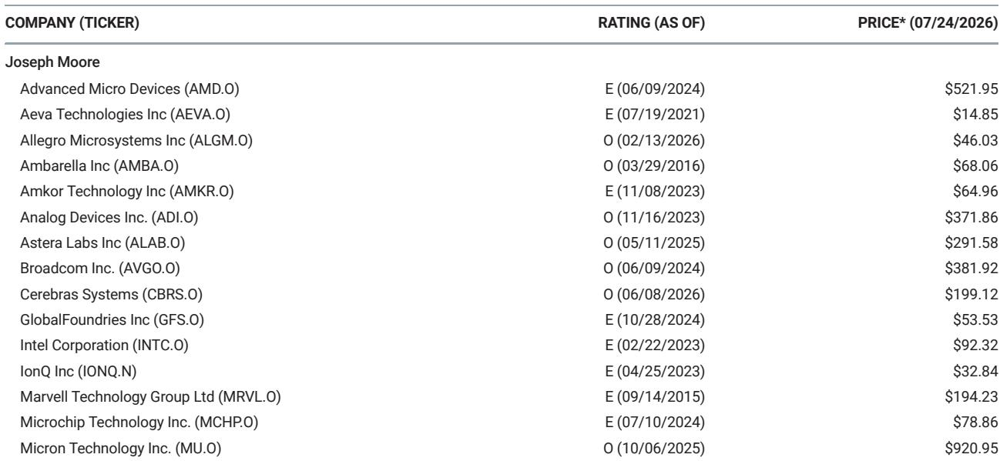
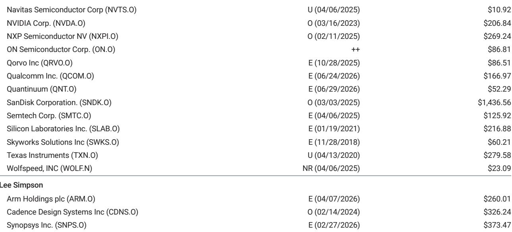
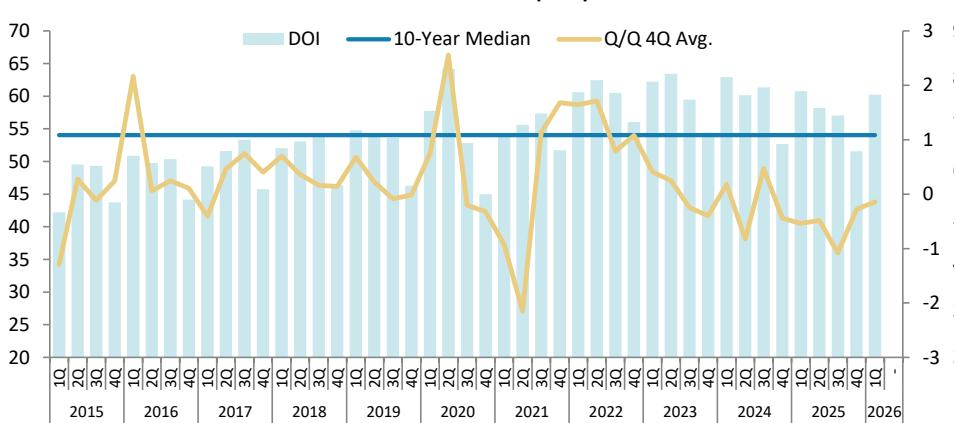

# MS：半导体行业数据与主题变化观察

半导体行业正在进入一个需求信号密集的财报窗口。MS在最新周报中覆盖了Amkor、Navitas、NXP、Skyworks、Qualcomm、Allegro和ON Semiconductor等多家公司，核心判断是：汽车半导体需求正在经历一轮由库存过低和终端需求共同推动的加速，而数据中心对功率半导体的拉动正在从概念走向可量化的收入贡献。这份报告的价值在于，它用大量来自TI和STMicro的近期数据，为这一判断提供了可交叉验证的证据。

报告特别指出，TI在2Q26财报中确认，汽车业务增长由中国的电动车和混动车驱动，且需求“在整个季度中逐步累积”，在4月会议时尚不可见。STMicro的汽车业务在2Q26同比增长约13-14%，其SiC收入环比增长超过30%，且book-to-bill远高于1。这些数据点共同指向一个结论：汽车半导体的复苏并非一次性补库，而是有持续性的周期启动。

## 1. 汽车半导体：库存过低叠加中国电动车需求，形成双驱动

报告认为，NXP是这一轮汽车半导体复苏中最具结构性优势的公司之一。与TI的模拟和功率器件不同，NXP的增长由软件定义汽车架构转型驱动，包括S32N、S32K5、成像雷达和10Gb以太网等产品。这些是单车价值量提升的故事，与全球汽车销量无关。1Q26时，这些加速增长驱动已占NXP汽车收入的45%以上，且保持双位数增长。

TI管理层在财报中明确表示，汽车客户已将库存降至“不可持续的低水平”，而一旦需求稍有回升，客户便发现自己处于“不可持续的状况”。STMicro也确认，汽车业务表现“高于我们和市场预期”，并预计全年该板块将同比增长约13-14%。对于NXP而言，这些同行数据大幅降低了其2Q26财报的不确定性，并提高了市场对3Q26指引上调的预期。

> **KC评论：** 汽车半导体的需求信号正在从“可能复苏”转向“确认加速”。但读者需要注意，不同公司的受益程度差异很大。NXP受益于架构升级，而更依赖传统功率器件的公司可能面临更慢的增长节奏。

## 2. 数据中心功率半导体：从概念到收入，电流传感器成为关键变量

Allegro是报告中最值得关注的数据中心受益者之一。其数据中心收入占比已从12月季度的约10%升至3月季度的约14%，管理层预计6月季度将达到16-17%，创下新高。增长最快的品类是电流传感器，其在数据中心出货中的占比从本财年初的零升至3月季度的18%，驱动因素是内容升级——电流传感器正在取代电源机架中的电阻器。

报告强调，电流传感器是Allegro利润率较高的产品线。此前数据中心业务因电机驱动器的低利润率而影响整体毛利率，但随着电流传感器占比提升，数据中心毛利率正接近公司平均水平，预计在2027年下半年将超过平均水平。这一变化意味着，数据中心对Allegro的贡献正在从“收入增长”转向“利润增长”。

ON Semiconductor同样受益于功率市场的复苏。STMicro在2Q26财报中确认，SiC收入同比增长低双位数、环比增长约35%，且book-to-bill远高于1。ON自身也在推进产能利用率提升和成本削减，包括两座晶圆厂的出售，预计从2027年起每年节省约3500万美元。报告认为，ON的毛利率有望在2026年下半年出现意外上行。

## 3. 定制芯片与边缘AI：Google Frozen v2和Microchip收购Hailo揭示新趋势

报告披露了两个值得关注的行业动向。Google正在探索名为“Frozen v2”的新芯片，专为运行Gemini模型而设计，与通用TPU不同，Frozen v2将Gemini的架构元素直接固化在硅片上，以提高推理速度和能效。行业调研显示，该芯片将使用片上SRAM，无需CoWoS封装，2027年开始小规模生产，2028年扩大规模。报告认为Marvell是可能的开发合作伙伴，尽管供应商尚未确认。这一趋势强化了SRAM方案在推理工作负载中的崛起。

Microchip则宣布收购边缘AI处理器公司Hailo，交易预计在2026年9月底完成。报告认为，这一交易符合半导体公司向物理AI与边缘计算交叉点布局的趋势，与ON收购Synaptics的逻辑一致。但报告也提醒，Microchip历史上已完成约17笔收购，价值创造路径并不总是清晰，且其核心业务仍深度嵌入产品市场，AI驱动的收入增长需要时间才能显现。

> **KC评论：** 定制芯片和边缘AI收购正在成为半导体行业的两条主线。Google Frozen v2如果确认由Marvell开发，将是对其定制芯片能力的重要背书。而Microchip收购Hailo，则反映出传统嵌入式芯片公司正在为物理AI时代做准备，但短期财务影响有限。

## 4. 手机芯片：Qualcomm面临结构性不确定性，但数据中心故事开始落地

Qualcomm是报告覆盖中手机业务不确定性最大的公司。报告预计6月季度手机收入为49亿美元，符合指引，但管理层已确认6月季度是中国Android的底部。Bloomberg报道Qualcomm正在将芯片组价格提高双位数以抵消成本上升，这虽然支持利润率，但可能进一步压制需求。Apple调制解调器份额流失也在加速，Qualcomm在iPhone中的份额将从9月季度的约70%降至12月季度的40%。

但报告也指出，Qualcomm的多元化战略正在获得 traction。汽车业务有望在2026财年末达到约60亿美元的年化收入。数据中心方面，2027财年50亿美元的目标主要由定制芯片驱动，包括至少两个超过10亿美元的项目。报告还提到，Qualcomm可能获得Trainium项目的一部分份额，与Marvell和Alchip共同参与，其3nm晶圆获取能力是潜在优势。

Skyworks的情况相对平衡。尽管智能手机环境充满挑战，但Apple需求仍是市场中最具韧性的部分。报告预计其9月季度移动业务环比增长16%，略低于季节性的20%，主要考虑到内存成本上升对手机定价和需求的不确定性。Qorvo收购预计在2027年初或2026年底完成，管理层对此持积极态度。

For informational purposes only. Portions may be generated,translated,summarized,or edited with AI assistance based on source materials and may contain omissions or errors. Please verify independently. This is not investment,legal,tax,accounting,or other professional advice.

For informational purposes only. Portions may be generated,translated,summarized,or edited with AI assistance based on source materials and may contain omissions or errors. Please verify independently. This is not investment,legal,tax,accounting,or other professional advice.

