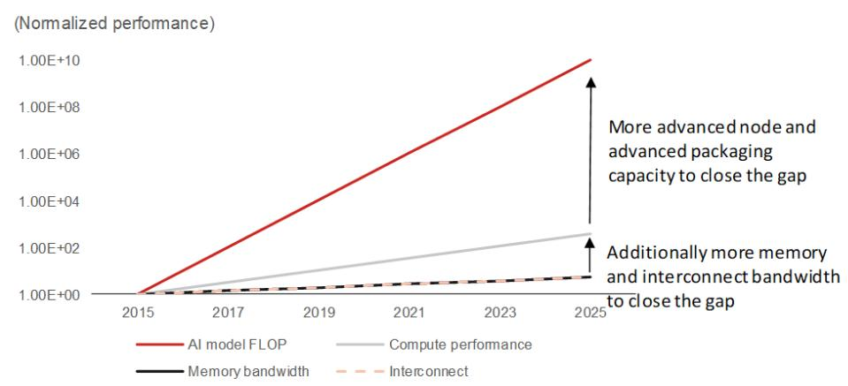

27 July 2026

EQUITY: TECHNOLOGY

## The DRAM in the Chinese crown; initiate at Buy CXMT should continue to gain market share as global supply of memory could remain tight

## Initiate coverage at Buy with and a TP of CNY116

We initiate coverage of CXMT – China's largest DRAM maker – at Buy with a TP of CNY116. We expect CXMT's market share gain to accelerate considering that the global supply of memory is unlikely to ease in the coming years. Supported by capacity expansion, node migration, and ASP hikes, we forecast CXMT to post 63%/74% sales/net profit to parent CAGRs in 2026-28F. Our TP of CNY116 is based on 20x 2028F EPS of CNY5.8. We assign a 20x target P/E multiple as we expect CXMT to trade at 2x the valuation of its major US competitor, Micron ([MU US, Not rated]; which has traded at ~10x over the past five years), owing to market share gains and the higher valuation multiples in China's market. Downside risks include: 1) changes in end demand; 2) intensifying competition from domestic peers such as YMTC (unlisted); 3) insufficient supply of IC and components (e.g., CPUs); and 4) escalation of geopolitical tensions between the US and China.

## Demand could continue to outpace supply in the foreseeable future; CXMT appears well-positioned to gain market share

We estimate that strong demand for agentic AI will drive a more than sevenfold increase in global memory usage (with 60%+ bit CAGR) over 2026-30F, even after accounting for potential adoption of memory-efficiency technologies (discounting memory usage by 4x). However, expansion of semiconductor capacity faces multiple bottlenecks (e.g., clean rooms, equipment, materials, and talents). Memory makers are expanding capacity at a 30-40% bit CAGR over 2026-30F, but that could still be insufficient. We forecast CXMT to record bit expansion at a 40-45% CAGR over 2026-30F and its global DRAM market share to increase from ~10% currently to ~18% by end-2028F.

## Impact from the MATCH Act (or potential US sanctions) is worth monitoring

The MATCH Act is a US export legislation designed to restrict China's access to advanced chip-making technologies by coordinating with allies to curb exports of crucial equipment and materials and preventing foreign firms from servicing machines already in China. Although CXMT may still have access to sufficient DUV domestically without using EUV to develop its upcoming 12-16nm nodes, whether it can get key foreign-made equipment (localization rate now is around $40\%$ , according to our estimates) and materials (such as photoresist) is worth monitoring, in our view. In the worst case, we assume CXMT's capacity expansion in Shanghai (potentially $30 - 40\%$ of its total capacity by 2028F) could be pushed out.

<table><tr><td>Year-end 31 Dec</td><td colspan="2">FY25</td><td colspan="2">FY26F</td><td colspan="2">FY27F</td><td colspan="2">FY28F</td></tr><tr><td>Currency (CNY)</td><td>Actual</td><td>Old</td><td>New</td><td>Old</td><td>New</td><td>Old</td><td>New</td><td></td></tr><tr><td>Revenue (mn)</td><td>61,799</td><td>0</td><td>290,666</td><td>0</td><td>560,788</td><td>0</td><td>773,323</td><td></td></tr><tr><td>Reported net profit (mn)</td><td>1,875</td><td>0</td><td>130,315</td><td>0</td><td>277,248</td><td>0</td><td>393,070</td><td></td></tr><tr><td>Normalised net profit (mn)</td><td>1,875</td><td>0</td><td>130,315</td><td>0</td><td>277,248</td><td>0</td><td>393,070</td><td></td></tr><tr><td>FD normalised EPS</td><td>3.11c</td><td></td><td>2.05</td><td></td><td>4.08</td><td></td><td>5.79</td><td></td></tr><tr><td>FD norm. EPS growth (%)</td><td>-</td><td></td><td>6,488.6</td><td></td><td>99.0</td><td></td><td>41.8</td><td></td></tr><tr><td>FD normalised P/E (x)</td><td>278.0</td><td>-</td><td>4.2</td><td>-</td><td>2.1</td><td>-</td><td>1.5</td><td></td></tr><tr><td>EV/EBITDA (x)</td><td>5.6</td><td>-</td><td>0.2</td><td>-</td><td>-0.5</td><td>-</td><td>-0.9</td><td></td></tr><tr><td>Price/book (x)</td><td>9.2</td><td>-</td><td>2.3</td><td>-</td><td>1.1</td><td>-</td><td>0.6</td><td></td></tr><tr><td>Dividend yield (%)</td><td>-</td><td>-</td><td>-</td><td>-</td><td>-</td><td>-</td><td>-</td><td></td></tr><tr><td>ROE (%)</td><td>3.8</td><td></td><td>84.0</td><td></td><td>70.7</td><td></td><td>54.0</td><td></td></tr><tr><td>Net debt/equity (%)</td><td>169.8</td><td></td><td>net cash</td><td></td><td>net cash</td><td></td><td>net cash</td><td></td></tr></table>

Source: Company data, NOM estimates

<table><tr><td>RatingStarts at</td><td>Buy</td></tr><tr><td>Target priceStarts at</td><td>CNY 116.00</td></tr><tr><td>IPO price27 July 2026</td><td>CNY 8.66</td></tr><tr><td>Implied upside</td><td>+1,239.5%</td></tr></table>

Market Cap (USD mn)

## Research Analysts

Donnie Teng - NIHK
donnie.teng@NOM.com
+852 2252 1439

Frank Fan - NIHK
frank.fan@NOM.com
+852 2252 2195

## Asia Technology

CW Chung - NIHK
cwchung@NOM.com
+852 2252 6075

## Key data on ChangXin Memory Technologies

<table><tr><td>Performance(%)</td><td>1M</td><td>3M</td><td>12M</td><td></td><td></td></tr><tr><td>Absolute (CNY)</td><td></td><td></td><td></td><td>M cap (USDmn)</td><td></td></tr><tr><td>Absolute (USD)</td><td></td><td></td><td></td><td>Free float (%)</td><td>2.8</td></tr><tr><td>Rel to CSI 300</td><td></td><td></td><td></td><td>3-mth ADT (USDmn)</td><td></td></tr></table>

<table><tr><td>Year-end 31 Dec</td><td>FY24</td><td>FY25</td><td>FY26F</td><td>FY27F</td><td>FY28F</td></tr><tr><td>Revenue</td><td>24,178</td><td>61,799</td><td>290,666</td><td>560,788</td><td>773,323</td></tr><tr><td>Cost of goods sold</td><td>-22,830</td><td>-36,465</td><td>-47,451</td><td>-60,675</td><td>-73,560</td></tr><tr><td>Gross profit</td><td>1,349</td><td>25,334</td><td>243,215</td><td>500,113</td><td>699,764</td></tr><tr><td>SG&amp;A</td><td>-2,765</td><td>-7,319</td><td>-23,544</td><td>-42,620</td><td>-54,906</td></tr><tr><td>Employee share expense</td><td>-4,607</td><td>-9,593</td><td>-39,240</td><td>-72,902</td><td>-96,665</td></tr><tr><td>Operating profit</td><td>-6,024</td><td>8,422</td><td>180,431</td><td>384,591</td><td>548,192</td></tr><tr><td>EBITDA</td><td>9,780</td><td>34,778</td><td>214,438</td><td>427,598</td><td>600,199</td></tr><tr><td>Depreciation</td><td>-14,456</td><td>-24,680</td><td>-32,207</td><td>-41,107</td><td>-50,007</td></tr><tr><td>Amortisation</td><td>-1,347</td><td>-1,675</td><td>-1,800</td><td>-1,900</td><td>-2,000</td></tr><tr><td>EBIT</td><td>-6,024</td><td>8,422</td><td>180,431</td><td>384,591</td><td>548,192</td></tr><tr><td>Net interest expense</td><td>-2,204</td><td>-2,954</td><td>-2,800</td><td>-2,600</td><td>-2,400</td></tr><tr><td colspan="6">Associates &amp; JCEs</td></tr><tr><td>Other income</td><td>-821</td><td>2,233</td><td>9,603</td><td>16,354</td><td>18,963</td></tr><tr><td>Earnings before tax</td><td>-9,049</td><td>7,701</td><td>187,234</td><td>398,344</td><td>564,755</td></tr><tr><td>Income tax</td><td>-2</td><td>-557</td><td>-13,481</td><td>-28,681</td><td>-40,662</td></tr><tr><td>Net profit after tax</td><td>-9,051</td><td>7,144</td><td>173,753</td><td>369,664</td><td>524,093</td></tr><tr><td>Minority interests</td><td>1,906</td><td>-5,269</td><td>-43,438</td><td>-92,416</td><td>-131,023</td></tr><tr><td colspan="6">Other items</td></tr><tr><td colspan="6">Preferred dividends</td></tr><tr><td>Normalised NPAT</td><td>-7,145</td><td>1,875</td><td>130,315</td><td>277,248</td><td>393,070</td></tr><tr><td colspan="6">Extraordinary items</td></tr><tr><td>Reported NPAT</td><td>-7,145</td><td>1,875</td><td>130,315</td><td>277,248</td><td>393,070</td></tr><tr><td colspan="6">Dividends</td></tr><tr><td>Transfer to reserves</td><td>-7,145</td><td>1,875</td><td>130,315</td><td>277,248</td><td>393,070</td></tr><tr><td colspan="6">Valuations and ratios</td></tr><tr><td>Reported P/E (x)</td><td>-</td><td>278.0</td><td>4.2</td><td>2.1</td><td>1.5</td></tr><tr><td>Normalised P/E (x)</td><td>-70.0</td><td>278.0</td><td>4.2</td><td>2.1</td><td>1.5</td></tr><tr><td>FD normalised P/E (x)</td><td>-</td><td>278.0</td><td>4.2</td><td>2.1</td><td>1.5</td></tr><tr><td>Dividend yield (%)</td><td>-</td><td>-</td><td>-</td><td>-</td><td>-</td></tr><tr><td>Price/cashflow (x)</td><td>72.5</td><td>14.3</td><td>2.5</td><td>1.5</td><td>1.0</td></tr><tr><td>Price/book (x)</td><td>12.6</td><td>9.2</td><td>2.3</td><td>1.1</td><td>0.6</td></tr><tr><td>EV/EBITDA (x)</td><td>12.6</td><td>5.6</td><td>0.2</td><td>-0.5</td><td>-0.9</td></tr><tr><td>EV/EBIT (x)</td><td>-</td><td>23.0</td><td>0.2</td><td>-0.5</td><td>-1.0</td></tr><tr><td>Gross margin (%)</td><td>5.6</td><td>41.0</td><td>83.7</td><td>89.2</td><td>90.5</td></tr><tr><td>EBITDA margin (%)</td><td>40.4</td><td>56.3</td><td>73.8</td><td>76.2</td><td>77.6</td></tr><tr><td>EBIT margin (%)</td><td>-24.9</td><td>13.6</td><td>62.1</td><td>68.6</td><td>70.9</td></tr><tr><td>Net margin (%)</td><td>-29.6</td><td>3.0</td><td>44.8</td><td>49.4</td><td>50.8</td></tr><tr><td>Effective tax rate (%)</td><td>-</td><td>7.2</td><td>7.2</td><td>7.2</td><td>7.2</td></tr><tr><td>Dividend payout (%)</td><td>-</td><td>0.0</td><td>0.0</td><td>0.0</td><td>0.0</td></tr><tr><td>ROE (%)</td><td>-</td><td>3.8</td><td>84.0</td><td>70.7</td><td>54.0</td></tr><tr><td>ROA (pretax %)</td><td>-</td><td>3.2</td><td>57.3</td><td>109.5</td><td>141.8</td></tr><tr><td colspan="6">Growth (%)</td></tr><tr><td>Revenue</td><td>166.1</td><td>155.6</td><td>370.3</td><td>92.9</td><td>37.9</td></tr><tr><td>EBITDA</td><td>-200.5</td><td>255.6</td><td>516.6</td><td>99.4</td><td>40.4</td></tr><tr><td>Normalised EPS</td><td>-56.7</td><td>-</td><td>6,488.6</td><td>99.0</td><td>41.8</td></tr><tr><td>Normalised FDEPS</td><td>-56.7</td><td>-</td><td>6,488.6</td><td>99.0</td><td>41.8</td></tr></table>

Source: Company data, NOM estimates

<table><tr><td colspan="6">Cashflow statement (CNYmn)</td></tr><tr><td>Year-end 31 Dec</td><td>FY24</td><td>FY25</td><td>FY26F</td><td>FY27F</td><td>FY28F</td></tr><tr><td>EBITDA</td><td>9,780</td><td>34,778</td><td>214,438</td><td>427,598</td><td>600,199</td></tr><tr><td>Change in working capital</td><td>-6,375</td><td>-38,565</td><td>-32,089</td><td>-10,873</td><td>-6,727</td></tr><tr><td>Other operating cashflow</td><td>3,492</td><td>40,307</td><td>37,096</td><td>-11,374</td><td>-21,154</td></tr><tr><td>Cashflow from operations</td><td>6,897</td><td>36,520</td><td>219,446</td><td>405,351</td><td>572,319</td></tr><tr><td>Capital expenditure</td><td>-71,230</td><td>-49,739</td><td>-72,000</td><td>-72,000</td><td>-72,000</td></tr><tr><td>Free cashflow</td><td>-64,332</td><td>-13,219</td><td>147,446</td><td>333,351</td><td>500,319</td></tr><tr><td>Reduction in investments</td><td>-301</td><td>-22,565</td><td>21,266</td><td>0</td><td>0</td></tr><tr><td>Net acquisitions</td><td></td><td></td><td></td><td></td><td></td></tr><tr><td>Dec in other LT assets</td><td>2,496</td><td>247</td><td>-1,085</td><td>-1,000</td><td>-1,000</td></tr><tr><td>Inc in other LT liabilities</td><td>7,273</td><td>-3,624</td><td>1,100</td><td>500</td><td>500</td></tr><tr><td>Adjustments</td><td>-10,654</td><td>-11,142</td><td>-21,281</td><td>500</td><td>500</td></tr><tr><td>CF after investing acts</td><td>-65,518</td><td>-50,303</td><td>147,446</td><td>333,351</td><td>500,319</td></tr><tr><td>Cash dividends</td><td></td><td></td><td></td><td></td><td></td></tr><tr><td>Equity issue</td><td>66,604</td><td></td><td></td><td></td><td></td></tr><tr><td>Debt issue</td><td></td><td></td><td></td><td></td><td></td></tr><tr><td>Convertible debt issue</td><td></td><td></td><td></td><td></td><td></td></tr><tr><td>Others</td><td>76,913</td><td>45,593</td><td>0</td><td>0</td><td></td></tr><tr><td>CF from financial acts</td><td>76,913</td><td>45,593</td><td>66,604</td><td>0</td><td>0</td></tr><tr><td>Net cashflow</td><td>11,396</td><td>-4,710</td><td>214,050</td><td>333,351</td><td>500,319</td></tr><tr><td>Beginning cash</td><td>31,113</td><td>42,508</td><td>37,798</td><td>251,847</td><td>585,199</td></tr><tr><td>Ending cash</td><td>42,508</td><td>37,798</td><td>251,847</td><td>585,199</td><td>1,085,517</td></tr><tr><td>Ending net debt</td><td>-4,640</td><td>96,381</td><td>-99,818</td><td>-433,170</td><td>-933,488</td></tr><tr><td colspan="6">Balance sheet (CNYmn)</td></tr><tr><td>As at 31 Dec</td><td>FY24</td><td>FY25</td><td>FY26F</td><td>FY27F</td><td>FY28F</td></tr><tr><td>Cash &amp; equivalents</td><td>42,508</td><td>37,798</td><td>251,847</td><td>585,199</td><td>1,085,517</td></tr><tr><td>Marketable securities</td><td>1</td><td>21,346</td><td>0</td><td>0</td><td>0</td></tr><tr><td>Accounts receivable</td><td>1,846</td><td>1,524</td><td>7,963</td><td>15,364</td><td>21,187</td></tr><tr><td>Inventories</td><td>18,550</td><td>28,568</td><td>32,501</td><td>38,233</td><td>42,322</td></tr><tr><td>Other current assets</td><td>5,110</td><td>21,750</td><td>30,000</td><td>32,000</td><td>34,000</td></tr><tr><td>Total current assets</td><td>68,014</td><td>110,986</td><td>322,312</td><td>670,796</td><td>1,183,026</td></tr><tr><td>LT investments</td><td>300</td><td>1,520</td><td>1,600</td><td>1,600</td><td>1,600</td></tr><tr><td>Fixed assets</td><td>153,132</td><td>183,024</td><td>222,817</td><td>253,710</td><td>275,702</td></tr><tr><td>Goodwill</td><td>121</td><td>123</td><td>120</td><td>120</td><td>120</td></tr><tr><td>Other intangible assets</td><td>48,591</td><td>39,938</td><td>33,499</td><td>27,546</td><td>22,100</td></tr><tr><td>Other LT assets</td><td>1,442</td><td>1,195</td><td>2,280</td><td>3,280</td><td>4,280</td></tr><tr><td>Total assets</td><td>271,599</td><td>336,785</td><td>582,627</td><td>957,051</td><td>1,486,829</td></tr><tr><td>Short-term debt</td><td>1,796</td><td>9,676</td><td>9,676</td><td>9,676</td><td>9,676</td></tr><tr><td>Accounts payable</td><td>6,275</td><td>8,702</td><td>11,700</td><td>14,961</td><td>19,146</td></tr><tr><td>Other current liabilities</td><td>49,119</td><td>34,465</td><td>18,000</td><td>19,000</td><td>20,000</td></tr><tr><td>Total current liabilities</td><td>57,191</td><td>52,842</td><td>39,376</td><td>43,637</td><td>48,822</td></tr><tr><td>Long-term debt</td><td>95,994</td><td>118,825</td><td>136,793</td><td>136,793</td><td>136,793</td></tr><tr><td>Convertible debt</td><td>5,194</td><td>5,678</td><td>5,560</td><td>5,560</td><td>5,560</td></tr><tr><td>Other LT liabilities</td><td>8,963</td><td>5,340</td><td>6,440</td><td>6,940</td><td>7,440</td></tr><tr><td>Total liabilities</td><td>167,342</td><td>182,685</td><td>188,169</td><td>192,930</td><td>198,615</td></tr><tr><td>Minority interest</td><td>62,837</td><td>97,346</td><td>140,785</td><td>233,200</td><td>364,224</td></tr><tr><td>Preferred stock</td><td></td><td></td><td></td><td></td><td></td></tr><tr><td>Common stock</td><td>57,771</td><td>60,193</td><td>67,884</td><td>67,884</td><td>67,884</td></tr><tr><td>Retained earnings</td><td>-38,522</td><td>-36,650</td><td>93,665</td><td>370,912</td><td>763,982</td></tr><tr><td>Proposed dividends</td><td></td><td></td><td></td><td></td><td></td></tr><tr><td>Other equity and reserves</td><td>22,171</td><td>33,211</td><td>92,125</td><td>92,125</td><td>92,125</td></tr><tr><td>Total shareholders&#x27; equity</td><td>41,420</td><td>56,754</td><td>253,673</td><td>530,921</td><td>923,991</td></tr><tr><td>Total equity &amp; liabilities</td><td>271,599</td><td>336,785</td><td>582,627</td><td>957,051</td><td>1,486,829</td></tr><tr><td colspan="6">Liquidity (x)</td></tr><tr><td>Current ratio</td><td>1.19</td><td>2.10</td><td>8.19</td><td>15.37</td><td>24.23</td></tr><tr><td>Interest cover</td><td>-2.7</td><td>2.9</td><td>64.4</td><td>147.9</td><td>228.4</td></tr><tr><td colspan="6">Leverage</td></tr><tr><td>Net debt/EBITDA (x)</td><td>net cash</td><td>2.77</td><td>net cash</td><td>net cash</td><td>net cash</td></tr><tr><td>Net debt/equity (%)</td><td>net cash</td><td>169.8</td><td>net cash</td><td>net cash</td><td>net cash</td></tr><tr><td colspan="6">Per share</td></tr><tr><td>Reported EPS (CNY)</td><td>-12.37c</td><td>3.11c</td><td>2.05</td><td>4.08</td><td>5.79</td></tr><tr><td>Norm EPS (CNY)</td><td>-12.37c</td><td>3.11c</td><td>2.05</td><td>4.08</td><td>5.79</td></tr><tr><td>FD norm EPS (CNY)</td><td>-12.37c</td><td>3.11c</td><td>2.05</td><td>4.08</td><td>5.79</td></tr><tr><td>BVPS (CNY)</td><td>0.69</td><td>0.94</td><td>3.74</td><td>7.82</td><td>13.61</td></tr><tr><td>DPS (CNY)</td><td>0.00</td><td>0.00</td><td>0.00</td><td>0.00</td><td>0.00</td></tr><tr><td colspan="6">Activity (days)</td></tr><tr><td>Days receivable</td><td>27.9</td><td>10.0</td><td>6.0</td><td>7.6</td><td>8.6</td></tr><tr><td>Days inventory</td><td>296.6</td><td>235.8</td><td>234.9</td><td>212.8</td><td>200.4</td></tr><tr><td>Days payable</td><td>100.3</td><td>75.0</td><td>78.5</td><td>80.2</td><td>84.8</td></tr><tr><td>Cash cycle</td><td>224.1</td><td>170.8</td><td>162.4</td><td>140.2</td><td>124.2</td></tr></table>

Source: Company data, NOM estimates

## Company profile

CXMT is the largest DRAM maker in China, and the forth largest in the global market, next to Samsung, Hynix and Micron.

Valuation Methodology

Our TP CNY116 is based on 20x 2028F EPS of CNY5.8. We assign a 20x target P/E multiple as we expect CXMT to trade twice the valuation of its major US competitor, Micron, which has traded at ~10x over the past five years, due to CXMT's market share gains and the higher valuation multiples in the China market. The benchmark index is CSI300

## Risks that may impede the achievement of the target price

Downside risks include: (1) changes in end demand; (2) intensifying competition from domestic peers such as YMTC; (3) insufficient supply of IC and components such as CPUs; and (4) escalation of geopolitical tensions between the US and China.

## ESG

CXMT provides details of its ESG policy on the company website (https://www.cxmt.com/en/sustainable.html). CXMT recognizes: (1) its duty in preserving and protecting the environment and strictly follows government law and regulations; (2) it is committed to complying with all labor laws and ensuring a free, equal and fair working environment for its employees; and (3) it indicates that integrity and compliance are the basic requirements for the survival and healthy development of the company by following the highest standards of compliance and business ethics to achieve sustainable business development goals.

# AI evolution could drive exponential memory demand growth

Why cloud AI and agentic AI may generate a lot of memory and networking demand

The memory industry entered a structural growth phase following the launch of ChatGPT [owned by OpenAI (unlisted)] in December 2022, which triggered considerable growth in GPU and high-bandwidth memory (HBM) demand. In modern workloads like AI and high-performance computing, memory is one of the primary performance bottlenecks as memory bandwidth cannot keep up with processor speed, where the rate of improvement in processor performance outpaces the rate of improvement in memory performance due to limited I/O and decreasing signal integrity. This disparity limits the overall system performance, as the processor spends more time waiting for data from memory, leading to a bottleneck.

Fig. 1: Performance of LLM, computer chips, memory, and interconnect  
  
Source: NOM

To break through the bottleneck, the industry relies on several workarounds, including memory content and bandwidth improvement as well as higher throughput from communication networking:

\- High bandwidth memory (HBM): Stacking more memory chips vertically directly on the processor package to increase bandwidth and drastically reduce distance and latency.

\- Caching: Utilizing smaller, ultra-fast on-chip memory (like SRAM) to hold frequently accessed data closer to the logic compute die.

\- Memory-on-logic or compute-in-memory: Packaging or moving the computing logic as close as possible or directly to the memory storage area to prevent data from having to travel across the chip.

\- Compute express link (CXL): Specialized interconnect technologies that allow processors to pool and access memory dynamically.

\- More interconnects for both copper and optical: As copper interconnects hit physical scaling limits and traditional packages run out of die shoreline, next-generation hardware is exploring optical interconnects to separate GPUs and HBMs. This bypasses traditional physical constraints, multiplying HBM capacity and reducing electro-optical data travel times.

\- Model compression: Reducing model size through techniques like quantization (lowering precision) or pruning to make them fit entirely into on-chip cache or HBM.

Subsequently, the adoption of retrieval-augmented generation (RAG) and agentic AI applications has accelerated demand for conventional servers and SSDs, and initiated a triple memory supercycle (commodity DRAM, HBM, and SSD) since 3Q25.

As AI semiconductor demand shifts from training toward inference workloads, memory demand is entering a period of exponential expansion. This reflects
