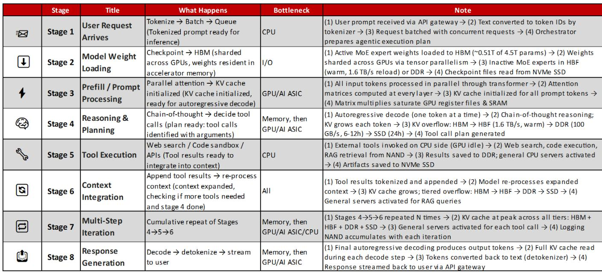
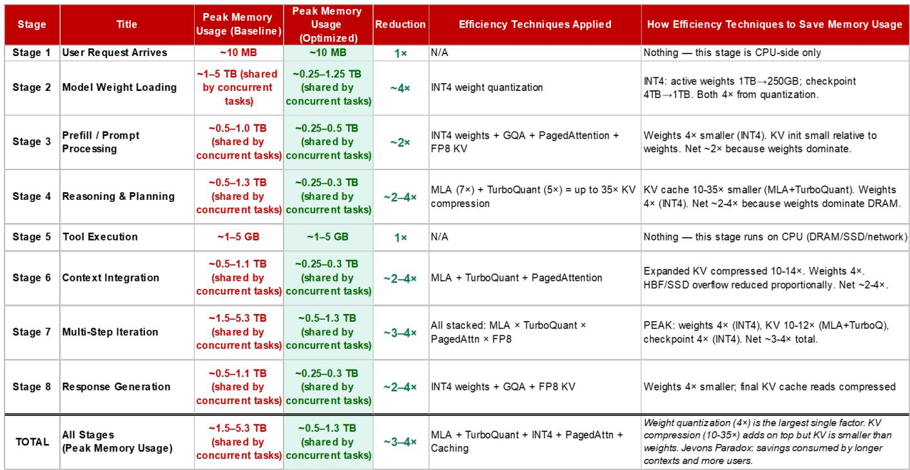
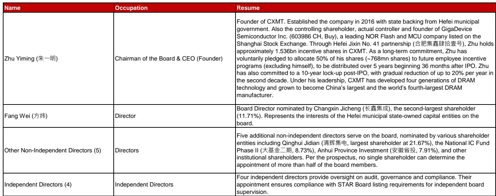

# NOM：长鑫存储DRAM与市场地位

全球存储芯片供给在未来数年难以放松，这是NOM在覆盖长鑫存储首份报告中给出的核心判断。这家中国最大的DRAM制造商，正站在一个供需结构性错配的窗口期。

报告认为，需求端来自代理型AI的驱动将推动全球存储用量在2026至2030年间增长超过七倍，即便考虑四倍的内存效率技术折扣。而供给端面临洁净室、设备、材料和人才等多重瓶颈，存储制造商以30%至40%的比特年复合增长率扩张，仍可能无法满足需求。

长鑫存储的产能扩张节奏高于行业均值。NOM预计其比特扩张在2026至2030年间达到40%至45%的年复合增长率，全球DRAM市占率将从目前的约10%提升至2028年底的约18%。这一判断建立在产能扩张、节点迁移和平均售价上涨三个支撑点上。

## 1. 代理型AI驱动存储需求的结构性增长

报告将存储需求增长的核心动力指向代理型AI。与生成式AI不同，代理型AI需要持续的内存读写和实时数据处理，对存储带宽和容量的消耗呈指数级上升。NOM测算，即使考虑四倍的内存效率技术折扣，全球存储用量在2026至2030年间仍将增长超过七倍，对应比特年复合增长率超过60%。

这一需求增速远超当前供给扩张能力。报告指出，全球存储制造商产能扩张的比特年复合增长率在30%至40%之间，与需求之间存在明显缺口。长鑫存储的扩张速度高于行业均值，这为其市占率提升提供了结构性机会。

> **KC评论：** 代理型AI对存储的需求不是线性增长，而是指数级。报告用“七倍增长”和“四倍折扣”两个数字说明，即便保守估计，供需缺口依然显著。这是理解长鑫存储增长逻辑的起点。

## 2. 产能扩张与节点迁移构成市占率提升的双轮驱动

长鑫存储的市占率提升并非单纯依赖行业景气。报告认为，三个具体因素共同支撑其增长：产能扩张、节点迁移和平均售价上涨。

产能方面，长鑫存储正在上海等地建设新产线，预计到2028年上海产能可能占其总产能的30%至40%。节点迁移方面，公司正在从现有制程向12至16纳米节点推进，这一过程不需要极紫外光刻设备，国内现有的深紫外光刻设备可以满足需求。

平均售价上涨则来自行业供需格局。当全球存储供给持续偏紧，DRAM价格上行周期将直接转化为长鑫存储的收入增长。NOM预测，长鑫存储2026至2028年营收年复合增长率为63%，归母净利润年复合增长率为74%。

## 3. 美国MATCH法案是产能扩张路径中的关键变量

报告在乐观预期中保留了审慎。美国MATCH法案旨在通过协调盟友限制关键设备和材料对华出口，并阻止外国公司维护已在中国境内的设备。长鑫存储的上海产能扩张计划，可能受到这一法案的直接影响。

NOM估计，长鑫存储当前设备国产化率约为40%。在极端情况下，上海产能扩张可能被推迟。报告没有给出这一情景的概率，但将其列为需要持续监控的因素。

值得注意的是，长鑫存储的节点迁移路径不需要极紫外光刻设备，这降低了短期技术封锁的不确定性。但光刻胶等关键材料的供应仍存在不确定性。报告认为，能否获得关键外国制造设备和材料，是值得持续观察的变量。

## 4. 财务模型显示现金流将在2026年转正

NOM的财务预测提供了另一个观察维度。长鑫存储在2024年仍处于亏损状态，归母净利润为负71.45亿元。但报告预测，2025年将实现盈利，2026年归母净利润将达到1303.15亿元。

现金流方面，公司2024年和2025年自由现金流均为负值，分别达到643.32亿元和132.19亿元。但报告预测，从2026年开始，自由现金流将转正，达到1474.46亿元，此后持续扩大。到2028年，公司预计从净负债转为净现金状态，净债务权益比从2025年的169.8%转为净现金。

这一现金流转折点，与产能扩张节奏和行业供需格局的变化高度同步。当产能建设进入稳定期，资本开支从高位回落，而收入端受益于量价齐升，现金流结构将发生根本性变化。

> **KC评论：** 财务预测中值得关注的是自由现金流转正的时间点。2026年之前，长鑫存储仍处于大规模资本开支期，现金流不确定性较大。2026年之后，产能释放和价格上行叠加，现金流改善速度可能超出市场预期。

---

For informational purposes only. Portions may be generated,translated,summarized,or edited with AI assistance based on source materials and may contain omissions or errors. Please verify independently. This is not investment,legal,tax,accounting,or other professional advice.

For informational purposes only. Portions may be generated,translated,summarized,or edited with AI assistance based on source materials and may contain omissions or errors. Please verify independently. This is not investment,legal,tax,accounting,or other professional advice.

