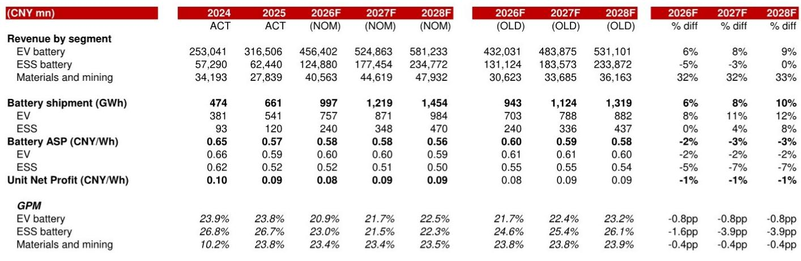
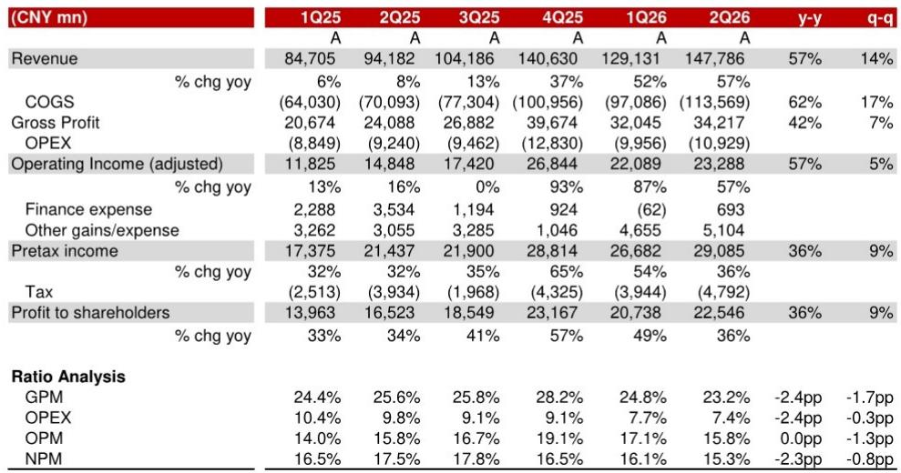
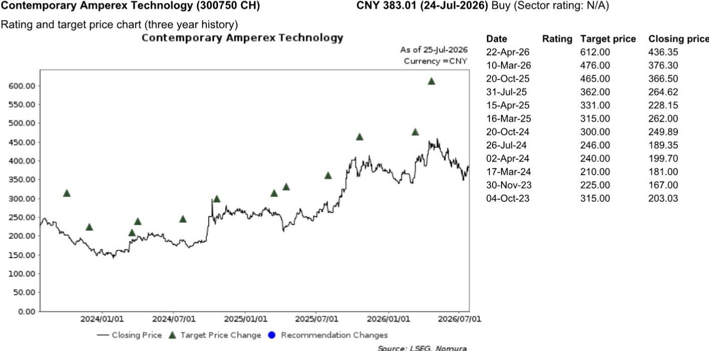

# NOM：宁德时代业务与季度数据观察

宁德时代在7月24日收盘后公布了2026年上半年业绩。这家全球最大电池制造商在第二季度实现净利润225亿元，同比增长36%，环比增长9%，落在市场预期的220-230亿元区间内。报告同时宣布了一项规模在200-400亿元之间的相关市场回购计划，约占公司最新相关市场市值的1.1-2.3%。

这份NOM研报的核心判断是：CATL的出货量增长依然强劲，成本不确定性可控，而回购计划可能对市场情绪产生正面影响。报告上调了未来三年的盈利预测。

## 1. 电池出货量上半年增长约60%，储能业务增速领先

从收入结构看，上半年电动汽车电池收入1920亿元，同比增长46%；储能电池收入530亿元，同比增长88%。NOM估算，上半年总电池出货量约为430-440GWh，同比增长约60%，其中第二季度环比增长10-15%至约230GWh。按此计算，不含增值税的电池均价约为每瓦时0.57元，环比基本持平。

报告预计，CATL全年电池出货量将达到约1TWh，同比增长51%，随后在2027-2028年维持19-22%的增速。支撑这一判断的，是全球电动汽车渗透率的持续提升，以及国内外储能装机量的增长。

> **KC评论：** 储能业务收入增速接近电动汽车的两倍，但相对规模仍只有后者的四分之一左右。储能正在成为CATL第二增长曲线，但短期内还无法替代电动汽车电池作为利润基本盘的地位。

## 2. 毛利率环比下降1.7个百分点，受原材料成本与收入结构影响

第二季度毛利率为23.2%，同比下降2.4个百分点，环比下降1.7个百分点。NOM将这一变化归因于原材料成本上涨和收入结构变化。上半年整体毛利率23.9%，同比下降1.1个百分点。

报告在调高收入预测的同时，将2026-2028年毛利率预测下调了0.6-1.4个百分点，理由是收入结构变化——低毛利的业务占比上升。不过，净利润预测仍上调了3.3-5.3%，因为出货量增长带来的收入增量超过了毛利率压缩的影响。

## 3. 200-400亿元回购计划，占市值1-2%

CATL宣布将在股东大会批准后12个月内，回购200-400亿元相关市场。如果按每股573元的回购价格上限计算，回购规模约占市值的0.8-1.5%。NOM认为，这一计划有助于改善股东回报，对市场情绪有正面意义。

从财务数据看，CATL目前处于净现金状态，2026年预计自由现金流超过1200亿元。回购计划的资金规模约占当年自由现金流的17-33%，在财务上具有可行性。

## 4. 估值框架：25倍2027年市盈率，隐含20%的盈利年复合增速

，基于25倍2027年预测每股收益25.26元。这一估值对应1.25倍2026-2028年盈利年复合增速的PEG。报告指出，CATL目前交易在18倍2026年市盈率和15倍2027年市盈率，估值并不昂贵。

从历史数据看，CATL的净资产回报表现从2024年的22.8%提升至2025年的24.7%，NOM预计2026-2028年将维持在26%以上。这意味着公司在扩大规模的同时，资本回报效率仍在提升。

报告列出的主要节奏变化不确定性包括：原材料价格上涨超预期、全球客户出货量不及预期、以及国内外市场竞争加剧。这些因素都可能影响毛利率和出货量目标的实现。

For informational purposes only. Portions may be generated,translated,summarized,or edited with AI assistance based on source materials and may contain omissions or errors. Please verify independently. This is not investment,legal,tax,accounting,or other professional advice.

For informational purposes only. Portions may be generated,translated,summarized,or edited with AI assistance based on source materials and may contain omissions or errors. Please verify independently. This is not investment,legal,tax,accounting,or other professional advice.

