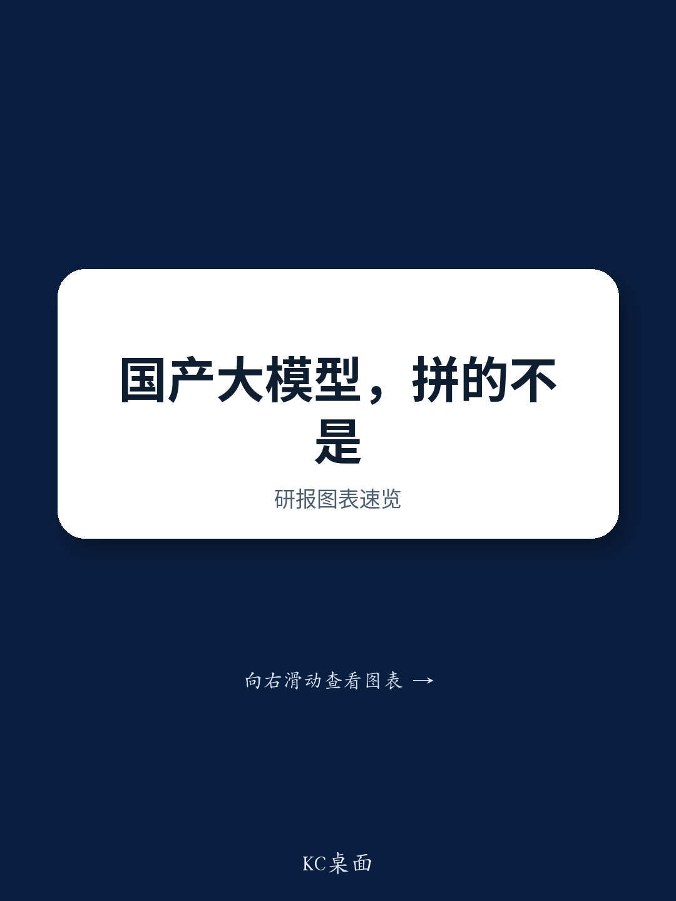

# DeepSeek Is Winning the Chinese LLM Race Not on Model Quality Alone, but on Cost Structure, Agent Integration, and a Developer-Led Distribution Strategy

The next phase of competition among Chinese large language model developers will be defined not by which company trains the largest parameter count, but by which firm can simultaneously scale its model architecture, integrate it deeply into agent workflows, and maintain a structurally lower cost base that enables price leadership. According to a group call held by NOM with an expert from a leading Chinese LLM player, DeepSeek has positioned itself at the intersection of all three trends. The company is seeking to narrow the capability gap with overseas frontier models while operating at a blended inference cost below CNY0.8 per million tokens and a selling price of approximately CNY1.3 per million tokens. This implies an inference contribution gross margin of roughly 40 percent, despite a reported price reduction of approximately 75 percent for its V4 generation. The strategic question for the industry is no longer whether Chinese LLMs can match GPT-level benchmarks, but whether any competitor can replicate DeepSeek's combination of architectural efficiency, agent-harness integration, and developer-led overseas adoption.

The timing of this analysis is critical. Model leadership cycles have compressed from approximately six months to three to four months, driven by AI-in-the-loop techniques that accelerate evaluation and training signal extraction. This means that a model generation advantage is now fleeting, and sustainable differentiation must come from factors that compound over time: proprietary user interaction data, automated feedback loops from real-world workflows, and a cost structure that allows aggressive pricing without destroying margins. DeepSeek's strategy reflects this reality. The company has delayed the official release of V4 partly to debug and optimize its agent-harness layer, aiming to build an integrated product comparable to Claude Code or Codex. This is not a delay born of weakness; it is a deliberate bet that the integrated model-agent system, not the standalone model, will be the durable competitive moat.

## Model Scaling Continues, but Architectural and Post-Training Efficiency Will Determine Which Firms Capture the Returns from Larger Parameter Counts

Chinese LLMs are moving toward multi-trillion-parameter architectures. The expert identified approximately 3 trillion parameters as the next practical milestone, supported by larger compute clusters, supernodes, high-speed interconnects, and optical networking. However, pure parameter scaling is approaching diminishing returns. Beyond a certain threshold, model competitiveness will depend increasingly on architectural innovations in memory management, reliable tool use, long-horizon task performance, and post-training efficiency. This shift has direct financial implications. Companies that invest heavily in parameter scaling without corresponding improvements in inference cost and agent integration risk building assets that are both expensive to run and difficult to differentiate. The marginal benefit of an additional trillion parameters declines when the model cannot reliably execute multi-step tasks or maintain context across extended interactions. The winners will be those that treat scaling not as an end in itself, but as one component of a broader system that includes efficient attention mechanisms, KV-cache offloading, and high infrastructure utilization.

## Model-Harness Integration Creates a Proprietary Data Flywheel That Standalone Model Performance Cannot Replicate

DeepSeek's decision to delay V4's official release for further debugging at the agent-harness layer signals a strategic conviction that the model's value is inseparable from its ability to function within an agent framework. The goal is to build an integrated product covering both professional software development and broader knowledge-work tasks. This integration creates a proprietary data flywheel that is difficult for competitors to replicate. Task trajectories, tool calls, user corrections, execution failures, and real-world workflows can be converted into feedback for both model and product improvement. Each interaction generates training signals that improve the next iteration, while the improved iteration attracts more users, generating more signals. A standalone model, no matter how capable, lacks this loop. It cannot learn from how users actually apply it in complex, multi-step tasks unless those interactions are captured and fed back into the training pipeline. The competitive advantage is therefore shifting from the standalone model toward the integrated model-agent system. Companies that treat the model as a product and the agent as a separate add-on will find themselves at a structural disadvantage, because their feedback loops will be slower and less rich.

## DeepSeek's Structural Cost Advantage Is Not a Pricing Gimmick but an Architectural and Infrastructure Achievement

The expert estimates DeepSeek's blended inference cost at below CNY0.8 per million tokens, assuming a 60 percent cache-hit rate and excluding model-training compute, training-related personnel expenses, and other R&D costs. This cost base supports a blended selling price of approximately CNY1.3 per million tokens, yielding an inference contribution gross margin of around 40 percent. The cost advantage is attributable to more efficient attention and memory management, including KV-cache offloading to NVMe SSDs, higher infrastructure utilization, and large-scale deployment on domestic accelerators. This is not a temporary subsidy or a loss-leading strategy. It is the result of architectural choices that reduce the computational cost of each token without proportionally reducing quality. The implication for competitors is stark. To match DeepSeek's pricing, a rival would need to either absorb lower margins, which is unsustainable over time, or replicate the architectural and infrastructure efficiencies that underpin DeepSeek's cost structure. The latter is not simply a matter of writing better code; it requires co-designing the model architecture with the hardware and memory hierarchy, a process that takes years of iteration. DeepSeek's price reduction of approximately 75 percent for the V4 generation is therefore not a marketing tactic but a structural shift in the industry cost curve.

## A Decision Framework for Evaluating Chinese LLM Competitors

For investors, enterprise buyers, and strategic partners evaluating Chinese LLM players, the preceding analysis suggests a framework with four dimensions. First, assess the company's cost structure transparency. Can it articulate its inference cost per token, its cache-hit rate assumptions, and its infrastructure utilization metrics? If not, its pricing strategy may be unsustainable. Second, evaluate the depth of its model-agent integration. Does the company have a product that captures user interaction data from real-world workflows and feeds it back into model improvement? Standalone model benchmarks are increasingly misleading. Third, examine the company's overseas distribution strategy. Is adoption developer-led or enterprise-led? Developer-led adoption, while slower to monetize in the short term, creates a more durable base because individual developers and small teams are less likely to switch providers once they have integrated a model into their toolchain. Fourth, consider the company's approach to open source. Open-source distribution lowers direct commercialization but expands reach, facilitates deployment across multiple clouds and hardware platforms, and makes it more difficult for closed-model providers to maintain high API premiums. A company that can combine a strong open-source presence with a sustainable cost advantage and deep agent integration is likely to capture a disproportionate share of token volume over time.

## Developer-Led Overseas Adoption and Model Layering Create a Complementary Positioning That Still Pressures Premium Pricing

The expert estimates DeepSeek's annualized recurring revenue reached approximately USD 520 million as of June 2026, with overseas markets contributing around 47 to 48 percent. Overseas users are concentrated in Europe and the United States, followed by Japan, South Korea, and Australia. Adoption remains developer-led, with individual developers and small to medium-sized project teams representing the core customer base. Large-enterprise penetration remains relatively limited. One emerging pattern is model layering. Developers may use Claude Code or Codex with premium overseas models for initial planning, architecture design, and complex reasoning, before switching to DeepSeek for sustained code generation and execution. DeepSeek therefore does not need to replace frontier models across the entire workflow. It can initially capture the token-intensive execution layer, where usage is higher and price sensitivity is greater. This complementary positioning still pressures overseas model pricing, as users become more comfortable routing tasks between premium and lower-cost models. Premium pricing should remain defensible for tasks where reliability and completion quality outweigh cost, but good-enough, lower-cost models embedded in agent workflows could capture a disproportionate share of token volume. The strategic implication for premium providers is that they must either improve their own cost structures or accept that their pricing power will erode at the execution layer, which is where the majority of token consumption occurs.

## Open-Source Distribution Functions as a Strategic Lever That Compounds DeepSeek's Cost and Integration Advantages

Although an open-source strategy weighs on direct commercialization, it lowers adoption barriers, expands overseas reach, facilitates deployment across multiple clouds and hardware platforms, and allows overseas customers to retain greater control over data, infrastructure, and customization. At the industry level, capable open-source alternatives make it more difficult for closed-model providers to maintain high API premiums. For DeepSeek, open source is not a concession but a deliberate distribution lever that reinforces its cost and integration advantages. Every developer who downloads and deploys the open-source model becomes a potential user of the hosted API, especially for tasks that require higher throughput or lower latency than local deployment can provide. The open-source model also generates community contributions, bug reports, and usage data that improve the proprietary version. This creates a virtuous cycle that is difficult for closed-model competitors to counter without opening their own models, which would undermine their pricing power. The sustainable differentiation of LLM players should therefore come from compute scale, proprietary user interactions, and the ability to extract high-quality training signals automatically from real-world workflows. DeepSeek's open-source strategy, combined with its cost structure and agent integration, positions it to capture all three.

*For informational purposes only. Portions may be generated, translated, summarized, or edited with AI assistance based on source materials and may contain omissions or errors. Please verify independently. This is not investment, legal, tax, accounting, or other professional advice.*

For informational purposes only. Portions may be generated, translated, summarized, or edited with AI assistance based on source materials and may contain omissions or errors. Please verify independently. This is not investment, legal, tax, accounting, or other professional advice.

