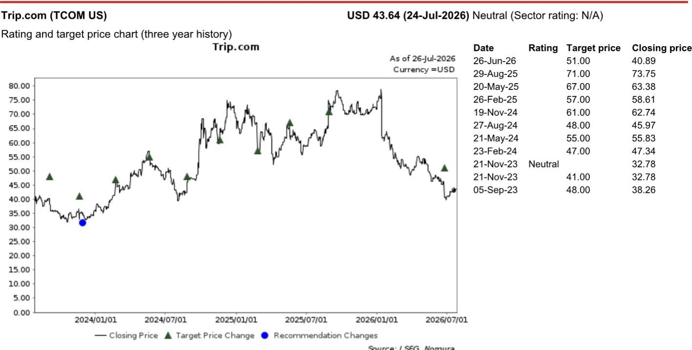

# NOM：携程被要求整改不当商业行为

2026年7月25日，中国国家市场监督管理总局公布了对携程（Trip.com）长达六个月的调查结果。这家在线旅游平台被认定在中国在线酒店预订市场占据支配地位，2025年份额接近60%。监管机构指出，自2020年起，携程要求部分优质酒店签署排他性协议，并强制其他酒店提供平台最低价格，通过流量分配、价格调整、下架酒店等手段执行这些要求。这些做法限制了竞争对手获取酒店库存和定价能力，最终影响了消费者选择和行业发展。

NOM标的在当日发布的快评中认为，虽然市场可能消化一次性罚款的影响，但携程国内酒店预订业务的结构性调整可能带来长期竞争格局的变化。

## 1. 罚款金额超出市场预期，但现金不确定性可控

监管机构责令携程停止上述行为，退还酒店保证金1.228亿元人民币，没收违法所得16.6亿元，并额外罚款35亿元。罚款基于携程2025财年中国市场收入的7.5%计算。NOM估算，总计约53亿元的现金义务占携程2026年第二季度净现金余额的11%。这一总罚款金额超过NOM此前30亿元的预估，但该机构认为市场更关注业务调整的长期影响，而非一次性财务支出。

> **KC评论：** 53亿元罚款占净现金比例不高，但7.5%的营收比例值得留意。这个比例高于阿里巴巴2021年反垄断罚款的4%，反映出监管对平台排他行为的定价在上升。

## 2. 排他协议取消后，竞争对手有望缩小供给差距

NOM分析指出，携程被要求停止与热门酒店的排他合作，并放宽对其他酒店的最低价要求后，美团和抖音等竞争对手可能借此机会缩小酒店供给差距。报告认为，携程的一站式模式和服务质量仍将维持其最大酒店预订渠道的地位，但酒店产品在各平台间的技术性同质化正在发生，竞争将加剧。

NOM以阿里巴巴2021年反垄断调查作为参照：在放弃与大型商户的排他协议后，阿里巴巴市场份额从2020年的59%下降至2025年的35%，同期拼多多和抖音合计份额从17%升至40%。该机构认为，对关键卖家的控制力减弱是阿里巴巴份额变化的主要原因。

## 3. 利润率节奏变化预期已反映在盈利预测中

NOM预计，国内酒店预订业务的持续调整将导致携程2026和2027财年非GAAP营业利润率分别同比下降3个和1个百分点。该机构对2026和2027财年非GAAP营业利润的预估分别低于Visible Alpha共识2%和9%。NOM维持对携程的公司观点，对应2027财年12倍市盈率。

## 4. 一个可复用的观察框架：排他协议取消后的平台竞争演变

阿里巴巴和携程的案例提供了一个观察框架：当监管要求平台放弃排他性安排后，竞争格局的变化通常经历三个阶段。第一阶段，竞争对手获得供给端入场机会，但受限于用户习惯和运营能力，份额变化缓慢。第二阶段，当平台间产品供给趋于同质化，竞争焦点转向价格、服务和运营效率，市场份额开始加速迁移。第三阶段，新格局形成，领先平台可能通过差异化服务重建壁垒。这一框架适用于评估其他依赖排他协议维持市场地位的平台型公司。

For informational purposes only. Portions may be generated,translated,summarized,or edited with AI assistance based on source materials and may contain omissions or errors. Please verify independently. This is not investment,legal,tax,accounting,or other professional advice.

For informational purposes only. Portions may be generated,translated,summarized,or edited with AI assistance based on source materials and may contain omissions or errors. Please verify independently. This is not investment,legal,tax,accounting,or other professional advice.

