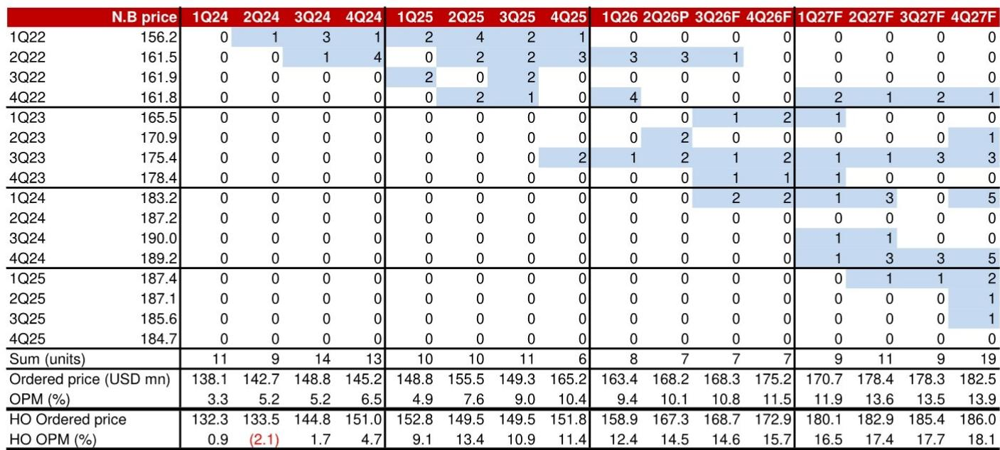
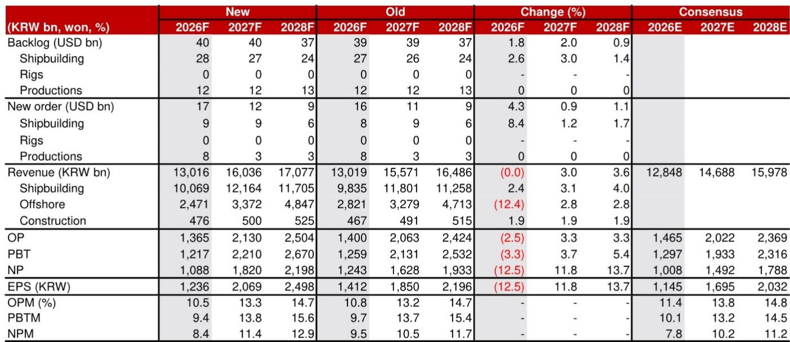
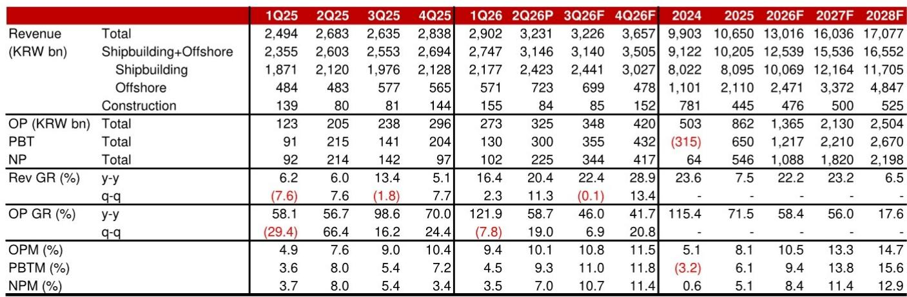

# Samsung Heavy Industries: 股价回调33%后风险回报重新平衡，但中国船厂扩张带来的结构性挑战限制上行空间

三星重工（SHI）的股价自4月24日高点下跌33.4%，同期韩国KOSPI指数上涨3.6%。这一分化使公司估值从4.9倍的峰值回落至12个月远期市净率3.7倍。对于观察者而言，问题是此次回调是否足以补偿未来的风险，还是中国造船产能扩张带来的结构性压力将继续影响公司表现。

答案需要细致分析。股价下跌已消除了估值中的泡沫，但并未消除根本性挑战。SHI目前的市净率意味着其核心造船业务估值（3.21倍）存在4.3%的溢价。这一溢价源于公司通过与美国通用动力和Vigor合作参与“让美国造船再次伟大”计划所带来的新兴机会。然而，溢价较之前有所收窄，反映出市场对机会和风险更为审慎的评估。

2026年第二季度营业利润较市场预期低13.2%，主要因退休养老金调整产生的一次性成本250亿韩元，这是一个可控的意外。更值得关注的是，新投产产能（全球运营业务和重新开放的2号船坞）的营业利润率似乎低于SHI的平均造船利润率。管理层预计2026年这些产能将带来9000亿韩元的额外收入，但如果利润率结构性偏低，盈利杠杆可能不如收入增长所显示的那么强劲。

SHI故事中的关键矛盾在于短期订单簿强劲与中期定价环境恶化之间的张力。2026年新订单预测为170亿美元，同比增长115.7%，主要由浮式液化天然气（F-LNG）项目驱动。公司上半年已获得96亿美元订单，完成全年目标的72%。这是令人印象深刻的运营表现。然而，报告分析师明确表示，由于“中国船厂扩张对新造船价格的下行压力”，评级并未上调。这是任何单个季度的强劲订单都无法解决的结构性挑战。

## 33%的回调使估值与基本面趋于一致，但盈利动能仍为负值

该股目前2026年远期正常化市盈率为18.5倍，2027年降至11.1倍，2028年降至9.2倍。从企业价值/息税折旧摊销前利润（EV/EBITDA）来看，倍数从2026年的10.8倍压缩至2028年的4.8倍。这些倍数并不高，但它们反映的是市场正在定价一个尚未完全实现的强劲盈利复苏。2026年营业利润预测为1.365万亿韩元，同比增长58.4%，但股价却下跌了三分之一。这表明市场要么在折现这些盈利的可持续性，要么在折现这些盈利将以低于当前模型的利润率实现的风险。

当前目标价22,900韩元反映了审慎的保守态度。目标市净率从4.01倍下调至3.35倍，降幅16.5%，尽管12个月远期每股账面价值估计从6,738韩元上调至7,456韩元。分析师实际上是在说，虽然账面价值在增长，但市场不再愿意为其支付同样的倍数。这是对中国船厂产能过剩问题的理性回应。

## F-LNG管道是近期主要催化剂，但新产能利润率是一个警示信号

2026年订单簿主要由海工项目驱动，尤其是F-LNG。预测海工新订单将激增至80亿美元，同比增长900%，而2025年基数为8亿美元。Coral South II项目（13亿美元）和Delfin项目（29亿美元）已获得，管理层目标在第四季度再获得两个F-LNG订单：Delfin II（25亿美元）和Western（25亿美元）。如果这些订单实现，SHI将拥有其历史上较强劲的订单积压之一。

然而，第二季度业绩包含了一个微妙但重要的警示。重新激活的2号船坞和全球运营业务带来的额外收入为季度1500亿韩元，但该收入的营业利润率低于SHI的平均造船利润率。这不是一次性问题。随着SHI扩大产能以满足需求，它正在将效率较低的产能投入使用。这种产能扩张带来的利润率稀释将在未来12至18个月内成为盈利轨迹的反复特征。

商船板块也讲述了类似的故事。2026年LNG船新订单预测增至65亿美元，同比增长131%，对应25艘船。这是LNG运输船的一个强劲周期，由全球液化产能建设和替换吨位需求驱动。但SHI在2024年和2025年初享有的定价权正被中国船厂的激进扩张所侵蚀，这些船厂现在以更低的价格竞争相同订单。报告分析师明确将中国船厂扩张列为主要下行风险，且这一风险不会迅速解决。

## 美国海军机会真实存在，但不足以单独抵消中国船厂产能过剩的影响

SHI通过与通用动力和Vigor的合作参与MASGA计划，是一个战略差异化因素。它使公司能够进入中国船厂无法进入的市场：美国海军和海岸警卫队舰艇建造。报告的估值方法在核心造船市净率基础上增加了4.3%的溢价以反映这一机会。这是一个合理的起点，但需要校准预期。

美国海军造船市场规模庞大但监管严格，采购周期长且政治监督显著。与通用动力和Vigor的合作处于早期阶段，虽然战略逻辑合理，但收入和利润贡献需要数年才能实现。当前4.3%的估值溢价之所以适中，正是因为市场认识到这是一个长期期权，而非近期盈利驱动因素。

对于关注SHI的观察者而言，决策框架应围绕三种情景构建。在基准情景中，强劲的F-LNG订单管道推动2027年和2028年的收入和利润增长，但新产能的利润率稀释和中国船厂的定价压力使市净率保持在3.0倍至3.5倍区间。在此情景下，该股从当前水平提供中个位数的年化回报。

在上行情景中，地缘政治事件（如曼德海峡封锁）引发油轮订单浪潮，或出现意外的浮动数据中心订单。任一催化剂都将增加中国船厂无法立即满足的新需求，赋予SHI定价权，并证明市净率重新评级至4.0倍左右是合理的。在此情景下，该股从当前水平有20%至30%的上行空间。

在下行情景中，中国船厂扩张加速，推动所有船型的新造船价格走低。这将压缩SHI的利润率，即使收入增长，也会导致盈利低于市场预期。市净率可能收缩至2.5倍或更低，意味着从当前水平下跌25%至30%。

当前最可能的结果是基准情景。上行催化剂真实存在但具有二元性，而来自中国的下行风险是结构性和持续性的。该股并不昂贵，但也不够便宜到足以补偿风险回报的不对称性。

对于现有持有者而言，是否继续持有取决于其时间范围和风险承受能力。未来12个月将由F-LNG订单簿的执行和新产能的利润率轨迹主导。如果随着新产能成熟利润率改善，盈利动能将支撑更高的倍数。如果利润率仍低于平均水平，该股将横盘整理。中国船厂扩张是一个多年的挑战，不会在2027年或2028年消失。它是全球造船业的结构性特征，任何对SHI的研究都必须考虑这一点。

这项分析最重要的见解是，SHI不再是一个动能故事。33%的回调已重置预期，该股现在反映了对机会和风险更为平衡的评估。F-LNG管道为盈利提供了强劲支撑，但上限受到来自中国的竞争压力限制。观察者应预期从当前水平获得个位数回报，只有在二元上行催化剂之一实现时，才可能出现超常收益。

*仅供参考。部分内容可能基于源材料通过AI辅助生成、翻译、总结或编辑，可能存在遗漏或错误。请独立核实。本文不构成任何专业建议。*

仅供参考。部分内容可能基于源材料通过AI辅助生成、翻译、总结或编辑，可能存在遗漏或错误。请独立核实。本文不构成任何专业建议。

