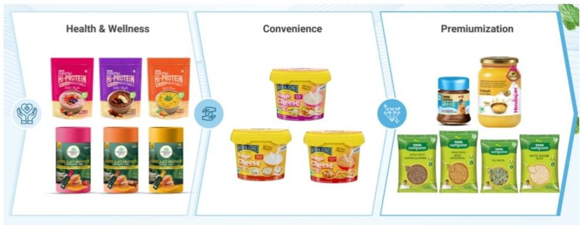
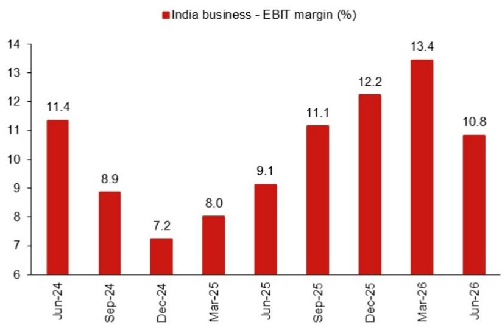

# NOM：消费行业数据与主题变化观察

Tata Consumer Products（TATACONS）在2026财年第一季度交出了一份与市场预期基本一致的业绩。印度市场收入同比增长12%，营业利润率13.5%，带动营业利润增长19.3%。但这份财报最值得关注的信号，不是核心的茶与盐业务如何应对成本波动，而是增长业务（Growth business）的占比已升至印度业务的36%，且同比增速达到47%。NOM在最新报告中指出，这一结构性变化正在重塑公司的DNA。

核心业务（茶与盐）在外部不确定性下仍保持韧性。茶叶销量同比增长2%，好于市场预期的持平，尽管印度遭遇热浪和燃气短缺导致的消费下降。但茶叶销售额同比下降4%，原因是公司将前期较低的茶叶采购成本让利给了消费者。盐的销量和销售额均增长7%，符合公司长期指引。管理层已在6月对茶和盐分别提价1-2%和6%，以支撑后续的销售增长和利润率。NOM预计，随着茶叶采购成本目前同比上涨约7-10%，公司可能在第二季度末进一步提价，以保护利润空间。

## 1. 增长业务以47%同比增速成为公司主要驱动力

增长业务（包括即饮饮品、Sampann、Capital Foods和Organic India）目前占TATACONS印度业务的36%，同比增长47%。即饮饮品（RTD/水）销售额和销量分别增长41%和35%。Sampann品牌销售额增长58%，其中核心产品（豆类、香料、Poha和Vermicelli）增速超过30%，干果、冷榨油以及新品类创新也贡献了额外增量。Capital Foods销售额增长40%，得益于创新、广告投入、渠道执行优化以及较低的基数效应。Organic India销售额增长27%。

管理层预计，尽管基数在抬高，增长业务仍能维持30%以上的增速，主要支撑来自新品推出和品类扩张的显著提速。NOM报告中的图18和图19展示了这一扩张路径。

> **KC评论：** 增长业务47%的增速并非一次性爆发。报告中的细分数据显示，Sampann的58%增长中，核心品类贡献了30%以上，这意味着增长有品类基础支撑，而非完全依赖新品拉动。Capital Foods的40%增长则部分受益于低基数，后续增速能否维持需要观察。

## 2. 毛利率环比改善但营业利润率环比调整符合预期

第一季度毛利率同比上升255个基点（环比上升140个基点）至42.7%。营业利润率同比扩大85个基点至13.5%，但环比调整105个基点，符合市场预期的13.7%。增长业务的利润率持续改善。管理层预计，近期提价措施的全面效果、潜在的进一步提价、美国咖啡业务利润率改善、持续的成本节约计划以及增长业务占比提升，将共同推动整体利润率扩张。中期营业利润率指引维持在17-20%。

NOM在估值模型中假设无不确定性利率6.75%、不确定性溢价5%、贝塔0.7，加权平均资本成本10.3%，终端增长率6%。报告同时指出，增长业务增速节奏变化和利润率仍在调整是主要不确定性。

## 3. 一个可复用的观察框架：从核心业务与增长业务的增速差判断公司转型阶段

对于正在经历业务结构转型的消费品公司，一个实用的观察维度是核心业务与增长业务的增速差。当增长业务增速持续高于核心业务2-3倍以上，且占比超过30%时，公司的估值逻辑可能从“稳定消费品”向“成长型消费品”切换。TATACONS当前的增长业务占比36%，增速47%，而核心业务（茶与盐）的销量增速在2-7%之间，增速差超过40个百分点。NOM报告中的财务预测显示，公司未来三年收入复合增速约11-12%，而正常化每股收益复合增速约16%，这一差距部分来自增长业务占比提升带来的利润率改善。

另一个值得关注的指标是增长业务的利润率趋势。报告提到增长业务利润率持续改善，但未给出具体数字。如果增长业务的利润率逐步接近核心业务，则整体利润率向17-20%中期目标靠拢的路径会更加清晰。

For informational purposes only. Portions may be generated,translated,summarized,or edited with AI assistance based on source materials and may contain omissions or errors. Please verify independently. This is not investment,legal,tax,accounting,or other professional advice.

For informational purposes only. Portions may be generated,translated,summarized,or edited with AI assistance based on source materials and may contain omissions or errors. Please verify independently. This is not investment,legal,tax,accounting,or other professional advice.

