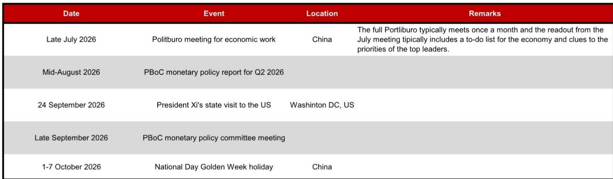
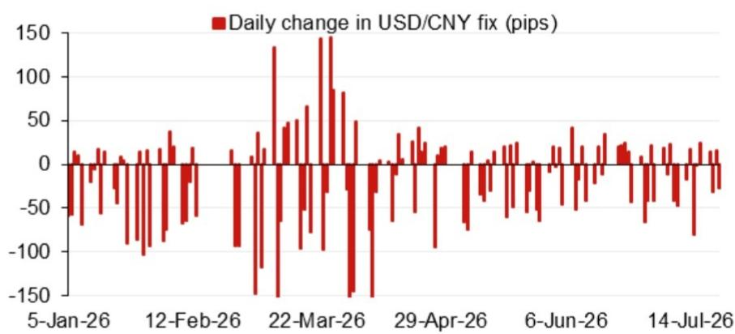
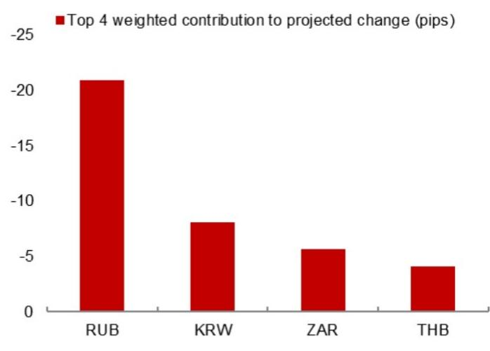

# The PBoC Is Tightening the USD/CNY Fix Faster Than Markets Expect, and the Disconnect Signals a Strategic Shift

The projected USD/CNY central parity rate for the next fixing stands at 6.7685, a level that is 254 pips lower than the previous model projection and 59 pips below the most recent official spot close. This is not a marginal adjustment. It represents a deliberate acceleration in the pace of renminbi appreciation embedded in the People's Bank of China's daily fixing mechanism, and it carries implications for every portfolio with Asia ex-Japan exposure. The timing matters because the gap between the model's raw projection and the actual fix -- after applying the counter-cyclical factor -- is narrowing to just 56 pips, suggesting that the PBoC is reducing its traditional buffer against volatility. The message is clear: Beijing is comfortable with a stronger currency, and it is using the fixing channel to signal that comfort well before the spot market has fully priced it in.

Observers have become accustomed to reading China's currency policy through a defensive lens -- managing depreciation expectations, preserving export competitiveness, and absorbing capital outflow pressures. That framework is now outdated. The data from the latest model update shows that the four largest overnight contributors to the projected change are all pushing the fix lower, meaning the PBoC's algorithm is absorbing global dollar weakness and converting it into renminbi strength with unusual speed. The counter-cyclical factor, which historically has been used to slow the pace of appreciation, is still present but its magnitude is shrinking. The implication is that the PBoC is moving from a reactive stance to a proactive one, using the fixing as a policy tool to guide expectations rather than merely to manage volatility.

The strategic rationale for this shift is rooted in the calendar of events that lies ahead. The July Politburo meeting, the Q2 monetary policy report, and President Xi's state visit to Washington in late September form a sequence of high-stakes policy and diplomatic moments. Each of these events creates a different incentive for the PBoC to demonstrate currency stability or strength. A stronger renminbi ahead of the Washington visit signals confidence and reduces the risk of being labeled a currency manipulator. A stronger fix ahead of the Politburo meeting signals that the leadership's economic agenda is on track. The model projection is not a technical artifact; it is a forward-looking policy signal embedded in a quantitative framework.

The question for global observers is not whether the renminbi will appreciate, but whether they are positioned for the speed and the mechanism through which that appreciation will occur. The fix is the transmission belt. Understanding how the PBoC calibrates it -- and how the counter-cyclical factor interacts with the model's raw output -- is the single most important analytical task for anyone managing Asia FX risk today.

## The Narrowing Gap Between Model Projection and Actual Fix Reveals a Declining Reluctance to Let the Renminbi Appreciate

The raw model projection for the next fix is 6.7685, but the projection after applying the counter-cyclical factor is 6.7741. The difference between these two numbers is 56 pips, down from a larger buffer in previous periods. This is not a trivial technical detail. The counter-cyclical factor is the PBoC's discretionary tool to dampen one-way expectations and prevent excessive volatility. When the gap is wide, the central bank is actively resisting the market's direction. When the gap narrows, it is signaling that it is willing to let the market-driven projection pass through to the fixing with less friction.

The narrowing gap is particularly significant because it comes at a time when the model's raw projection is already aggressive by historical standards. The previous model projection was 6.7939, meaning the current projection is 254 pips lower. That is a large single-period shift. In a normal environment, the PBoC would use the counter-cyclical factor to slow the pace of appreciation, potentially adding 100 to 150 pips of buffer. The fact that the buffer is only 56 pips suggests that the central bank views the current pace as acceptable, even desirable.

This is a departure from the pattern seen in 2024 and early 2025, when the PBoC consistently widened the counter-cyclical factor to resist depreciation pressure. The asymmetry is striking: when the renminbi was under pressure to weaken, the PBoC intervened aggressively to slow the fall. Now that the pressure has reversed, it is intervening only lightly to slow the rise. The implication is that the central bank's preference function has shifted. It is no longer defending a floor; it is managing a glide path upward.

## The Overnight Contribution Breakdown Shows That Global Dollar Weakness Is Being Fully Passed Through Into the Fix, Amplifying the Transmission of External Shocks

The model's top four weighted overnight contributors to the projected change are all pushing the fix lower. This is a critical detail because it reveals the mechanism through which global FX moves are being transmitted into China's domestic currency regime. When the dollar weakens broadly, the renminbi fixing algorithm captures that weakness and converts it into a lower USD/CNY fix. But the speed of that conversion depends on the weights assigned to different currency pairs and the PBoC's willingness to let those weights drive the outcome.

In the current configuration, the model is assigning high weights to currencies that have strengthened significantly against the dollar overnight -- likely including the euro, the yen, and the Korean won. Each of those currencies contributes to the projected appreciation of the renminbi. The fact that all four top contributors are aligned in the same direction means there is no internal offset. The model is not averaging out conflicting signals; it is compounding a single directional move.

For observers, this means that any further dollar weakness will be transmitted into the fix with minimal attenuation. If the dollar index falls by 1 percent, the USD/CNY fix could fall by a comparable magnitude, rather than being buffered by the counter-cyclical factor or by a diversified weighting scheme. This creates a scenario in which the renminbi becomes a high-beta play on the dollar. When the dollar falls, the renminbi appreciates more than peers. When the dollar stabilizes or rises, the renminbi could hold its ground because the PBoC is now comfortable with a stronger currency. The asymmetry of the past -- where the renminbi depreciated more than peers when the dollar rose and appreciated less than peers when the dollar fell -- is being unwound.

## The Sequence of Policy Events Through Late 2026 Creates a Tight Window for Renminbi Appreciation, Making the Current Fixing Trajectory a Leading Indicator

The calendar of events in the report is not merely a list of dates. It is a policy roadmap that explains why the PBoC is accelerating the fix now rather than later. The July Politburo meeting is the first major milestone. The readout from that meeting typically includes a to-do list for the economy and clues to the priorities of the top leadership. A stronger renminbi ahead of that meeting signals that the economy is on a stable footing and that the leadership's policy mix is working. It also reduces the risk that the meeting will focus on currency weakness as a problem to be solved.

The Q2 monetary policy report, due in mid-August, is the second milestone. That report will provide a detailed assessment of the transmission mechanism for monetary policy, including the exchange rate channel. If the PBoC has already guided the fix to a stronger level by that point, the report will be able to claim success in managing expectations and stabilizing the external environment. It will also provide cover for any further adjustments in the third quarter.

The most important event is President Xi's state visit to Washington in late September. Currency policy has been a recurring source of tension in US-China relations, and a renminbi that is perceived as artificially weak invites political risk. By allowing the fix to appreciate ahead of the visit, the PBoC removes that risk from the bilateral agenda. It also signals that China is willing to play by the rules of the global financial system. The timing of the fixing acceleration -- starting in July and continuing through August -- suggests that the PBoC is front-loading the appreciation so that the renminbi is at a comfortable level by the time the President lands in Washington.

The National Day Golden Week holiday in early October creates a natural pause point. After the holiday, the PBoC can reassess the trajectory based on how the external environment has evolved. But the key insight is that the window for appreciation is narrow. If the PBoC does not use the July-to-September period to move the fix higher, it will have missed the opportunity to align currency policy with the diplomatic calendar. The model projection of 6.7685 is the first concrete evidence that it is using that window.

## A Decision Framework for Observers: Treat the Fix as a Leading Indicator, Not a Lagging One, and Adjust Positioning in Three Dimensions

Most observers treat the USD/CNY fix as a lagging indicator -- a number that reflects what has already happened in global markets overnight. That is a mistake. The fix is a forward-looking policy signal that incorporates the PBoC's view of where the currency should be, not just where it has been. To operationalize this insight, observers should adopt a three-dimensional decision framework.

First, monitor the gap between the raw model projection and the actual fix after the counter-cyclical factor. When that gap is narrowing, as it is now, the PBoC is signaling that it is comfortable with the current pace of appreciation. Observers should increase their long renminbi exposure or reduce their short positions. When the gap is widening, the PBoC is signaling discomfort, and observers should reduce exposure or hedge.

Second, track the composition of overnight contributions. When all top contributors are aligned in the same direction, the fix will move more sharply than when contributors are mixed. Observers should adjust their sensitivity assumptions accordingly. In the current environment, a 1 percent move in the dollar index should be expected to produce a larger move in USD/CNY than historical beta would suggest.

Third, align currency positioning with the policy calendar. The July-to-September window is the most favorable period for renminbi appreciation. Observers should front-load their positioning rather than waiting for confirmation from spot markets. After the Washington visit and the Golden Week holiday, the risk-reward profile shifts. The PBoC may allow the fix to stabilize or even reverse slightly if the external environment changes. The decision framework is not about predicting the level; it is about identifying the regime.

## The Model's Error Pattern Suggests That the Current Projection May Understate the Pace of Appreciation, Adding Urgency to Positioning Decisions

The report includes recent model errors, and the pattern is instructive. The model has a tendency to underestimate the magnitude of directional moves when the PBoC is actively using the counter-cyclical factor. In the current environment, the counter-cyclical factor is being used lightly, which reduces one source of error. But the model may still be underestimating the speed of appreciation because it is calibrated to a regime in which the PBoC resisted currency strength. That regime has changed.

The historical error pattern shows that the model's projections tend to be more accurate when the fix is moving in a range-bound or gradually trending manner. When the fix accelerates, the model lags. If the PBoC continues to narrow the counter-cyclical factor buffer and if global dollar weakness persists, the actual fix could undershoot the model projection -- meaning the renminbi could appreciate faster than the model predicts. This is not a forecast; it is a risk assessment based on the empirical relationship between model errors and policy regime shifts.

For observers, the implication is that waiting for the spot market to confirm the fix trajectory is a dangerous strategy. By the time spot USD/CNY reaches the level implied by the current fix projection, the fix may already have moved lower. The window for entry is now, not after the spot market has caught up. The model error pattern reinforces the urgency of the three-dimensional decision framework described above. The PBoC is leading. The fix is leading. The spot market will follow, but with a lag that could cost those who wait.

*For informational purposes only. Portions may be generated, translated, summarized, or edited with AI assistance based on source materials and may contain omissions or errors. Please verify independently. This is not professional advice.*

For informational purposes only. Portions may be generated, translated, summarized, or edited with AI assistance based on source materials and may contain omissions or errors. Please verify independently. This is not professional advice.

