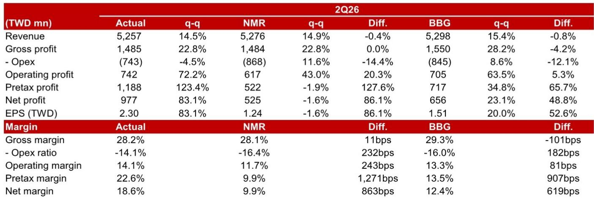
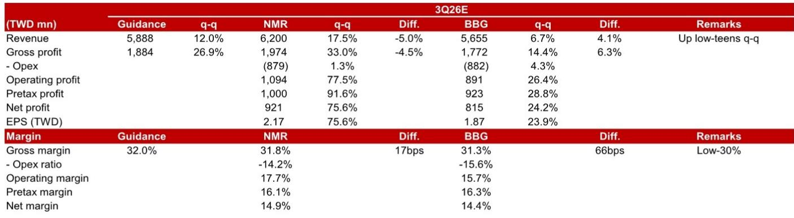
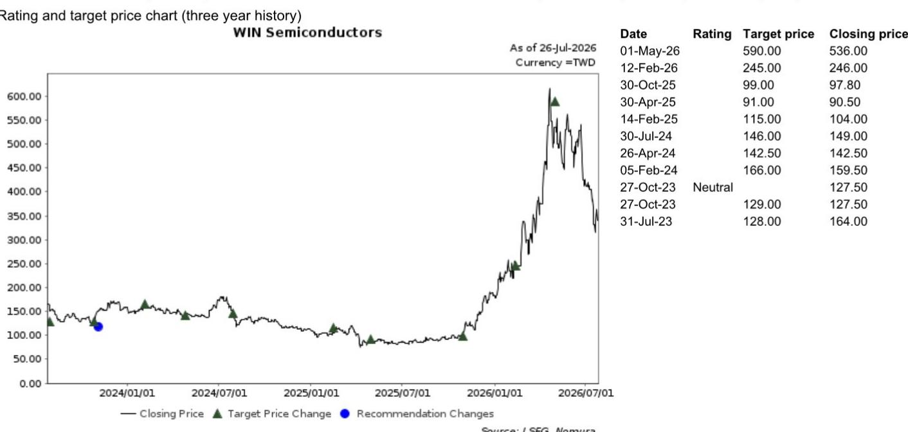

# NOM：WinSemi光学代工业务进入量产爬坡阶段

NOM标的在最新报告中指出，Win Semi 2026年第二季度业绩符合预期，但更值得关注的是其光学代工业务正在从样品阶段转向量产爬坡。光电探测器（PD）已在季末为单一战略客户进入量产，管理层对该客户的需求预测持乐观态度，并预计2026年光学通信收入将占高个位数百分比，2027年有望迈向双位数。这家以砷化镓代工为主业的公司，正在数据中心和卫星通信两个方向同时积累光学与射频能力。

## 1. 第二季度毛利率符合预期，费用控制推动利润超预期

Win Semi 第二季度合并毛利率为28.2%，落在公司此前指引的高20%区间内，与NOM预测基本一致。但营业利润率达到14.1%，显著高于市场预期，主要得益于营业费用率从第一季度的17%降至14%。公司产能利用率从60%提升至65%，折旧费用维持在每季约7.6亿新台币的水平。管理层预计第三季度营收环比增长低双位数，毛利率升至低30%区间。

> **KC评论：** 毛利率改善的核心驱动力来自产品组合变化——基础设施收入占比已与手机业务相当，而基础设施的毛利率远高于公司平均水平。折旧下降的边际贡献正在减弱，管理层明确表示当前每季约7亿新台币的折旧水平已接近底部。

## 2. 光学代工从单一客户起步，激光产品线逐步扩展

光学业务在第二季度录得所有应用中最显著的环比增长。光电探测器在季末进入量产，目前仅服务一家战略客户，但管理层表示产能已接近满载，短期内不担心客户单一化问题。在激光器方面，公司已量产VCSEL和长距离EML，中距离EML预计2026年下半年加入产品线，CW激光器预计2027年下半年开始贡献部分收入。NOM估计，光学通信收入占公司营收比重将从2026年的高个位数百分比，在2027年向双位数迈进。

值得注意的是，光学产品的毛利率目前仅与公司平均水平相当，低于基础设施业务。这意味着光学业务的收入增长短期内对整体利润率的拉动效果有限，其价值更多体现在打开新的成长空间。

## 3. 卫星通信与基础设施构成第二增长曲线

Win Semi 在卫星通信领域同时布局砷化镓和氮化镓技术，覆盖功率放大器和低噪声放大器，应用场景包括卫星本体和地面网关。目前基础设施收入中，基站与卫星的贡献大致相当。NOM在另一份全球卫星射频供应链报告中指出，如果SpaceX的部署承诺得以兑现，2026至2027年快速增长的卫星业务将持续改善Win Semi的产品组合。

管理层在交流中强调，卫星通信业务具有项目制特征，并非经常性收入。去年基站收入远高于卫星，但今年新的卫星部署和手机直连卫星应用正在扩大卫星业务规模。6G的早期讨论也已开始，客户正在与公司接洽。

## 4. 库存大幅增加为应对外部环境变化做准备

第二季度末库存余额达76亿新台币，环比增长48%。公司解释称，增加主要来自原材料和化学品储备，目的是应对外部环境变化（如出口管制）和中东局势对供应链安全的影响。公司已与关键材料供应商签订长期协议，并与光电探测器客户合作确保衬底供应。

这一库存策略表明，Win Semi 正在为下半年旺季生产做主动备货，而非被动应对需求波动。管理层明确表示，库存增加与材料价格上涨无关，纯粹是出于供应链安全考虑。

## 5. 观察框架：从产品组合变化判断盈利能力拐点

Win Semi 的盈利能力改善路径可以拆解为三个层次：第一，基础设施收入占比持续提升，因其毛利率远高于公司平均，这是当前最确定的利润改善来源；第二，光学业务收入规模扩大，但其毛利率目前仅与公司平均持平，对利润率的贡献需要等待规模效应显现；第三，折旧费用已接近底部，未来新增资本支出将重新推高折旧，抵消部分利润率改善效果。

读者需要跟踪的关键指标包括：基础设施与手机业务的收入占比差距、光学业务毛利率是否随规模提升、以及每季折旧费用的实际变化方向。这三个变量共同决定了公司能否从当前的低30%毛利率区间进一步向上突破。

For informational purposes only. Portions may be generated,translated,summarized,or edited with AI assistance based on source materials and may contain omissions or errors. Please verify independently. This is not investment,legal,tax,accounting,or other professional advice.

For informational purposes only. Portions may be generated,translated,summarized,or edited with AI assistance based on source materials and may contain omissions or errors. Please verify independently. This is not investment,legal,tax,accounting,or other professional advice.

