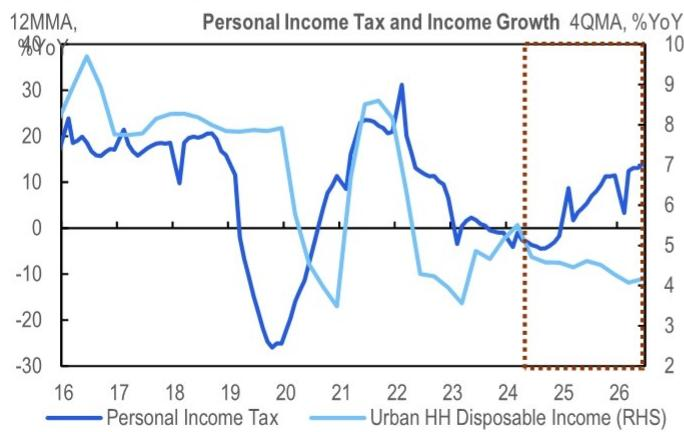
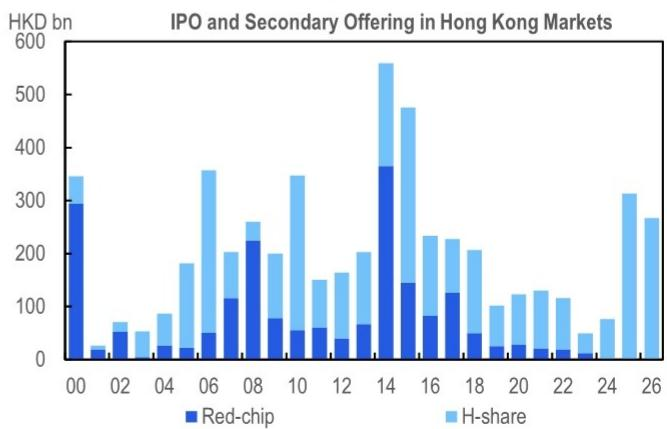

# 宏观环境观察

## 离岸信托税务规则的调整

## 研究观点

7月24日，相关部门发布了第21号文件，对个人在离岸信托方面的税务规则进行了实质性调整，即日起生效。这一举措是完善跨境资金流动监管的又一环节，也印证了我们对大规模减税降费阶段已过去的长期判断。我们认为，这可能在短期内对香港市场情绪产生影响：通过离岸信托持有权益的红筹/VIE架构创始人可能需要调整资产以应对合规要求。从中期来看，随着离岸信托税务优势的减弱，H股架构在IPO市场可能进一步受到青睐。对于财富管理领域，超高净值家庭在离岸信托架构中的税务规划空间将显著收窄。

**事件概述**——7月24日，相关部门发布第21号文件，对个人在离岸信托方面的税务规则进行了实质性调整，即日起生效。主要内容包括：1）设立环节税：居民个人将资产转入离岸信托时，需按市场价值对未实现增值部分缴税；2）年度归属：信托收入无论是否分配，每年均需在设立人手中缴税，包括通过控制的离岸实体获得的收入；3）反避税条款：贷款、担保、费用报销及低于市场价使用信托资产等行为可能被重新定性为应税分配；4）退出税：信托终止、设立人死亡或失去中国税务居民身份时触发应税事件；5）广泛的居民身份认定：外国国籍或海外居住不排除在中国有主要经济利益的个人被视为中国税务居民；6）追溯清理：2023年1月1日起的未缴税款需在90天内自行申报，按时申报可免滞纳金。

**完善跨境监管的又一举措**——第21号文件是跨境资金流动监管持续完善的又一措施。此前，相关部门已对直接对外投资规则进行了调整，并对跨境证券、期货和基金业务进行了规范。离岸信托已成为企业主持有境外上市公司权益以及超高净值家庭进行财富规划和税务递延的常见工具。第21号文件明确了此前税务上的模糊地带。在正式文件出台前，上海、江苏、深圳等地已开始对离岸信托安排进行核查，部分案例已适用相关税率。此次公告将现有实践正式化，并建立了全国性框架。

**大规模减税降费阶段已过去**——第21号文件强化了我们对大规模减税降费阶段已过去的判断。近年来，个人所得税收入增速持续高于社会消费品零售总额增速和城镇居民收入增速，这一差距在近期进一步扩大。这一趋势反映了多方面因素：土地出让收入的结构性变化、收入分配格局的调整需求，以及将技术发展带来的收益向中低收入群体转移的财政需要。从这个角度看，对中低收入群体的定向支持与对高收入群体的税收调节同样重要。

**市场影响：短期情绪因素，中期生态重塑**——我们认为香港上市公司可能对此更为敏感。

- 短期来看，红筹/VIE架构的创始人通常通过离岸信托持有权益，面临两重压力：一是设立环节税和年度归属规则对以往未实现或未分配的财富产生即期税务成本；二是追溯清理义务将这一压力集中在90天内。这些因素可能导致部分大股东调整持股，尤其是在香港上市的红筹/VIE公司中。

- 中长期来看，红筹架构在IPO市场已因监管因素而热度下降，第21号文件进一步削弱了其税务优势。H股架构将上市主体保留在境内，似乎是阻力较小的路径，可能加速这一转变。在财富管理领域，随着离岸信托税务效率的降低，超高净值家庭进行跨境架构的动机减弱。合规成本的上升可能使增量资金更倾向于留在境内或回流。这一公告可能重塑金融和法律服务行业，尤其是信托、家族办公室和私人银行业务。

**汇率、资本流动与人民币国际化**：我们认为第21号文件是一项税务合规措施，而非新的资本管制政策。它对汇率或利率的影响有限。重要的是，它不影响人民币国际化的相关渠道，这些渠道通过合规的官方通道运行。

- 香港作为财富管理中心：我们认为香港的角色基本不受影响。第21号文件适用于所有离岸信托，无论其注册地。香港仍是合规跨境财富管理最便捷、监管最完善的通道之一。

**后续关注点**——实施情况是首要关注点，未来几个月的个人所得税收入数据可作为及时检验。其他灰色地带可能受到更多关注，包括跨境SPV、家族办公室/私人银行业务、保险和房地产。同时，财政政策的再分配维度——如何将来自高收入群体的税收收入转化为对中低收入群体的支持——与收入影响本身同样值得关注。

图1. 近年来个人所得税收入增速持续高于收入增速

图2. 红筹架构在香港IPO市场已逐渐被H股取代

