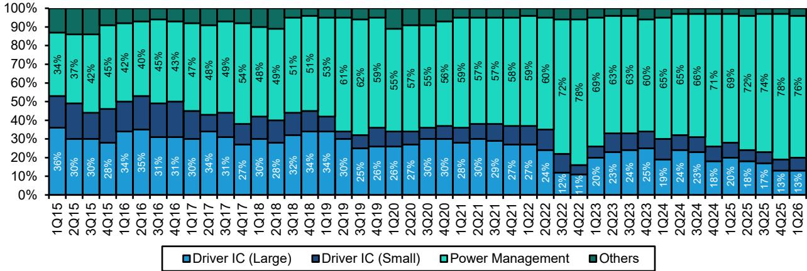
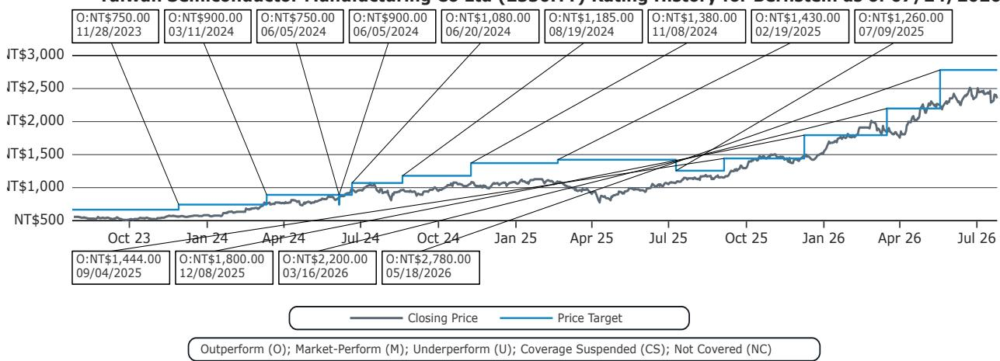
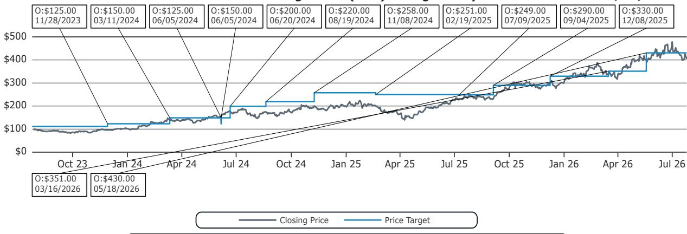

# 成熟制程代工厂的上涨行情：关于需求转移与定价能力的假设审视

联电和世界先进今年以来分别上涨约150%和65%，这一市场叙事表面看似合理，但经不起深入推敲。市场参与者已计入两个核心假设：台积电退出老旧工厂将向这些厂商转移可观需求，以及持续的涨价将延续疫情期间供应紧张时的模式。然而，这两个假设均无法通过量化检验。台积电最老旧工厂的需求转移，最多仅占联电和世界先进合计总产能的4-6%，在其收入结构中几乎可以忽略不计。与此同时，涨价论调混淆了中国大陆代工厂和特定晶圆厂交易的特殊条件与更广泛的成熟制程市场——后者的需求在结构上仍显不足。

这一问题的紧迫性在于，这些股票的价格与其基本面现实之间的差距已扩大至历史极端供应短缺时期才见过的水平。联电的远期市净率即便在近期回调后仍达3.8倍，超过了2022年疫情短缺带来空前定价能力时的峰值估值。当前环境不具备任何此类特征。正如台积电自身所言，成熟制程需求“并不强劲”，而存储成本上升可能进一步抑制需求的风险，又增添了市场似乎忽略的另一层阻力。

这些股票的上涨逻辑建立在三大支柱上：台积电的需求转移、持续的定价能力，以及硅光子和先进制程合作等新增长方向。每一支柱都比市场认为的更脆弱，在某些情况下，证据甚至直接与叙事相矛盾。对于严谨的观察者而言，问题不在于这些公司是否拥有可行的业务，而在于当前估值是否已提前反映了未来数年难以实现的乐观预期。

联电与世界先进之间的分化也颇具启示意义。尽管两者因相似主题而上涨，但其业务基本面差异带来了截然不同的风险回报方程。世界先进在电源管理IC上的高敞口及其与台积电的中介层合作关系，提供了真实但有限的需求可见性，而联电则缺乏这一点。理解真正的差异所在，以及差异不存在之处，对于在这一半导体价值链环节进行布局至关重要。

## 台积电需求转移的量化影响微乎其微

联电和世界先进最常被提及的催化剂，是市场预期台积电淘汰其两座最老旧工厂将把需求转移至这些竞争对手。台积电已确认将逐步淘汰6英寸的Fab 2和8英寸的Fab 5。市场将此解读为一次重大的产能转移，将收紧成熟制程供应并增强替代供应商的定价能力。

然而数据揭示了不同的图景。即使台积电Fab 2和Fab 5目前生产的每一片晶圆都完全转移至联电和世界先进，合计产量也仅占它们6英寸和8英寸总产能的8-13%。若以所有制程节点的总产能衡量，这一影响将缩小至4-6%。一项增加不到6%总产能利用率的需求转移，并非结构性催化剂。它最多只是边际利好，且当前股价已充分甚至过度反映了这一因素。

更重要的是，台积电并未完全退出成熟制程市场。该公司已确认正在日本和欧洲扩大成熟制程产能。这意味着，即便在淘汰老旧工厂的同时，台积电也在新增服务于联电和世界先进相同客户群的地理区域产能。对行业供应的净影响远非需求转移叙事所暗示的收紧。基于这一逻辑建立仓位的参与者，已为一项在最佳情况下仅占收入极小比例的产能利好支付了周期高点的估值。

## 2027年的涨价难以持续：存储成本压缩终端需求

这轮上涨的第二大支柱，是市场预期联电和世界先进能够继续提价，延续今年已成功实施的涨价。市场引用了中国大陆代工厂（受益于本土化趋势）以及力积电（将其一座工厂出售给美光并满负荷运营）的涨价案例。此处的错误在于假设某一细分市场的定价动态适用于所有参与者。

中国大陆代工厂涨价，是因为本土对国产半导体供应的需求在结构性增长，且其产能已充分利用。力积电的涨价则得益于美光收购工厂带来的特定需求。这些因素均不适用于联电或世界先进。联电和世界先进在全球成熟制程市场竞争，而该市场需求并不紧张。台积电将成熟制程需求描述为“并不强劲”，直接与涨价叙事相矛盾。

然而，更显著的风险来自一个间接渠道——存储成本上升对成熟制程需求的影响，而鲜有市场参与者讨论这一点。当存储价格上涨时，系统OEM厂商面临DRAM和NAND的物料清单成本上升。为维持整体系统定价，它们通常会削减逻辑组件的支出，而许多逻辑组件正是在成熟制程上制造的。如果存储成本继续攀升，联电和世界先进产品的需求可能会在市场预期定价能力增强之时反而走弱。这并非推测性情景，而是半导体终端市场动态中一个记录完备的模式，也是当前估值未能反映的二阶风险。

## 世界先进相对更优，但其优势已被定价

在成熟制程代工领域，世界先进拥有联电所缺乏的真实结构性优势。世界先进超过75%的收入来自电源管理IC。台积电已明确指出，电源管理IC和CMOS图像传感器是成熟制程整体需求疲软中的例外。这一产品组合为世界先进提供了需求底线，而联电因其更多元化且周期性更强的业务组合，并不具备这一优势。

世界先进还受益于与台积电在中介层市场的特定合作关系。台积电CoWoS先进封装的需求强劲，带动了中介层需求，台积电将部分生产外包给世界先进。这一中介层业务为世界先进在新加坡的VSMC 12英寸工厂提供了需求可见性，该工厂目前按计划于2027年第一季度量产。一期产能为每月4.4万片晶圆，已通过长期协议完全锁定，管理层正在评估二期扩建。

这些都是真实的积极因素，但不足以证明当前估值的合理性。世界先进的远期市净率为4.2倍，即使计入更高的产能利用率假设、更高的中介层定价以及VSMC更快的爬坡速度，该股票相对于当前水平的下行空间仅为7%，股息回报表现为3%。对于一家增长前景良好但并非卓越的公司而言，这是一个合理至略高的估值。它并非便宜货，也肯定未反映在市场整体成熟制程面临阻力时，参与者应要求的安全边际。

## 硅光子是真实机遇，但对联电的业绩影响需数年才能显现

联电宣布将为SILITH生产光子IC，并获得了imec的技术授权，这引发了市场对硅光子作为新增长方向的热情。这是一个合理的长期机遇。硅光子技术应对了数据中心互联和高性能计算中不断增长的带宽需求，并可利用原本面临结构性衰退的成熟制程产能。

但时间问题十分严峻。硅光子领域的同行Tower Semiconductor在2026年第一季度的光子收入同比增长了三倍，并已为2027年锁定了13亿美元的收入合同。为支撑这一增长，Tower正投入9.2亿美元资本支出以扩大硅光子产能。相比之下，联电尚未宣布针对硅光子的专项资本支出。imec的技术授权发生在2025年底，从零开始建立有意义的客户群和生产能力通常需要数年时间。

即使联电在硅光子领域取得成功，未来两到三年的收入贡献也不太可能大到足以影响公司的整体财务表现。市场正在定价一个最快也要到本十年末才能实现的结果。在此期间，核心成熟制程业务面临上述定价和需求阻力。硅光子是未来增长的一个真实选择，但选择权具有时间价值，当前估值并未反映实现该价值所需的多年投资和执行风险。

## 英特尔3纳米合作讨论忽略了联电的能力与客户基础缺失

联电上涨行情中最具投机性的元素，是围绕其可能与英特尔在3纳米制造上合作的讨论。逻辑似乎是，联电可以分担英特尔先进制程产能的资本负担，并获得领先技术，从而与大陆竞争对手形成差异化。这一论点在多个层面站不住脚。

联电在7纳米或5纳米制造方面毫无经验，也没有领先制程的客户基础。认为它能从技术或商业角度对3纳米合作做出有意义贡献的想法，在其历史和能力中找不到支撑。英特尔的3纳米产能几乎已完全被内部产品消耗。要使该产能对外部客户“代工友好”，需要大量的工艺调整、设计工具包开发和客户认证工作，绝非简单的产能共享安排。

资本支出负担是另一个关键考量。如果联电参与联合项目，它需要为一个没有现有客户关系且无执行记录的制程节点投入数十亿美元的资本支出。财务风险巨大，产生足以证明该风险合理的回报的概率很低。联电与英特尔之间的讨论可能确实在进行，正如市场所猜测的那样，但讨论与有财务意义的联合项目之间的鸿沟巨大。将这一结果计入价格的参与者，是在假设一系列成功的工艺转移、客户赢得和产能爬坡，而联电历史上并无此类先例。

## 成熟制程代工厂的布局决策框架

对于评估联电和世界先进布局的观察者而言，相关框架并非关于这些公司是否拥有可行的业务——它们确实有。问题在于，当前估值是否恰当反映了看涨逻辑面临的风险。一个结构化的方法可得出三个具体决策点。

第一，量化评估需求转移。台积电工厂淘汰最多为联电和世界先进增加4-6%的总产能。任何依赖此作为主要催化剂的逻辑，都建立在一个可忽略的因素之上。如果一只股票的看涨理由依赖于一个使收入变动不到5%的因素，那么该股票相对于基本面驱动因素很可能被高估。

第二，在终端需求弹性的背景下评估定价能力。中国大陆代工厂和力积电的成功涨价是公司特定事件，而非行业趋势。更相关的动态是存储成本上升可能压缩成熟制程需求。如果存储价格继续上涨，联电和世界先进今年展现的定价能力可能随着OEM厂商削减逻辑组件支出以管理总系统成本而逆转。

第三，区分真实的结构性优势与投机性选择权。世界先进的电源管理业务敞口及其与台积电的中介层关系是真实、可量化的优势，支撑着合理估值。联电的硅光子和英特尔合作讨论则是投机性选择权，时间跨度长，近期产生实质性影响的概率低。为投机性选择权支付周期高点的倍数，是导致负回报的常见路径。

这一决策框架指向一个清晰的结论：联电相对于其基本面前景被高估，而世界先进估值合理但上行空间有限。市场将真实但温和的利好与变革性催化剂混为一谈。对于严谨的观察者而言，适当的回应是避开前者，对后者保持谨慎态度，等待反映这些业务实际风险回报特征的更佳入场时机。

*仅供参考。部分内容可能基于源材料通过AI辅助生成、翻译、总结或编辑，可能存在遗漏或错误。请独立核实。本文不构成任何专业建议。*

仅供参考。部分内容可能基于源材料通过AI辅助生成、翻译、总结或编辑，可能存在遗漏或错误。请独立核实。本文不构成任何专业建议。

