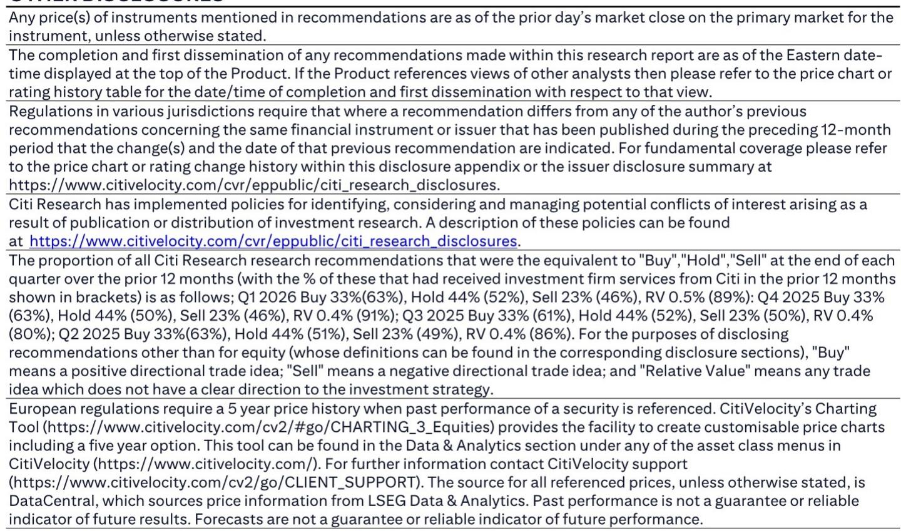
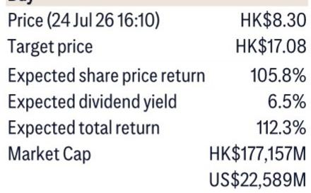
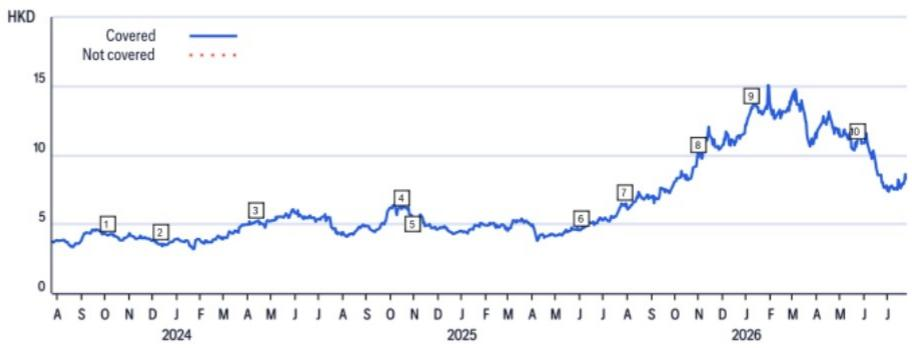

# Citi：基础材料行业数据与主题变化观察

Citi在7月底对中国铝业子公司包头铝业进行实地调研后发布报告。公司管理层在交流中给出了几个关键判断：中国将继续维持电解铝产能上限政策，海外研究审批正在收紧，而来自AI、电网和铝替铜等新兴领域的需求有望对冲传统行业的节奏变化。这些信息叠加在一起，勾勒出中国铝业当前面临的供给刚性、需求结构转换和政策环境变化的图景。

## 1. 产能上限政策执行力度未松动，但存在统计口径干扰

管理层明确表示，中国不会放开产能天花板。通过提高电流强度，实际产量可能超过核定产能3%至5%，但监管部门可以通过核查用电量来发现超产行为。考虑到每年20天以上的检修周期，单月产量可能偏高，全年总产量仍与产能基本匹配。

一个容易被忽视的变量是再生铝的统计归属。部分企业将再生铝产量计入原铝总产量统计，导致公布的原铝产量数据高于实际产能。这意味着市场在解读月度产量数据时，需要区分统计口径变化与真实供给扩张。

> **KC评论：** 产能上限政策本身没有变化，但统计口径的模糊地带可能让市场误判供给不确定性。读者在跟踪月度产量数据时，应关注原铝与再生铝的分项统计，而非只看总量。

## 2. 海外产能扩张面临更严格的审批框架

相关法规对境外研究审批提出了更严格的要求。国有企业与民营企业的资金出境都需要获得ODI批准，但通过境外已有资金进行的研究则无需经过这一审批流程。新规还加强了对实际控制人的审查。

中国铝业的海外战略因此聚焦于资源获取和在有可再生能源的地区布局铝产能。这一方向选择既受制于审批环境，也反映了公司对低碳铝长期竞争力的判断。

## 3. 需求端结构性增长可对冲传统领域节奏变化

管理层预计，AI数据中心、电力及电网研究、铝替铜三个细分领域的需求增长，能够弥补传统行业需求仍在调整的影响。公司给出的全球铝消费复合年增长率约为4%，主要驱动力来自新能源汽车、储能系统和AI数据中心。

这一增速假设能否兑现，取决于铝替铜的渗透速度以及AI基础设施建设的持续性。报告没有对这两个变量做更细致的敏感性分析，但指出了需求结构正在发生方向性变化。

## 4. 成本优势与股东回报策略形成支撑

中国铝业的成本已处于全球铝成本曲线最低的30%区间，这得益于其垂直一体化业务模式。在“十五五”规划期间，公司将氧化铝产能向低成本地区转移、升级300千安以下电解铝产能、在海外可再生能源区域布局铝产能。

股东回报方面，管理层表示2026年股息支付率可能同比提升，同时会考虑股份回购和大股东增持。再生铝产能目前处于过剩状态，宏观环境性不如原铝，瓶颈在于回收渠道和废料分类。

报告对铝价上行有明确预期，但也列出了节奏变化不确定性：铝价和氧化铝价格低于预期、成本高于预期、减值损失超预期，以及政府可能在铝价过高时放松供给限制。这些不确定性点构成了判断铝行业走势时需要持续跟踪的变量。

For informational purposes only. Portions may be generated,translated,summarized,or edited with AI assistance based on source materials and may contain omissions or errors. Please verify independently. This is not investment,legal,tax,accounting,or other professional advice.

For informational purposes only. Portions may be generated,translated,summarized,or edited with AI assistance based on source materials and may contain omissions or errors. Please verify independently. This is not investment,legal,tax,accounting,or other professional advice.

