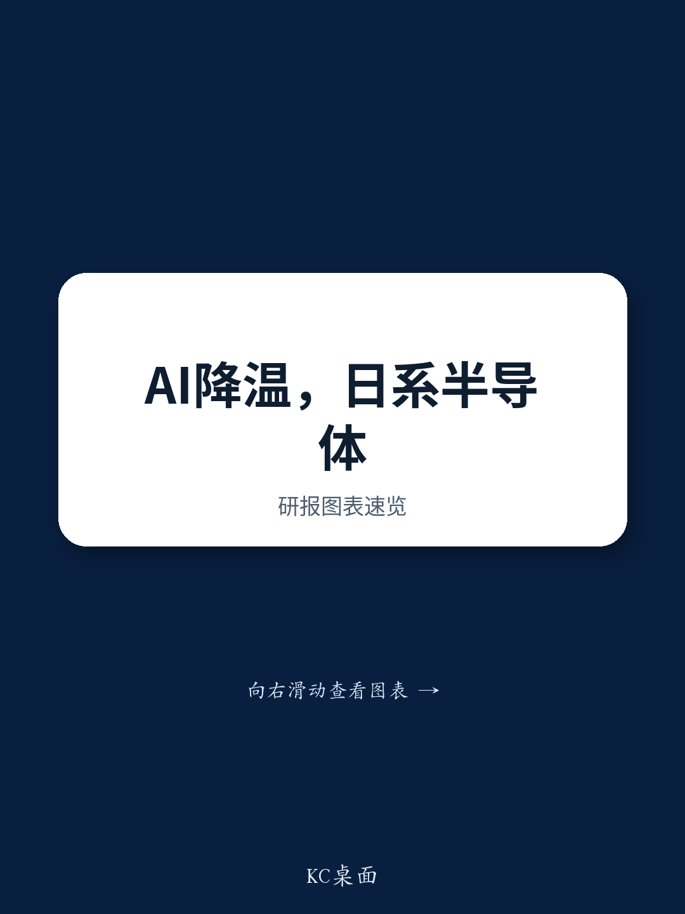

# 日本电气设备与半导体行业观察：AI相关板块的情绪变化与基本面分化

在日本电气设备和半导体领域，一个引人注目的分化正在出现。7月下旬在香港进行的一周读者交流中，市场对AI和数据中心相关公司的情绪明显趋于谨慎，尽管内存和数据中心基础设施的潜在需求图景依然稳健。某存储芯片公司的报价从6月高点112,700日元回落约50%，但许多读者并未将其视为机会，反而开始质疑内存供需平衡能否持续到2027年上半年。推动此前上涨的积极消息仍在出现，但市场反应平淡。这并非业务基本面恶化的故事，而是持仓调整、预期重置，以及市场在周期性噪音与结构性变化之间挣扎的故事。

时机很重要。4-6月财报季即将开始，市场对7-9月NAND定价的共识已是环比增长约20%。许多读者认为，届时出现超预期惊喜的可能性不大，意味着“容易赚的钱”已经赚到。对于管理日本主题组合的参与者而言，问题不再是AI需求是否真实，而是当前从AI相关公司的轮动是创造了机会，还是预示着对这些需求中有多少已被定价的更深入重估。

本分析所依据的报告覆盖了日本电气设备和半导体领域的十家公司。分析师对日立、卡西欧计算机、铠侠、三菱电机和索喜科技维持原有观点，对夏普持一种观点，对剩余公司持另一种观点。但读者交流揭示了一个已经走在评级前面的市场。分析师信念与读者行为之间的差距，是这些数据中最重要的信号。

## 读者对AI相关公司的情绪已从热情转向谨慎，即使供应约束持续存在

此次读者交流最显著的发现是基本面展望与价格走势之间的不对称。作为覆盖范围内最纯粹的AI存储标的，该存储芯片公司的报价从高点腰斩。许多读者最初将下跌归因于韩国存储持有者的去杠杆化，这是一个让基本面逻辑保持完整的技术性解释。但随着交流的推进，一个更根本的担忧浮现：2027年下半年之后的内存供需展望。这是一个前瞻性的担忧，而非当前季度的问题。

分析师对NAND的看法明确看多2026年和2027年，驱动力来自数据中心KV缓存应用需求的激增。这是一个具体、可验证的机制。KV缓存是大语言模型推理所需的内存架构，随着AI工作负载的扩展，对高带宽NAND解决方案的需求会不成比例地增长。报告指出，供应短缺将持续到2026-2027年。然而，读者已经越过这一阶段，开始担忧“悬崖”问题。

这种模式很重要，因为它表明市场正在为存储类公司定价一个“盈利峰值”情景，尽管这个峰值尚未达到。这对组合构建的隐含信息是，日本AI相关公司现在可能需要一个催化剂来重新定价，而不仅仅是持续的基本面强劲。估值倍数扩张的“低垂果实”已经消失。

## 财报季将清晰区分超预期与不及预期，市场已在提前布局

报告提供了明确的财报季偏好。分析师看好铠侠、三菱电机和日立的4-6月业绩。看空夏普、松下、富士电机和索喜科技。这并非随机列表，而是直接映射到读者正在讨论的主题上。

对于三菱电机，看好的理由在于稳健的工厂自动化业绩，以及汽车设备业务正式分拆公告的潜在催化剂。这是一个结构性故事，而非周期性故事。分拆将通过使剩余业务更透明、更专注于高利润的工业自动化来释放价值。读者期待这一公告，这意味着报价可能已经反映了部分概率。但如果公告出现，反应可能很剧烈。

日立则是另一种情况。读者兴趣被描述为“再次不高”，但一些人仍预期业绩超预期。这正是那种低预期环境可能产生积极惊喜的情况。当一个低AI敞口的高质量综合企业未被追捧时，门槛更低。4-6月的超预期可能触发重新定价，恰恰因为没有人为此布局。

在看空方面，夏普和索喜科技吸引了最多的负面读者看法。对于松下，焦点在于能源和工业板块的业绩，而物流软件收购Blue Yonder的中期展望被视为未解决的问题。对于富士电机，报价已经下跌，读者不认为即将到来的业绩是重大风险，但对数据中心UPS业务存在长期担忧。这是一个微妙的区分：短期安全但结构性脆弱。

## 低AI敞口公司提供市场忽视的逆向路径

报告中最反直觉的信号之一是推荐日立和卡西欧计算机作为低AI相关敞口的公司。乍看之下，这似乎是防御性姿态。但逻辑更具战略性。如果AI交易正在降温、情绪正在转变，那些未参与上涨的公司损失更小。它们还拥有独立于AI叙事的独特催化剂。

例如，卡西欧计算机几乎没有引起读者兴趣。给出的理由是4-6月是需求淡季。但淡季业绩不等于差业绩。一家在平静期被忽视的公司，可能在季节性更强的半年到来时带来惊喜。兴趣的缺失本身就是一个数据点。当没有人提问时，预期就很低。

对于日立，低AI敞口与潜在业绩超预期的结合创造了有利的不对称性。如果报价超预期且更广泛的AI交易继续降温，日立可能吸引从过热公司轮出的资金。如果AI交易重新升温，日立足够多元化，能通过其工业和基础设施业务间接受益。这不是对冲，而是一个凸性头寸。

## 决策框架：区分日本电气设备和半导体公司信号与噪音的三个问题

报告详细的逐公司观点可以综合成一个供组合管理者使用的决策框架。该框架有三个维度。

第一，评估公司对内存供需辩论的敞口。如果公司是像铠侠这样的纯存储标的，关键变量不是当前定价，而是市场对2027年供需平衡的看法。分析师认为短缺持续到2027年，但如果读者情绪已经转向2027年的担忧，那么报价可能不会重新定价，直到需求增长轨迹在该时间范围之后可持续的清晰信号出现。对于这些公司，入场时机取决于你相信市场是正确折现了2027年的过剩，还是过度修正。

第二，评估财报季催化剂日历。分析师明确看好的公司，如三菱电机和日立，有可识别的催化剂：分拆公告和业绩超预期。看空的公司，如夏普和索喜科技，面临已部分折现的逆风。问题是坏消息是否已完全定价。对于松下，Blue Yonder的悬而未决是一个中期问题，不会在一个季度内解决。对于富士电机，数据中心UPS的担忧是结构性的，但并非迫在眉睫。

第三，考虑持仓信号。报告指出，读者对卡西欧和明电舍的兴趣较低，部分原因是季节性。淡季公司兴趣低是正常的。但对拥有明确催化剂的公司（如日立的潜在业绩超预期）兴趣低，则是一个逆向信号。当市场不注意时，惊喜的潜力更高。

应用这一框架，最具可操作性的见解是，市场目前过度权重了AI饱和的叙事风险，而低权重了低敞口公司中的独特催化剂。从AI的轮出是真实的，但可能相对于基本面时间线已经过度。

## 日本存储和数据中心公司的结构性看多逻辑依然完整，但市场现在要求交付证明

报告最重要的分析贡献是明确声明，由于数据中心KV缓存领域需求的显著增长，NAND供应短缺将持续到2026-2027年。这不是模糊的看多评论，而是一个具体、可检验的论点。KV缓存需求是AI推理工作负载的直接函数，而这些工作负载的增长速度是内存供应短期内无法匹配的。

读者对2027年下半年的担忧是合理的，但这是一个2027年的问题。现在关注它，市场实际上是在折现一个至少18个月后的峰值。在此期间，铠侠和其他存储公司将报告多个季度的强劲业绩。风险在于市场已经向前看，不会奖励这些业绩。

这创造了一种张力，定义了当前的机会集。如果分析师关于供应短缺持续到2027年的判断正确，那么铠侠当前的回落对于12个月视野的参与者来说是一个机会。如果市场对2027年的担忧是正确的，那么回落是更长期下跌的开始。答案将来自业绩数据。铠侠4-6月的业绩以及7-9月的定价评论将是第一个考验。

对于不愿对存储采取二元看法的参与者，更广泛的教训是，日本电气设备和半导体领域现在是一个选股者的市场。所有AI相关公司水涨船高的日子已经结束。赢家将是那些能够实现业绩超预期、执行结构性转型（如分拆）并证明其增长不完全依赖AI叙事的公司。输家将是那些乘着AI浪潮但没有建立可持续竞争优势的公司。

报告的最后实质性观点是，读者对AI相关公司的情绪已经降温，但潜在的需求驱动因素并未改变。情绪与现实之间的差距正是主动管理可以增加价值的地方。问题不在于是否持有日本电气设备和半导体公司，而在于持有哪些公司，以及以什么价格。

*仅供参考。部分内容可能基于源材料通过AI辅助生成、翻译、总结或编辑，可能存在遗漏或错误。请独立核实。这不构成专业建议。*

仅供参考。部分内容可能基于源材料通过AI辅助生成、翻译、总结或编辑，可能存在遗漏或错误。请独立核实。这不构成专业建议。

