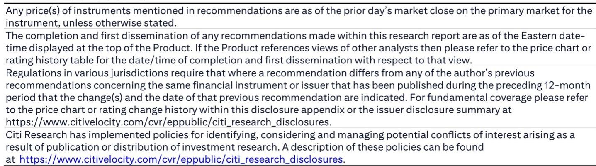
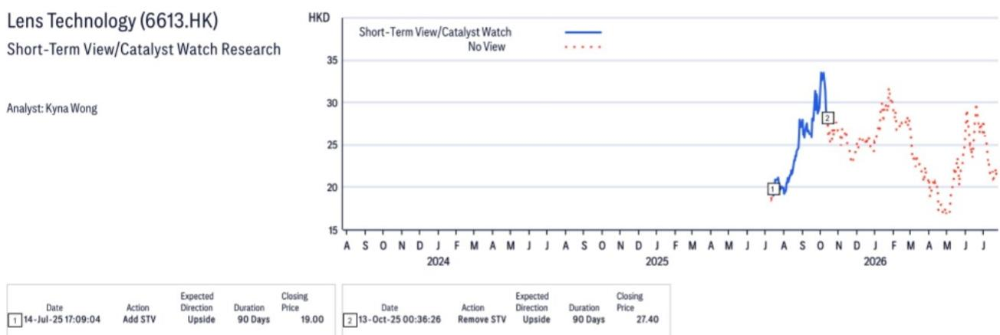
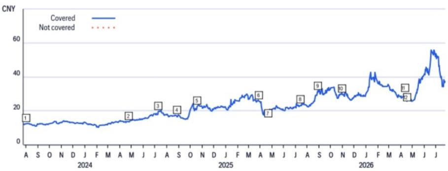

# Intel’s Glass Substrate Ambition Hands Lens Technology a Rare Entry Point into Next-Generation Chip Packaging

On July 25, Intel and Lens Technology announced a strategic collaboration to accelerate glass substrate-based packaging solutions. This is not a routine supply chain agreement. It signals that Intel, having unveiled its first glass substrate in 2023 and introduced its EMIB-T interconnect technology in May 2025, is now moving toward commercialization with a production ramp expected in 2027-2028. For Lens Technology, a company whose core business has been glass covers for smartphones, this partnership represents a pivot into semiconductor packaging infrastructure at precisely the moment when the industry's substrate technology faces a structural bottleneck.

The timing matters. Traditional organic substrates are approaching fundamental physical limits in signal integrity, power delivery, and thermal management as chip designs grow larger and interconnect densities increase. Glass substrates offer a path forward: superior dimensional stability, higher interconnect density, and better power efficiency. But the manufacturing challenges are formidable. Through-glass via (TGV) formation, micro-crack control, and warpage management at scale have stalled commercialization for years. Lens Technology believes its three years of R&D in glass substrate solutions, combined with proven mass-production capabilities in glass grinding and polishing, can solve these yield problems.

What makes this development strategically significant is not just the technology. It is the structural position Lens Technology now occupies. The company is no longer merely a supplier of protective covers for consumer devices. It is becoming a critical enabler of Intel's next-generation packaging roadmap. That shift changes the research perspective for Lens Technology in ways that are not yet reflected in its current valuation.

## Glass Substrates Are Not an Incremental Improvement; They Are a Packaging Paradigm Shift That Rewrites the Supply Chain

The semiconductor industry has long treated packaging as an afterthought, a necessary but unglamorous step between wafer fabrication and final assembly. That assumption is breaking down. As transistor scaling slows, packaging has become the primary lever for performance gains. Advanced packaging techniques such as 2.5D and 3D integration now determine how effectively chips can communicate, how much power they consume, and how much heat they dissipate.

Organic substrates, the incumbent material, were never designed for the current generation of large, high-power chips. They expand and contract with temperature changes, creating misalignment between layers. They absorb moisture, degrading electrical performance over time. They cannot support the ultra-fine line widths and spacing that next-generation interconnects require. Glass substrates solve all three problems. They are dimensionally stable across temperature ranges, impermeable to moisture, and capable of supporting much finer feature sizes.

The catch is manufacturing. Glass is brittle. Drilling through-glass vias at high yield requires precise control of laser parameters, etching chemistry, and thermal management. Grinding and polishing glass to the flatness required for advanced packaging is a different discipline from producing smartphone covers. Lens Technology's three years of dedicated R&D and its existing manufacturing infrastructure in glass processing give it a head start. But the real question is whether that head start translates into a durable competitive advantage or merely a temporary first-mover position.

The answer depends on Intel's willingness to lock in supply chain partners early. Given Intel's stated ambition to commercialize glass substrates by 2027-2028, it cannot afford to wait for multiple suppliers to develop capabilities in parallel. It needs one or two partners who can scale quickly. Lens Technology, with its track record of high-volume glass manufacturing for Apple and Xiaomi, fits that profile. The qualification processes expected this year will determine whether the partnership moves from collaboration to production.

## Lens Technology's Core Business Provides the Manufacturing Credibility That Makes This Partnership Credible

It is easy to dismiss Lens Technology as a consumer electronics supplier venturing into unfamiliar territory. That would be a mistake. The company's core business—producing glass covers for smartphones, tablets, and wearables—requires exactly the process disciplines that glass substrate manufacturing demands: precision grinding, polishing, inspection, and high-yield mass production. The difference is in the application, not the fundamental manufacturing capability.

Consider the scale. Lens Technology's largest clients include Apple and Xiaomi, two of the world's most demanding OEMs in terms of quality, yield, and delivery consistency. Serving those clients requires tolerances measured in microns, defect rates measured in parts per million, and production volumes measured in hundreds of millions of units per year. Glass substrate manufacturing for semiconductor packaging imposes even tighter tolerances, but the underlying process control capabilities are similar.

The company's three-year R&D investment in glass substrate solutions was not speculative. It was a deliberate bet that the packaging industry would eventually need a glass processing specialist. That bet is now paying off. Lens Technology can offer Intel something that pure semiconductor equipment suppliers cannot: proven mass-production experience with glass at scale. The challenge of improving TGV yield and reducing micro-crack and warpage for large packaging sizes is fundamentally a process engineering problem, and Lens Technology has the process engineering DNA.

There is a risk, however. The qualification timeline is uncertain. The report indicates that certain qualification processes are expected this year, with potential product launch from customers next year. That timeline is aggressive. If qualification slips, or if Intel decides to dual-source with another partner, Lens Technology's first-mover advantage could erode. But the structural logic of the partnership is sound. Intel needs a glass processing partner that can ramp to volume quickly. Lens Technology needs an anchor customer that can justify the capital investment. The alignment of interests is unusually strong.

## The Dual Growth Engine Thesis Now Has a Third Pillar, and That Changes the Valuation Framework

The research case for Lens Technology has traditionally rested on two growth engines: automotive and iPhone cover glass upgrades, combined with metal casing share gains and assembly businesses. The A-share rating carries a 报告观点 stance based on fair valuation, while the H-share rating is a 报告观点, reflecting a 25% discount to the A-share P/E multiple and the expectation of re-rating driven by an upcoming key upgrade cycle.

The Intel partnership introduces a third growth engine that does not fit neatly into the existing valuation model. Glass substrate revenue, if it materializes, would not be correlated with smartphone replacement cycles or automotive demand. It would be tied to Intel's packaging roadmap and the broader adoption of glass substrates across the semiconductor industry. That diversification is valuable. It reduces the company's dependence on consumer electronics end-markets and opens a pathway into a higher-margin, longer-cycle business.

The earnings estimates in the report provide a baseline. For the current fiscal year ending December 2025, EPS is forecast at Rmb 0.825 on the A-share, rising to Rmb 1.346 in the following year. That implies a 63% year-over-year increase. The 31% three-year earnings CAGR through various businesses, plus margin improvement. Glass substrate revenue is not yet incorporated into those numbers. If the Intel partnership generates meaningful revenue by 2027-2028, the earnings trajectory could exceed current estimates.

The report explicitly links that premium to cover glass content upgrade in iOS foldable devices. Glass substrate revenue would be additive to that thesis, not substitutive. The risk is that observers treat the Intel partnership as a long-duration option with no near-term revenue, diluting the focus on the core business. But the report's timeline—qualification this year, product launch next year—suggests that revenue visibility could emerge sooner than the market expects.

## A Decision Framework for Evaluating Lens Technology's Glass Substrate Opportunity

For those trying to assess whether this partnership is a genuine inflection point or a speculative sideshow, four questions provide a useful framework.

First, does Intel have a credible path to glass substrate commercialization? The answer is yes, but with caveats. Intel unveiled its first glass substrate in 2023 and introduced EMIB-T in May 2025. The production ramp in 2027-2028 is plausible given Intel's track record in packaging innovation, but the company has also faced execution challenges in its foundry business. Glass substrate manufacturing at scale is unproven. The risk of delays is real.

Second, is Lens Technology uniquely positioned to solve the manufacturing bottleneck? The answer is qualified. No other company combines Lens Technology's scale in glass processing with a willingness to invest in semiconductor packaging applications. But competitors are not standing still. Established substrate suppliers and equipment manufacturers are also developing glass capabilities. Lens Technology's advantage is in process integration and yield management, not in fundamental materials science.

Third, what is the revenue potential if the partnership succeeds? The report does not provide specific revenue estimates for glass substrates, which is appropriate given the early stage. But the addressable market is large. Advanced packaging substrates are a multi-billion-dollar market growing at double-digit rates. Even a single-digit share would be material for a company with Lens Technology's current revenue base.

Fourth, what are the downside risks? The most obvious is qualification failure. If Lens Technology cannot meet Intel's yield and reliability targets, the partnership may not progress beyond pilot production. A second risk is delay in Intel's own roadmap. If Intel pushes its glass substrate commercialization to 2029 or beyond, the near-term catalyst disappears. A third risk is competitive displacement. If a larger supplier, such as a major PCB manufacturer, develops glass substrate capabilities and undercuts Lens Technology on cost, the partnership could lose its strategic rationale.

These risks are real, but they are not unique to Lens Technology. They apply to any company attempting to enter the advanced packaging supply chain. The difference is that Lens Technology has a clear path to revenue within 12-24 months, not 5-10 years. That near-term visibility is what separates this opportunity from speculative technology bets.

## The Partnership Forces a Reassessment of Lens Technology's Competitive Position Beyond Consumer Electronics

Lens Technology has long been viewed as a consumer electronics supplier with exposure to automotive and metal casing growth. The Intel partnership changes that perception. It positions the company as a participant in the semiconductor packaging ecosystem, which has fundamentally different growth dynamics, margin profiles, and competitive moats.

The key insight is that glass substrate manufacturing is not a commodity business. It requires process expertise that takes years to develop and scale. Lens Technology's three years of R&D, combined with its existing manufacturing infrastructure, create a barrier to entry that potential competitors cannot easily replicate. The company is not simply supplying a component. It is providing a manufacturing capability that Intel needs to execute its packaging roadmap.

This is not to suggest that Lens Technology will become a semiconductor company. It will remain a glass processing company. But the application of that processing capability to semiconductor packaging opens a new revenue stream with higher margins and longer product lifecycles than consumer electronics. The automotive business already provided some diversification. The glass substrate business provides a bridge into the semiconductor supply chain, which is structurally more attractive than the smartphone supply chain.

The report's rating split between A-share 报告观点 and H-share 报告观点 reflects this ambiguity. The A-share rating is cautious because near-term valuation is fair. The H-share rating is more optimistic because the discount to A-share creates room for re-rating as the upgrade cycle approaches. The Intel partnership adds a catalyst that could accelerate that re-rating, particularly if qualification milestones are met on schedule.

Observers should watch three signposts over the next 12 months. First, any public update on qualification progress from Intel or Lens Technology. Second, initial revenue recognition from glass substrate products, which the report suggests could begin next year. Third, any additional customer announcements, which would validate the technology beyond Intel. Each of these signposts would increase confidence that the partnership is progressing from collaboration to commercial reality.

---

*For informational purposes only. Portions may be generated, translated, summarized, or edited with AI assistance based on source materials and may contain omissions or errors. Please verify independently. This is not professional advice.*

For informational purposes only. Portions may be generated, translated, summarized, or edited with AI assistance based on source materials and may contain omissions or errors. Please verify independently. This is not professional advice.

