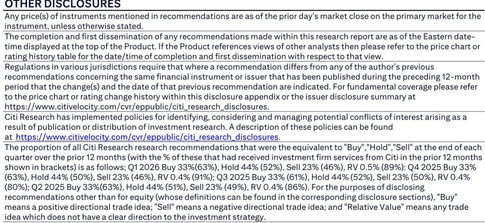

# The Semiconductor Boom Is Reshaping Chemicals Demand, but Housing and China Expose a Two-Track Market

Japan’s specialty chemicals sector is often described as a single ecosystem. The data from ten overseas companies reporting through late July 2026 tells a different story: this is a market splitting into two distinct currents. On one track, semiconductor demand has entered a structural super-cycle, with foundries raising guidance, equipment makers accelerating production capacity, and memory suppliers locking customers into multi-year take-or-pay agreements. On the other track, US housing remains stalled by persistently high interest rates, and China’s decorative paint market—a bellwether for construction-linked chemicals—has shifted from growth to contraction within a single quarter. For observers of Japanese chemical companies, the strategic implication is clear: portfolio exposure to front-end semiconductor materials and life sciences CDMO is becoming a return driver, while exposure to construction-linked coatings and housing-related silicones is becoming a risk that must be actively managed rather than passively accepted.

The divergence is not a short-term tactical pattern. It reflects a fundamental reordering of downstream demand that will determine which Japanese chemical companies compound earnings over the next three to five years and which will face margin compression. The data points are unambiguous. TSMC raised its full-year sales guidance from growth of 30% or more to over 40% year-on-year. ASML increased its full-year sales guidance by roughly 20% and plans to raise low-NA EUV production capacity by 30% in both 2027 and 2028. Micron reports that demand remains well above supply for both DRAM and NAND and expects supply shortages to continue from 2027—a timeline that implies pricing power for upstream material suppliers for at least three more years. These are not cyclical upswings. They are structural capacity deficits driven by AI infrastructure, advanced logic, and memory densification that semiconductor makers themselves describe as multi-year phenomena.

Meanwhile, US homebuilders are cutting guidance. D.R. Horton lowered its homes-closed forecast for fiscal 2026 from 86,000–87,500 to 83,800–84,300, a reduction of roughly 3% that fell well below consensus. Lennar’s new orders declined 4% year-on-year in the March-to-May period, and its guidance for June-to-August implies continued weakness. PulteGroup held its guidance but described the market environment as challenging, with stabilization limited to select states such as Florida. The common thread is affordability: interest rates remain elevated, and homebuyers are exhibiting a cautious stance that homebuilders attribute directly to higher rates and geopolitical uncertainty. For Japanese chemical companies supplying silicones, sealants, or architectural coatings to the US housing market, this is not a temporary soft patch. It is a demand headwind that has persisted through multiple quarters and shows no sign of reversing.

The paint market adds a further layer of complexity. Akzo Nobel’s second-quarter results reveal a sharp regional divergence that mirrors the broader two-track narrative. Southeast Asian decorative paint volumes rose in mid-single digits year-on-year, driven by Vietnam and Indonesia. European decorative paint volumes weakened sequentially, falling from low-single-digit declines in the first quarter to mid-single-digit declines in the second quarter. The most striking shift occurred in China: decorative paint volumes rose in mid-single digits in the first quarter but fell in mid-single digits in the second quarter. Akzo Nobel’s own description—that China decorative paints outperformed the market even as they declined—suggests the underlying market is contracting faster than the company’s reported numbers. For Nippon Paint Holdings, which has significant China exposure, this trend is a material watch item. The reassuring data point is that aggressive pricing has not yet dampened demand: Akzo Nobel implemented price increases that fully offset a roughly 10% rise in raw material costs, and volume has remained broadly flat at the company level. But the China deceleration introduces a risk that pricing power may not hold if volumes continue to deteriorate.

The semiconductor supply chain, by contrast, is operating at a different order of magnitude. The most telling data point is not the revenue growth but the behavior of semiconductor companies themselves. TSMC increased its inventory from 80 days at the end of March to 87 days at the end of June, explicitly to prepare for the 2nm node launch. ASML is not just raising guidance; it is making concrete production capacity commitments two years out. Micron is entering multi-year strategic agreements that include floor prices and take-or-pay clauses—contractual structures that were rare in the memory industry before this cycle. These are not the actions of companies responding to a demand spike. They are the actions of companies that believe the demand base has permanently shifted upward and are building supply chains to match.

For Japanese chemical companies that supply semiconductor materials—including Citi’s coverage names Nittobo and JX Advanced Metals, as well as broader players in photoresists, deposition materials, and CMP slurries—the implication is straightforward. The demand signal from downstream customers is not just strong; it is locked in through contractual mechanisms that provide earnings visibility. The take-or-pay clauses that Micron is negotiating mean that even if end-market demand softens temporarily, material suppliers will receive committed volumes at agreed prices. The floor prices mean that the downside risk that historically plagued commodity-like semiconductor materials is being structurally reduced. This is a qualitative change in the risk profile of the semiconductor materials sub-sector, and it should change how observers evaluate valuation multiples for these companies.

The life sciences segment reinforces the positive track, though with a different risk profile. Lonza’s first-half 2026 sales grew 16% year-on-year on a local-currency basis, and the company maintained its full-year guidance for 11–12% growth. The demand base is broad: major pharmaceutical companies and midsize biotech firms are both increasing their manufacturing outsourcing, and the demand spans early clinical-stage programs through commercial drugs. For Japanese CDMO providers such as AGC and Nitto Denko, the reassurance is that the outsourcing trend is not concentrated in a single therapeutic area or company size. It is a secular shift driven by the cost and complexity of building in-house manufacturing capacity for biologics and advanced therapies. The risk in this segment is that CDMO capacity is also expanding globally, and pricing pressure could emerge if new entrants overbuild. But the current data shows demand still outpacing supply, which suggests that the near-to-medium-term outlook for Japanese CDMO players remains favorable.

The data center investment cycle introduces a nuance that observers should not overlook. Alphabet’s capital expenditure trajectory is extraordinary: quarterly capex rose from $31.9 billion in the first quarter to $44.9 billion in the second quarter, and the company raised its 2026 capex guidance to $195–$205 billion while signaling that 2027 capex will rise sharply from 2026 levels. The direct implication for semiconductor material companies is positive, as data center buildout drives demand for advanced logic, high-bandwidth memory, and AI accelerators. But Alphabet’s free cash flow was negative $5.9 billion in the second quarter, and the company acknowledged that aggressive investment will pressure free cash flow for the foreseeable future. This creates a potential second-order risk: if the largest hyperscalers face cash flow constraints, they may slow the pace of data center construction or shift procurement terms in ways that affect upstream material demand. For now, the near-term signal remains positive, but observers of AI-exposed chemical companies should monitor free cash flow trends at the hyperscaler level as a leading indicator.

## A Decision Framework for Allocating Across the Two Tracks

The data from these ten overseas companies provides the basis for a structured allocation framework that observers can apply to Japanese chemical portfolios. The framework rests on three dimensions: demand visibility, pricing power, and cyclical exposure.

**Demand visibility** is highest in semiconductor materials. Multi-year customer agreements, take-or-pay clauses, and floor prices create earnings visibility that is rare in the chemicals industry. It is moderate in life sciences CDMO, where outsourcing demand is secular but lacks contractual lock-in. It is lowest in housing-linked chemicals and China-exposed paints, where demand is weakening and the duration of the downturn is uncertain.

**Pricing power** is strongest in semiconductor materials and paints. In semiconductor materials, the structural supply deficit gives suppliers leverage. In paints, Akzo Nobel’s ability to pass through raw material cost increases without volume loss demonstrates pricing power that observers may be underestimating. The risk is that this pricing power erodes if volume deterioration continues, particularly in China.

**Cyclical exposure** is lowest in semiconductor materials and life sciences, where demand is driven by structural trends in AI, advanced manufacturing, and biopharma outsourcing. It is highest in housing and construction-linked chemicals, where demand is directly tied to interest rates and consumer confidence.

The framework suggests a clear portfolio tilt. Favor semiconductor materials and CDMO, where demand visibility is high and cyclical exposure is low. Monitor paints, where pricing power provides a buffer but China exposure introduces a material risk that requires active monitoring. Be cautious on housing-linked chemicals, where demand is weak and the catalyst for recovery—lower interest rates—is not yet visible in the data.

The most important insight from this framework is that the two-track market is not a temporary dispersion that will revert. The semiconductor super-cycle has structural drivers—AI infrastructure, advanced node transitions, and memory densification—that will persist regardless of the macroeconomic cycle. The housing weakness has structural drivers as well: elevated interest rates, affordability constraints, and geopolitical uncertainty that are unlikely to resolve quickly. Japanese chemical companies that are positioned on the right track will compound earnings. Those on the wrong track will face margin compression and multiple contraction. The data from these ten companies makes the divergence visible. The strategic question for observers is whether their portfolios reflect it.

*For informational purposes only. Portions may be generated, translated, summarized, or edited with AI assistance based on source materials and may contain omissions or errors. Please verify independently. This is not professional advice.*

For informational purposes only. Portions may be generated, translated, summarized, or edited with AI assistance based on source materials and may contain omissions or errors. Please verify independently. This is not professional advice.

