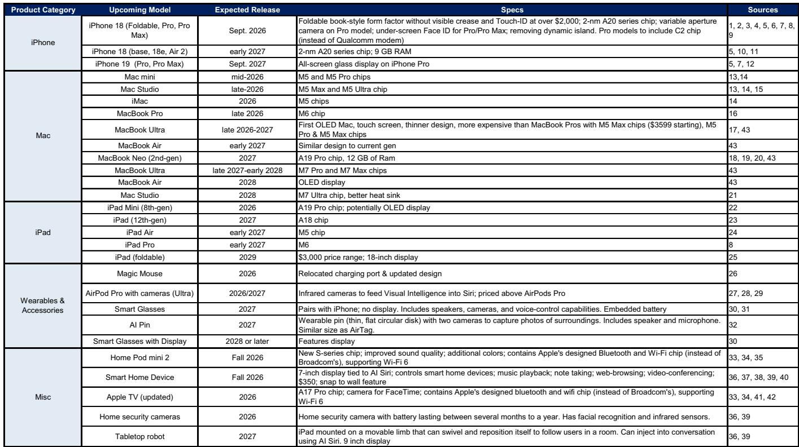
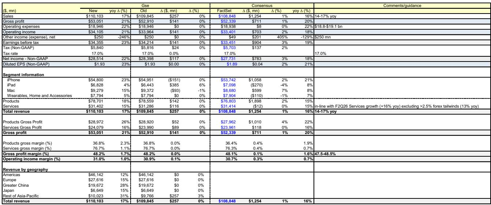
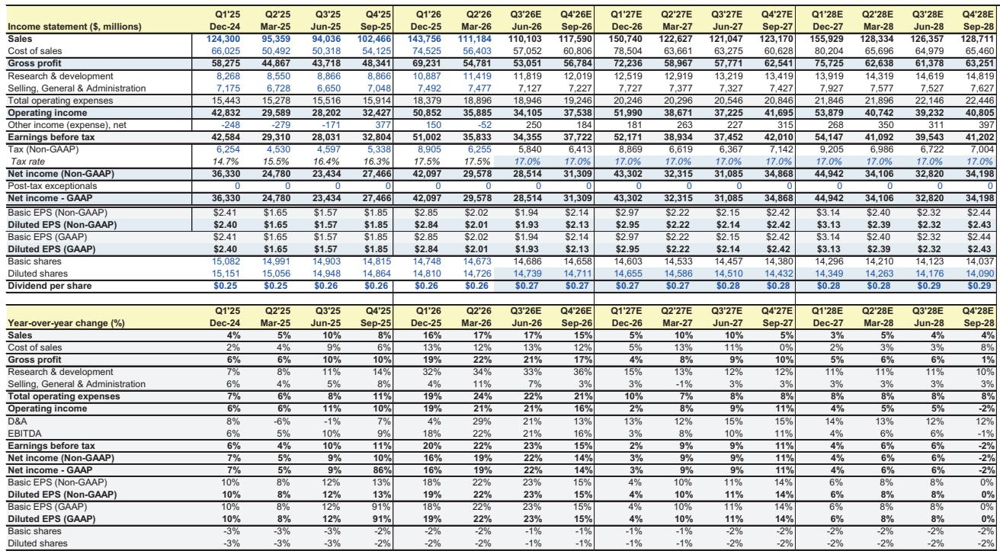

# GS：Apple业务与季度数据观察

这份GS研究笔记的核心判断是：Apple 在 F3Q26（截至 2026 年 6 月的季度）的营收和每股盈利有望同时超出市场预期，但超预期来源并非单一引擎——iPhone 与 Mac 的产品收入是主要驱动力，而服务收入中的 App Store 增速正在节奏变化，需要 iCloud+ 和 AppleCare+ 等产品相关服务来弥补缺口。报告认为，这种“产品强、服务结构变”的组合，正在改变市场对 Apple 盈利可持续性的评估框架。

研究笔记预测 F3Q26 每股盈利为 1.93 美元，高于 FactSet 共识的 1.89 美元；营收 1101 亿美元，高于共识的 1088 亿美元，同比增长 17%，落在公司指引 14%-17% 的上沿。其中 iPhone 收入预计 548 亿美元，同比增长 23%，高于共识的 21% 增速，背后是 15% 的单位出货量增长和 7% 的平均售价提升——后者来自高端机型占比上升。

## 1. 产品收入超预期来自市场份额与定价能力

报告指出，Apple 在 C2Q26 期间表现优于大盘，部分原因是读者从传统AI基础设施交易轮出，但更关键的是 Apple 在行业性内存成本上涨导致的涨价潮中实现了市场份额增长。6 月 Mac 和 iPad 提价公告后报价一度下跌，但GS认为，现有提价（以及可能的进一步提价）将在未来几个季度强化盈利增长。其逻辑是：Apple 用户群体相对缺乏价格弹性，品牌粘性、美国运营商补贴以及近期低价产品（iPhone 17e、MacBook Neo）的推出，共同支撑了销量基础。

> **KC评论：** 这里容易被忽略的是“提价反而强化盈利”的前提条件——不是所有公司都能在涨价时保住销量。报告明确提到了品牌粘性和运营商补贴这两个结构性缓冲，它们才是 Apple 能够执行提价策略而不丢失市场份额的真正壁垒。

## 2. 服务收入增速面临 App Store 结构性节奏变化

服务收入预计同比增长 15%，与共识一致，但结构正在变化。App Store 在中国和日本等地区的佣金率持续受压，增速继续节奏变化。GS认为，产品相关服务（iCloud+、AppleCare+）仍有可观增长空间，足以推动服务业务维持两位数的增速。这一判断的关键在于：服务收入的质量正在从“高利润率的平台抽成”转向“与硬件绑定更紧密的订阅和保修”，后者的增长更依赖于硬件用户基数的扩大与换机周期。

## 3. 毛利率指引上沿与运营费用控制

报告预测 F3Q26 毛利率为 48.2%，落在公司指引 47.5%-48.5% 的上沿，高于共识的 48.1%。产品毛利率预计 36.8%，同比提升 2.3 个百分点；服务毛利率 76.7%，同比提升 1.1 个百分点。运营费用指引为 188-191 亿美元，与报告预测的 189.5 亿美元基本一致。毛利率的改善并非来自单一因素，而是产品组合向高端倾斜、服务收入占比提升以及成本控制共同作用的结果。

## 4. 秋季产品发布提供需求持续性验证窗口

报告提到，Apple 将在年度 9 月活动中发布 iPhone 18 Pro/Pro Max 和 iPhone Fold，这将是检验 iPhone 需求可持续性的关键节点。F2026 财年至今，iPhone 已实现多个季度超过 20% 的同比增长，市场对增速能否维持存在分歧。折叠屏产品的加入可能改变产品组合和平均售价结构，但也带来新的供应链和良率不确定性。GS认为，9 月活动将提供更清晰的信号，帮助市场判断这一轮产品周期的长度和强度。

整体来看，这份报告描绘的 Apple 正处于一个“产品周期强劲、服务结构转型、定价能力验证”的阶段。市场对 Apple 的关注点正在从“AI 是否构成威胁”转向“在硬件涨价和 App Store 受压的双重环境下，盈利增长能否持续”。秋季产品发布和后续几个季度的数据，将是检验这一判断的关键证据。

For informational purposes only. Portions may be generated,translated,summarized,or edited with AI assistance based on source materials and may contain omissions or errors. Please verify independently. This is not investment,legal,tax,accounting,or other professional advice.

For informational purposes only. Portions may be generated,translated,summarized,or edited with AI assistance based on source materials and may contain omissions or errors. Please verify independently. This is not investment,legal,tax,accounting,or other professional advice.

