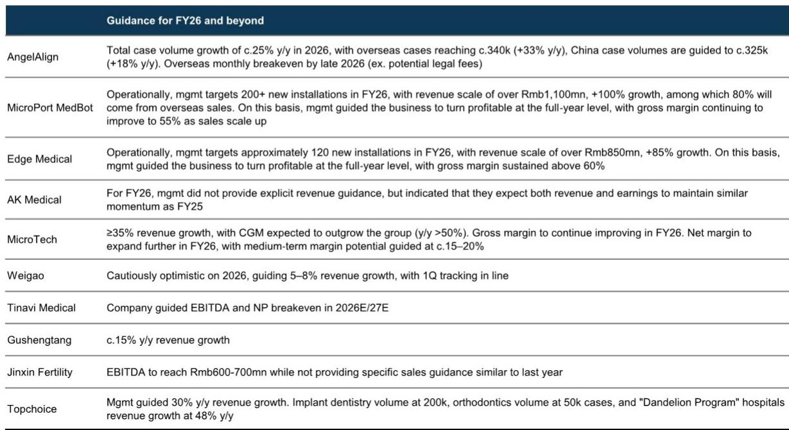
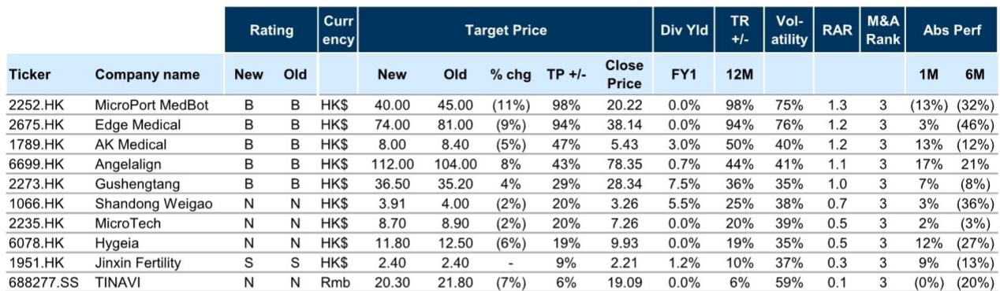
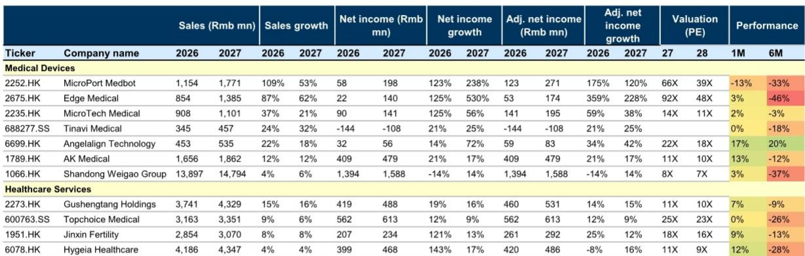

# GS：医疗行业数据与主题变化观察

这份GS在2026年7月发布的研报，覆盖了中国医疗器械与医疗服务板块的11家公司，核心判断是：国内需求复苏的可见度仍然参差不齐，而具备全球化能力的公司正在拉开差距。报告基于2Q/1H26业绩预览，但公司。

过去六个月，中国医疗器械与服务板块报价平均下跌21%，尽管近一个月反弹4.5%，仍落后于更广泛的医疗保健板块（+8.9%）。读者兴趣高度集中在两类公司：一是运营复苏清晰的标的，二是有海外扩张记录的企业。时代天使近一个月上涨16.8%，市场对其国际增长轨迹的信心在增强。手术机器人公司持续吸引大量关注，但报价尚未充分反映近期的海外商业化进展，读者仍在等待订单验证和海外需求的可持续性。

> **KC评论：** 这份报告的核心不是预测行业整体拐点，而是指出“全球化”已经从加分项变成了区分项。，几乎都伴随海外业务超预期，则多因国内政策仍在调整或反腐影响。

## 1. 手术机器人海外商业化进入放量阶段，盈利能力出现拐点

微创机器人和埃斯顿医疗是这一趋势的代表。微创机器人7月22日的盈利预告是一个关键转折点：1H26实现盈利，收入同比增长约200-230%，海外收入增长超过450%，毛利率扩张超过15个百分点。公司累计获得约300台全球订单（其中240+台来自海外），2026年目标安装约200台。埃斯顿医疗累计海外系统安装/发货约100台，手术量超过2万例，运营杠杆正在形成。

AK Medical也发布了正面盈利预告，1H26收入增长约10%，净利润增长超过20%，海外收入同比增长约40%，超出预期。其手术机器人商业化持续推进，截至6月已获得11个招标（其中5个来自海外），强化了海外增长叙事。

## 2. 医疗服务：运营逐步恢复，但消费类服务复苏节奏仍不确定

医疗服务板块的恢复更温和，且分化明显。海吉亚在截至2026年5月的五个月中，门诊量同比增长4%，手术量增长7.6%，定价稳定且病例组合向高复杂度倾斜。公司同时采取了更谨慎的扩张策略，节奏变化重资产资本开支，并计划在2026-28年间每年投入约5亿元人民币用于股东回报。

固生堂保持稳健的营收增长，1Q同比增15%，4-5月增15-20%，与全年指引一致。公司也在增强股东回报，计划年度分红不低于4.5亿港元（派息率约60%），并宣布额外3亿港元回购计划。海外方面，固生堂正在扩大新加坡业务，目标到2026年底开设约50家门店，贡献约3亿元人民币收入。

锦欣生殖的复苏信号更明确：1H26净利润至少9000万元（去年同期净亏损10.44亿元），EBITDA至少2.9亿元。运营数据上，新患者就诊量同比增长9%，取卵周期数增长6%，海外业务增长42%是主要驱动力。

## 3. 政策不确定性仍在，但边际影响趋于稳定

报告指出，国内基本面仍受政策相关逆风制约，包括耗材集采常态化、DRG/DIP下的控费措施，以及2026年下半年即将启动的设备集采。不过，定价不确定性在高基数效应下正在逐步稳定。报告同时提示，自2026年5月以来的最新反腐措施可能对医院采购活动和临床量产生短期影响。

从公司指引看，不同细分领域的政策影响差异明显。时代天使仅约5-7%的收入来自公立医院，集采影响有限。而威高集团对2026年持“谨慎乐观”态度，指引收入增长5-8%，1Q符合预期。天智航则指引2026-27年实现EBITDA和净利润盈亏平衡，反映出国内招标活动节奏变化的行业性仍在调整。

> **KC评论：** 一个容易被忽略的观察框架是：报告对每家公司估值调整的幅度和方向，实际上反映了分析师对“国内政策不确定性敞口”与“海外增长确定性”之间的权衡。，要么受集采影响小，但国内业务面临集采或反腐仍在调整。

## 4. 一个可复用的观察框架：从“是否全球化”到“全球化能否盈利”

报告提供了几个关键指标，可以用来评估一家医疗器械或服务公司的全球化进展是否可持续：海外收入增速是否持续高于国内；海外业务是否接近盈亏平衡点；海外订单/安装量是否可验证；海外毛利率是否高于国内或正在改善。

以时代天使为例，公司指引2026年海外病例数约34万例（同比增长33%），海外业务预计在2026年底实现月度盈亏平衡（不含潜在法律费用）。微创机器人指引2026年收入超过11亿元人民币（同比增长100%），其中80%来自海外销售，全年层面实现盈利，毛利率目标提升至55%。埃斯顿医疗指引2026年收入超过8.5亿元（同比增长85%），全年盈利，毛利率维持60%以上。

这些指引如果兑现，将意味着中国医疗器械公司正在从“产品出口”阶段进入“海外运营盈利”阶段，这对估值框架的影响可能比短期收入增速更大。

For informational purposes only. Portions may be generated,translated,summarized,or edited with AI assistance based on source materials and may contain omissions or errors. Please verify independently. This is not investment,legal,tax,accounting,or other professional advice.

For informational purposes only. Portions may be generated,translated,summarized,or edited with AI assistance based on source materials and may contain omissions or errors. Please verify independently. This is not investment,legal,tax,accounting,or other professional advice.

