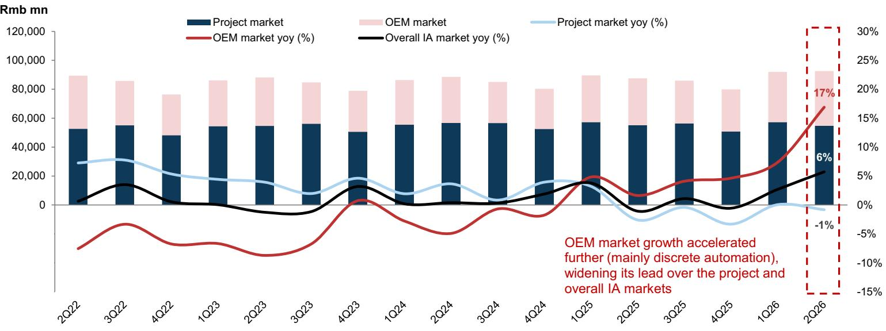
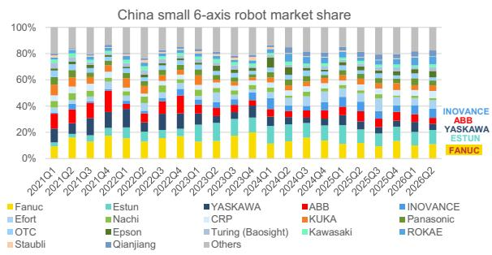
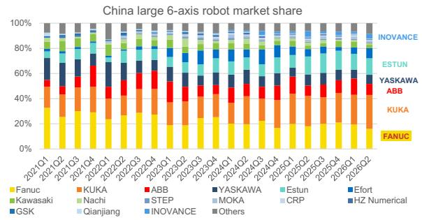
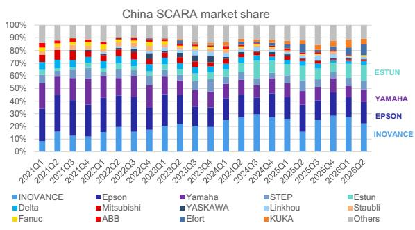
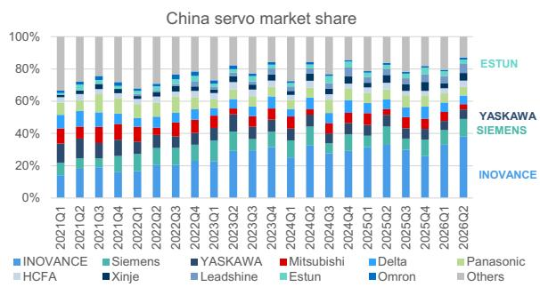
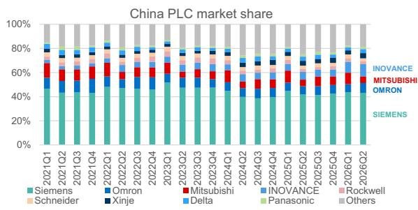
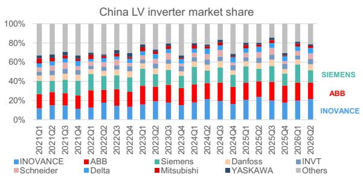
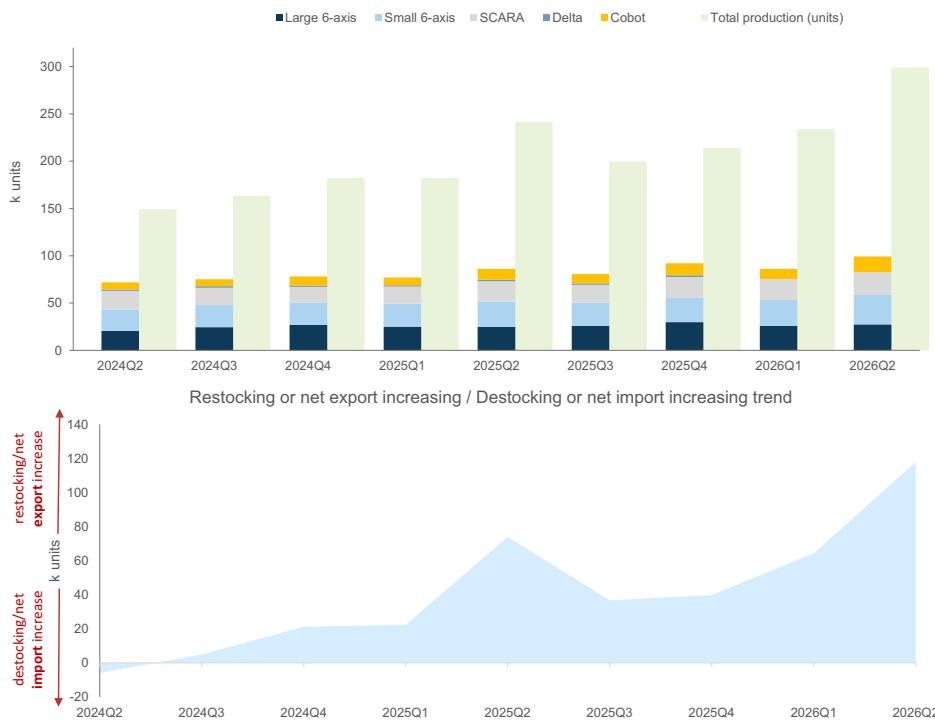
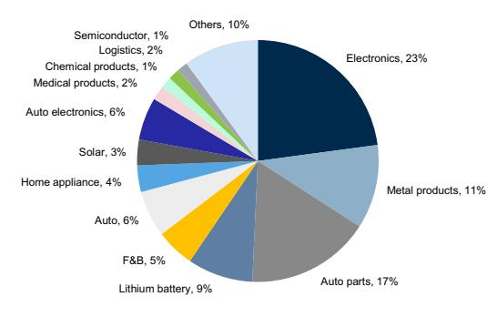
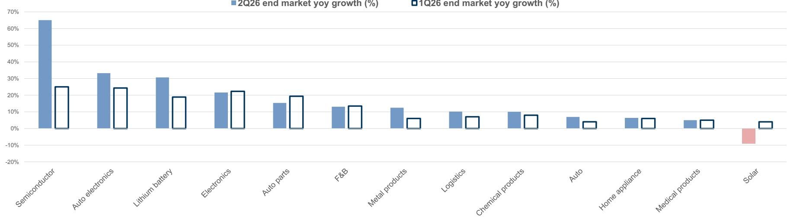

## 2Q26 中国工业机器人与自动化竞争格局关键观察

根据MIR的销售数据（与国家统计局公布的生产数据相对照）以及我们覆盖公司的业务板块披露，我们整理了最新的格局分析。

工业自动化（IA）市场在2Q26同比增长6%，其中项目型/OEM（主要是离散自动化）市场同比分别为-1%/+17%，延续了1Q26可见的OEM引领的复苏。在此背景下，汇川技术再次成为自动化领域最清晰的市场份额获得者：它在伺服、低压变频器和SCARA中保持了第一的市场地位，伺服份额环比+5个百分点/同比+5个百分点至38%，PLC份额同比+4个百分点，SCARA份额同比+6个百分点，这些增长集中在它已占据领先地位的品类，强化了我们的观点，即份额整合正围绕汇川技术较强的垂直领域持续进行。

2Q26工业机器人总销量（根据MIR数据）达到10.1万台，同比+17%/环比+15%，而1Q26为同比+14%/环比-5%。协作机器人仍然是增长最快的细分领域，同比增长43%。相比之下，国家统计局报告的工业机器人产量同比增长24%/环比增长28%。在不同机器人类型中，头部领导地位稳定，但下方竞争依然激烈，埃斯顿/汇川技术保持总体第一/第三，汇川技术维持了其在1Q26从发那科手中夺得的第三名位置，前三名（埃斯顿/库卡（美的）/汇川技术）的同比份额温和集中（分别为0个百分点/+1个百分点/+1个百分点）。

按终端市场划分，增长高度集中于高科技领域。半导体销售加速至同比+65%（自3Q21以来较强增长）；汽车电子和锂电池在2Q26均超过30%的同比增长（1Q26为20%以上）。太阳能在1Q26出现一次性的正增长后，在2Q26恢复至同比-9%。

中国本土工业机器人企业在2Q26显著集中了份额，本土品牌总市场份额达到60%，环比+5个百分点/同比+5个百分点。本土化增长在机器人和控制品类中广泛存在，本土企业在小型六轴/大型六轴/SCARA/伺服中的份额同比分别增长+5个百分点/+2个百分点/+7个百分点/+6个百分点。在公司层面，埃斯顿和汇川技术分别排名总体第一和第三——这与汇川技术在伺服、PLC和SCARA中的自身份额整合方向一致，鉴于其伺服份额同比+5个百分点和SCARA份额同比+6个百分点，汇川技术可能是伺服和SCARA品类层面本土化增长的重要贡献者。一个显著的例外是低压变频器，汇川技术保持第一，但份额同比下降-2个百分点，同时本土企业整体份额同比下降-3个百分点，这与其它领域的广泛本土化增长形成对比。

基于2026年上半年强劲的订单接收（同比增长40%），假设订单前置时间约为1-2个月，我们认为汇川技术2Q的IA收入增长可能在同比30%~40%左右，与1Q相比订单与收入的差距大幅缩小，这得益于2Q初为更好转化而进行的产能扩张。我们预计汇川技术在核心控制品类（变频器、伺服和PLC）中持续获得份额的支持下，将在2Q26业绩中表现优于同行和更广泛的市场。

图表1：2Q26工业自动化市场同比增长6%，项目型/OEM市场为-1%/+17%
工业自动化市场同比增长及按项目型/OEM市场划分

<table><tr><td></td><td>2Q22</td><td>3Q22</td><td>4Q22</td><td>1Q23</td><td>2Q23</td><td>3Q23</td><td>4Q23</td><td>1Q24</td><td>2Q24</td><td>3Q24</td><td>4Q24</td><td>1Q25</td><td>2Q25</td><td>3Q25</td><td>4Q25</td><td>1Q26</td><td>2Q26</td></tr><tr><td colspan="18">市场同比增长</td></tr><tr><td>项目型市场</td><td>7%</td><td>8%</td><td>5%</td><td>4%</td><td>4%</td><td>2%</td><td>5%</td><td>2%</td><td>4%</td><td>1%</td><td>4%</td><td>3%</td><td>-3%</td><td>0%</td><td>-3%</td><td>0%</td><td>-1%</td></tr><tr><td>OEM市场</td><td>-8%</td><td>-3%</td><td>-7%</td><td>-7%</td><td>-9%</td><td>-7%</td><td>1%</td><td>-3%</td><td>-5%</td><td>-1%</td><td>-2%</td><td>5%</td><td>2%</td><td>4%</td><td>5%</td><td>7%</td><td>17%</td></tr><tr><td>总计</td><td>1%</td><td>4%</td><td>1%</td><td>0%</td><td>-1%</td><td>-1%</td><td>3%</td><td>0%</td><td>0%</td><td>0%</td><td>2%</td><td>4%</td><td>-1%</td><td>1%</td><td>-1%</td><td>3%</td><td>6%</td></tr></table>

在2Q26，MIR恢复了之前仅包含项目型和OEM类别的市场结构（停止了1Q26引入的“其他”类别）。

上层控制层
图表2：2Q26中国工业自动化竞争格局中谁在获得和失去市场份额概览，按关键细分领域划分，2Q26市场份额及公司趋势

<table><tr><td>CNC系统</td><td colspan="3">发那科 ↓, 27%</td><td colspan="3">新代 ↑, 20%</td><td colspan="4">三菱, 19%</td><td colspan="3">西门子 ↑, 12%</td><td colspan="2">广州数控 ↓, 8%</td><td>其他, 15%</td></tr><tr><td>中大型PLC</td><td colspan="7">西门子, 51%</td><td colspan="2">欧姆龙 ↑, 10%</td><td colspan="2">汇川技术, 7%</td><td>三菱, 5%</td><td>罗克韦尔 ↓4%</td><td colspan="3">其他, 23%</td></tr><tr><td>小型PLC</td><td colspan="3">西门子, 30%</td><td colspan="3">汇川技术, 15%</td><td colspan="2">信捷 ↑12%</td><td colspan="2">台达 ↑7%</td><td colspan="2">三菱 ↓, 7%</td><td colspan="4">其他, 30%</td></tr><tr><td>工业机器人</td><td>埃斯顿 11%</td><td>库卡（美的）, 10%</td><td>汇川技术 ↓9%</td><td>发那科 ↓...</td><td>埃夫特 ↑6%</td><td>珞石 ↑6%</td><td>爱普生 ↑, 6%</td><td>ABB ↓, 4%</td><td>安川 ↓, 4%</td><td>新时达, 2%</td><td colspan="6">其他, 35%</td></tr><tr><td>伺服</td><td colspan="4">汇川技术 ↑, 38%</td><td colspan="2">西门子 ↑, 11%</td><td>安川, 6%</td><td>雷赛 5%</td><td>松下 5%</td><td>台达 5%</td><td>信捷, 5%</td><td>海浦蒙特, 4%</td><td>三菱, 3%</td><td colspan="2">埃斯顿, 3%</td><td>其他, 14%</td></tr><tr><td>低压变频器</td><td colspan="2">汇川技术 ↑, 23%</td><td colspan="2">ABB, 18%</td><td colspan="2">西门子 ↓, 14%</td><td>丹佛斯 6%</td><td colspan="2">施耐德, 6%</td><td>台达, 6%</td><td>英威腾, 6%</td><td>伟创, 4%</td><td colspan="2">安川, 2%, 三菱, 2%</td><td colspan="2">其他, 13%</td></tr></table>

现场层

1) 黄色高亮表示同比市场份额增长者；深蓝色表示同比市场份额下降者；红色边框线表示我们覆盖的公司；2) 以上数据来自MIR对销售的估计，可能与公司报告的分部收入存在差异。

图表3：在小型六轴机器人中，本土企业/埃斯顿/汇川技术2Q26市场份额同比+5个百分点/+1个百分点/0个百分点
中国市场中主要小型六轴机器人企业的季度市场份额趋势

  
来源：MIR，数据由GS全球研究汇编  
图表4：在大型六轴机器人中，本土企业/埃斯顿/汇川技术2Q26市场份额同比+2个百分点/-1个百分点/-1个百分点
中国市场中主要大型六轴机器人企业的季度市场份额趋势

  
来源：MIR，数据由GS全球研究汇编  
图表5：在SCARA机器人中，本土企业/汇川技术/埃斯顿2Q26市场份额同比+7个百分点/+6个百分点/+1个百分点
中国市场中主要SCARA企业的季度市场份额趋势

  
来源：MIR，数据由GS全球研究汇编  
图表6：在伺服中，本土企业/汇川技术/埃斯顿2Q26市场份额同比+6个百分点/+5个百分点/0个百分点
中国市场中主要伺服企业的季度市场份额趋势  
图表7：在PLC中，汇川技术2Q26市场份额同比+4个百分点
中国市场中主要PLC企业的季度市场份额趋势

  
图表8：在低压变频器中，本土企业/汇川技术2Q26市场份额同比-3个百分点/-2个百分点
中国市场中主要低压变频器企业的季度市场份额趋势  
来源：MIR，数据由GS全球研究汇编

  
来源：MIR，数据由GS全球研究汇编

  
来源：MIR，数据由GS全球研究汇编

工业自动化（IA）市场在2Q26同比增长6%，其中项目型/OEM（主要是离散自动化）市场同比分别为-1%/+17%，延续了1Q26可见的OEM引领的复苏。在此背景下，汇川技术再次成为自动化领域最清晰的市场份额获得者：它在伺服、低压变频器和SCARA中保持了第一的市场地位，伺服份额环比+5个百分点/同比+5个百分点至38%，PLC份额同比+4个百分点，SCARA份额同比+6个百分点，这些增长集中在它已占据领先地位的品类，强化了我们的观点，即份额整合正围绕汇川技术较强的垂直领域持续进行。

2Q26工业机器人总销量（根据MIR数据）达到10.1万台，同比+17%/环比+15%，而1Q26为同比+14%/环比-5%。协作机器人仍然是增长最快的细分领域，同比增长43%。相比之下，国家统计局报告的工业机器人产量同比增长24%/环比增长28%。在不同机器人类型中，头部领导地位稳定，但下方竞争依然激烈，埃斯顿/汇川技术保持总体第一/第三，汇川技术维持了其在1Q26从发那科手中夺得的第三名位置，前三名（埃斯顿/库卡（美的）/汇川技术）的同比份额温和集中（分别为0个百分点/+1个百分点/+1个百分点）。

按终端市场划分，增长高度集中于高科技领域。半导体销售加速至同比+65%，为自3Q21以来较强增长，而汽车电子和锂电池在2Q26均超过30%的同比增长（1Q26为20%以上）。太阳能方面，在1Q26出现一次性的正增长后，恢复至同比-9%。这种组合与我们最新的工业指标一致，这些指标指向高科技和自动化相关基本面的韧性，同时工厂自动化活动增强，强化了我们对FA周期，特别是离散自动化的建设性看法。这也与我们最新的宏观更新一致，该更新强调了不断扩大的“K型”分化以及高科技制造业和相关领域的持续活力。

中国本土工业机器人企业在2Q26显著集中了份额，本土品牌总市场份额达到60%，环比+5个百分点/同比+5个百分点。本土化增长在机器人和控制品类中广泛存在，本土企业在小型六轴/大型六轴/SCARA/伺服中的份额同比分别增长+5个百分点/+2个百分点/+7个百分点/+6个百分点。在公司层面，埃斯顿和汇川技术分别排名总体第一和第三——这与汇川技术在伺服、PLC和SCARA中的自身份额整合方向一致，鉴于其伺服份额同比+5个百分点和SCARA份额同比+6个百分点，汇川技术可能是伺服和SCARA品类层面本土化增长的重要贡献者。一个显著的例外是低压变频器，汇川技术保持第一，但份额同比下降-2个百分点，同时本土企业整体份额同比下降-3个百分点，这与其它领域的广泛本土化增长形成对比。

☐ 对于小型六轴机器人，本土品牌市场份额增至59%（环比+4个百分点/同比+5个百分点）。埃斯顿以11%的份额排名第二（环比+1个百分点/同比+1个百分点），而汇川技术以7%的份额升至第三，得益于销量同比增长16%/环比增长13%。

☐ 对于大型六轴机器人，本土品牌市场份额增至36%（环比+7个百分点/同比+2个百分点），尽管这仍然是本土企业最弱的品类。埃斯顿以13%的份额排名第三（环比+1个百分点/同比-1个百分点）。汇川技术排名从第十升至第八，份额为4%（环比+2个百分点/同比-1个百分点，销量同比-10%/环比+122%）。

☐ 在SCARA机器人中，汇川技术连续第四个季度保持第一，2Q26份额为22%（同比+6个百分点），尽管其份额环比下降5个百分点，主要由于领先海外企业在2Q相对于1Q26的复苏。

☐ 在协作机器人中，埃斯顿排名第十（1Q26为第八），保持4%的市场份额。珞石在2Q26首次超越节卡和遨博，以17%的份额排名第一（环比+7个百分点/同比+4个百分点），得益于销量环比+167%/同比+93%的增长。

图表9：2Q26工业自动化市场同比增长6%，项目型/OEM市场为-1%/+17%
工业自动化市场同比增长及按项目型/OEM/其他市场划分

<table><tr><td></td><td>2Q22</td><td>3Q22</td><td>4Q22</td><td>1Q23</td><td>2Q23</td><td>3Q23</td><td>4Q23</td><td>1Q24</td><td>2Q24</td><td>3Q24</td><td>4Q24</td><td>1Q25</td><td>2Q25</td><td>3Q25</td><td>4Q25</td><td>1Q26</td><td>2Q26</td></tr><tr><td colspan="18">市场同比增长</td></tr><tr><td>项目型市场</td><td>7%</td><td>8%</td><td>5%</td><td>4%</td><td>4%</td><td>2%</td><td>5%</td><td>2%</td><td>4%</td><td>1%</td><td>4%</td><td>3%</td><td>-3%</td><td>0%</td><td>-3%</td><td>0%</td><td>-1%</td></tr><tr><td>OEM市场</td><td>-8%</td><td>-3%</td><td>-7%</td><td>-7%</td><td>-9%</td><td>-7%</td><td>1%</td><td>-3%</td><td>-5%</td><td>-1%</td><td>-2%</td><td>5%</td><td>2%</td><td>4%</td><td>5%</td><td>7%</td><td>17%</td></tr><tr><td>总计</td><td>1%</td><td>4%</td><td>1%</td><td>0%</td><td>-1%</td><td>-1%</td><td>3%</td><td>0%</td><td>0%</td><td>0%</td><td>2%</td><td>4%</td><td>-1%</td><td>1%</td><td>-1%</td><td>3%</td><td>6%</td></tr></table>

在2Q26，MIR恢复了之前仅包含项目型和OEM类别的市场结构（停止了1Q26引入的“其他”类别）。

图表10：2Q26工业机器人总销量达到10.1万台，其中小型六轴/大型六轴/SCARA/Delta/协作机器人销量分别为3.1万/2.7万/2.4万/0.2万/1.6万台。协作机器人继续成为增长最快的细分领域，同比增长43%
按机器人类型划分的季度销量，以及中国季度总产量

<table><tr><td>销量增长 (%)</td><td>2024Q2</td><td>2024Q3</td><td>2024Q4</td><td>2025Q1</td><td>2025Q2</td><td>2025Q3</td><td>2025Q4</td><td>2026Q1</td><td>2026Q2</td></tr><tr><td colspan="10">销量同比增长 (%)</td></tr><tr><td>小型六轴</td><td>-1%</td><td>-3%</td><td>-9%</td><td>4%</td><td>18%</td><td>5%</td><td>9%</td><td>13%</td><td>15%</td></tr><tr><td>大型六轴</td><td>-1%</td><td>-2%</td><td>1%</td><td>12%</td><td>21%</td><td>6%</td><td>10%</td><td>3%</td><td>11%</td></tr><tr><td>SCARA</td><td>8%</td><td>13%</td><td>12%</td><td>11%</td><td>10%</td><td>2%</td><td>34%</td><td>23%</td><td>13%</td></tr><tr><td>Delta</td><td>10%</td><td>8%</td><td>1%</td><td>1%</td><td>4%</td><td>6%</td><td>18%</td><td>8%</td><td>3%</td></tr><tr><td>协作机器人</td><td>44%</td><td>27%</td><td>27%</td><td>41%</td><td>52%</td><td>31%</td><td>31%</td><td>29%</td><td>43%</td></tr><tr><td>总计</td><td>5%</td><td>4%</td><td>2%</td><td>12%</td><td>20%</td><td>7%</td><td>18%</td><td>14%</td><td>17%</td></tr><tr><td colspan="10">销量环比增长 (%)</td></tr><tr><td>小型六轴</td><td>-1%</td><td>3%</td><td>-1%</td><td>4%</td><td>12%</td><td>-9%</td><td>4%</td><td>7%</td><td>14%</td></tr><tr><td>大型六轴</td><td>-8%</td><td>20%</td><td>11%</td><td>-8%</td><td>-2%</td><td>5%</td><td>15%</td><td>-14%</td><td>6%</td></tr><tr><td>SCARA</td><td>20%</td><td>-7%</td><td>-9%</td><td>9%</td><td>19%</td><td>-13%</td><td>19%</td><td>1%</td><td>8%</td></tr><tr><td>Delta</td><td>9%</td><td>1%</td><td>-4%</td><td>-4%</td><td>12%</td><td>3%</td><td>7%</td><td>-11%</td><td>6%</td></tr><tr><td>协作机器人</td><td>29%</td><td>-1%</td><td>29%</td><td>-14%</td><td>38%</td><td>-14%</td><td>29%</td><td>-16%</td><td>53%</td></tr><tr><td>总计</td><td>4%</td><td>5%</td><td>4%</td><td>-1%</td><td>12%</td><td>-6%</td><td>14%</td><td>-5%</td><td>15%</td></tr><tr><td colspan="10">产量增长 (%)</td></tr><tr><td>同比 %</td><td>15%</td><td>37%</td><td>41%</td><td>49%</td><td>62%</td><td>22%</td><td>17%</td><td>28%</td><td>24%</td></tr><tr><td>环比 %</td><td>22%</td><td>9%</td><td>12%</td><td>0%</td><td>33%</td><td>-17%</td><td>7%</td><td>9%</td><td>28%</td></tr></table>

1) 大型/小型六轴机器人分别指负载高于/低于20kg的机器人。2) 假设中国机器人进出口量保持稳定，补库/去库趋势通过季度产量与销量之间的差额是否高于/低于历史平均水平（自2021Q1至当前季度）来追踪。

来源：MIR，国家统计局

图表11：按终端市场划分，半导体销售跃升至同比65%（自3Q21以来最高同比增速）。汽车电子和锂电池在2Q26加速至30%以上同比增长（1Q26为20%以上）。太阳能在一季度出现一次性正增长后，恢复至9%的同比下降
按终端市场划分的工业机器人销售组合及同比增长

2Q26终端市场组合

<table><tr><td>终端市场：同比增长 (%)</td><td>2024Q2</td><td>2024Q3</td><td>2024Q4</td><td>2025Q1</td><td>2025Q2</td><td>2025Q3</td><td>2025Q4</td><td>2026Q1</td><td>2026Q2</td></tr><tr><td>电子</td><td>17%</td><td>27%</td><td>15%</td><td>9%</td><td>26%</td><td>8%</td><td>13%</td><td>22%</td><td>21%</td></tr><tr><td>汽车零部件</td><td>16%</td><td>11%</td><td>12%</td><td>24%</td><td>28%</td><td>13%</td><td>26%</td><td>19%</td><td>15%</td></tr><tr><td>金属制品</td><td>11%</td><td>18%</td><td>7%</td><td>7%</td><td>12%</td><td>4%</td><td>12%</td><td>6%</td><td>12%</td></tr><tr><td>锂电池</td><td>-24%</td><td>-28%</td><td>-11%</td><td>10%</td><td>34%</td><td>17%</td><td>29%</td><td>19%</td><td>31%</td></tr><tr><td>太阳能</td><td>-26%</td><td>-51%</td><td>-40%</td><td>-15%</td><td>-24%</td><td>-22%</td><td>-18%</td><td>4%</td><td>-9%</td></tr><tr><td>汽车</td><td>-10%</td><td>-9%</td><td>-20%</td><td>45%</td><td>33%</td><td>6%</td><td>22%</td><td>4%</td><td>7%</td></tr><tr><td>食品饮料</td><td>8%</td><td>12%</td><td>5%</td><td>6%</td><td>8%</td><td>4%</td><td>7%</td><td>13%</td><td>13%</td></tr><tr><td>汽车电子</td><td>17%</td><td>18%</td><td>15%</td><td>22%</td><td>26%</td><td>16%</td><td>27%</td><td>24%</td><td>33%</td></tr><tr><td>家电</td><td>15%</td><td>29%</td><td>22%</td><td>12%</td><td>6%</td><td>4%</td><td>7%</td><td>6%</td><td>6%</td></tr><tr><td>医疗产品</td><td>8%</td><td>12%</td><td>6%</td><td>8%</td><td>8%</td><td>5%</td><td>8%</td><td>5%</td><td>5%</td></tr><tr><td>物流</td><td>-1%</td><td>4%</td><td>2%</td><td>4%</td><td>7%</td><td>2%</td><td>9%</td><td>7%</td><td>10%</td></tr><tr><td>化工产品</td><td>12%</td><td>9%</td><td>5%</td><td>7%</td><td>10%</td><td>3%</td><td>9%</td><td>8%</td><td>10%</td></tr><tr><td>半导体</td><td>9%</td><td>23%</td><td>12%</td><td>25%</td><td>34%</td><td>30%</td><td>21%</td><td>25%</td><td>65%</td></tr><tr><td>其他</td><td>27%</td><td>26%</td><td>15%</td><td>8%</td><td>35%</td><td>10%</td><td>42%</td><td>3%</td><td>20%</td></tr></table>

■ 2Q26终端市场同比增长 (%)  
□1Q26终端市场同比增长 (%)

  
来源：MIR

图表12：根据我们的估计，2Q26隐含的RV/谐波减速器行业销量可能分别实现同比+14%/+23%的增长
按GSe划分的减速器季度销量及同比增长

<table><tr><td>每台机器人减速器数量</td><td>RV</td><td>谐波</td></tr><tr><td>小型六轴</td><td>2.0</td><td>4.0</td></tr><tr><td>大型六轴</td><td>6.0</td><td>0.0</td></tr><tr><td>SCARA</td><td>0.0</td><td>2.5</td></tr><tr><td>Delta</td><td>0.0</td><td>0.0</td></tr><tr><td>协作机器人</td><td>1.0</td><td>6.0</td></tr></table>

<table><tr><td colspan="10">隐含的RV/谐波减速器销量及增长</td></tr><tr><td></td><td>2024Q2</td><td>2024Q3</td><td>2024Q4</td><td>2025Q1</td><td>2025Q2</td><td>2025Q3</td><td>2025Q4</td><td>2026Q1</td><td>2026Q2</td></tr><tr><td colspan="10">销量（千台）</td></tr><tr><td>RV减速器</td><td>176</td><td>202</td><td>219</td><td>207</td><td>214</td><td>215</td><td>243</td><td>221</td><td>243</td></tr><tr><td>谐波减速器</td><td>185</td><td>184</td><td>193</td><td>192</td><td>230</td><td>204</td><td>233</td><td>229</td><td>283</td></tr><tr><td colspan="10">同比增长 (%)</td></tr><tr><td>RV减速器</td><td>0%</td><td>-1%</td><td>0%</td><td>11%</td><td>22%</td><td>7%</td><td>11%</td><td>6%</td><td>14%</td></tr><tr><td>谐波减速器</td><td>9%</td><td>7%</td><td>4%</td><td>14%</td><td>24%</td><td>11%</td><td>21%</td><td>20%</td><td>23%</td></tr><tr><td colspan="10">环比增长 (%)</td></tr><tr><td>RV减速器</td><td>-6%</td><td>15%</td><td>9%</td><td>-5%</td><td>3%</td><td>1%</td><td>13%</td><td>-9%</td><td>10%</td></tr><tr><td>谐波减速器</td><td>10%</td><td>-1%</td><td>5%</td><td>-1%</td><td>20%</td><td>-11%</td><td>15%</td><td>-2%</td><td>23%</td></tr></table>

注：减速器销量是我们根据MIR在图表3中报告的按类型划分的机器人销量以及我们假设的每台机器人减速器数量估算的。

来源：MIR，GS全球研究

图表13：2Q26中国本土工业机器人企业总市场份额环比+5个百分点/同比+5个百分点至60%。埃斯顿/汇川技术目前分别排名第一/第三
按品牌划分的工业机器人总销量明细

<table><tr><td colspan="3">总计</td><td colspan="2">销量趋势</td><td colspan="7">市场份额</td></tr><tr><td>排名</td><td>品牌</td><td>来源</td><td>2Q26 环比</td><td>2Q26 同比</td><td>2Q25</td><td>1Q26</td><td>2Q26</td><td>2025</td><td>2Q26 环比</td><td>2Q26 同比</td><td></td></tr><tr><td>1</td><td>埃斯顿</td><td>本土</td><td>18%</td><td>15%</td><td>11%</td><td>10%</td><td>11%</td><td>10%</td><td>-</td><td>0pp</td><td>0pp</td></tr><tr><td>2</td><td>库卡（美的）</td><td>海外</td><td>15%</td><td>24%</td><td>9%</td><td>10%</td><td>10%</td><td>10%</td><td>-</td><td>0pp▲</td><td>1pp</td></tr><tr><
