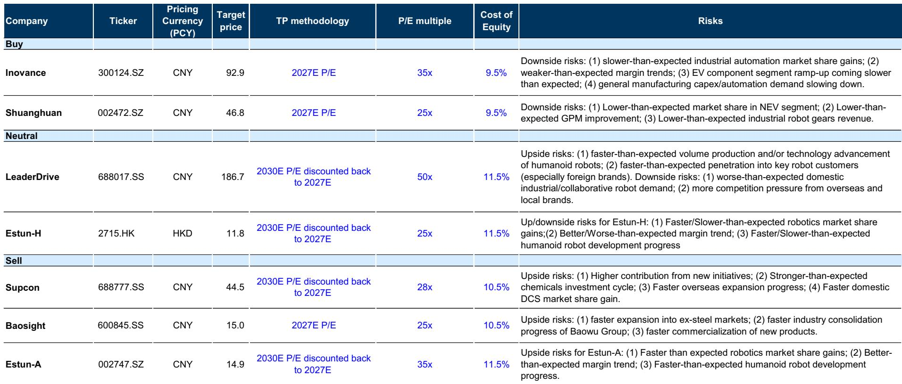
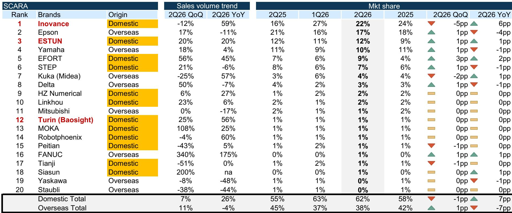
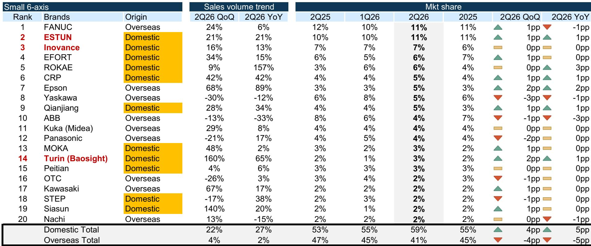

# 行业观察：机器人领域数据与趋势变化

2Q26中国工业自动化市场整体同比增长6%，但结构分化明显。项目型市场同比下降1%，而OEM市场（离散自动化）同比增长17%，延续了1Q26开始的OEM驱动复苏。最新发布的竞争格局分析显示，汇川技术是这一轮复苏中份额增长较为明显的参与者，其在伺服、低压变频器和SCARA机器人领域均保持第一，伺服份额环比和同比均提升5个百分点至38%，PLC份额同比提升4个百分点，SCARA份额同比提升6个百分点。这些增长集中在汇川已具备领先地位的品类，表明份额整合正围绕其较强垂直领域持续进行。

## 1. 工业机器人总销量达10.1万台，协作机器人增速较快

根据MIR数据，2Q26中国工业机器人总销量为10.1万台，同比增长17%，环比增长15%。协作机器人仍是增长较快的细分领域，同比增长43%。国家统计局公布的产量数据同比增长24%、环比增长28%，产量与国内销量之间的差距环比扩大，出口增长吸收了部分产量增量。从机器人类型看，头部格局稳定但竞争依然激烈，埃斯顿和汇川分别保持整体第一和第三，汇川维持了从1Q26起从发那科手中夺得的第三位，前三名（埃斯顿、库卡/美的、汇川）的同比份额变化分别为0、+1、+1个百分点。

## 2. 下游需求高度集中于高科技领域，半导体增速创近年新高

终端市场增长高度集中于高科技垂直行业。半导体领域销售同比增长65%，为3Q21以来较强增速。汽车电子和锂电池均实现超过30%的同比增长，高于1Q26的20%以上。光伏则在1Q26短暂正增长后，2Q26重新转为同比下降9%。这一组合与最新的工业指标一致，指向高科技和自动化相关基本面保持韧性，同时工厂自动化活动正在加强，尤其是在离散自动化领域。

> **观察评论：** 半导体和锂电池的强劲增长并非偶然，它们对应的是制造业中资本开支较为活跃的两个方向。光伏的反复则提醒，并非所有新能源子行业都处于同一周期阶段。读者在评估自动化需求时，需要区分终端市场的结构性差异，而非笼统看总量。

## 3. 国产品牌整体份额突破60%，低压变频器是相对少见例外

2Q26中国本土工业机器人厂商整体市场份额有所集中，国产品牌整体市占率达到60%，环比和同比均提升5个百分点。本土化增长在机器人和控制品类中广泛展开，国产品牌在小六轴、大六轴、SCARA和伺服领域的同比份额分别提升5、2、7、6个百分点。埃斯顿和汇川分别位列整体第一和第三，与汇川在伺服、PLC和SCARA领域的自身份额集中方向一致。低压变频器是明显的例外：汇川虽保持第一，但份额同比下降2个百分点，国产品牌整体份额也同比下降3个百分点，与其他品类广泛的本土化增长形成对比。

## 4. 汇川2Q26订单同比增长40%，收入增长有望收窄与订单差距

基于6M2026订单同比增长40%的表现，假设订单交付周期约1-2个月，汇川2Q26工业自动化收入增速可能在30%-40%之间，订单与收入的差距相比1Q26将大幅收窄，这得益于2Q早期为提升转化率而进行的产能扩张。在核心控制品类（变频器、伺服和PLC）持续获得份额的支持下，汇川有望在2Q26业绩期继续表现优于同行和更广泛的市场。

这份报告提供了一个观察中国自动化竞争格局的框架：OEM市场复苏是当前需求的主要驱动力，高科技领域是增长较为集中的终端市场，而国产品牌的份额集中正在从伺服、SCARA等优势品类向外扩展，但低压变频器领域仍存在结构性差异。对于关注制造业升级的读者，汇川和埃斯顿的份额变化、协作机器人的渗透速度以及半导体和锂电池领域的自动化需求强度，是三个值得持续跟踪的指标。

For informational purposes only. Portions may be generated,translated,summarized,or edited with AI assistance based on source materials and may contain omissions or errors. Please verify independently. This is not investment,legal,tax,accounting,or other professional advice.

For informational purposes only. Portions may be generated,translated,summarized,or edited with AI assistance based on source materials and may contain omissions or errors. Please verify independently. This is not investment,legal,tax,accounting,or other professional advice.

