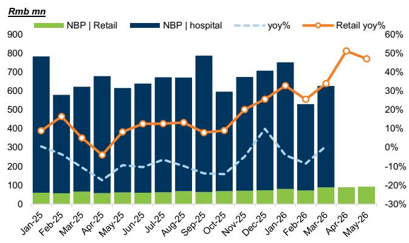
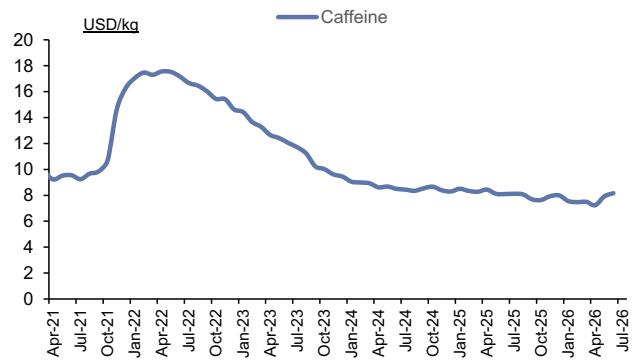
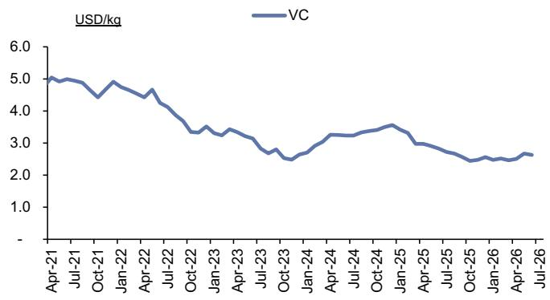
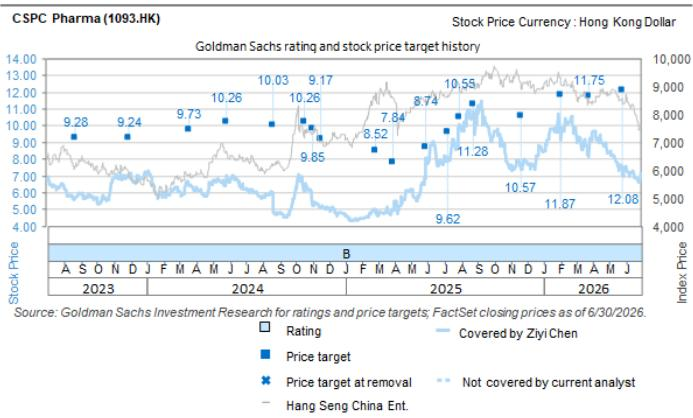

# CSPC Pharma (1093.HK): 业绩预告：合作收入带动表现超预期；成品药销售在政策环境下保持韧性

阿斯利康首付款确认带动业绩超预期；成品药增长加速：CSPC发布正面盈利预告，预计2026年上半年净利润为59亿至62亿元人民币（2025年上半年为25.5亿元），主要得益于与阿斯利康长效GLP-1合作收入的确认。公司预计将在2026年第二季度将12亿美元首付款中的8.4亿美元（约57.4亿元人民币）确认为授权费收入，这意味着约70%的首付款将在2026年上半年入账，超出此前预期，并为业绩带来显著提升。更重要的是，2026年上半年成品药销售同比增长约10%，高于此前预期的同比增长7.3%，与管理层近期在读者日上关于2026年销售增长指引不变的表述一致。这表明尽管5月份以来面临行业环境变化，第二季度增长仍显著加速（同比增长约14%，第一季度为同比增长6.2%）。我们认为这是一个积极信号，表明外部环境对创新药商业化的影响仍在可控范围内。特别是，零售渠道的更强贡献部分抵消了医院渠道的相关影响（例如，渠道调研显示，恩必普在4月至6月期间的零售销售同比增长47%至51%）。

基于阿斯利康收入确认强于预期以及成品药增长表现更佳，我们将2026E/27E/28E的盈利预测分别上调19.3%/2.7%/2.4%，并将12个月目标价从12.08港元上调至12.14港元。

陈子怡
+852-2978-0526 | ziyi.chen@gs.com
GS (Asia) L.L.C.

严鸿林
+852-2978-6666 | honglin.yan@gs.com
GS (Asia) L.L.C.

图表1：恩必普第二季度零售销售增长强劲  

图表2：咖啡因原料药价格6月出现回升信号  
  
来源：PharmCube  
来源：Wind

图表3：维生素C原料药价格第二季度保持疲软  
  
来源：Wind

## 目标价风险与方法论 - CSPC Pharma

我们的12个月目标价12.14港元基于分部估值法：1）恩必普的现金流折现估值为88亿港元（考虑了2029E集采情景），2）新产品线的现金流折现估值为557亿港元，3）成熟产品组合及仿制药业务估值为358亿港元，4）原料药业务按2026E预期市盈率4.8倍估值（29亿港元）。折现率为9%。主要下行风险：1）恩必普集采早于预期；2）新产品放量慢于预期；3）重大研发项目失败；4）仿制药降价影响大于预期。我们给予报告评级。

## 投资论点 - CSPC Pharma

CSPC是中国领先的制药企业，专注于中枢神经系统、肿瘤、心血管和感染性疾病等治疗领域。鉴于公司当前主要产品（包括恩必普、多美素、津优力和克艾力）已接近销售峰值（2023年合计占成品药销售超过50%），而新上市产品正在逐步放量，我们预计公司未来两年销售增长将加速。此外，其早期研发管线和新药技术平台在更多临床数据公布后，可能带来潜在的上行空间。新的业务合作交易可能为公司带来增量收入来源。鉴于CSPC相比同行业公司的估值吸引力，以及其ADC管线的潜在近期催化剂，我们给予报告评级。主要下行风险：1）恩必普集采早于预期；2）新产品收入增长慢于预期；3）重大研发项目失败；4）业务合作进展缓慢。

<table><tr><td>1093.HK</td><td>12个月目标价：12.14港元</td><td colspan="2">现价：8.30港元</td><td colspan="2">潜在空间：46.3%</td></tr>
<tr><td>买入</td><td>GS预测</td><td></td><td></td><td></td><td></td></tr>
<tr><td rowspan="12">市值：956亿港元 / 122亿美元 企业价值：862亿港元 / 110亿美元 3个月日均交易量：7.816亿港元 / 9970万美元 中国 中国制药与生物科技 并购排名：3 租赁计入净债务及企业价值？：否</td>
<td rowspan="2">收入（百万元人民币）新</td>
<td>12/25</td>
<td>12/26E</td>
<td>12/27E</td>
<td>12/28E</td>
</tr>
<tr>
<td>26,006.0</td>
<td>32,317.1</td>
<td>32,579.9</td>
<td>35,014.7</td>
</tr>
<tr>
<td>收入（百万元人民币）旧</td>
<td>26,006.0</td>
<td>30,195.9</td>
<td>31,914.3</td>
<td>34,375.0</td>
</tr>
<tr>
<td>EBITDA（百万元人民币）</td>
<td>4,945.7</td>
<td>10,286.5</td>
<td>9,364.8</td>
<td>8,993.2</td>
</tr>
<tr>
<td>每股收益（人民币）新</td>
<td>0.34</td>
<td>0.68</td>
<td>0.63</td>
<td>0.60</td>
</tr>
<tr>
<td>每股收益（人民币）旧</td>
<td>0.34</td>
<td>0.57</td>
<td>0.61</td>
<td>0.59</td>
</tr>
<tr>
<td>市盈率（倍）</td>
<td>19.9</td>
<td>10.5</td>
<td>11.5</td>
<td>12.0</td>
</tr>
<tr>
<td>市净率（倍）</td>
<td>2.4</td>
<td>2.1</td>
<td>1.9</td>
<td>1.8</td>
</tr>
<tr>
<td>股息率（%）</td>
<td>2.6</td>
<td>4.8</td>
<td>4.4</td>
<td>4.2</td>
</tr>
<tr>
<td>CROCI（%）</td>
<td>14.4</td>
<td>24.8</td>
<td>24.3</td>
<td>22.4</td>
</tr>
<tr>
<td></td>
<td>3/26</td>
<td>6/26E</td>
<td>9/26E</td>
<td>12/26E</td>
</tr>
<tr>
<td>每股收益（人民币）</td>
<td>0.08</td>
<td>0.45</td>
<td>0.08</td>
<td>0.08</td>
</tr>
</table>

来源：公司数据，GS预测，FactSet。价格截至2026年7月27日收盘。

## 披露附录

## Reg AC

我们，陈子怡和严鸿林，特此证明本报告中表达的所有观点准确反映了我们对相关公司及其证券的个人观点。我们还证明，我们的薪酬中没有任何部分直接或间接与本报告中表达的具体建议或观点相关。

除非另有说明，本报告封面所列的个人均为GS全球投资研究部分析师。

撰稿作者：陈子怡 GS (Asia) L.L.C.，严鸿林 GS (Asia) L.L.C.。

除非另有说明，本报告撰稿作者披露中列出的个人均为GS全球投资研究部分析师。

## GS因子概况

GS因子概况通过将股票的关键属性与市场（即我们评级的股票范围）及其行业同行进行比较，提供投资背景。所描绘的四个关键属性是：增长、财务回报、倍数（例如估值）和综合（增长、财务回报和倍数的综合）。增长、财务回报和倍数是通过使用每只股票特定指标的标准化排名来计算的。然后将指标的标准化排名进行平均，并转换为相关属性的百分位数。每个指标的具体计算可能因财年、行业和地区而异，但标准方法如下：

增长基于股票的前瞻性销售增长、EBITDA增长和每股收益增长（对于金融股，仅基于每股收益和销售增长），较高的百分位数表示增长较高的公司。财务回报基于股票的前瞻性净资产回报表现、已动用资本回报率和CROCI（对于金融股，仅基于净资产回报表现），较高的百分位数表示财务回报较高的公司。倍数基于股票的前瞻性市盈率、市净率、价格/股息、EV/EBITDA、EV/FCF和EV/债务调整后现金流（对于金融股，仅基于市盈率、市净率和价格/股息），较高的百分位数表示交易倍数较高的股票。综合百分位数计算为增长百分位数、财务回报百分位数和（100% - 倍数百分位数）的平均值。

财务回报和倍数使用GS分析师对未来至少三个季度后的财年结束时的预测。增长使用对未来至少七个季度后的财年与未来至少三个季度后的财年相比的输入（所有指标均基于每股）。

有关我们如何计算GS因子概况的更详细说明，请联系您的GS代表。

## 并购排名

在我们的全球覆盖范围内，我们使用并购框架审视股票，考虑定性因素和定量因素（可能因行业和地区而异），以纳入某些公司可能被收购的潜在可能性。然后，我们分配一个并购排名，作为对我们评级覆盖范围内的公司从1到3进行评分的方法，其中1表示公司成为收购目标的可能性高（30%-50%），2表示可能性中等（15%-30%），3表示可能性低（0%-15%）。对于排名为1或2的公司，根据我们的标准部门指南，我们将并购组成部分纳入我们的目标价。并购排名为3被视为不重要，因此不计入我们的目标价，并且可能在研究中讨论或不讨论。

## Quantum

Quantum是GS的专有数据库，提供对详细财务报表历史、预测和比率的访问。它可用于对单个公司进行深入分析，或比较不同行业和市场的公司。

## 披露

CSPC Pharma的评级是相对于其覆盖范围内的其他公司：3SBio Inc.、Abbisko Therapeutics、Antengene、Ascletis Pharma Inc.、BeOne Medicines Ltd. (A)、BeOne Medicines Ltd. (ADR)、Betta Pharma、CARsgen Therapeutics、CSPC Pharma、CStone Pharma、中国医疗系统控股、Everest Medicines、复星医药 (A)、复星医药 (H)、翰森制药、恒瑞医药、复宏汉霖、海普瑞、Impact Therapeutics、诺诚健华 (A)、诺诚健华 (H)、信达生物、加科思、科伦博泰、康诺亚生物、传奇生物、丽珠集团 (A)、丽珠集团 (H)、绿叶制药、欧康维视、中国生物制药、联邦制药国际、再鼎医药 (ADR)、再鼎医药 (H)

## 公司特定监管披露

以下披露涉及GS集团（及其附属机构，“GS”）与GS全球投资研究所涵盖的公司之间的关系。

GS做市该证券或衍生品：CSPC Pharma (8.30港元)

评级/投资银行关系分布
GS投资研究全球股票覆盖范围

<table><tr><td rowspan="2"></td><td colspan="3">评级分布</td><td colspan="3">投资银行关系</td></tr>
<tr><td>买入</td><td>中性</td><td>卖出</td><td>买入</td><td>中性</td><td>卖出</td></tr>
<tr><td>全球</td><td>50%</td><td>34%</td><td>16%</td><td>65%</td><td>59%</td><td>43%</td></tr>
</table>

截至2026年7月1日，GS全球投资研究对3,104只股票有投资评级。GS将股票指定为买入和卖出，列入各个地区的投资清单；未如此指定的股票被视为中性。就FINRA规则要求的上述披露而言，此类分配等同于买入、持有和卖出。请参阅下面的“评级、覆盖范围和相关定义”。投资银行关系图表反映了每个评级类别中GS在过去十二个月内提供过投资银行服务的公司所占的百分比。

目标价和评级历史图表  
  
所示目标价应结合所有先前发布的GS报告（可能包含或不包含目标价）以及公司、其行业和金融市场的发展情况来考虑。

## 目标价历史表格 CSPC Pharma (1093.HK)

<table><tr><td>报告日期</td><td>目标价（港元）</td><td>收盘价（港元）</td></tr>
<tr><td>2026年5月28日</td><td>12.08</td><td>6.96</td></tr>
<tr><td>2026年3月26日</td><td>11.75</td><td>8.16</td></tr>
<tr><td>2026年2月2日</td><td>11.87</td><td>9.15</td></tr>
<tr><td>2025年11月20日</td><td>10.57</td><td>7.72</td></tr>
<tr><td>2025年8月24日</td><td>11.28</td><td>10.51</td></tr>
<tr><td>2025年7月30日</td><td>10.55</td><td>10.10</td></tr>
<tr><td>2025年7月8日</td><td>9.62</td><td>7.86</td></tr>
<tr><td>2025年5月29日</td><td>8.74</td><td>7.62</td></tr>
<tr><td>2025年3月30日</td><td>7.84</td><td>5.06</td></tr>
<tr><td>2025年2月25日</td><td>8.52</td><td>5.03</td></tr>
<tr><td>2024年11月17日</td><td>9.17</td><td>5.13</td></tr>
<tr><td>2024年11月1日</td><td>9.85</td><td>5.27</td></tr>
<tr><td>2024年10月18日</td><td>10.26</td><td>6.57</td></tr>
<tr><td>2024年8月21日</td><td>10.03</td><td>5.68</td></tr>
<tr><td>2024年5月27日</td><td>10.26</td><td>6.89</td></tr>
<tr><td>2024年3月20日</td><td>9.73</td><td>6.41</td></tr>
<tr><td>2023年11月30日</td><td>9.24</td><td>7.05</td></tr>
<tr><td>2023年10月5日</td><td>9.28</td><td>5.30</td></tr>
<tr><td>2023年8月23日</td><td>9.28</td><td>5.63</td></tr>
</table>

表格中所示目标价未针对公司行动进行调整。

## 监管披露

## 美国法律法规要求的披露

请参阅上述公司特定监管披露，了解本报告中提及的公司所需的任何以下披露：待定交易中的经理或联合经理；1%或以上所有权；特定服务的报酬；客户关系类型；先前期间的已管理/联合管理公开发行；董事职位；对于股票证券，做市和/或专家角色。GS可能作为本金交易或可能交易本报告中讨论的发行人的债务证券（或相关衍生品）。

以下是额外要求的披露：所有权和重大利益冲突：GS政策禁止其分析师、向分析师报告的专业人员及其家庭成员持有分析师覆盖范围内任何公司的证券。分析师薪酬：分析师的薪酬部分基于GS的盈利能力，其中包括投资银行收入。分析师作为高管或董事：GS政策通常禁止其分析师、向分析师报告的人员或其家庭成员担任分析师覆盖范围内任何公司的高管、董事或顾问。非美国分析师：非美国分析师可能不是GS & Co. LLC的关联人员，因此可能不受FINRA规则2241或FINRA规则2242关于与主题公司沟通、公开露面以及交易分析师所覆盖证券的限制。

## 美国以外司法管辖区法律法规要求的额外披露

以下披露是所指示司法管辖区要求的，除非已根据美国法律和法规在上文作出。澳大利亚：GS Australia Pty Ltd及其附属公司不是澳大利亚《1959年银行法》（联邦）定义的授权存款机构，在澳大利亚不提供银行服务，也不从事银行业务。除非GS另有约定，本研究及其任何访问仅适用于澳大利亚《公司法》含义内的“批发客户”。在编制研究报告时，GS Australia全球投资研究部门的成员可能会参加由研究报告主题公司和其他实体主办或组织的实地考察和其他会议。在某些情况下，如果GS Australia认为在实地考察或会议的具体情况下适当且合理，此类实地考察或会议的费用可能部分或全部由相关发行人承担。如果本文档内容包含任何金融产品建议，则仅为一般性建议，由GS在未考虑客户的目标、财务状况或需求的情况下编制。客户在根据任何此类建议采取行动之前，应考虑该建议是否适合其自身的目标、财务状况和需求。某些GS Australia和New Zealand的利益披露以及GS的澳大利亚卖方研究独立性政策声明的副本可在以下网址获取：https://www.goldmansachs.com/disclosures/australia-new-zealand/index.html。巴西：有关CVM第20号决议的披露信息可在以下网址获取：https://www.gs.com/worldwide/brazil/area/gir/index.html。在适用的情况下，根据CVM第20号决议第20条定义，对本研究报告内容负主要责任的巴西注册分析师是本报告开头指定的第一作者，除非文本末尾另有说明。加拿大：此信息仅供您参考，在任何情况下均不应被解释为GS & Co. LLC为在加拿大购买证券以交易任何加拿大证券而进行的广告、要约或招揽。GS & Co. LLC未在加拿大任何司法管辖区根据适用的加拿大证券法注册为交易商，通常不被允许交易加拿大证券，并且可能被禁止在加拿大某些司法管辖区出售某些证券和产品。如果您希望在加拿大交易任何加拿大证券或其他产品，请联系GS Canada Inc.（GS集团公司的附属公司）或其他注册的加拿大交易商。香港：可根据要求从GS (Asia) L.L.C.获取本研究中提及的所覆盖公司证券的进一步信息。印度：可从GS (India) Securities Private Limited获取本研究中提及的主题公司或公司的进一步信息，研究分析师 - SEBI注册号INH000001493，地址：10th Floor, Ascent-Worli, Sudam Kalu Ahire Marg, Worli, Mumbai-400 025, India，公司识别号U74140MH2006FTC160634，电话+91 22 6616 9000，传真+91 22 6616 9001。GS可能实益拥有本研究报告中所提及的主题公司或公司1%或以上的证券（该术语在印度《1956年证券合同（监管）法》第2(h)条中定义）。SEBI的注册和NISM的认证绝不保证中介机构的业绩，也不向读者提供任何回报保证。GS (India) Securities Private Limited的合规官和读者投诉联系详情、年度合规审计报告副本以及其他相关信息和披露可在以下链接找到：https://www.goldmansachs.com/worldwide/india/research-analyst。日本：见下文。韩国：除非GS另有约定，本研究及其任何访问仅适用于《金融服务和资本市场法》含义内的“专业读者”。可从GS (Asia) L.L.C.首尔分行获取本研究中提及的主题公司或公司的进一步信息。新西兰：GS New Zealand Limited及其附属公司在新西兰既不是“注册银行”也不是“存款接受者”（定义见《1989年新西兰储备银行法》）。除非GS另有约定，本研究及其任何访问适用于《2008年金融顾问法》含义内的“批发客户”。某些GS Australia和New Zealand的利益披露副本可在以下网址获取：https://www.goldmansachs.com/disclosures/australia-new-zealand/index.html。俄罗斯：在俄罗斯联邦分发的研究报告不是俄罗斯立法中定义的广告，而是信息和分析，其主要目的不是推广产品，并且不提供俄罗斯立法关于评估活动含义内的评估。研究报告不构成俄罗斯法律法规定义的个人化研究交流，不针对特定客户，并且是在未分析客户的财务状况、投资概况或风险概况的情况下编制的。GS不对客户或任何其他人基于本研究报告可能做出的任何投资决策承担任何责任。新加坡：GS (Singapore) Pte.（公司编号：198602165W），受新加坡金融管理局监管，对本研究承担法律责任，如有任何与本研究报告相关的事宜，应联系该公司。台湾：此材料仅供参考，未经许可不得转载。读者应仔细考虑其自身的投资风险。投资结果由个人读者自行负责。英国：在英国将被归类为零售客户（定义见金融行为监管局规则）的人士，应结合先前GS关于本报告所提及的所覆盖公司的报告阅读本研究，并应参考GS International已发送给他们的风险警告。这些风险警告的副本以及本报告中使用的某些金融术语的词汇表，可应要求从GS International获取。

欧盟和英国：有关欧盟委员会授权条例(EU) (2016/958)第6(2)条的披露信息（该条例补充了欧洲议会和理事会的条例(EU) No 596/2014，包括该授权条例在英国脱离欧盟和欧洲经济区后作为英国国内法律和法规实施的情况），涉及研究交流或建议投资策略的其他信息客观呈现的技术安排以及特定利益或利益冲突迹象的披露，可在以下网址获取：https://www.gs.com/disclosures/europeanpolicy.html，其中说明了与投资研究相关的利益冲突管理的欧洲政策。

日本：GS Japan Co., Ltd.是在关东财务局注册的金融工具交易商，注册号金商第69号，并且是日本证券业协会、日本金融期货协会、第二类金融工具业协会和日本投资管理协会的成员。股票买卖需支付与客户预先确定的佣金加上消费税。有关日本证券交易所、日本证券业协会或日本证券金融公司要求的任何适用披露，请参阅公司特定披露。

## 评级、覆盖范围和相关定义

买入 (B)，中性 (N)，卖出 (S) 分析师建议将股票作为买入或卖出纳入各个地区的投资清单。被指定为投资清单上的买入或卖出取决于股票相对于其覆盖范围的总回报潜力。任何未被指定为投资清单上的买入或卖出且具有有效评级（即未被暂停评级、未评级、早期生物科技、暂停覆盖或未覆盖的股票）的股票被视为中性。每个地区管理区域信念清单，这些清单选自各自地区投资清单上的报告评级股票，代表侧重于总回报潜力大小和/或在其各自覆盖范围内实现回报的可能性的研究交流。此类信念清单中股票的添加或移除由各自地区的投资审查委员会或其他指定委员会管理，并不代表分析师对此类股票的投资评级发生变化。

总回报潜力代表当前股价与目标价之间的上行或下行差异，包括所有已支付或预期股息，预计在目标价相关的时间范围内实现。所有覆盖的股票都需要目标价。总回报潜力、目标价和相关时间范围在每份添加或重申投资清单成员资格的报告中有说明。

覆盖范围：每个覆盖范围内的所有股票列表可通过主要分析师、股票和覆盖范围在以下网址获取：https://www.gs.com/research/hedge.html。

未评级 (NR)。当GS在此公司涉及并购或战略交易中担任顾问角色时，当存在法律、监管或政策限制（由于GS参与交易）时，以及在某些其他情况下，根据GS政策，投资评级、目标价和盈利预测（如相关）将被移除。早期生物科技 (ES)。根据GS政策，当该公司既没有通过II期临床试验的药物、治疗或医疗设备，也没有获得分销后II期药物、治疗或医疗设备的许可时，不分配投资评级和目标价。评级暂停 (RS)。GS已暂停此股票的投资评级和目标价，因为没有足够的基本面基础来确定投资评级或目标价。先前的投资评级和目标价（如有）对此股票不再有效，不应依赖。覆盖暂停 (CS)。GS已暂停对此公司的覆盖。未覆盖 (NC)。GS不覆盖此公司。

## 全球产品；分发实体

GS全球投资研究为GS的客户在全球范围内制作和分发研究产品。位于GS全球各办事处的分析师对行业和公司进行研究，并对宏观经济、货币、大宗商品和投资组合策略进行研究。本研究由以下机构在澳大利亚分发：GS Australia Pty Ltd (ABN 21 006 797 897)；在巴西：GS do Brasil Corretora de Títulos e Valores Mobiliários S.A.；GS巴西公共沟通渠道：0800 727 5764 和/或 contatogoldmanbrasil@gs.com。工作日（节假日除外）上午9点至下午6点开放。在加拿大：GS & Co. LLC；在香港：GS (Asia) L.L.C.；在印度：GS (India) Securities Private Ltd.；在日本：GS Japan Co., Ltd.；在韩国：GS (Asia) L.L.C.首尔分行；在新西兰：GS New Zealand Limited；在俄罗斯：OOO GS；在新加坡：GS (Singapore) Pte.（公司编号：198602165W）；在美国：GS & Co. LLC。GS International已批准本研究在英国的分发。

GS International (“GSI”)，由审慎监管局授权并由金融行为监管局和审慎监管局监管，已批准本研究在英国的分发。

欧洲经济区：GS Bank Europe SE (“GSBE”) 是一家在德国注册的信贷机构，在单一监管机制内，受欧洲中央银行直接审慎监管，并在其他方面受德国联邦金融监管局和德意志联邦银行监管，并在欧洲经济区内分发研究。

## 一般披露

本研究仅供我们的客户使用。除与GS相关的披露外，本研究基于我们认为可靠的当前公开信息，但我们不声明其准确或完整，并且不应依赖于此。本文包含的信息、意见、估计和预测截至本文日期，如有更改，恕不另行通知。我们寻求在适当的时候更新我们的研究，但各种法规可能阻止我们这样做。除某些定期发布的行业报告外，大多数报告根据分析师的判断以不规则的间隔发布。

GS开展全球全方位、综合性的投资银行、投资管理和经纪业务。我们与全球投资研究所覆盖的相当大比例的公司存在投资银行和其他业务关系。GS & Co. LLC，美国经纪交易商，是SIPC的成员（https://www.sipc.org）。

我们的销售人员、交易员和其他专业人员可能向我们的客户和主要交易部门提供口头或书面的市场评论或交易策略，这些评论或策略反映的观点可能与本研究表达的观点相反。我们的资产管理领域、主要交易部门和投资业务可能做出与本研究报告中的建议或观点不一致的投资决策。

本报告中指定的分析师可能不时与我们的客户（包括GS销售人员和交易员）讨论，或在本报告中讨论，涉及可能对本报告中讨论的股票证券市场价格产生近期影响的催化剂或事件的交易策略，这种影响可能在方向上与分析师的此类股票已发布目标价预期相反。任何此类交易策略都不同于且不影响分析师对此类股票的基本股票评级，该评级反映了股票相对于其覆盖范围的总回报潜力，如本文所述。

我们和我们的关联公司、高级职员、董事和员工将不时持有本研究中提及的证券或衍生品的多头或空头头寸，作为本金进行交易，并买入或卖出这些证券或衍生品，除非法规或GS政策另有禁止。

在GS安排的会议上归因于第三方演讲者的观点，包括来自GS其他部门的个人，不一定反映全球投资研究的观点，也不是GS的官方观点。

本文引用的任何第三方，包括任何销售人员、交易员和其他专业人员或其家庭成员，可能持有与本文指定分析师表达的观点不一致的所提及产品的头寸。

本研究不构成在任何司法管辖区出售或招揽购买任何证券的要约，如果此类要约或招揽在该司法管辖区是非法的。它不构成个人建议，也未考虑个别客户的特定投资目标、财务状况或需求。客户应考虑本研究中的任何建议或推荐是否适合其特定情况，并在适当时寻求专业建议，包括税务建议。本研究中提及的投资的价值和价格以及从中获得的收入可能会波动。过往表现并非未来表现的指引，未来回报不保证，可能发生原始资本损失。汇率波动可能对某些投资的价值或价格或从中获得的收入产生不利影响。

某些交易，包括涉及期货、期权和其他衍生品的交易，会带来重大风险，并不适合所有读者。读者应查阅当前的期权和期货披露文件，这些文件可从GS销售代表或以下网址获取：https://www.theocc.com/about/publications/character-risks.jsp 和 https://www.goldmansachs.com/disclosures/cftc_fcm_disclosures。在需要多次买卖期权（如价差）的期权策略中，交易成本可能很高。将根据要求提供支持文件。

全球投资研究提供的不同服务水平：GS全球投资研究向您提供的服务水平和类型可能与向GS内部和其他外部客户提供的服务水平和类型不同，具体取决于多种因素，包括您个人对接收沟通的频率和方式的偏好、您的风险状况和投资重点及视角（例如，市场范围、特定行业、长期、短期）、您与GS整体客户关系的规模和范围，以及法律和监管限制。例如，某些客户可能希望在特定证券的研究发布时收到通知，某些客户可能希望将我们内部客户网站上提供的分析师基本面分析的特定数据通过数据馈送或其他方式以电子方式传送给他们。分析师基本面研究观点的任何变化（例如，对股票证券的评级、目标价或盈利预测的重大变化）将在通过电子方式广泛发布到我们内部客户网站或通过其他必要方式向所有有权接收此类报告的客户发布之前，不会传达给任何客户。

所有研究报告同时通过电子方式发布到我们的内部客户网站，向所有客户提供。并非所有研究内容都会重新分发给我们的客户或提供给第三方聚合商，GS也不对第三方聚合商重新分发我们的研究负责。对于与一种或多种证券、市场或资产类别相关的研究、模型或其他数据（包括相关服务），请联系您的GS代表或访问 https://research.gs.com。

披露信息也可在 https://www.gs.com/research/hedge.html 获取，或联系研究合规部，地址：200 West Street, New York, NY 10282。

## © 2026 GS.

您仅可为自己使用而存储、显示、分析、修改、重新格式化并打印通过此服务提供给您的信息。未经GS明确书面同意，您不得转售或逆向工程此信息以计算或开发任何用于披露和/或营销的指数，或创建任何其他衍生作品或商业产品、数据或产品。未经GS明确书面同意，您不得以任何格式向任何第三方发布、传输或以其他方式复制此信息的全部或部分。前述限制包括但不限于使用、提取、下载或检索此信息的全部或部分，以训练或微调机器学习或人工智能系统，或作为任何此类系统的提示或输入提供或复制此信息的全部或部分。
