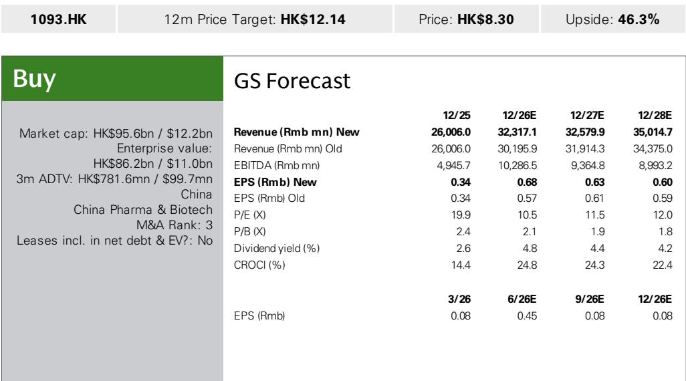

# The AstraZeneca Deal Is Reshaping CSPC Pharma’s Earnings Trajectory, But the Real Signal Is in Its Finished-Drug Resilience

CSPC Pharma issued a positive profit alert for the first half of 2026, guiding net profit to RMB 5.9–6.2 billion, more than double the RMB 2.55 billion reported in the same period of 2025. The headline driver is unmistakable: the company expects to recognize approximately USD 840 million (roughly RMB 5.74 billion) of the USD 1.2 billion upfront payment from its AstraZeneca collaboration on a long-acting GLP-1 asset, with about 70% of that total booked in the first half alone. That recognition is ahead of market expectations and provides a one-time earnings uplift of a magnitude rarely seen in the Chinese biopharma sector.

Yet the profit alert, while dramatic on its face, is the wrong place to anchor a research thesis. The upfront payment is a non-recurring event. What matters for the company’s long-term valuation is the second data point in the same announcement: finished-drug sales grew approximately 10% year-on-year in the first half, accelerating to roughly 14% in the second quarter from 6.2% in the first quarter. This acceleration occurred despite the anti-corruption headwinds introduced in May 2026, which many observers feared would disrupt innovative drug commercialization across the sector.

The tension between a one-time licensing windfall and a durable operating acceleration is the central strategic question for CSPC. The former validates the company’s ability to execute high-value business development. The latter tests whether its commercial machinery can function under policy conditions. This article argues that the finished-drug performance is the more consequential signal for long-term observers, and that the AstraZeneca deal, while transformative for near-term earnings, is best understood as a catalyst that buys time for the company’s pipeline to mature.

## The AstraZeneca Upfront Recognition Confirms CSPC’s BD Capability, Not a Structural Earnings Shift

The magnitude of the upfront payment recognition is striking. CSPC expects to book roughly RMB 5.74 billion in license fee income from the AstraZeneca deal in the first half of 2026, representing about 70% of the total USD 1.2 billion upfront. This is ahead of the analyst consensus expectation, which had modeled a more conservative recognition schedule. The result is a 2026E EPS estimate revised upward by 19.3%, from RMB 0.57 to RMB 0.68.

Observers should resist the temptation to extrapolate this earnings level. The upfront payment is a single event, not a recurring revenue stream. The collaboration with AstraZeneca will generate future milestone payments and royalties, but those are contingent on clinical and regulatory outcomes that remain years away. The accounting treatment that allows CSPC to recognize the bulk of the upfront in one half-year period is a timing decision, not a reflection of ongoing commercial performance.

What the deal does demonstrate is CSPC’s capacity to originate and package assets that attract top-tier global partners. The GLP-1 space is among the most competitive in global pharma, with Novo Nordisk, Eli Lilly, and a host of Chinese and international players all vying for position. That AstraZeneca committed a USD 1.2 billion upfront for CSPC’s long-acting candidate signals that the asset has differentiated characteristics—likely in dosing frequency, efficacy, or tolerability—that justify a premium. For a Chinese biopharma company, this type of validation is rare and strategically important. It provides a template for future business development and may improve CSPC’s negotiating leverage with other potential partners.

But the earnings uplift from this deal is transient. By 2027E, the EPS estimate revision shrinks to 2.7%, and by 2028E to 2.4%. The operating story must come from elsewhere.

## Finished-Drug Growth Accelerated Through Policy Headwinds, Signaling Commercial Resilience

The more important metric in the profit alert is the 10% year-on-year growth in finished-drug sales for the first half, with a clear acceleration from 6.2% in the first quarter to approximately 14% in the second quarter. This is ahead of the analyst estimate of 7.3% growth and, crucially, occurred during a period when the anti-corruption campaign introduced in May 2026 created uncertainty around hospital access and physician prescribing behavior.

The mechanism behind this resilience is instructive. Hospital-related disruption was partially offset by stronger retail channel contribution. The most concrete example is CSPC’s flagship product NBP (butylphthalide), a treatment for ischemic stroke. Channel checks indicate that NBP retail sales grew between 47% and 51% year-on-year during the April-to-June period. That is not a marginal improvement; it is a near-doubling of retail momentum in a single quarter.

This matters for two reasons. First, it demonstrates that CSPC’s commercial team can adapt its go-to-market strategy when the hospital channel faces headwinds. The ability to pivot to retail is not automatic; it requires existing relationships with pharmacy chains, a product profile suited for self-pay or insurance-reimbursed outpatient use, and the logistical capability to shift inventory. CSPC has all three. Second, the retail channel tends to be less exposed to volume-based procurement (VBP) price adjustments, which are primarily a hospital-channel phenomenon. If CSPC can sustain or grow its retail contribution, it creates a buffer against the pricing dynamics that will inevitably come when NBP faces VBP, which the analyst model assumes will occur in 2029E.

The implication is that the company’s commercial infrastructure is more adaptable than the market has priced in. The anti-corruption headwinds were a real test, and the second-quarter acceleration suggests that CSPC passed it.

## The NBP VBP Overhang Remains, But the Retail Channel Provides a Partial Hedge

NBP remains the single most important product in CSPC’s portfolio, and its eventual inclusion in VBP is the most widely cited downside risk. The analyst model explicitly factors in a VBP scenario for NBP in 2029E, and the discounted cash flow valuation for the product is only RMB 8.8 billion—a fraction of the company’s total sum-of-the-parts valuation of over RMB 100 billion.

The standard bear case is that VBP will affect NBP revenue, as it has done for countless other Chinese blockbusters. That risk is real, and observers should not dismiss it. But the retail channel data from the second quarter of 2026 introduces a nuance that the bear case often overlooks. VBP primarily affects hospital-channel pricing. If a product has a strong retail presence, it can maintain higher prices in that channel even after hospital prices are adjusted. The 47–51% retail growth for NBP suggests that the product is building a self-pay or outpatient franchise that could navigate a VBP event better than a purely hospital-dependent product would.

This is not a complete hedge. Even with retail strength, NBP will face revenue dynamics when VBP arrives. But the magnitude of the impact may be lower than the current valuation discounts imply. The analyst model assigns a 9% discount rate and a 2029E VBP scenario to NBP. If the retail channel continues to grow at the pace seen in the second quarter, the actual revenue change from VBP could be shallower than modeled, providing upside to the terminal value.

## The New Product Wave Is the True Earnings Driver, and It Requires Patient Capital

CSPC’s sum-of-the-parts valuation assigns the largest single component—RMB 55.7 billion—to the “new product wave,” which includes recently launched and pipeline assets in oncology, central nervous system, and other therapeutic areas. This is the part of the story that depends least on legacy products like NBP and most on the company’s R&D and commercialization execution.

The analyst model assumes that these new products will ramp up over the next two to three years and that their growth will offset the eventual decline of NBP and other maturing assets. That assumption is reasonable but not guaranteed. The key risk is slower-than-expected new product revenue growth, which the analyst explicitly lists as a downside risk alongside earlier-than-expected NBP VBP and failure of major R&D projects.

The AstraZeneca deal is relevant here not just for the upfront payment, but for what it signals about CSPC’s pipeline quality. A USD 1.2 billion upfront from a global partner is a strong third-party validation that the company’s early-stage assets have global potential. That should give observers more confidence in the new product wave valuation, even if the specific products that will drive that value are not yet clear.

But confidence is not certainty. The new product wave will require sustained investment in R&D, sales force expansion, and regulatory approval timelines. The earnings uplift from the AstraZeneca deal provides financial flexibility—CSPC will have a stronger balance sheet and more cash to deploy toward these investments. In that sense, the deal is not just a one-time earnings event; it is a strategic enabler that reduces the risk of underinvestment during the pipeline transition.

## A Decision Framework for Evaluating CSPC’s Risk-Reward

For those trying to form a view on CSPC, the profit alert provides enough data to construct a simple decision framework. The framework has three layers, each corresponding to a different time horizon and a different source of value.

The first layer is the near-term earnings boost from the AstraZeneca upfront. This is the most certain component. The company has guided to a specific range, the recognition schedule is clear, and the cash is already received. For a 12-month view, this layer dominates: the 2026E P/E multiple of 10.5x is low by historical standards, and if the market looks through the one-time boost and prices the stock on normalized earnings, that would imply a higher multiple but a lower absolute earnings base. Those who study CSPC for the 2026 earnings need to be comfortable that the market will not fully discount the upfront.

The second layer is the commercial resilience of the finished-drug business. This is the medium-term driver. The second-quarter acceleration to 14% growth, driven by retail channel strength, suggests that CSPC can grow through policy headwinds. The key question is whether this momentum is sustainable. If retail growth for NBP continues at 40–50% year-on-year, and if other products follow a similar pattern, then the 2027E and 2028E revenue estimates may prove conservative. If the anti-corruption headwinds intensify or if hospital channel access changes further, the growth rate could revert. Observers should monitor quarterly retail channel data and NBP prescription trends as leading indicators.

The third layer is the pipeline and new product wave. This is the long-term value driver and the highest-risk component. The AstraZeneca deal provides a positive signal, but the ultimate value of the new product wave depends on clinical data readouts, regulatory approvals, and commercial execution over the next three to five years. The analyst model assumes success, and the sum-of-the-parts valuation reflects that optimism. Those with a longer time horizon should focus on pipeline milestones, particularly in the ADC and GLP-1 programs, as the most important catalysts.

The decision framework, then, is straightforward: the near-term earnings are supported by a visible catalyst; the medium-term commercial story is more resilient than the market expects; and the long-term pipeline thesis is credible but unproven. Each layer has a different risk profile, and the appropriate entry point depends on an observer’s time horizon and tolerance for pipeline risk.

For those with a 12- to 18-month horizon, the near-term earnings boost and the commercial resilience together provide a favorable risk-reward. The 10.5x forward P/E is undemanding, the execution is visible, and the AstraZeneca deal provides both validation and financial flexibility that improve the odds of success.

*For informational purposes only. Portions may be generated, translated, summarized, or edited with AI assistance based on source materials and may contain omissions or errors. Please verify independently. This is not professional advice.*

For informational purposes only. Portions may be generated, translated, summarized, or edited with AI assistance based on source materials and may contain omissions or errors. Please verify independently. This is not professional advice.

