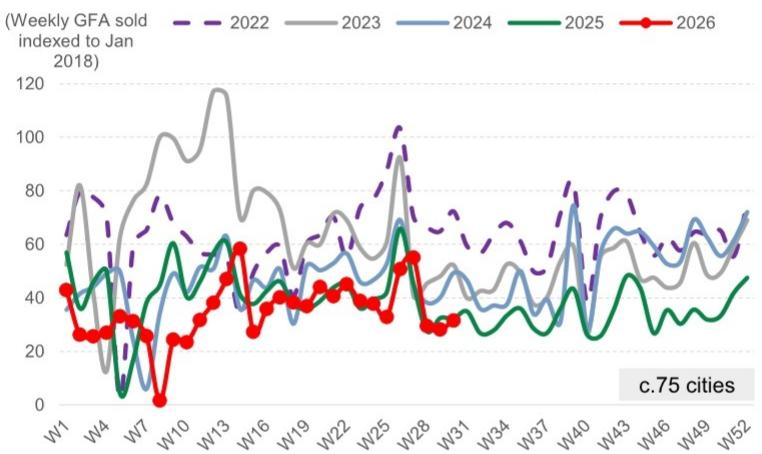
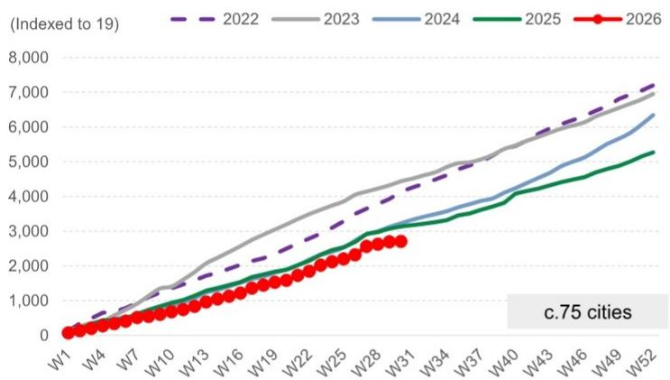
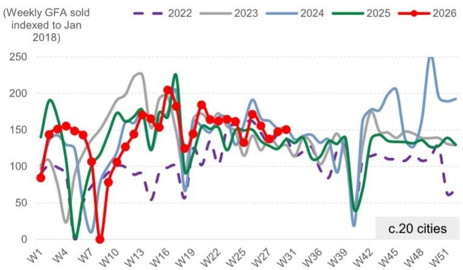
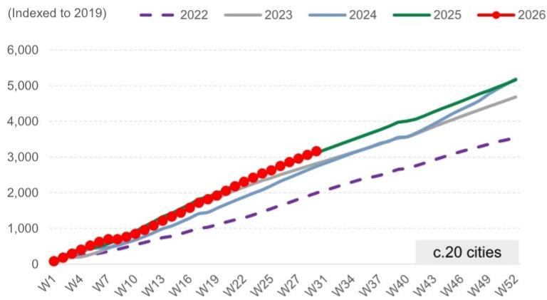
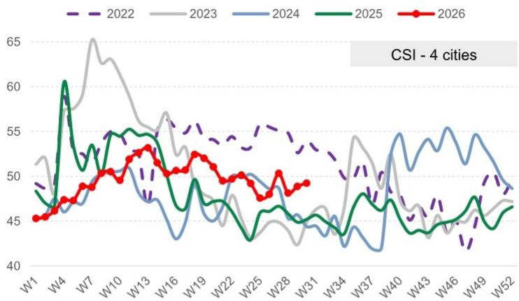
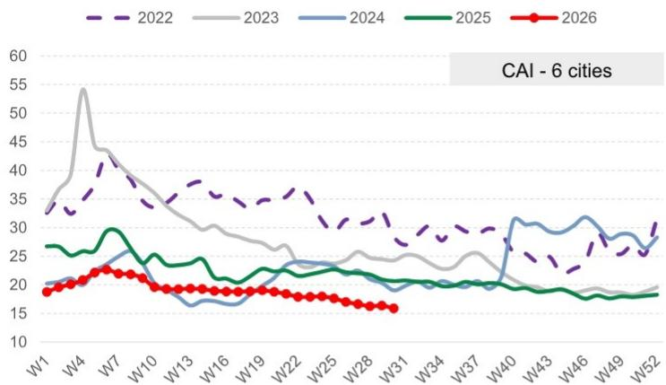
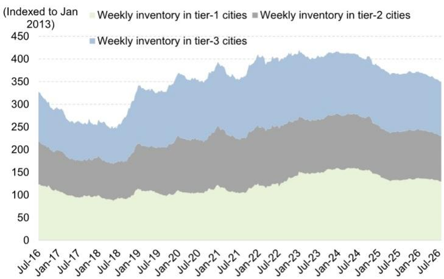
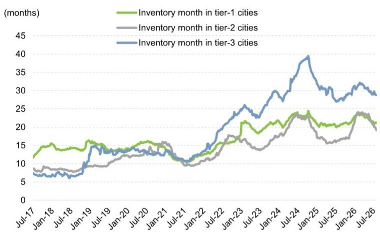
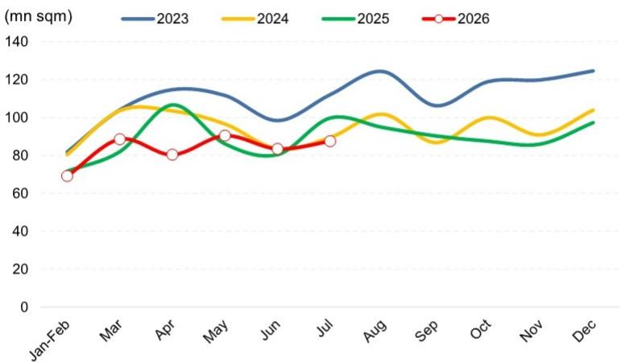

# 中国房地产市场周度观察

## 第30周总结——交易量延续增长，市场活动整体保持平稳

### 本周要点：

市场表现：一、二手房交易量延续增长态势，分别环比增长12%和2%，7月整体同比分别增长7%和3%。市场活动保持稳定：1）新房搜索活跃度环比提升1.2%；2）二手房带看和成交量环比持平；3）重点监测城市交易价格出现温和改善，新房供应量有所缩减（7月环比下降5%，同比下降16%），中介对价格预期趋于积极（连续第二周改善）。

### 关键数据：

■ 新房成交量环比增长12%，同比下降2%；新房搜索活跃度环比提升1.2%。

二手房成交量环比增长2%，同比增长10%，中介对价格上涨预期略有上升。

7月：重点城市新房成交面积中位数环比下降8%，同比增长7%；二手房成交面积中位数环比下降10%，同比增长3%。

年初至今：新房成交面积均值同比下降14%，较2024/2023年水平分别下降16%/39%；二手房成交面积均值同比增长1%，较2024/2023年水平分别增长15%/12%。

\- 库存量环比下降0.3%，去化周期为27.3个月（6月均值为27.5个月）。

估值：我们覆盖的较强国企开发商报价平均环比下降3%，其中保利发展（600048.SS，中性）表现相对较好，环比下降1%；其他开发商报价平均环比下降1%。境外/境内覆盖标的目前交易价格较2026年末预估净资产价值平均折让36%/32%，对应2026年预估市净率0.5倍/0.4倍。

■ 约75个城市的销售数据显示，百强开发商7月合同销售额可能同比下降6%，6月为下降13%。

王怡，CFA
+86(21)2401-8930 |
yi.wang@goldmansachs.cn
GS（中国）证券有限责任公司

■ 竣工：GSPC跟踪指标显示7月竣工面积同比降幅为百分之十几（国家统计局/GS预估6月同比降幅分别为25%/约20%），GS预估2026全年同比下降15%。

徐石
+86(21)2401-8929 |
shi.x.xu@goldmansachs.cn
GS（中国）证券有限责任公司

### 启示：

景凯妍
+86(21)2411-8092 |
kaiyan.jing@goldmansachs.cn
GS（中国）证券有限责任公司

新开工：基于300个城市土地出让趋势和全国水泥发运率（环比上升2.7个百分点至42%），7月新开工面积同比降幅约为百分之二十几（国家统计局/GS预估6月同比降幅分别为26%/百分之二十几）。

■ 贝壳（新房和二手房）二季度总交易额可能同比增长2%（新房下降23%/二手房增长12%）。

## 新房市场第30周：成交面积环比增长12%，同比下降2%，年初至今累计同比下降14%

图表1：上周约75个城市新房成交面积环比增长12%，同比下降2%

  
来源：中指数据，GS全球投资研究  
图表2：约75个城市年初至今新房成交面积均值同比下降14%，较2024/2023年水平分别下降16%/39%

  
来源：中指数据，GS全球投资研究

## 二手房市场：第30周/年初至今成交量同比分别增长10%/1%，中介价格预期略有上升，但业主挂牌价预期未变

图表3：上周约20个城市二手房成交面积环比增长2%，同比增长10%  
二手房周均成交量

  
来源：Wind，GS全球投资研究  
图表4：约20个城市年初至今二手房成交面积同比增长1%，较2024/2023年水平分别增长15%/12%  
2026年二手房成交量与2022-2025年对比

  
来源：Wind，GS全球投资研究

图表5：中原报价指数均值环比上升0.4个百分点，同比上升4.0个百分点  
4个城市周度中原报价指数跟踪

  
中原报价指数反映中介对房价的看法，高于50表示看涨，反之亦然。  
来源：中原地产  
图表6：中原经理指数均值环比下降0.5个百分点，同比下降4.8个百分点  
6个城市周度中原经理指数跟踪

中原经理指数反映业主挂牌价格。

来源：中原地产

## 库存第30周：库存环比下降0.3%，较2025年末下降6.1%，去化周期为27.3个月（6月均值为27.5个月）

图表7：库存量环比下降0.3%，较2025年末下降6.1%  
约20个城市分线级库存总量

  
来源：中指数据，GS全球投资研究  
图表8：去化周期环比下降0.3%，较2025年末下降2.3%  
约20个城市分线级去化周期（12个月滚动）

  
来源：中指数据，GS全球投资研究

## GSPC显示7月竣工面积同比降幅为百分之十几，GS预估2026全年同比下降15%

GS房地产竣工跟踪指标显示，基于下游供需关系及GS浮法玻璃行业展望和自有的周度浮法玻璃需求模型，7月竣工面积同比降幅为百分之十几（国家统计局/GS预估6月同比降幅分别为25%/约20%），GS预估2026全年同比下降15%。

图表9：GSPC跟踪指标隐含月度竣工面积...  
GSPC跟踪指标隐含月度竣工面积——基于GS浮法玻璃供需模型

  
1-2月为1月和2月的均值。  
图表10：...显示7月竣工面积同比降幅为百分之十几  
GSPC同比变化——基于GS浮法玻璃供需模型

  
来源：卓创资讯，Wind，国家统计局，GS全球投资研究

## 估值：市净率估值处于周期低位

第30周，我们覆盖的较强国企开发商报价平均环比下降3%，其中保利发展（600048.SS，中性）表现相对较好，环比下降1%；其他开发商报价平均环比下降1%。

我们覆盖的境外开发商报价平均环比下降2%（MSCI中国指数下降2%）；境内开发商报价平均环比下降1%（沪深300指数上涨2%）。

我们覆盖的境外开发商目前交易价格较2026年末预估净资产价值平均折让36%，对应2026年预估市净率0.5倍，而2008年下半年、2011年下半年和2014年上半年的周期低点分别为折让39%/0.7倍、折让73%/0.9倍、折让58%/0.9倍。

我们覆盖的境内开发商目前交易价格较2026年末预估净资产价值平均折让32%，对应2026年预估市净率0.4倍，而2008年下半年、2011年下半年和2014年上半年的周期低点分别为折让67%/1.6倍、折让64%/1.5倍、折让61%/1.2倍。

图表11：第30周，我们覆盖的较强国企开发商报价平均环比下降3%，其中保利A股（600048.SS，中性）表现相对较好，环比下降1%；其他开发商报价平均环比下降1%。我们覆盖的境外开发商报价平均环比下降2%（MSCI中国指数下降2%）；境内开发商报价平均环比下降1%（沪深300指数上涨2%）。

<table><tr><td rowspan="2">公司</td><td rowspan="2">代码</td><td rowspan="2">类型</td><td rowspan="2">2026年7月27日价格</td><td colspan="3">报价表现</td></tr><tr><td>过去一周</td><td>本月至今</td><td>年初至今</td></tr><tr><td>较强国企开发商</td><td></td><td></td><td>(本币)</td><td></td><td></td><td></td></tr><tr><td>招商蛇口</td><td>001979.SZ</td><td>央企</td><td>6.9</td><td>-2%</td><td>7%</td><td>-21%</td></tr><tr><td>中国海外发展</td><td>0688.HK</td><td>央企</td><td>13.4</td><td>-2%</td><td>11%</td><td>9%</td></tr><tr><td>华润置地</td><td>1109.HK</td><td>央企</td><td>32.8</td><td>-5%</td><td>9%</td><td>21%</td></tr><tr><td>绿城中国</td><td>3900.HK</td><td>混合所有制</td><td>7.2</td><td>-2%</td><td>7%</td><td>-15%</td></tr><tr><td>中国金茂</td><td>0817.HK</td><td>央企</td><td>1.3</td><td>-4%</td><td>8%</td><td>10%</td></tr><tr><td>保利发展</td><td>600048.SS</td><td>央企</td><td>5.0</td><td>-1%</td><td>8%</td><td>-18%</td></tr><tr><td>均值</td><td></td><td></td><td></td><td>-3%</td><td>8%</td><td>-2%</td></tr><tr><td>其他开发商</td><td></td><td></td><td>(本币)</td><td></td><td></td><td></td></tr><tr><td>龙湖集团</td><td>0960.HK</td><td>民企</td><td>6.6</td><td>-1%</td><td>11%</td><td>-22%</td></tr><tr><td>新城发展</td><td>1030.HK</td><td>民企</td><td>1.4</td><td>-1%</td><td>6%</td><td>-31%</td></tr><tr><td>万科A</td><td>000002.SZ</td><td>混合所有制</td><td>3.1</td><td>-1%</td><td>6%</td><td>-33%</td></tr><tr><td>万科H</td><td>2202.HK</td><td>混合所有制</td><td>2.4</td><td>-2%</td><td>13%</td><td>-27%</td></tr><tr><td>均值</td><td></td><td></td><td></td><td>-1%</td><td>9%</td><td>-28%</td></tr><tr><td>H股均值</td><td></td><td></td><td></td><td>-2%</td><td>9%</td><td>-8%</td></tr><tr><td>A股均值</td><td></td><td></td><td></td><td>-1%</td><td>7%</td><td>-24%</td></tr><tr><td>产业链指数</td><td></td><td></td><td></td><td></td><td></td><td></td></tr><tr><td>建筑材料</td><td></td><td></td><td></td><td>3%</td><td>-26%</td><td>8%</td></tr><tr><td>建筑公司</td><td></td><td></td><td></td><td>2%</td><td>-7%</td><td>-11%</td></tr><tr><td>建筑产品</td><td></td><td></td><td></td><td>3%</td><td>-9%</td><td>-18%</td></tr><tr><td>家用电器</td><td></td><td></td><td></td><td>0%</td><td>1%</td><td>-8%</td></tr><tr><td>家居装饰</td><td></td><td></td><td></td><td>1%</td><td>-7%</td><td>-23%</td></tr></table>

建筑材料指数（801710.SI）、建筑公司指数（801720.SI）、建筑产品指数（801713.SI）、装饰公司指数（801722.SI）、家用电器指数（801110.SI）和家居装饰指数（801142.SI）由Wind编制。

图表12：中国开发商估值对比

<table><tr><td rowspan="2">公司</td><td rowspan="2">代码</td><td colspan="2">日均流动性（百万美元）</td><td colspan="3">截至价格</td><td rowspan="2">12个月目标价</td><td rowspan="2">潜在上涨/下跌空间（%）</td><td rowspan="2">目标价相对净资产价值折让</td><td rowspan="2">2026年末预估净资产价值</td><td rowspan="2">当前价格相对净资产价值折让/溢价</td><td colspan="4">摊薄核心市盈率（倍）</td><td colspan="4">市净率（倍）（不含重估增值）</td><td colspan="4">股息率（%）</td></tr><tr><td>市值（十亿美元）</td><td>1个月均值</td><td>类型</td><td>评级</td><td>2026年7月27日</td><td>25</td><td>26E</td><td>27E</td><td>28E</td><td>25</td><td>26E</td><td>27E</td><td>28E</td><td>25</td><td>26E</td><td>27E</td><td>28E</td></tr><tr><td colspan="24"></td></tr><tr><td colspan="24">开发商</td></tr><tr><td colspan="24">较强国企开发商</td></tr><tr><td>招商蛇口</td><td>001979.SZ</td><td>9.1</td><td>74</td><td>央企</td><td>中性</td><td>6.85（人民币）</td><td>10.10</td><td>47</td><td>-15%</td><td>11.93</td><td>(43)</td><td>n.m.</td><td>16.9</td><td>14.1</td><td>13.0</td><td>0.6</td><td>0.6</td><td>0.6</td><td>0.6</td><td>0.7</td><td>2.7</td><td>3.2</td><td>3.5</td></tr><tr><td>中国海外发展</td><td>0688.HK</td><td>18.7</td><td>40</td><td>央企</td><td>买入</td><td>13.4（港元）</td><td>14.70</td><td>10</td><td>-10%</td><td>16.36</td><td>(18)</td><td>10.3</td><td>11.0</td><td>10.3</td><td>9.0</td><td>0.4</td><td>0.4</td><td>0.4</td><td>0.4</td><td>3.6</td><td>3.6</td><td>3.9</td><td>4.5</td></tr><tr><td>华润置地</td><td>1109.HK</td><td>29.8</td><td>90</td><td>央企</td><td>买入</td><td>32.8（港元）</td><td>36.60</td><td>12</td><td>-10%</td><td>40.68</td><td>(19)</td><td>9.5</td><td>10.6</td><td>10.3</td><td>9.3</td><td>1.0</td><td>0.9</td><td>0.9</td><td>0.8</td><td>3.9</td><td>3.7</td><td>3.8</td><td>4.2</td></tr><tr><td>绿城中国</td><td>3900.HK</td><td>2.3</td><td>10</td><td>混合所有制</td><td>买入</td><td>7.2（港元）</td><td>11.10</td><td>54</td><td>-15%</td><td>13.02</td><td>(45)</td><td>3.4</td><td>3.7</td><td>3.6</td><td>3.4</td><td>0.5</td><td>0.5</td><td>0.4</td><td>0.4</td><td>-</td><td>2.8</td><td>5.0</td><td>7.4</td></tr><tr><td>中国金茂</td><td>0817.HK</td><td>2.3</td><td>10</td><td>央企</td><td>买入</td><td>1.3（港元）</td><td>1.70</td><td>28</td><td>-10%</td><td>1.89</td><td>(30)</td><td>33.9</td><td>32.1</td><td>11.0</td><td>6.6</td><td>0.6</td><td>0.6</td><td>0.5</td><td>0.5</td><td>2.3</td><td>1.3</td><td>3.9</td><td>6.5</td></tr><tr><td>保利发展</td><td>600048.SS</td><td>8.9</td><td>97</td><td>央企</td><td>中性</td><td>5.01（人民币）</td><td>6.50</td><td>30</td><td>-10%</td><td>7.24</td><td>(31)</td><td>58.0</td><td>n.m.</td><td>n.m.</td><td>n.m.</td><td>0.3</td><td>0.3</td><td>0.3</td><td>0.3</td><td>0.7</td><td>-</td><td>-</td><td>-</td></tr><tr><td colspan="8">均值</td><td>30</td><td>-12%</td><td></td><td>(31)</td><td>10.3</td><td>11.0</td><td>10.3</td><td>9.0</td><td>0.6</td><td>0.5</td><td>0.5</td><td>0.5</td><td>1.9</td><td>2.3</td><td>3.3</td><td>4.3</td></tr><tr><td colspan="24">其他开发商</td></tr><tr><td>龙湖集团</td><td>0960.HK</td><td>6.0</td><td>18</td><td>民企</td><td>中性</td><td>6.6（港元）</td><td>7.50</td><td>13</td><td>-25%</td><td>9.94</td><td>(33)</td><td>n.m.</td><td>n.m.</td><td>39.5</td><td>20.0</td><td>0.3</td><td>0.3</td><td>0.3</td><td>0.3</td><td>1.2</td><td>-</td><td>0.8</td><td>1.6</td></tr><tr><td>新城发展</td><td>1030.HK</td><td>1.3</td><td>4</td><td>民企</td><td>卖出</td><td>1.4（港元）</td><td>1.80</td><td>28</td><td>-50%</td><td>3.64</td><td>(61)</td><td>24.0</td><td>35.6</td><td>16.5</td><td>9.4</td><td>0.3</td><td>0.3</td><td>0.3</td><td>0.2</td><td>-</td><td>-</td><td>-</td><td>-</td></tr><tr><td>万科A</td><td>000002.SZ</td><td>4.5</td><td>65</td><td>混合所有制</td><td>卖出</td><td>3.13（人民币）</td><td>3.70</td><td>18</td><td>-10%</td><td>4.10</td><td>(24)</td><td>n.m.</td><td>n.m.</td><td>n.m.</td><td>n.m.</td><td>0.3</td><td>0.4</td><td>0.4</td><td>0.5</td><td>-</td><td>-</td><td>-</td><td>-</td></tr><tr><td>万科H</td><td>2202.HK</td><td>0.7</td><td>8</td><td>混合所有制</td><td>卖出</td><td>2.39（港元）</td><td>2.90</td><td>21</td><td>-35%</td><td>4.47</td><td>(47)</td><td>n.m.</td><td>n.m.</td><td>n.m.</td><td>n.m.</td><td>0.2</td><td>0.3</td><td>0.3</td><td>0.3</td><td>-</td><td>-</td><td>-</td><td>-</td></tr><tr><td colspan="8">均值</td><td>20</td><td>-30%</td><td></td><td>(41)</td><td>n.m.</td><td>n.m.</td><td>n.m.</td><td>n.m.</td><td>0.3</td><td>0.3</td><td>0.3</td><td>0.3</td><td>0.3</td><td>-</td><td>0.2</td><td>0.4</td></tr><tr><td colspan="8">覆盖均值</td><td colspan="2">26</td><td colspan="2">(35)</td><td>23.2</td><td>18.3</td><td>15.0</td><td>10.1</td><td>0.5</td><td>0.5</td><td>0.4</td><td>0.4</td><td>1.2</td><td>1.4</td><td>2.1</td><td>2.8</td></tr><tr><td colspan="8">H股均值</td><td colspan="2">24</td><td colspan="2">(36)</td><td>16.2</td><td>18.6</td><td>15.2</td><td>9.6</td><td>0.5</td><td>0.5</td><td>0.4</td><td>0.4</td><td>1.6</td><td>1.6</td><td>2.5</td><td>3.4</td></tr><tr><td colspan="8">A股均值</td><td colspan="2">32</td><td colspan="2">(32)</td><td>58.0</td><td>16.9</td><td>14.1</td><td>13.0</td><td>0.4</td><td>0.4</td><td>0.4</td><td>0.5</td><td>0.5</td><td>0.9</td><td>1.1</td><td>1.2</td></tr></table>

来源：Datastream，GS全球投资研究

## 附录

## Reg AC

我们，王怡（CFA）、徐石和景凯妍，特此证明本报告中表达的所有观点准确反映了我们个人对相关公司及其证券的看法。我们还证明，我们的薪酬中没有任何部分直接或间接与报告中表达的具体建议或观点相关。

撰稿人：王怡（CFA），GS（中国）证券有限责任公司；徐石，GS（中国）证券有限责任公司；景凯妍，GS（中国）证券有限责任公司。

除非另有说明，本报告撰稿人披露中列出的个人均为GS全球投资研究部门分析师。

## GS因子概况

GS因子概况通过将关键属性与市场（即我们的评级股票池）及其行业同行进行比较，为股票提供投资背景。四个关键属性为：增长、财务回报、估值倍数和综合指标（增长、财务回报和估值倍数的综合）。增长、财务回报和估值倍数通过计算每只股票特定指标的标准化排名得出。各指标的标准化排名随后取平均值，并转换为相应属性的百分位数。每个指标的具体计算可能因财年、行业和地区而异，但标准方法如下：

增长基于股票的前瞻性销售增长、EBITDA增长和每股收益增长（对于金融股，仅基于每股收益和销售增长），百分位数越高表示增长潜力越大。财务回报基于股票的前瞻性净资产回报表现、已动用资本回报率和现金回报率（对于金融股，仅基于净资产回报表现），百分位数越高表示财务回报越高。估值倍数基于股票的前瞻性市盈率、市净率、价格/股息、企业价值/EBITDA、企业价值/自由现金流和企业价值/债务调整后现金流（对于金融股，仅基于市盈率、市净率和价格/股息），百分位数越高表示估值倍数越高。综合指标百分位数计算为增长百分位数、财务回报百分位数和（100% - 估值倍数百分位数）的平均值。

财务回报和估值倍数使用分析师对未来至少三个季度后的财年末预测。增长使用对未来至少七个季度后的财年输入数据，与未来至少三个季度后的财年进行比较（所有指标均基于每股基础）。

有关GS因子概况计算方法的更详细说明，请联系您的GS代表。

## 并购排名

在我们的全球覆盖范围内，我们使用并购框架审视股票，同时考虑定性因素和定量因素（可能因行业和地区而异），以纳入某些公司可能被收购的潜力。然后我们分配并购排名，作为对我们评级覆盖范围内的公司进行评分的方法，从1到3，其中1表示公司成为收购目标的可能性较高（30%-50%），2表示中等可能性（15%-30%），3表示较低可能性（0%-15%）。对于排名为1或2的公司，按照我们的标准部门指南，我们将并购因素纳入目标价。并购排名为3被视为不重要，因此不计入我们的目标价，并且可能在研究中讨论或不讨论。

## Quantum

Quantum是GS专有数据库，提供详细的财务报表历史、预测和比率。可用于对单一公司进行深入分析，或比较不同行业和市场的公司。

## 披露

## 评级/投资银行关系分布

GS投资研究全球股票覆盖范围

<table><tr><td rowspan="2"></td><td colspan="3">评级分布</td><td colspan="3">投资银行关系</td></tr><tr><td>买入</td><td>持有</td><td>卖出</td><td>买入</td><td>持有</td><td>卖出</td></tr><tr><td>全球</td><td>50%</td><td>34%</td><td>16%</td><td>65%</td><td>59%</td><td>43%</td></tr></table>

截至2026年7月1日，GS全球投资研究对3,104只股票有投资评级。GS将股票指定为各种区域投资清单上的买入和卖出；未如此指定的股票被视为中性。就FINRA规则要求的上述披露而言，此类指定等同于买入、持有和卖出。请参阅下面的“评级、覆盖范围和相关定义”。“投资银行关系”图表反映了每个评级类别中GS在过去十二个月内提供投资银行服务的公司百分比。

## 监管披露

## 美国法律法规要求的披露

请参阅上述公司特定监管披露，了解本报告中提及的公司所需的任何以下披露：待定交易中的经理或联合经理；1%或其他所有权；特定服务的报酬；客户关系类型；先前期间的已管理/联合管理公开发行；董事职位；对于股票，做市和/或专家角色。GS作为本金交易或可能交易本报告中讨论的发行人的债务证券（或相关衍生品）。

以下为额外要求的披露：所有权和重大利益冲突：GS政策禁止其分析师、向分析师报告的专业人员及其家庭成员持有分析师覆盖范围内的任何公司的证券。分析师薪酬：分析师的薪酬部分基于GS的盈利能力，其中包括投资银行收入。分析师作为高管或董事：GS政策通常禁止其分析师、向分析师报告的人员或其家庭成员担任分析师覆盖范围内的任何公司的高管、董事或顾问。非美国分析师：非美国分析师可能不是GS及有限责任公司的关联人员，因此可能不受FINRA规则2241或FINRA规则2242关于与主题公司沟通、公开露面以及交易分析师覆盖的证券的限制。

## 美国以外司法管辖区法律和法规要求的额外披露

以下披露是各司法管辖区要求的，除非已根据美国法律在上述范围内作出。澳大利亚：GS澳大利亚有限公司及其关联公司不是澳大利亚《1959年银行法》定义的授权存款机构，不在澳大利亚提供银行服务或开展银行业务。除非GS另有约定，本研究及其访问权限仅适用于澳大利亚《公司法》定义的“批发客户”。在制作研究报告时，GS澳大利亚全球投资研究成员可能会参加由其研究报告主题的公司和其他实体主办或组织的实地考察和其他会议。在某些情况下，如果GS澳大利亚认为在特定情况下适当且合理，此类实地考察或会议的费用可能部分或全部由相关发行人承担。如果本文档内容包含任何金融产品建议，则仅为一般性建议，由GS在不考虑客户目标、财务状况或需求的情况下编制。客户在根据任何此类建议采取行动前，应考虑该建议是否适合其自身目标、财务状况和需求。GS澳大利亚和新西兰某些利益披露以及GS澳大利亚卖方研究独立性政策声明的副本可在以下网址获取：https://www.goldmansachs.com/disclosures/australia-new-zealand/index.html。巴西：有关CVM第20号决议的披露信息可在以下网址获取：https://www.gs.com/worldwide/brazil/area/gir/index.html。在适用的情况下，根据CVM第20号决议第20条定义，主要负责本研究报告内容的巴西注册分析师为本报告开头指定的第一作者，除非文本末尾另有说明。加拿大：此信息仅供您参考，在任何情况下均不应被解释为GS及有限责任公司为在加拿大购买加拿大证券而进行的广告、要约或招揽。GS及有限责任公司未在加拿大任何司法管辖区注册为交易商，根据适用的加拿大证券法，通常不允许交易加拿大证券，并且可能被禁止在加拿大的某些司法管辖区出售某些证券和产品。如果您希望在加拿大交易任何加拿大证券或其他产品，请联系GS加拿大公司（GS集团公司的关联公司）或其他注册的加拿大交易商。香港：可根据要求从GS（亚洲）有限责任公司获取本研究中提及的覆盖公司证券的进一步信息。印度：有关本研究报告提及的主题公司或公司的进一步信息，SEBI的注册和NISM的认证绝不保证中介机构的业绩或向读者提供任何回报保证。GS（印度）证券私人有限公司合规官和读者投诉联系详情、年度合规审计报告副本以及其他相关信息和披露可在以下链接找到：https://www.goldmansachs.com/worldwide/india/research-analyst。日本：见下文。韩国：除非GS另有约定，本研究及其访问权限仅适用于《金融服务和资本市场法》定义的“专业读者”。有关本研究中提及的主题公司或公司的进一步信息，可从GS（亚洲）有限责任公司首尔分行获取。新西兰：GS新西兰有限公司及其关联公司不是新西兰《1989年新西兰储备银行法》定义的“注册银行”或“存款接受者”。除非GS另有约定，本研究及其访问权限适用于《2008年金融顾问法》定义的“批发客户”。GS澳大利亚和新西兰某些利益披露的副本可在以下网址获取：https://www.goldmansachs.com/disclosures/australia-new-zealand/index.html。俄罗斯：在俄罗斯联邦分发的研究报告不属于俄罗斯法律定义的广告，而是以产品推广为主要目的的信息和分析，并且不提供俄罗斯评估活动法律意义上的评估。研究报告不构成俄罗斯法律法规定义的个人化研究交流，不针对特定客户，并且是在未分析客户财务状况、投资概况或风险偏好的情况下编制的。GS对客户或任何其他人基于本研究报告可能做出的任何投资决策不承担任何责任。新加坡：GS（新加坡）有限公司（公司编号：198602165W），受新加坡金融管理局监管，接受对本研究的法律责任，如有任何与本研究报告相关的问题，应联系该公司。台湾：此材料仅供参考，未经许可不得转载。读者应仔细考虑自身的投资风险。投资结果由个人读者自行负责。英国：在英国可能被归类为零售客户（定义见金融行为监管局规则）的人士，应结合先前GS关于本报告中提及的覆盖公司的研究阅读本研究，并应参考GS国际已发送给他们的风险警告。这些风险警告的副本以及本报告中使用的某些金融术语的词汇表，可根据要求从GS国际获取。

欧盟和英国：关于欧盟委员会授权条例（EU）2016/958第6(2)条的披露信息（包括该授权条例在英国脱离欧盟和欧洲经济区后转化为英国国内法律和法规的情况），涉及研究交流或其他建议或暗示投资策略的信息的客观呈现技术安排以及特定利益或利益冲突迹象的披露技术标准，可在以下网址获取：https://www.gs.com/disclosures/europeanpolicy.html，其中说明了与投资研究相关的利益冲突管理欧洲政策。

日本：GS日本有限公司是在关东财务
