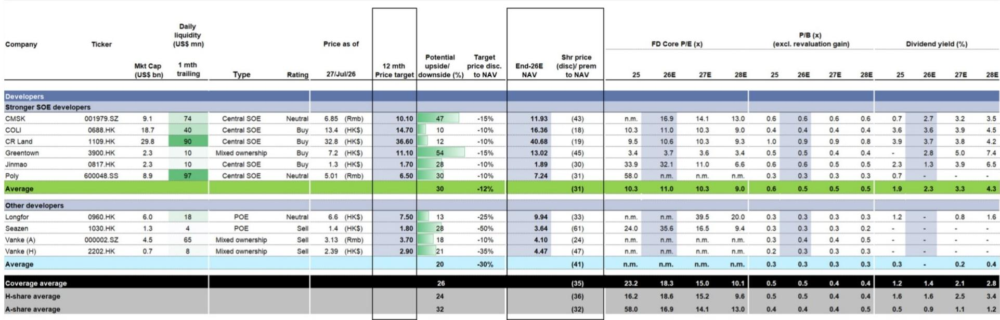
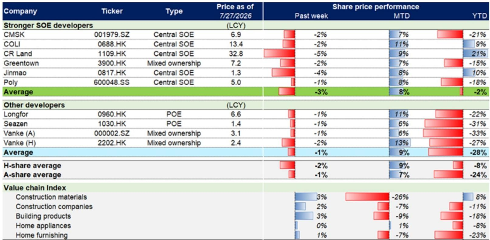
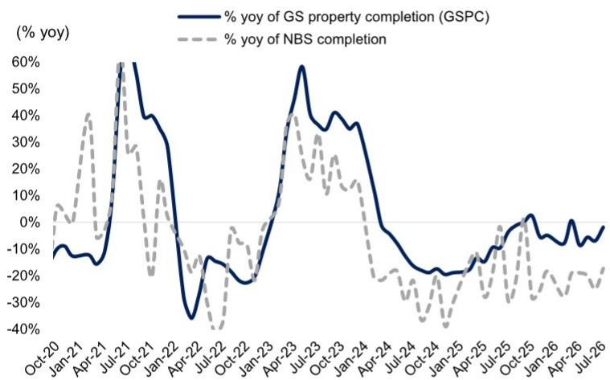

# 城市与住房数据变化观察

最新一期中国房地产周报显示，截至7月27日当周（第30周），新房和二手房交易量延续了此前的增长态势，分别实现环比12%和2%的涨幅。7月全月新房成交面积同比增长7%，二手房同比增长3%。这份报告的核心观察在于：交易量的温和扩张正在与市场活动的稳定形成共振，但价格层面的改善仍集中在中介预期而非业主报价，市场修复的广度和深度仍需进一步观察。

报告覆盖约75个城市的新房数据和约20个城市的二手房数据。新房方面，第30周成交面积环比增长12%，但同比仍下降2%。二手房表现更为稳健，第30周成交面积环比增长2%，同比增长10%。从年初至今的累计数据看，新房成交面积同比下降14%，较2024年和2023年同期分别低16%和39%；二手房成交面积则同比增长1%，较2024年和2023年同期分别高出15%和12%。二手房市场在成交量上的相对优势依然明显。

## 1. 中介价格预期连续第二周改善，但业主报价仍在走弱

报告引用了中原地产的指数数据，揭示了市场参与者之间的预期分化。第30周，反映中介对房价看法的中原经理指数（CSI）环比上升0.4个百分点，同比上升4.0个百分点，且已连续第二周改善。该指数以50为荣枯线，高于50代表看涨。然而，反映业主挂牌报价意愿的中原报价指数（CAI）环比下降0.5个百分点，同比下降4.8个百分点。这意味着，尽管一线从业者对价格前景趋于乐观，但实际卖家的要价行为并未跟进，市场仍处于“中介预期改善、业主信心不足”的博弈阶段。

> **KC评论：** 中介预期改善通常领先于实际成交价企稳，但业主报价持续走弱说明卖方仍面临去化不确定性。这两个指数的背离，意味着市场短期可能维持“量稳价弱”的格局，而非全面回暖。

## 2. 库存去化周期维持高位，供给端主动调整

截至第30周，报告监测的约20个城市的新房库存总量环比下降0.3%，较2025年底水平下降6.1%。但库存去化月数仍为27.3个月，略高于6月26日的平均水平27.5个月。这一水平远高于行业公认的合理区间，表明去库存仍是市场的主要矛盾。值得注意的是，7月新房新增供应量环比下降5%，同比下降16%，显示出开发商在供给端采取了主动调整策略。这种“以价换量”叠加“以缩量换价”的组合，是当前市场企稳的重要支撑，但也意味着行业研究和开工活动将持续承压。

## 3. 竣工面积延续两位数同比下滑，新开工降幅未见收窄

报告通过自建的浮法玻璃供需模型（GSPC）推算，7月竣工面积同比降幅约为高十位数（high-teens），即17%-19%左右，较6月国家统计局公布的25%降幅有所收窄，但全年预计仍将下降15%。新开工方面，基于300城土地出让趋势和全国水泥出货率数据，报告预计7月新开工面积同比降幅约为中二十位数（mid-twenties），即24%-26%左右，与6月基本持平。这两个指标表明，房地产研究链条的底部尚未明确到来，尤其是新开工的持续仍在调整，将影响后续可售资源的补充和产业链上下游的需求。

## 4. 开发商估值处于历史低位，与过往周期底部相比仍有空间

报告提供了覆盖开发商的估值对比。截至第30周，其覆盖的境外上市开发商报价平均较2026年底预估净资产价值（NAV）折让36%，对应0.5倍2026年预估市净率（P/B）。境内上市开发商平均折让32%，对应0.4倍2026年预估P/B。报告将当前估值与2008年下半年、2011年下半年和2014年上半年三次市场低谷进行了对比。以境外覆盖为例，三次低谷的NAV折让分别为39%、73%和58%，P/B分别为0.7倍、0.9倍和0.9倍。当前0.5倍的P/B已低于前两次低谷，但NAV折让幅度尚未达到2011年和2014年的极端水平。这一对比框架提示，估值已计入大量悲观预期，但市场信心的修复仍需基本面的进一步验证。

> **KC评论：** 估值比较本身不构成买入信号，但提供了一个可量化的参照系。当前P/B已低于2008年低谷，但NAV折让幅度小于2011年和2014年，说明市场对资产价值的重估仍在进行中。读者应关注后续月度销售数据和价格指数的边际变化，而非仅依赖历史估值分位。

这份周报的核心价值在于，它通过高频数据勾勒出一个“量稳、价弱、库存高、研究冷”的市场轮廓。交易量的连续改善是积极信号，但价格预期的分化、库存去化周期的不确定性以及新开工的持续仍在调整，都指向市场仍处于筑底阶段，而非趋势性反转。对于行业决策者而言，关注点应从单纯的成交量转向价格企稳的可持续性以及开发商现金流的改善节奏。

For informational purposes only. Portions may be generated,translated,summarized,or edited with AI assistance based on source materials and may contain omissions or errors. Please verify independently. This is not investment,legal,tax,accounting,or other professional advice.

For informational purposes only. Portions may be generated,translated,summarized,or edited with AI assistance based on source materials and may contain omissions or errors. Please verify independently. This is not investment,legal,tax,accounting,or other professional advice.

