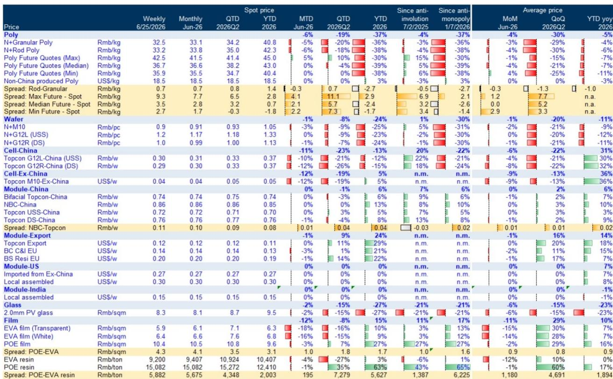
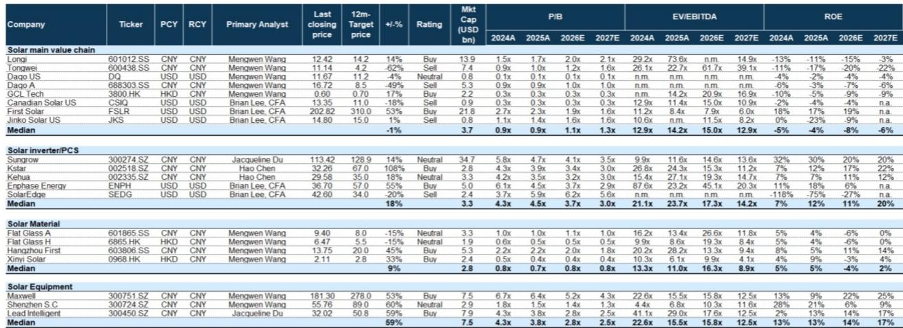
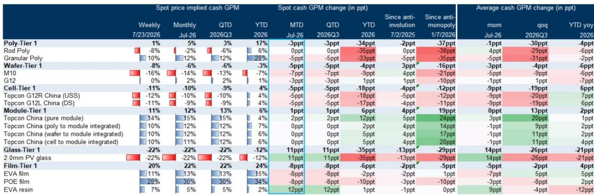

# GS：价格数据与市场变化观察

7月光伏产业链价格出现分化。GS最新月度追踪数据显示，7月至今光伏各环节均价环比下降约7%，但玻璃环节价格逆势上涨6%，库存天数从6月的57天降至50天。与此同时，硅片和电池片价格分别环比下跌7%和11%，成为价格走弱的主要影响。这份报告的核心信号是：产业链利润拐点可能正在从玻璃环节开始，但上游多晶硅和硅片的供需不确定性尚未解除。

报告通过追踪各环节现货价格与成本，推算出隐含现金毛利率的变化。7月玻璃和组件环节的现金毛利率分别环比改善11个百分点和1个百分点，而多晶硅、硅片、电池片和胶膜的毛利率则分别环比下降3、5、5和8个百分点。这种利润从上游向中下游的再分配，是7月光伏产业链最显著的结构性变化。

## 1. 玻璃库存出现积极拐点，龙头企业协同减产10%

7月玻璃环节最值得关注的变化是供给端的主动调整。报告指出，龙头企业通过冷修等方式协同减产约10%，直接推动了库存天数的下降——从6月的60天降至7月底的50天。GS预计，随着季节性需求回暖，9月玻璃库存天数有望进一步降至35天，并支撑下半年约10%的价格涨幅。

> **KC评论：** 玻璃是光伏产业链中产能退出成本最高的环节之一，冷修意味着实质性减产而非停产观望。库存天数从60天降至50天，虽然仍高于正常水平，但方向性变化值得跟踪。报告隐含的判断是：如果需求如期恢复，玻璃可能是本轮周期中最早实现供需再平衡的环节。

## 2. 多晶硅新能效标准落地，但对有效供给影响有限

7月20日，多晶硅生产能耗强制性国家标准正式发布，较征求意见稿进一步收紧。现有产能的能耗强度上限从6.4kgce/kg降至6.3kgce/kg，2027年1月起执行。报告认为，这一标准对有效供给的影响有限——目前约260万吨的运营产能大多已达标或可通过技改达标。GS预计2026至2030年多晶硅产能利用率将维持在30%左右的低位。

这一判断背后是产能过剩的深层结构问题。即使新标准淘汰部分落后产能，行业总产能仍远超需求。报告对多晶硅的谨慎态度，与对玻璃的乐观形成对照：前者是供给侧政策难以扭转过剩格局，后者是主动减产正在产生效果。

## 3. 产业链利润分化：玻璃与组件改善，上游继续承压

从各环节的现金利润变化看，7月最突出的特征是利润从上游向中下游转移。玻璃环节的现金毛利率从-33%回升至-22%，组件环节从11%升至12%，而多晶硅、硅片、电池片的现金毛利率则分别降至5%、-6%和-10%。报告特别指出，组件环节的利润改善主要来自上游成本下降，而非自身涨价——组件价格7月环比持平。

这种利润结构的变化，对产业链不同位置的公司意味着不同的处境。上游企业面临的是产能过剩和价格持续节奏变化的双重不确定性，而中下游企业则受益于成本端改善。报告在覆盖标的中，更倾向于选择受益于玻璃价格回升、胶膜涨价和组件利润改善的公司。

## 4. 一个可复用的观察框架：库存天数与供给变化的联动关系

这份报告提供了一个简洁但有效的分析框架：跟踪各环节的库存天数变化，判断供需拐点的先后顺序。玻璃环节的库存天数从60天降至50天，是产业链中第一个出现改善信号的环节。报告认为，如果季节性需求在9月兑现，玻璃库存有望进一步降至35天，届时价格可能迎来更持续的回升。

这个框架的核心逻辑是：在产能普遍过剩的环境下，价格拐点不会同时出现在所有环节。最先出现供给调整、库存改善的环节，可能最先迎来利润修复。读者可以按此逻辑，逐一观察硅片、电池片等环节的库存和供给变化，判断下一轮利润修复的次序。

For informational purposes only. Portions may be generated,translated,summarized,or edited with AI assistance based on source materials and may contain omissions or errors. Please verify independently. This is not investment,legal,tax,accounting,or other professional advice.

For informational purposes only. Portions may be generated,translated,summarized,or edited with AI assistance based on source materials and may contain omissions or errors. Please verify independently. This is not investment,legal,tax,accounting,or other professional advice.

