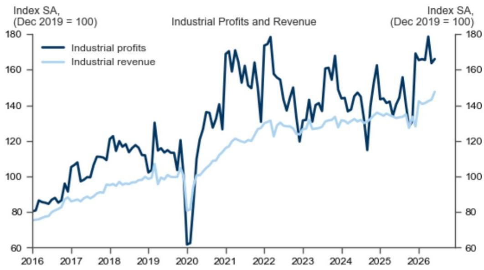

# 宏观观察：6月工业利润与收入数据简析

## 核心要点：

6月份，工业利润同比增长18.3%，收入同比增长11.4%（5月分别为+21.0%和+6.7%）。经季节性调整后，环比来看，工业利润增长1.5%（5月为-8.4%），收入增长3.1%（5月为+0.6%）。

## 关键数据：

工业利润：6月同比增长+18.3%（环比增长：经GS季节性调整后为+1.5%）；5月：同比增长+21.0%（环比增长：经季节性调整后为-8.4%）。

工业收入：6月同比增长+11.4%（环比增长：经GS季节性调整后为+3.1%）；5月：同比增长+6.7%（环比增长：经季节性调整后为+0.6%）。

## 主要观察：

1. 从同比角度看，6月工业利润增长18.3%，5月为21.0%。从环比角度看，经季节性调整后，6月利润增长1.5%，而5月为下降8.4%（见图表1）。

2. 从同比角度看，下游行业利润6月增长16.2%，较5月的10.2%有所加快。相比之下，上游行业利润同比增速从5月的58.3%放缓至24.5%，主要受化学原料、石油和天然气开采行业影响。相关部门评论称，上半年原材料制造业对工业利润增长的贡献为8.8个百分点，电子行业贡献为8.5个百分点。

3. 从同比角度看，6月工业收入增长11.4%，5月为6.7%。环比来看，6月收入增长3.1%（5月为+0.6%）。整体利润率（总利润除以总收入）在12个月均值基础上于6月小幅上升（见图表2），主要受上游和下游行业利润率改善推动。

图表1：6月工业利润与收入环比均有所增长

来源：相关部门，GS全球研究

图表2：6月整体利润率在12个月均值基础上继续小幅上升

来源：相关部门，CEIC，GS全球研究
