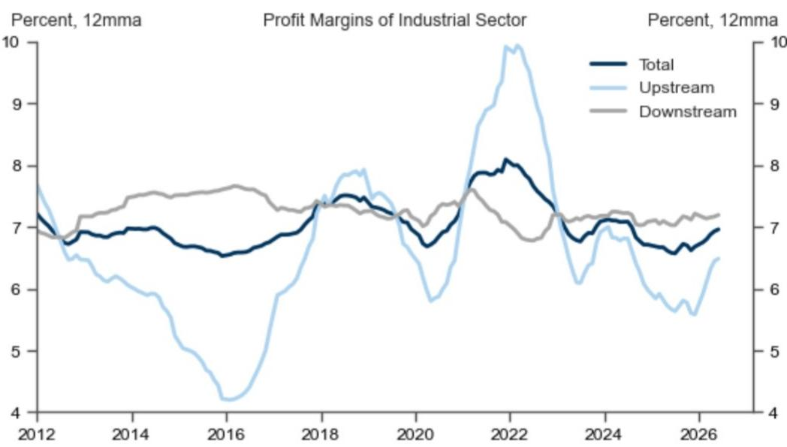

# 研究主题与行业变化观察

中国工业企业6月利润同比增长18.3%，收入同比增长11.4%。与5月相比，利润增速从21.0%回落，但收入增速从6.7%明显加快。更值得关注的信号来自环比数据：经季节性调整后，6月工业利润环比增长1.5%，而5月为下降8.4%；工业收入环比增长3.1%，5月仅为0.6%。这意味着5月出现的环比调整在6月得到修复，量价关系出现边际改善。

这份报告的核心判断是：6月工业利润的同比增速节奏变化主要受上游行业基数效应和价格回落影响，但下游利润增速在加快，整体利润率在12个月移动平均基础上继续小幅上行。利润结构正在从上游向中下游转移。

## 1. 下游利润增速加快，上游利润增速明显节奏变化

6月下游工业企业利润同比增长16.2%，较5月的10.2%明显提速。上游利润增速则从5月的58.3%大幅节奏变化至24.5%，影响主要来自化学原料、石油和天然气开采业。国家统计局在解读上半年数据时指出，原材料制造业对上半年工业利润增长的贡献为8.8个百分点，电子行业贡献8.5个百分点。上下游利润增速的收敛，意味着此前上游价格高企对下游利润的挤压正在缓解，但上游利润增速仍高于下游，利润分配格局尚未完全逆转。

> **研究评论：** 上游利润节奏变化不等于上游景气度变化，而是高基数下的正常回归。下游利润提速才是更值得关注的边际变化，它意味着终端需求可能在企稳，成本端不确定性也在减轻。但报告没有展开下游利润改善是来自量还是价，这里仍需验证。

## 2. 收入环比改善幅度大于利润，利润率小幅上行

6月工业收入环比增长3.1%，远高于5月的0.6%，改善幅度明显大于利润环比（1.5%对-8.4%）。收入端的修复更显著，说明量的恢复可能领先于价的恢复。整体利润率（利润总额除以收入）在12个月移动平均基础上继续小幅上行，报告认为这得益于上下游利润率的同时改善。利润率的持续修复，是判断企业盈利能力是否触底的关键观察点。

## 3. 一个可复用的观察框架：利润增速的同比与环比拆解

这份报告提供了一个简洁但有效的分析框架：同时看同比和环比两个维度。同比数据受基数效应干扰大，环比数据更能反映当期边际变化。5月利润环比大幅下降8.4%，6月转为增长1.5%，虽然幅度不大，但方向变化本身就有信号意义。收入环比从0.6%跳升至3.1%，改善幅度更明显。对于跟踪中国工业数据的读者，可以沿用这个框架：先看环比是否企稳，再看同比增速的基数效应，最后结合利润率趋势判断盈利质量。

6月的数据指向一个初步企稳的图景，但利润环比增长仅有1.5%，修复力度偏弱。下游利润能否持续改善，以及上游价格回落是否会进一步影响上游利润，是后续需要持续跟踪的两个变量。

For informational purposes only. Portions may be generated,translated,summarized,or edited with AI assistance based on source materials and may contain omissions or errors. Please verify independently. This is not investment,legal,tax,accounting,or other professional advice.

For informational purposes only. Portions may be generated,translated,summarized,or edited with AI assistance based on source materials and may contain omissions or errors. Please verify independently. This is not investment,legal,tax,accounting,or other professional advice.

