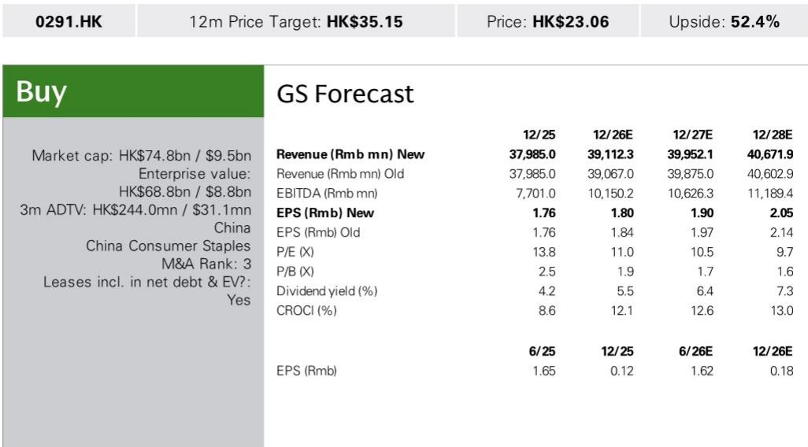
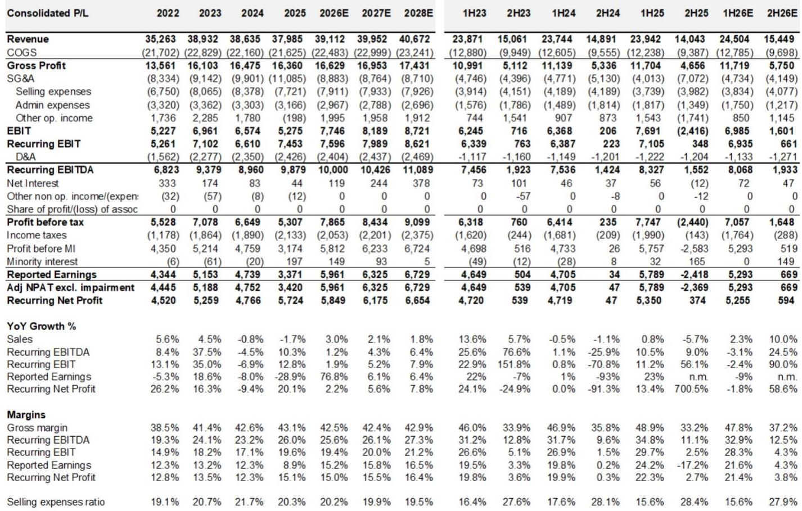
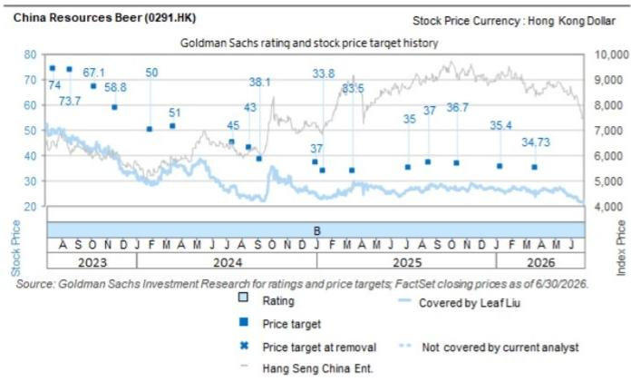

# GS：华润啤酒业务与近期数据观察

GS在最新一期华润啤酒（0291.HK）1H26预览报告中指出，公司啤酒业务量价均有望实现同比增长，且增速高于行业整体水平。但包装材料成本上升和白酒业务持续去库存，将压制上半年利润表现。报告预计1H26收入245亿元，同比增长2%；经常性净利润53亿元，同比下降2%。这一判断的核心矛盾在于：啤酒高端化带来的结构性改善，能否对冲成本端和白酒业务的双重不确定性。

## 1. 啤酒量价增长跑赢行业，但成本不确定性在2Q26更为明显

报告预计华润啤酒1H26啤酒销量同比增长2.2%，显著高于国家统计局口径的行业整体增速0.2%。ASP（每升均价）同比上升约0.6%，主要受高端产品组合支撑。喜力品牌维持20%以上的销量增长，渠道覆盖从核心市场扩展至江苏、上海、四川及东北地区。雪花纯生包装升级后恢复稳定增长，Super X保持中个位数增速，老雪和Amstel延续双位数增长。

但成本端并不乐观。GS成本追踪显示，1H26铝价同比上涨19%，抵消了大麦锁价带来的成本节约。报告预计啤酒单位COGS出现低个位数增长，且2Q26的不确定性更为突出。此外，上半年体育赛事密集推高营销费用，总部搬迁也带来一次性行政开支。综合来看，1H26啤酒核心经营利润预计与去年同期基本持平，约72.6亿元。

> **KC评论：** 铝罐成本是今年啤酒行业最容易被低估的变量。大麦成本下降已基本被市场消化，但铝价同比上涨19%意味着包装成本占比更高的企业，毛利率不确定性可能比市场预期更大。华润啤酒通过高端化提价只能部分对冲，2Q26的数据将是关键验证节点。

## 2. 白酒业务仍为集团利润影响，去库存节奏慢于预期

华润啤酒的白酒业务（金沙、景芝）在1H26预计继续影响集团盈利。报告预计白酒收入同比下降10%，EBIT亏损从1H25的1.52亿元扩大至2.36亿元。尽管管理层在5-6月观察到终端动销因低基数出现温和改善，但消费者信心仍然仍在调整，行业去库存尚未结束。

GS认为，白酒业务在2H26的销售环比改善空间有限，但亏损有望显著收窄。公司正在对白酒业务进行严格的费用管控，并加强与华润集团的协同以维持规模。这一判断意味着，白酒业务的拐点更可能出现在2027年，而非2026年下半年。

## 3. 2H26啤酒ASP有望加速增长，铝价走势是核心观察变量

进入2H26，GS预计啤酒销量趋于平稳，但ASP在低基数效应和持续高端化推动下，有望实现中个位数同比增长。这将部分抵消包装成本不确定性。报告特别指出，7月铝价TD（交易日均价）较2025年均价上涨23%，同比上涨11%，成本不确定性并未缓解。

报告将2026-2028年收入预测上调约1%，主要来自啤酒业务，白酒预测维持不变。2026年全年收入和经常性净利润预计分别为391亿元和58亿元，同比增长3%和2%。2027年增速进一步节奏变化至2%和6%。

**对产业决策者的观察框架：** 华润啤酒当前的核心叙事是“高端化能否跑赢成本周期”。喜力20%以上的增长和Super X的稳健表现，证明产品组合升级仍在推进。但铝价走势和白酒去库存节奏，决定了利润释放的时间表。2H26的ASP增速和铝价同比变化，是两个最值得跟踪的先行指标。

For informational purposes only. Portions may be generated,translated,summarized,or edited with AI assistance based on source materials and may contain omissions or errors. Please verify independently. This is not investment,legal,tax,accounting,or other professional advice.

For informational purposes only. Portions may be generated,translated,summarized,or edited with AI assistance based on source materials and may contain omissions or errors. Please verify independently. This is not investment,legal,tax,accounting,or other professional advice.

