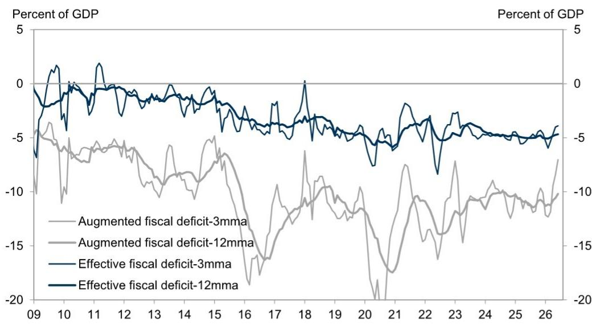

# 宏观观察：近期值得关注的三个方向

近期宏观环境中有三个值得关注的要点：

## 一、财政数据反映的动向

6月数据显示，一般公共预算收入同比增长8.7%，支出增速为4.0%。政府性基金收入中，土地出让收入同比下降42%。综合来看，近期广义财政赤字率（三个月移动平均）约为GDP的7.0%，而2025年为11.0%。这一变化被认为是二季度增长节奏调整的重要背景。

  
来源：Wind, CEIC, GS Global Investment Research

## 二、对7月重要会议的观察

7月的重要会议预计在未来几天召开。二季度实际GDP同比增长4.3%，处于全年增长目标区间（4.5–5%）的下沿附近。市场普遍关注会议是否会释放更积极的政策信号。考虑到地方在资金和节奏上的约束，来自上层的明确指引对于下半年地方项目的推进较为关键。

## 三、7月PMI前瞻

本周将发布7月官方制造业和非制造业PMI。高频数据显示，钢铁生产有所放缓，行业调研反馈新订单偏弱。7月天气条件对部分地区生产活动带来影响，包括台风和强降雨。综合判断，预计制造业PMI可能从6月的50.3小幅调整至49.9附近。

---

## 近期研究参考

## 主题研究：

宏观观察：政策调整的时机，2026年7月20日

亚洲聚焦：高科技领域的新融资渠道，2026年7月12日

## 数据跟踪：

亚洲周度前瞻：中国PMI、韩国工业产出、香港及台湾GDP，2026年7月24日

中国宏观自有指标追踪：7月，2026年7月24日

中国经济活动与政策追踪：7月24日，2026年7月24日

中国：6月财政收支增速均有改善，土地出让收入继续收缩，2026年7月22日

中国消费数据：2026年二季度消费动能环比放缓，2026年7月19日

中国：6月跨境资金流动数据观察，2026年7月17日

中国：7月重要会议前瞻——政策表述或更积极，需求侧仍是关键，2026年7月16日

中国：6月货币信贷数据低于预期，央行表态显示宽松仍有条件，2026年7月15日

中国：70城新房价格跌幅继续收窄，一线城市环比回升，2026年7月15日

中国：二季度实际GDP增速放缓，6月活动数据分化，2026年7月15日

中国：6月贸易增速进一步加快，2026年7月14日

中国：扩大消费相关规划——供给侧推动，需求侧约束，2026年7月14日

## 团队分享材料：

宏观到微观：下半年政策与消费展望（回放），2026年7月22日

宏观与策略：全球宏观、7月重要会议、市场观点（中文），2026年7月20日

中国：宏观展望（2026年7月），2026年7月3日

---

## 研究团队

Andrew Tilton  
+852-2978-1802  
andrew.tilton@gs.com  
GS (Asia) L.L.C.

Hui Shan  
+852-2978-6634  
hui.shan@gs.com  
GS (Asia) L.L.C.

Lisheng Wang
+852-3966-4004
lisheng.wang@gs.com
GS (Asia) L.L.C.

## Xinquan Chen

+852-2978-2418
xinquan.chen@gs.com
GS (Asia) L.L.C.

Yuting Yang
+852-2978-7283
yuting.y.yang@gs.com
GS (Asia) L.L.C.

Chelsea Song

Chelsea Song +852-2978-0106 chelsea.song@gs.com GS (Asia) L.L.C.

---

## 附录

## 分析师声明

本人Hui Shan特此证明，本报告中所表达的所有观点均准确反映本人的个人观点，且未受公司业务或客户关系的影响。

除非另有说明，本报告封面所列人员均为全球投资研究部门分析师。

撰稿人：Hui Shan GS (Asia) L.L.C.

除非另有说明，本报告撰稿人披露中列出的个人均为全球投资研究部门分析师。

## 披露信息

## 监管披露

## 美国法律法规要求的披露

请参见上述针对本报告提及公司的具体监管披露，包括以下任何一项：待定交易中的主承销商或联合主承销商；1%或以上的持股；特定服务的报酬；客户关系类型；过往期间的主承销/联合主承销公开发行；董事职位；对于权益证券，做市和/或专家角色。GS可能作为本金交易本报告讨论的发行人债务证券（或相关衍生品）。

其他必要披露：持股与重大利益冲突：GS政策禁止其分析师、向分析师汇报的专业人员及其家庭成员持有分析师覆盖范围内的任何公司证券。分析师薪酬：分析师薪酬部分基于GS的盈利能力，其中包括投资银行业务收入。分析师作为高管或董事：GS政策通常禁止其分析师、向分析师汇报的人员或其家庭成员在分析师覆盖范围内的任何公司担任高管、董事或顾问。非美国分析师：非美国分析师可能不是GS & Co. LLC的关联人员，因此可能不受FINRA规则2241或FINRA规则2242关于与目标公司沟通、公开露面以及交易所覆盖证券的限制。

## 美国以外司法管辖区法律法规要求的额外披露

以下为特定司法管辖区要求的披露，除非已根据美国法律法规在上文作出。澳大利亚：GS Australia Pty Ltd及其关联公司并非澳大利亚《1959年银行法》定义的授权存款机构，不提供银行服务，也不在澳大利亚开展银行业务。除非GS另有约定，本研究及其访问权限仅面向澳大利亚《公司法》定义的“批发客户”。在制作研究报告时，GS Australia全球投资研究团队成员可能参加作为研究对象的公司及其他实体主办或组织的实地考察和会议。在某些情况下，如果GS Australia认为在特定情况下适当且合理，此类实地考察或会议的费用可能部分或全部由相关发行人承担。若本文内容包含任何金融产品建议，则仅为一般性建议，由GS在未考虑客户目标、财务状况或需求的情况下编制。客户在根据此类建议采取行动前，应考虑该建议是否适合自身目标、财务状况和需求。GS Australia和New Zealand的利益披露声明及GS澳大利亚卖方研究独立性政策声明副本可在以下网址获取：https://www.goldmansachs.com/disclosures/australia-new-zealand/index.html。巴西：关于CVM第20号决议的披露信息可在https://www.gs.com/worldwide/brazil/area/gir/index.html获取。如适用，根据CVM第20号决议第20条定义，本研究报告内容的巴西注册主要分析师为本报告开头指定的第一作者，除非文末另有说明。加拿大：此信息仅供您参考，在任何情况下均不应被视为GS & Co. LLC为在加拿大购买证券而进行的广告、要约或招揽。GS & Co. LLC未在加拿大任何司法管辖区注册为交易商，通常不被允许在加拿大交易证券，并可能被禁止在加拿大某些司法管辖区销售某些证券和产品。如欲在加拿大交易任何加拿大证券或其他产品，请联系GS Canada Inc.（GS Group Inc.的关联公司）或其他注册的加拿大交易商。香港：可向GS (Asia) L.L.C.索取本研究报告所涉覆盖公司证券的进一步信息。印度：可向GS (India) Securities Private Limited（研究分析师 - SEBI注册号INH000001493，地址：10th Floor, Ascent-Worli, Sudam Kalu Ahire Marg, Worli, Mumbai-400 025, India，企业识别号U74140MH2006FTC160634，电话+91 22 6616 9000，传真+91 22 6616 9001）获取本研究报告所涉主体公司的进一步信息。GS可能实益持有本研究报告所涉主体公司1%或以上的证券（定义见印度《证券合同（监管）法》1956年第2(h)条）。SEBI的注册和NISM的认证绝不保证中介机构的业绩或向读者提供任何回报保证。GS (India) Securities Private Limited的合规官和读者投诉联系方式、年度合规审计报告副本及其他相关信息和披露可在以下链接获取：https://www.goldmansachs.com/worldwide/india/research-analyst。日本：见下文。韩国：除非GS另有约定，本研究及其访问权限仅面向《金融服务和资本市场法》定义的“专业读者”。可向GS (Asia) L.L.C.首尔分行获取本研究报告所涉主体公司的进一步信息。新西兰：GS New Zealand Limited及其关联公司在新西兰既非“注册银行”也非“存款接受机构”（定义见《1989年新西兰储备银行法》）。除非GS另有约定，本研究及其访问权限面向《2008年金融顾问法》定义的“批发客户”。GS Australia和New Zealand的利益披露声明副本可在以下网址获取：https://www.goldmansachs.com/disclosures/australia-new-zealand/index.html。俄罗斯：在俄罗斯联邦分发的研究报告不构成俄罗斯法律定义的广告，而是以信息和分析为主，不以产品推广为主要目的，且不提供俄罗斯评估活动法律意义上的评估。研究报告不构成俄罗斯法律法规定义的个性化研究交流，不针对特定客户，且未分析客户的财务状况、投资概况或风险概况。GS不对客户或任何其他人基于本研究报告做出的任何投资决策承担责任。新加坡：GS (Singapore) Pte.（公司编号：198602165W）受新加坡金融管理局监管，对本研究承担法律责任。如有任何与本研究报告相关的事宜，请联系该公司。台湾：本资料仅供参考，未经许可不得转载。读者应仔细考虑自身投资风险。投资结果由个人读者自行承担。英国：在英国被归类为零售客户（定义见金融行为监管局规则）的人士，应结合此前GS关于本报告所涉覆盖公司的研究阅读本报告，并应参考GS International已发送给他们的风险警告。这些风险警告的副本以及本报告中使用的某些金融术语的词汇表可向GS International索取。

欧盟和英国：关于欧盟委员会授权条例(EU) 2016/958第6(2)条（包括该授权条例在英国脱离欧盟和欧洲经济区后转化为英国国内法律和法规的部分）的披露信息，涉及研究交流或建议投资策略的客观呈现技术安排以及特定利益或利益冲突披露的技术标准，可在https://www.gs.com/disclosures/europeanpolicy.html获取，其中载明了与投资研究相关的利益冲突管理欧洲政策。

日本：GS Japan Co., Ltd.是关东财务局注册的金融工具交易商（注册号：金商第69号），是日本证券业协会、日本金融期货协会、第二类金融工具业协会和日本投资管理协会的会员。股票买卖需按与客户预先确定的佣金加消费税收取。有关日本证券交易所、日本证券业协会或日本证券金融公司要求的适用披露，请参见公司特定披露。

## 全球产品；分发实体

GS全球投资研究为GS客户在全球范围内制作和分发研究产品。GS全球各办公室的分析师对行业和公司以及宏观经济、货币、大宗商品和投资组合策略进行研究。本研究在澳大利亚由GS Australia Pty Ltd（ABN 21 006 797 897）分发；在巴西由GS do Brasil Corretora de Títulos e Valores Mobiliários S.A.分发；GS巴西公共沟通渠道：0800 727 5764和/或contatogoldmanbrasil@gs.com，工作日（节假日除外）上午9点至下午6点；在加拿大由GS & Co. LLC分发；在香港由GS (Asia) L.L.C.分发；在印度由GS (India) Securities Private Ltd.分发；在日本由GS Japan Co., Ltd.分发；在韩国由GS (Asia) L.L.C.首尔分行分发；在新西兰由GS New Zealand Limited分发；在俄罗斯由OOO GS分发；在新加坡由GS (Singapore) Pte.（公司编号：198602165W）分发；在美国由GS & Co. LLC分发。GS International已批准本研究在英国的分发。

GS International（“GSI”）由审慎监管局（“PRA”）授权，受金融行为监管局（“FCA”）和PRA监管，已批准本研究在英国的分发。

欧洲经济区：GS Bank Europe SE（“GSBE”）是在德国注册的信贷机构，在单一监管机制下受欧洲央行直接审慎监管，并在其他方面受德国联邦金融监管局（BaFin）和德意志联邦银行监管，并在欧洲经济区内分发研究。

## 一般披露

本研究仅供我们的客户使用。除与GS相关的披露外，本研究基于我们认为可靠的当前公开信息，但我们不保证其准确或完整，也不应依赖于此。本文所含信息、观点、估计和预测截至本文日期，如有变更，恕不另行通知。我们力求适时更新我们的研究，但各种法规可能阻止我们这样做。除某些定期发布的行业报告外，大部分报告根据分析师的判断不定期发布。

GS开展全球全方位、综合性的投资银行、投资管理和经纪业务。我们与全球投资研究所覆盖的相当比例的公司存在投资银行和其他业务关系。GS & Co. LLC是美国经纪交易商，是SIPC的成员（https://www.sipc.org）。

我们的销售人员、交易员和其他专业人员可能向客户和我们的自营交易部门提供口头或书面的市场评论或交易策略，这些评论或策略可能反映与本研究报告所表达观点相反的意见。我们的资产管理领域、自营交易部门和投资业务可能做出与本研究报告中的建议或观点不一致的投资决策。

除非法规或GS政策另有禁止，我们及我们的关联公司、高级职员、董事和员工可能不时持有本研究报告所述证券或衍生品的多头或空头头寸，担任本金角色，并买卖这些证券或衍生品。

在GS组织的会议上归因于第三方演讲者（包括GS其他部门的个人）的观点不一定反映全球投资研究的观点，也不是GS的官方观点。

本文引用的任何第三方，包括任何销售人员、交易员和其他专业人员或其家庭成员，可能持有本报告所述产品的头寸，且这些头寸可能与本文指定分析师表达的观点不一致。

本研究侧重于跨市场、行业和板块的投资主题。它不试图区分我们描述的任何行业或板块内单个公司的前景或表现，也不提供对单个公司的分析。

本研究中与某一行业或板块内的权益或信用证券或证券相关的任何交易建议均反映了所讨论的投资主题，并非对任何此类证券的单独建议。

本研究不构成在任何司法管辖区出售或购买任何证券的要约或要约邀请，且不构成个人建议，也未考虑个别客户的特定投资目标、财务状况或需求。客户应考虑本研究中的任何建议或推荐是否适合其特定情况，并在适当时寻求专业建议，包括税务建议。本研究中提及的投资的价格和价值以及从中获得的收入可能波动。过往表现并非未来表现的指引，未来回报不保证，且可能发生原始资本损失。汇率波动可能对某些投资的价值或价格或从中获得的收入产生不利影响。

某些交易，包括涉及期货、期权和其他衍生品的交易，会产生重大风险，并不适合所有读者。读者应查阅当前的期权和衍生品披露文件，这些文件可从GS销售代表处或https://www.theocc.com/about/publications/character-risks.jsp和https://www.goldmansachs.com/disclosures/cftc_fcm_disclosures获取。在需要多次买卖期权的期权策略（如价差策略）中，交易成本可能很高。将根据要求提供支持性文件。

全球投资研究提供的不同服务水平：GS全球投资研究向您提供的服务水平和类型可能与向GS内部及其他外部客户提供的服务有所不同，具体取决于多种因素，包括您个人对沟通频率和方式的偏好、您的风险状况和投资重点及视角（如市场范围、行业特定、长期、短期）、您与GS整体客户关系的规模和范围，以及法律和监管限制。

例如，某些客户可能要求在特定研究报告发布时收到通知，某些客户可能要求将分析师基础分析中的特定数据通过数据推送或其他方式以电子形式交付。分析师基础研究观点的任何变更（例如，评级、目标价或权益证券盈利预测的重大变化）不会在通过电子方式向内部客户网站广泛发布研究报告或以其他必要方式向所有有权接收此类报告的客户传达此类信息之前，向任何客户传达。

所有研究报告同时通过电子方式发布到我们的内部客户网站，所有客户均可同时获取。并非所有研究内容都会重新分发给我们的客户或提供给第三方聚合商，GS也不对第三方聚合商重新分发我们的研究负责。如需获取与一个或多个证券、市场或资产类别相关的研究、模型或其他数据（包括相关服务），请联系您的GS代表或访问https://research.gs.com。

披露信息也可在https://www.gs.com/research/hedge.html或联系Research Compliance, 200 West Street, New York, NY 10282获取。

## © 2026 GS.

您仅可为自身目的存储、展示、分析、修改、重新格式化及打印通过本服务提供的信息。未经GS明确书面同意，您不得转售或逆向工程此信息以计算或开发任何用于披露和/或营销的指数，或创建任何其他衍生作品或商业产品、数据或服务。未经GS明确书面同意，您不得以任何格式向任何第三方发布、传输或以其他方式复制此信息的全部或部分。前述限制包括但不限于使用、提取、下载或检索此信息的全部或部分，以训练或微调机器学习或人工智能系统，或向任何此类系统提供或复制此信息的全部或部分作为提示或输入。
