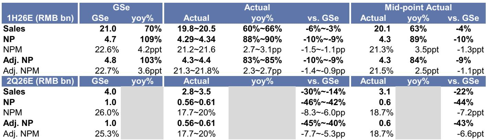
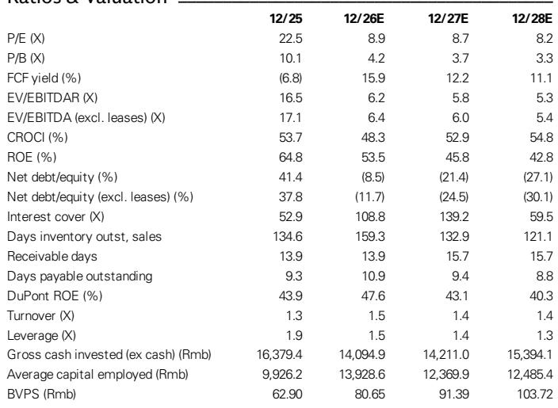
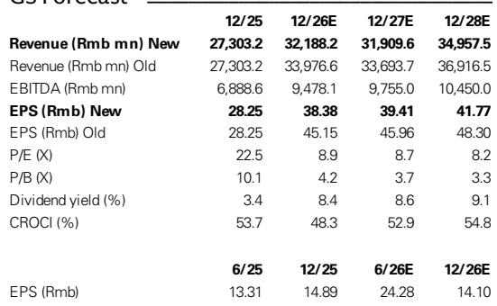

# 老铺黄金业务与季度数据观察

老铺黄金在7月27日发布业绩预告，2026年上半年收入预计在198亿至205亿元人民币之间，低于此前预期的210亿元；调整后净利润预计在43亿至44亿元之间，低于预期的48亿元。这份预告揭示了一个关键点：公司在5月提价后毛利率本应扩张，但二季度实际净利润率仅约19%，远低于预期的26%。收入与利润率双双低于预期，意味着公司正面临金价变化带来的销售不确定性与运营杠杆出现变化的双重影响。

## 1. 二季度隐含收入环比大幅下滑，线上渠道跌幅超过六成

根据测算，若取一季度业绩预告中位数，二季度隐含收入仅为28亿至35亿元，较此前预期的40亿元低22%至30%。更值得关注的是线上渠道的表现。追踪数据显示，二季度老铺黄金在天猫平台的销售额同比跌幅超过60%。线上渠道原本是利润率较高的销售通路，其大幅调整直接拉低了整体盈利水平。

## 2. 提价后毛利率扩张被运营费用稀释

公司在5月曾表示，提价后毛利率能够达到45%以上。但二季度实际净利润率仅约19%，两者之间的差距主要来自运营费用端的杠杆出现变化。分析认为，公司在门店升级和品牌建设上的持续投入，使得员工薪酬、营销及管理费用在收入下滑时无法同比例缩减，形成了典型的运营去杠杆。此外，租金成本虽然大部分为可变，但短期内也难以完全匹配收入变化。

> **观察评论：** 提价带来的毛利率改善是理论上的，实际落地需要足够高的收入规模来摊薄固定费用。二季度收入环比大幅下滑，使得费用率被动上升，这是利润率低于预期的直接原因。线上渠道的剧烈调整进一步放大了这一效应。

## 3. 公司已开始测试价格策略以应对金价变化

报告透露了一个值得跟踪的变化：在金价变化的背景下，老铺黄金已在上海新天地门店测试较低定价策略，随后在北京SKP商场允许会员折扣与促销折扣叠加使用（较此前额外优惠5%），这一调整带来了明显的客流改善。这表明公司正在尝试通过价格手段平衡品牌定位与销售不确定性，但降价对毛利率的影响将在下半年逐步显现，相关预测已据此下调了2026年下半年的毛利率预期。

## 4. 盈利预测下调，但认为金价回升可缓解销售不确定性

2026至2028年的净利润预测下调14%至15%，对应约41%的上行空间。报告更新公司观点，核心逻辑在于：如果金价如预期在年底回升至每盎司4900美元（当前约4100美元），销售最困难的阶段可能已经过去。届时，消费情绪修复、经销商库存消化以及新产品推出（包括降价产品）有望共同刺激需求。8月下旬的完整财报将是验证这些判断的关键节点。

For informational purposes only. Portions may be generated,translated,summarized,or edited with AI assistance based on source materials and may contain omissions or errors. Please verify independently. This is not investment,legal,tax,accounting,or other professional advice.

For informational purposes only. Portions may be generated,translated,summarized,or edited with AI assistance based on source materials and may contain omissions or errors. Please verify independently. This is not investment,legal,tax,accounting,or other professional advice.

