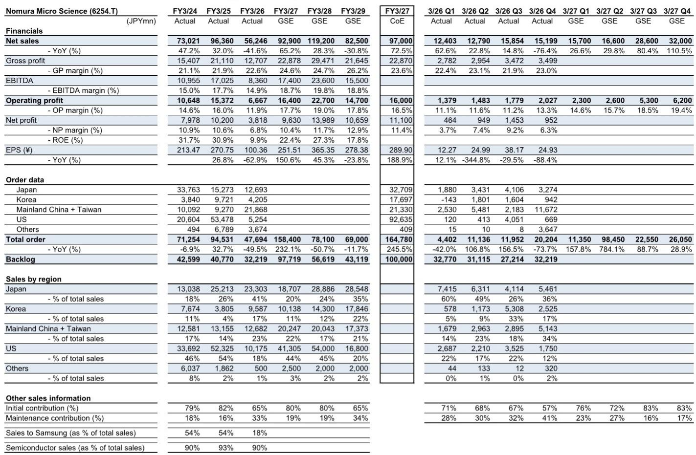
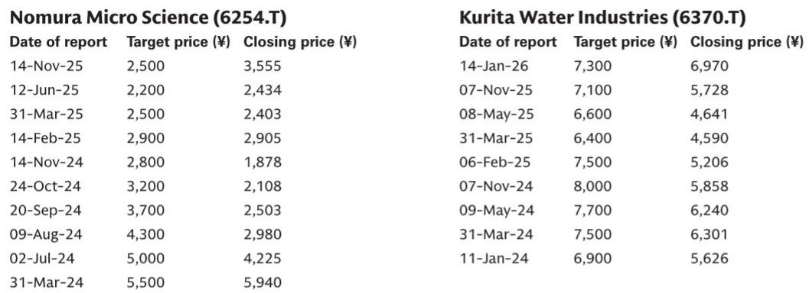
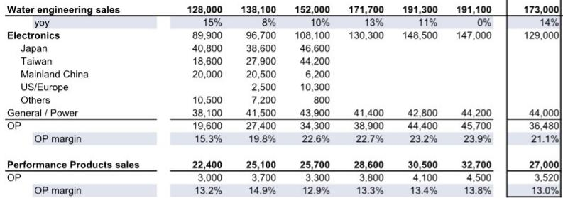

# GS：半导体行业数据与主题变化观察

GS最新报告更新了日本四家半导体公用事业公司的盈利预测，核心判断是：尽管部分公司因项目节奏和客户集中度面临短期不确定性，但整个子板块在中长期半导体研究周期中仍处于有利位置。报告特别指出，NOM微科学（NOM Micro Science）和Organo两家公司因深度参与大型晶圆厂超纯水系统建设，盈利增长路径相对清晰，而日本材料（Japan Material）则因过度依赖单一客户Kioxia的资本开支节奏，估值重估后仍需观察项目落地进度。

## 1. NOM微科学的大规模美国项目成为盈利增长核心驱动

报告将NOM微科学2027财年（FY3/27）营业利润预测上调33%，主要依据是公司已将在手大型美国项目纳入指引，并假设2026年上半年获得大额订单、下半年开始确认收入。从订单数据看，美国市场订单在2025财年达到534.78亿日元后，2026财年骤降至52.54亿日元，但2027财年指引订单高达926.35亿日元，显示项目周期存在明显的前低后高特征。报告认为，基于FY3/27和FY3/28平均EBITDA计算的估值倍数仍处于历史正常范围下限，当前报价对应FY3/27预期市盈率约16-17倍，FY3/28预期市盈率约11-12倍。

> **KC评论：** NOM微科学的盈利预测大幅上调，核心假设是美国大型项目能否在2026年上半年如期获得订单。报告虽然更新公司观点，但读者需要关注其订单确认节奏——如果项目延迟，盈利预测存在下调不确定性。

## 2. Organo受益于台积电持续资本开支，但需计入建设延迟不确定性

Organo作为台积电全球超纯水设施供应商，报告维持长期看好判断。台积电最新财报显示其未来几年资本开支仍将保持积极态势，这为Organo提供了稳定的收入基础。不过，报告将FY3/27-FY3/28营业利润预测下调1-3%，主要反映最新项目排期变化和部分建设延迟不确定性。调整原因并非基本面变化，而是无风险利率上升导致折现率提高。这一调整幅度极小，表明报告对Organo的盈利可见度仍有信心。

## 3. 日本材料面临客户集中度与项目节奏的双重不确定性

日本材料是四家公司中年初至今估值重估幅度最大的，主要原因是市场对Kioxia资本开支扩张的预期升温——过去五年Kioxia贡献了日本材料35-52%的销售额。报告预计FY3/28营业利润将同比增长超过40%，主要来自新项目初期销售的大幅增加。但报告同时指出，由于利润率随新项目规模波动，且项目排期每天都在变化，目前将分析重心完全转向FY3/28仍为时过早。基于此，报告仅将FY3/28营业利润预测上调17%。

## 4. 估值框架显示子板块整体仍处于合理区间

报告采用行业相对EV/EBITDA溢价法进行估值：对NOM微科学给予+40%溢价（相当于近期上行周期平均水平），对日本材料给予+20%溢价（相当于当前周期平均溢价水平）。这一框架的核心逻辑是，半导体公用事业公司作为晶圆厂建设的“卖水人”，其收入与半导体资本开支高度相关，但不同公司的客户结构和项目可见度差异显著。NOM微科学和Organo因客户分散度更高、项目规模更大，获得了更高的估值溢价；日本材料则因客户集中度过高，估值溢价相对保守。

> **KC评论：** 报告使用的估值方法值得关注——它并非简单采用历史市盈率，而是通过行业相对EV/EBITDA溢价来反映不同公司的项目可见度和客户结构差异。这种框架对理解半导体设备服务类公司的估值逻辑有参考价值。

整体来看，GS对日本半导体公用事业子板块维持看多立场，但公司选择上存在明显分化：NOM微科学和Organo因项目确定性更高获得公司观点，日本材料则因客户集中度和项目节奏不确定性更新公司观点。报告的核心假设是半导体中长期研究周期不会逆转，但短期项目节奏波动是主要不确定性来源。

For informational purposes only. Portions may be generated,translated,summarized,or edited with AI assistance based on source materials and may contain omissions or errors. Please verify independently. This is not investment,legal,tax,accounting,or other professional advice.

For informational purposes only. Portions may be generated,translated,summarized,or edited with AI assistance based on source materials and may contain omissions or errors. Please verify independently. This is not investment,legal,tax,accounting,or other professional advice.

